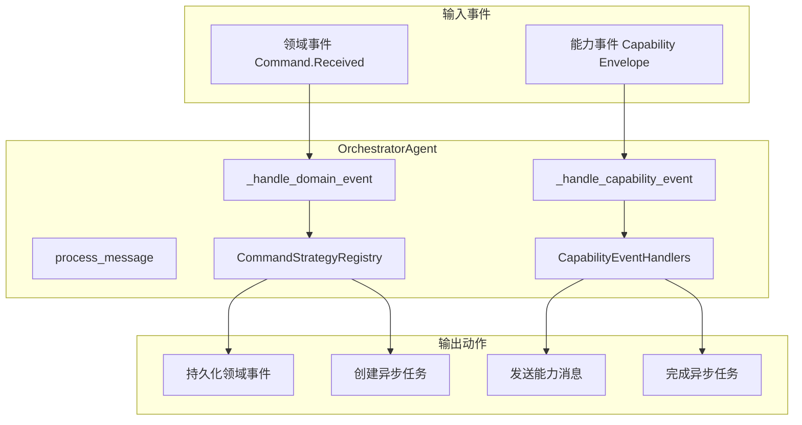
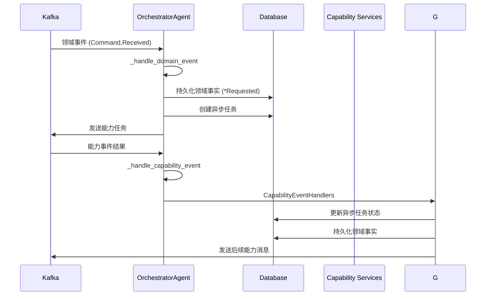
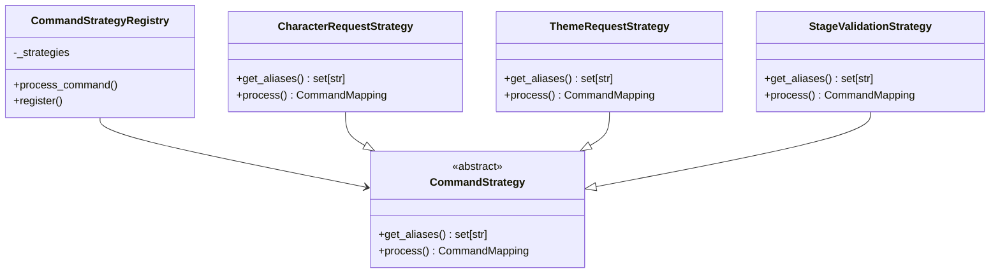
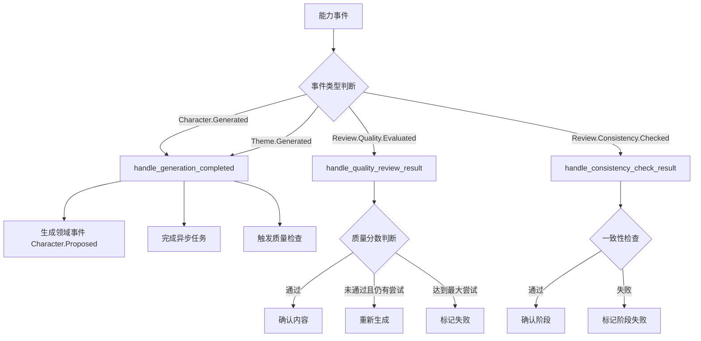
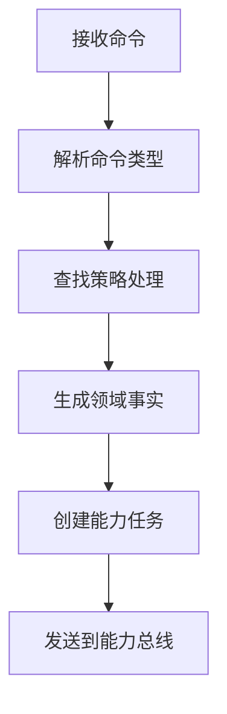
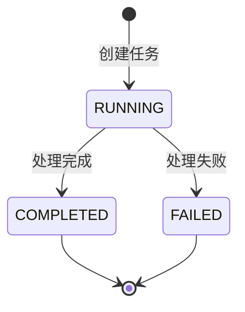

# 编排代理 (Orchestrator Agent)

负责协调领域事件和能力任务的核心编排服务，实现命令到领域事件的投影和能力任务的分发。

## 🏗️ 架构概览

### 核心职责

- **事件处理**：消费领域总线和能力事件
- **命令映射**：将触发类领域事件投影为领域事实
- **任务分发**：向对应的能力主题发送能力任务
- **结果投影**：将能力结果投影为领域事实

### 架构图



## 📁 目录结构

```
orchestrator/
├── __init__.py           # 代理注册和导出
├── agent.py              # 主编排代理类
├── command_strategies.py # 命令处理策略
├── event_handlers.py     # 能力事件处理器
└── message_factory.py    # 消息工厂
```

## 🎯 核心组件

### OrchestratorAgent

主编排代理类，继承自 `BaseAgent`，负责处理两种类型的事件：



### CommandStrategyRegistry

命令策略注册表，使用策略模式实现不同命令类型的处理逻辑：



### CapabilityEventHandlers

能力事件处理器集合，处理不同类型的能力完成事件：



## 🔧 命令处理流程

### 1. 命令到事件的映射



### 2. 幂等性保护

- **领域事件**：通过 `correlation_id + event_type` 确保唯一性
- **异步任务**：检查已有 `RUNNING/PENDING` 状态的任务

### 3. 任务状态管理



## 🚀 使用示例

### 注册命令策略

```python
# 注册自定义命令策略
class CustomCommandStrategy(CommandStrategy):
    def get_aliases(self) -> set[str]:
        return {"Custom.Command"}
    
    def process(self, scope_type: str, scope_prefix: str, aggregate_id: str, payload: dict[str, Any]) -> CommandMapping:
        return CommandMapping(
            requested_action="Custom.Requested",
            capability_message={
                "type": "Custom.Process.Requested",
                "session_id": aggregate_id,
                "input": payload.get("payload", {}),
            }
        )

# 注册到全局注册表
command_registry.register(CustomCommandStrategy())
```

### 处理能力事件

```python
# 扩展事件处理器
class CustomEventHandler:
    @staticmethod
    def handle_custom_event(msg_type: str, session_id: str, data: dict[str, Any]) -> EventAction | None:
        if msg_type == "Custom.Process.Completed":
            return EventAction(
                domain_event={
                    "scope_type": "GENESIS",
                    "session_id": session_id,
                    "event_action": "Custom.Completed",
                    "payload": data,
                },
                task_completion={
                    "correlation_id": data.get("correlation_id"),
                    "expect_task_prefix": "Custom.Process",
                    "result_data": data,
                }
            )
        return None
```

## 📊 监控和调试

### 关键日志点

- `orchestrator_ignored_message`: 忽略未知格式的消息
- `async_task_create_failed`: 异步任务创建失败
- `async_task_already_exists`: 检测到重复的异步任务

### 性能考虑

- 使用数据库连接池管理会话
- 批量处理领域事件持久化
- 异步任务状态更新采用乐观锁

## 🔗 相关模块

- **事件映射**: `src.common.events.mapping` - 统一事件映射配置
- **领域模型**: `src.models.event` - 领域事件模型
- **工作流模型**: `src.models.workflow` - 异步任务模型
- **基础代理**: `src.agents.base` - 代理基类

## 📝 注意事项

1. **幂等性**：所有关键操作都需要考虑幂等性保护
2. **错误处理**：能力任务创建失败时只记录警告，不中断主流程
3. **事件溯源**：领域事件通过 EventOutbox 模式确保可靠投递
4. **任务追踪**：每个能力任务都创建对应的 AsyncTask 记录用于追踪