# 领域代理编排器 (Orchestrator Agent)

负责协调和管理领域事件与能力任务之间的流转，是整个事件驱动架构的核心协调组件。

## 🚀 最新架构增强 (2024.09.26)

### 事件类型系统与能力事件处理优化 ✨

最近的重构实现了事件类型定义的统一和能力事件处理流程的优化：

#### 🔧 统一事件元数据模型

**实现了完整的事件类型系统**：
- 字符串字面量类型：`MessageType`、`EventActionType`、`TargetType`、`ScopeType`
- 统一事件元数据：`EventMetadata` 类，消除重复定义
- 类型安全的数据模型：`GenerationData`、`QualityReviewData`、`ConsistencyCheckData`
- 智能类型转换：`CapabilityEventMessage.to_typed_data()` 自动推断数据类型

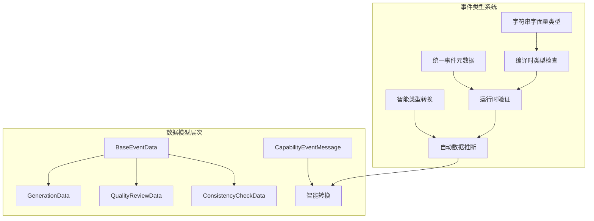
```mermaid
graph TD
    subgraph "事件类型系统"
        A[字符串字面量类型] --> B[编译时类型检查]
        C[统一事件元数据] --> D[运行时验证]
        E[智能类型转换] --> F[自动数据推断]
    end
    
    subgraph "数据模型层次"
        G[BaseEventData] --> H[GenerationData]
        G --> I[QualityReviewData] 
        G --> J[ConsistencyCheckData]
        K[CapabilityEventMessage] --> L[智能转换]
    end
    
    B --> D
    D --> F
    F --> L
```

#### 🔧 Pydantic 类型系统完整实现

**从 TypedDict 到 Pydantic 的全面升级**：

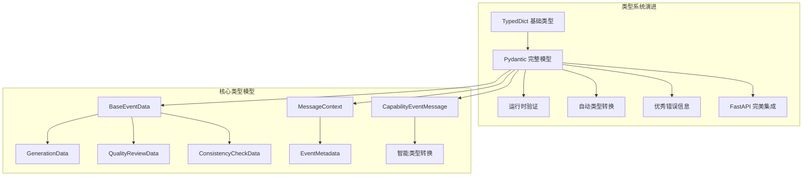
```mermaid
graph TB
    subgraph "类型系统演进"
        A[TypedDict 基础类型] --> B[Pydantic 完整模型]
        B --> C[运行时验证]
        B --> D[自动类型转换]
        B --> E[优秀错误信息]
        B --> F[FastAPI 完美集成]
    end
    
    subgraph "核心类型模型"
        G[BaseEventData] --> H[GenerationData]
        G --> I[QualityReviewData]
        G --> J[ConsistencyCheckData]
        
        K[MessageContext] --> L[EventMetadata]
        M[CapabilityEventMessage] --> N[智能类型转换]
    end
    
    B --> G
    B --> K
    B --> M
```

**统一事件元数据模型**：
- 消除了重复定义，合并所有元数据字段到 `UnifiedEventMetadata`
- 提供向后兼容的别名：`EventMetadata = UnifiedEventMetadata`
- 支持编译时和运行时的双重类型检查

#### 🏗️ Outbox Payload 命名空间隔离构建器

**实现了 LLD 规范的命名空间隔离设计**：

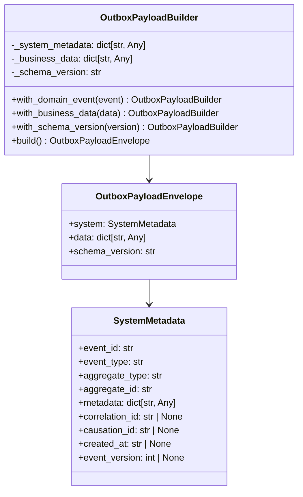
```mermaid
classDiagram
    class SystemMetadata {
        +event_id: str
        +event_type: str
        +aggregate_type: str
        +aggregate_id: str
        +metadata: dict[str, Any]
        +correlation_id: str | None
        +causation_id: str | None
        +created_at: str | None
        +event_version: int | None
    }
    
    class OutboxPayloadEnvelope {
        +system: SystemMetadata
        +data: dict[str, Any]
        +schema_version: str
    }
    
    class OutboxPayloadBuilder {
        -_system_metadata: dict[str, Any]
        -_business_data: dict[str, Any]
        -_schema_version: str
        +with_domain_event(event) OutboxPayloadBuilder
        +with_business_data(data) OutboxPayloadBuilder
        +with_schema_version(version) OutboxPayloadBuilder
        +build() OutboxPayloadEnvelope
    }
    
    OutboxPayloadBuilder --> OutboxPayloadEnvelope
    OutboxPayloadEnvelope --> SystemMetadata
```

**核心优势**：
- **彻底消除字段冲突风险**：通过命名空间隔离确保系统元数据与业务数据完全分离
- **类型安全**：使用 Pydantic 模型确保运行时验证和自动类型转换
- **向后兼容**：在 OutboxManager 中保持扁平化输出结构，兼容现有消费者
- **可扩展性**：为后续架构演进（版本升级）提供明确边界

#### 🔄 有效负载构建流程增强

**新的构建流程**：
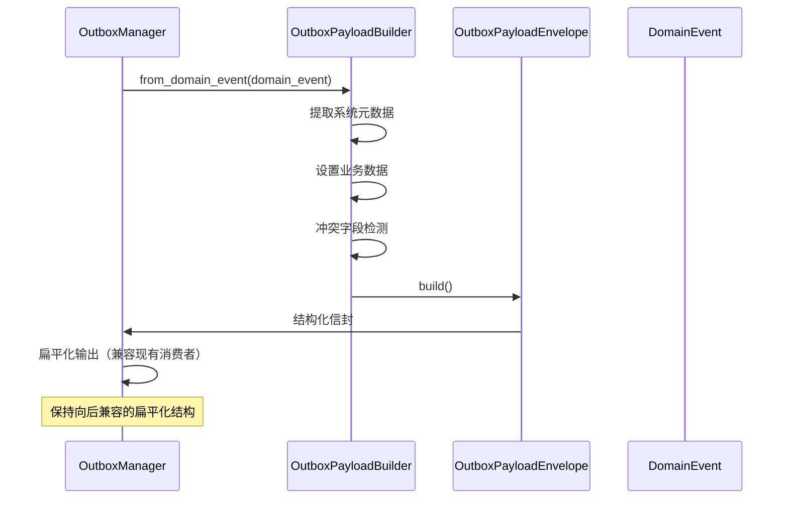
```mermaid
sequenceDiagram
    participant O as OutboxManager
    participant B as OutboxPayloadBuilder
    participant E as OutboxPayloadEnvelope
    participant D as DomainEvent
    
    O->>B: from_domain_event(domain_event)
    B->>B: 提取系统元数据
    B->>B: 设置业务数据
    B->>B: 冲突字段检测
    B->>E: build()
    
    E->>O: 结构化信封
    O->>O: 扁平化输出（兼容现有消费者）
    
    Note over O: 保持向后兼容的扁平化结构
```

**冲突检测机制**：
```python
# 检查业务数据是否包含顶层保留字段
conflicts = set(data.keys()) & self.RESERVED_TOP_LEVEL_FIELDS
if conflicts:
    raise ValueError(
        f"Business data contains reserved top-level fields: {conflicts}. "
        f"These fields conflict with the envelope structure."
    )
```

#### 📊 输出结构示例

**新的信封结构**：
```json
{
  "system": {
    "event_id": "550e8400-e29b-41d4-a716-446655440000",
    "event_type": "Genesis.Character.Created",
    "aggregate_type": "Genesis",
    "aggregate_id": "session-123",
    "metadata": {"source": "orchestrator"},
    "correlation_id": "550e8400-e29b-41d4-a716-446655440000"
  },
  "data": {
    "character_name": "张三",
    "character_age": 25
  },
  "schema_version": "v1"
}
```

**兼容性输出**（OutboxManager 自动扁平化）：
```json
{
  "event_id": "550e8400-e29b-41d4-a716-446655440000",
  "event_type": "Genesis.Character.Created",
  "aggregate_type": "Genesis",
  "aggregate_id": "session-123",
  "metadata": {"source": "orchestrator"},
  "correlation_id": "550e8400-e29b-41d4-a716-446655440000",
  "character_name": "张三",
  "character_age": 25,
  "_schema_version": "v1"
}
```

### 领域事件有效负载构建逻辑增强 ✨

在新的 Pydantic 类型系统和 OutboxPayloadBuilder 基础上，进一步增强了领域事件有效负载构建逻辑：

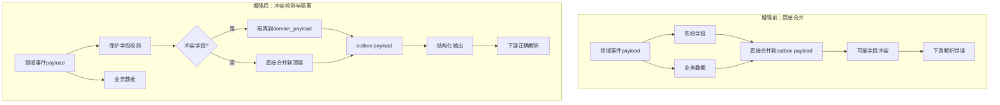
```mermaid
graph TD
    subgraph "增强前：简单合并"
        A[领域事件payload] --> B[系统字段]
        A --> C[业务数据]
        B --> D[直接合并到outbox payload]
        C --> D
        D --> E[可能字段冲突]
        E --> F[下游解析错误]
    end
    
    subgraph "增强后：冲突检测与隔离"
        G[领域事件payload] --> H[保护字段检测]
        G --> I[业务数据]
        H --> J{冲突字段?}
        J -->|是| K[隔离到domain_payload]
        J -->|否| L[直接合并到顶层]
        K --> M[outbox payload]
        L --> M
        M --> N[结构化输出]
        N --> O[下游正确解析]
    end
```

#### 有效负载构建特性

- **关键字段保护**: 保护 `event_id`, `event_type`, `aggregate_type`, `aggregate_id`, `metadata`, `created_at` 等系统字段
- **冲突检测**: 自动检测领域payload中的字段冲突
- **智能隔离**: 将冲突字段隔离到 `domain_payload` 子对象中
- **结构化输出**: 确保输出结构的一致性和可预测性
- **向下兼容**: 保持与现有消费者的兼容性

#### 实现细节

```python
# 保护的关键系统字段
protected_fields = {"event_id", "event_type", "aggregate_type", "aggregate_id", "metadata", "created_at"}

# 冲突检测和隔离逻辑
conflicting_fields = set(domain_payload.keys()) & protected_fields
if conflicting_fields:
    # 将冲突字段隔离到domain_payload子对象中
    domain_payload_safe = {}
    domain_payload_conflicts = {}
    
    for key, value in domain_payload.items():
        if key in protected_fields:
            domain_payload_conflicts[key] = value
        else:
            domain_payload_safe[key] = value
    
    # 安全字段直接合并到顶层
    outbox_payload.update(domain_payload_safe)
    
    # 冲突字段放入domain_payload子对象
    if domain_payload_conflicts:
        outbox_payload["domain_payload"] = domain_payload_conflicts
```

#### 输出结构示例

**无冲突情况**:
```json
{
  "event_id": "550e8400-e29b-41d4-a716-446655440000",
  "event_type": "Genesis.Character.Created",
  "aggregate_type": "Genesis",
  "aggregate_id": "session-123",
  "metadata": {"source": "orchestrator"},
  "character_name": "张三",
  "character_age": 25
}
```

**有冲突情况**:
```json
{
  "event_id": "550e8400-e29b-41d4-a716-446655440000",
  "event_type": "Genesis.Character.Created", 
  "aggregate_type": "Genesis",
  "aggregate_id": "session-123",
  "metadata": {"source": "orchestrator"},
  "domain_payload": {
    "event_type": "Character.Created",
    "aggregate_id": "session-456"
  },
  "character_name": "张三"
}
```

#### 日志增强

```python
# 冲突检测日志
if conflicting_fields:
    self.log.warning(
        "domain_payload_field_conflict_detected",
        event_id=str(domain_event.event_id),
        event_type=domain_event.event_type,
        conflicting_fields=list(conflicting_fields),
        message="领域payload包含系统保留字段，将被隔离到domain_payload子对象中"
    )
```

#### 新增日志事件

- `domain_payload_field_conflict_detected`: 字段冲突检测警告，包含：
  - `event_id`: 事件ID
  - `event_type`: 事件类型  
  - `conflicting_fields`: 冲突字段列表
  - `message`: 处理说明

### 领域事件幂等性检查器增强 ✨

最近的重构增强了领域事件幂等性检查器，添加了全面的日志记录功能以提升系统可观测性：

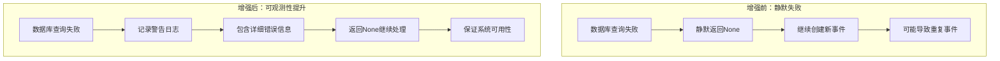
```mermaid
graph TD
    subgraph "增强前：静默失败"
        A[数据库查询失败] --> B[静默返回None]
        B --> C[继续创建新事件]
        C --> D[可能导致重复事件]
    end
    
    subgraph "增强后：可观测性提升"
        E[数据库查询失败] --> F[记录警告日志]
        F --> G[包含详细错误信息]
        G --> H[返回None继续处理]
        H --> I[保证系统可用性]
    end
```

#### 增强特性

- **可观测性提升**: 捕获数据库查询异常并记录详细警告信息
- **错误追踪**: 包含错误类型、错误消息和相关上下文信息
- **系统可用性**: 在数据库异常时仍保证系统正常运行
- **内置日志记录**: 使用模块级logger实例，无需额外配置
- **上下文信息**: 日志包含 correlation_id 和 evt_type 便于追踪

#### 实现细节

```python
# 增强前 (简化的异常处理)
@staticmethod
async def check_existing_domain_event(correlation_id: str, evt_type: str, db_session) -> DomainEvent | None:
    try:
        # 查询逻辑...
    except Exception:
        # 静默失败
        return None

# 增强后 (完整的可观测性)
@staticmethod
async def check_existing_domain_event(correlation_id: str, evt_type: str, db_session) -> DomainEvent | None:
    try:
        # 安全地转换correlation_id为UUID
        safe_correlation_id = safe_uuid_conversion(correlation_id)
        if safe_correlation_id is None:
            # 如果correlation_id无法转换为UUID，视为没有现有事件
            return None

        return await db_session.scalar(
            select(DomainEvent).where(
                and_(
                    DomainEvent.correlation_id == safe_correlation_id,
                    DomainEvent.event_type == evt_type,
                )
            )
        )
    except Exception as e:
        # 记录数据库错误以提升可观测性
        logger.warning(
            "orchestrator_domain_event_check_failed",
            correlation_id=correlation_id,
            evt_type=evt_type,
            error=str(e),
            error_type=type(e).__name__,
            message="数据库查询失败，假定不存在现有事件以保证系统可用性",
        )
        # 如果发生任何其他错误，视为没有现有事件以保证系统可用性
        return None
```

#### 新增日志事件

- `orchestrator_domain_event_check_failed`: 数据库查询失败的警告日志，包含：
  - `correlation_id`: 关联ID
  - `evt_type`: 事件类型
  - `error`: 错误详情
  - `error_type`: 错误类型
  - `message`: 错误处理说明

#### UUID安全性增强

增强后的实现还包括了UUID格式验证，确保correlation_id的有效性：

```python
# 安全的UUID转换逻辑
safe_correlation_id = safe_uuid_conversion(correlation_id)
if safe_correlation_id is None:
    # 如果correlation_id无法转换为UUID，视为没有现有事件
    return None
```

这确保了数据库查询的安全性和数据一致性。

#### 增强前后对比

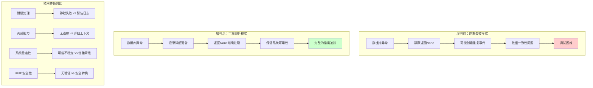
```mermaid
graph TD
    subgraph "增强前：静默失败模式"
        A1[数据库异常] --> A2[静默返回None]
        A2 --> A3[可能创建重复事件]
        A3 --> A4[数据一致性问题]
        A4 --> A5[调试困难]
        style A5 fill:#ffcccc
    end
    
    subgraph "增强后：可观测性模式"
        B1[数据库异常] --> B2[记录详细警告]
        B2 --> B3[返回None继续处理]
        B3 --> B4[保证系统可用性]
        B4 --> B5[完整的错误追踪]
        style B5 fill:#ccffcc
    end
    
    subgraph "技术特性对比"
        C1[错误处理] --> C2[静默失败 vs 警告日志]
        C3[调试能力] --> C4[无追踪 vs 详细上下文]
        C5[系统稳定性] --> C6[可能不稳定 vs 优雅降级]
        C7[UUID安全性] --> C8[无验证 vs 安全转换]
    end
```

#### 功能特性对比表

| 特性维度 | 增强前 | 增强后 | 改进效果 |
|---------|--------|--------|---------|
| **错误处理** | 静默失败 | 详细警告日志 | 🔧 提升问题诊断能力 |
| **可观测性** | 无错误信息 | 完整上下文追踪 | 🔍 便于调试和监控 |
| **系统稳定性** | 可能产生副作用 | 优雅降级 | 🛡️ 保证系统可用性 |
| **UUID安全性** | 直接使用参数 | 安全转换验证 | 🛡️ 防止无效数据 |
| **日志记录** | 无相关日志 | 结构化警告日志 | 📊 增强系统可观测性 |
| **维护成本** | 问题定位困难 | 快速错误诊断 | ⚡ 降低运维成本 |

#### 新增日志事件详细说明

**`orchestrator_domain_event_check_failed` 事件结构**:
```json
{
  "event": "orchestrator_domain_event_check_failed",
  "level": "warning", 
  "correlation_id": "550e8400-e29b-41d4-a716-446655440000",
  "evt_type": "Genesis.Character.Created",
  "error": "relation \"domain_events\" does not exist",
  "error_type": "ProgrammingError",
  "message": "数据库查询失败，假定不存在现有事件以保证系统可用性"
}
```

**日志字段说明**:
- `correlation_id`: 用于追踪请求链路的唯一标识
- `evt_type`: 事件类型，便于分类和过滤
- `error`: 具体的错误信息，便于问题诊断
- `error_type`: 错误类型，帮助快速定位问题类别
- `message`: 系统处理说明，提供上下文信息

### 主题前缀推断逻辑优化 ✨

最近的重构优化了主题前缀推断逻辑，改进了作用域类型的处理方式：

```mermaid
graph TD
    subgraph "优化前：直接转换"
        A[主题: genesis.outline.events] --> B[split获取前缀: genesis]
        B --> C[直接转换为大写: GENESIS]
        C --> D[scope_type = scope_prefix]
    end
    
    subgraph "优化后：两步转换"
        E[主题: genesis.outline.events] --> F[split获取前缀: genesis]
        F --> G[首字母大写: Genesis]
        G --> H[转换为大写: GENESIS]
        H --> I[scope_type = scope_prefix.upper()]
    end
```

#### 优化特性

- **更清晰的语义**: `scope_prefix` 使用首字母大写格式 (Genesis)，更符合命名规范
- **类型分离**: `scope_prefix` 和 `scope_type` 职责分离，前者用于显示，后者用于内部处理
- **向后兼容**: 最终的 `scope_type` 保持不变，确保现有逻辑正常运行
- **代码可读性**: 更清晰地表达了作用域信息的处理流程

#### 实现细节

```python
# 优化前
scope_prefix = topic.split(".", 1)[0].upper() if "." in topic else DEFAULT_VALUES["scope_type"]
scope_type = scope_prefix

# 优化后  
scope_prefix = topic.split(".", 1)[0].capitalize() if "." in topic else DEFAULT_VALUES["scope_prefix"]
scope_type = scope_prefix.upper()  # 例如: GENESIS
```

### 业务逻辑与配置解耦 ✨

最近的重构实现了工作流逻辑与JSON配置的完全解耦，提供了清晰的业务规则接口：

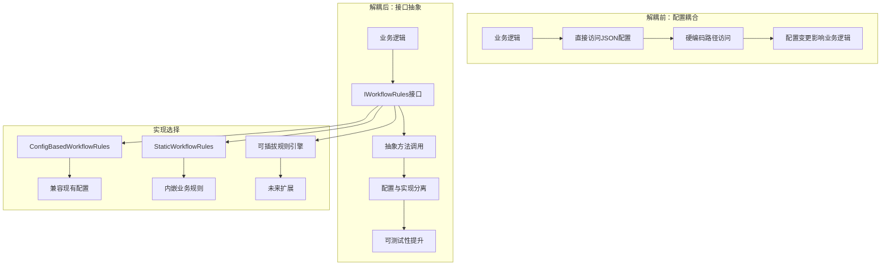
```mermaid
graph TB
    subgraph "解耦前：配置耦合"
        A[业务逻辑] --> B[直接访问JSON配置]
        B --> C[硬编码路径访问]
        C --> D[配置变更影响业务逻辑]
    end
    
    subgraph "解耦后：接口抽象"
        E[业务逻辑] --> F[IWorkflowRules接口]
        F --> G[抽象方法调用]
        G --> H[配置与实现分离]
        H --> I[可测试性提升]
    end
    
    subgraph "实现选择"
        J[ConfigBasedWorkflowRules] --> K[兼容现有配置]
        L[StaticWorkflowRules] --> M[内嵌业务规则]
        N[可插拔规则引擎] --> O[未来扩展]
    end
    
    F --> J
    F --> L
    F --> N
```

#### 核心解耦特性

- **接口抽象**: `IWorkflowRules` 提供统一的工作流决策接口
- **实现分离**: 业务逻辑不再直接依赖JSON配置结构
- **可测试性**: 支持Mock实现，便于单元测试
- **向后兼容**: `ConfigBasedWorkflowRules` 桥接现有系统
- **未来扩展**: 支持规则引擎、配置服务等多种实现方式

### Pydantic 类型系统升级 ✨

最近的重构将原有的 TypedDict 类型系统升级为完整的 Pydantic 实现，实现了"ultrathink"级别的类型安全性：


```mermaid
graph TB
    subgraph "类型系统演进"
        A[TypedDict 基础类型] --> B[Pydantic 完整模型]
        B --> C[运行时验证]
        B --> D[自动类型转换]
        B --> E[优秀错误信息]
        B --> F[FastAPI 完美集成]
    end
    
    subgraph "核心类型模型"
        G[BaseEventData] --> H[GenerationData]
        G --> I[QualityReviewData]
        G --> J[ConsistencyCheckData]
        
        K[MessageContext] --> L[EventMetadata]
        M[CapabilityEventMessage] --> N[智能类型转换]
    end
    
    B --> G
    B --> K
    B --> M
```

#### 类型安全特性

- **编译时检查**: Literal 类型确保消息类型的准确性
- **运行时验证**: Pydantic 模型自动验证数据完整性
- **智能转换**: `CapabilityEventMessage.to_typed_data()` 自动推断数据类型
- **向后兼容**: 工厂函数支持从字典创建类型安全对象

#### 新增数据模型

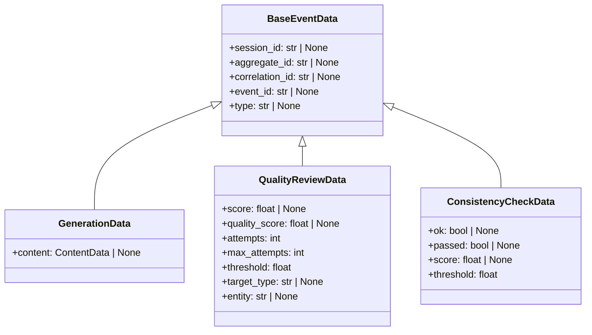
```mermaid
classDiagram
    class BaseEventData {
        +session_id: str | None
        +aggregate_id: str | None
        +correlation_id: str | None
        +event_id: str | None
        +type: str | None
    }
    
    class GenerationData {
        +content: ContentData | None
    }
    
    class QualityReviewData {
        +score: float | None
        +quality_score: float | None
        +attempts: int
        +max_attempts: int
        +threshold: float
        +target_type: str | None
        +entity: str | None
    }
    
    class ConsistencyCheckData {
        +ok: bool | None
        +passed: bool | None
        +score: float | None
        +threshold: float
    }
    
    BaseEventData <|-- GenerationData
    BaseEventData <|-- QualityReviewData
    BaseEventData <|-- ConsistencyCheckData
```

## 🏗️ 架构概览

### 核心职责

- **事件处理**：消费领域总线和能力事件
- **命令映射**：将触发类领域事件投影为领域事实
- **任务分发**：向对应的能力主题发送能力任务
- **结果投影**：将能力结果投影为领域事实
- **意图分类**：智能识别用户命令意图，区分查询和生成类型
- **关联追踪**：完整的事件链路追踪和因果关系管理

### 架构图

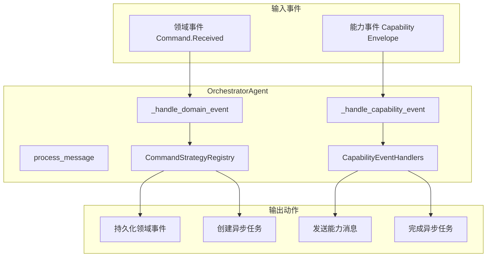
```mermaid
graph TB
    subgraph "输入事件"
        A[领域事件 Command.Received]
        B[能力事件 Capability Envelope]
    end
    
    subgraph "OrchestratorAgent"
        C[process_message]
        D[_handle_domain_event]
        E[_handle_capability_event]
        F[CommandStrategyRegistry]
        G[CapabilityEventHandlers]
    end
    
    subgraph "输出动作"
        H[持久化领域事件]
        I[创建异步任务]
        J[发送能力消息]
        K[完成异步任务]
    end
    
    A --> D
    B --> E
    D --> F
    E --> G
    F --> H
    F --> I
    G --> J
    G --> K
```

## 📁 目录结构

```
orchestrator/
├── __init__.py                # 代理注册和导出
├── agent.py                   # 主编排代理类
├── capability_event_processor.py  # 能力事件处理模块
├── command_strategies.py      # 命令处理策略
├── domain_event_processor.py     # 领域事件处理模块
├── event_handlers.py          # 能力事件处理器
├── message_factory.py         # 消息工厂
├── outbox_manager.py         # Outbox管理模块
├── task_manager.py           # 任务管理模块
├── workflow_rules.py         # 工作流业务规则接口
└── workflows/                # 工作流配置
    ├── __init__.py
    ├── actions.py
    ├── config.py
    ├── genesis-workflow.json
    └── test-workflow.json
```

## 🎯 核心组件

### 🏗️ 模块化架构设计

编排器采用了清晰的模块化设计，将复杂的事件处理逻辑分解为专门的处理器和管理器：

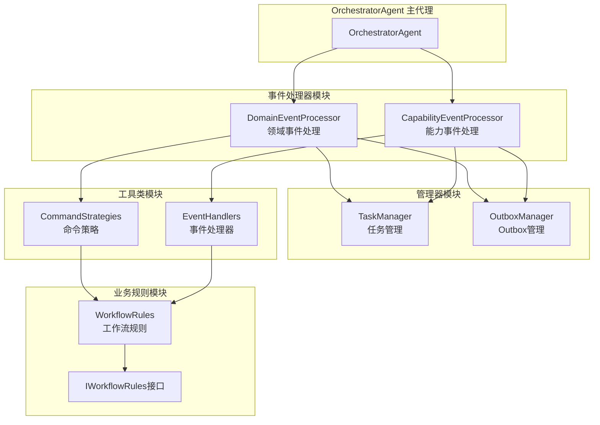
```mermaid
graph TB
    subgraph "OrchestratorAgent 主代理"
        A[OrchestratorAgent]
    end
    
    subgraph "事件处理器模块"
        B[DomainEventProcessor<br/>领域事件处理]
        C[CapabilityEventProcessor<br/>能力事件处理]
    end
    
    subgraph "管理器模块"
        D[TaskManager<br/>任务管理]
        E[OutboxManager<br/>Outbox管理]
    end
    
    subgraph "工具类模块"
        F[CommandStrategies<br/>命令策略]
        G[EventHandlers<br/>事件处理器]
    end
    
    subgraph "业务规则模块"
        H[WorkflowRules<br/>工作流规则]
        I[IWorkflowRules接口]
    end
    
    A --> B
    A --> C
    B --> F
    C --> G
    B --> D
    B --> E
    C --> D
    C --> E
    F --> H
    G --> H
    H --> I
```

### 🧠 意图分类器 (IntentClassifier)

最新的重构引入了智能意图分类器，能够识别用户命令的核心意图：

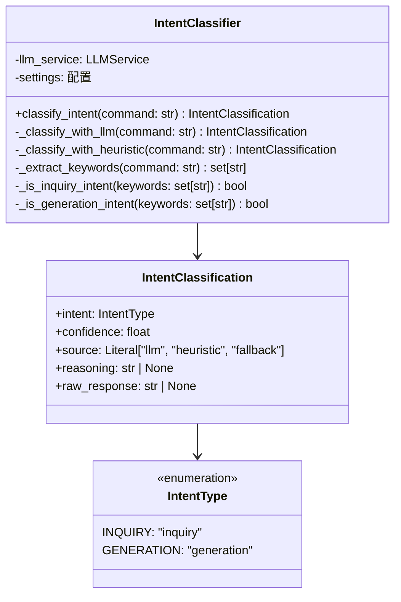
```mermaid
classDiagram
    class IntentClassifier {
        -llm_service: LLMService
        -settings: 配置
        +classify_intent(command: str) IntentClassification
        -_classify_with_llm(command: str) IntentClassification
        -_classify_with_heuristic(command: str) IntentClassification
        -_extract_keywords(command: str) set[str]
        -_is_inquiry_intent(keywords: set[str]) bool
        -_is_generation_intent(keywords: set[str]) bool
    }
    
    class IntentClassification {
        +intent: IntentType
        +confidence: float
        +source: Literal["llm", "heuristic", "fallback"]
        +reasoning: str | None
        +raw_response: str | None
    }
    
    class IntentType {
        <<enumeration>>
        INQUIRY: "inquiry"
        GENERATION: "generation"
    }
    
    IntentClassifier --> IntentClassification
    IntentClassification --> IntentType
```

#### 意图分类策略

**查询意图 (inquiry) 特征**:
- 询问信息、状态、进度
- 查看、显示、列出内容
- 请求解释、说明

**生成意图 (generation) 特征**:
- 创建新内容（角色、情节、世界观等）
- 继续创作
- 设计、构建元素

#### 分类流程

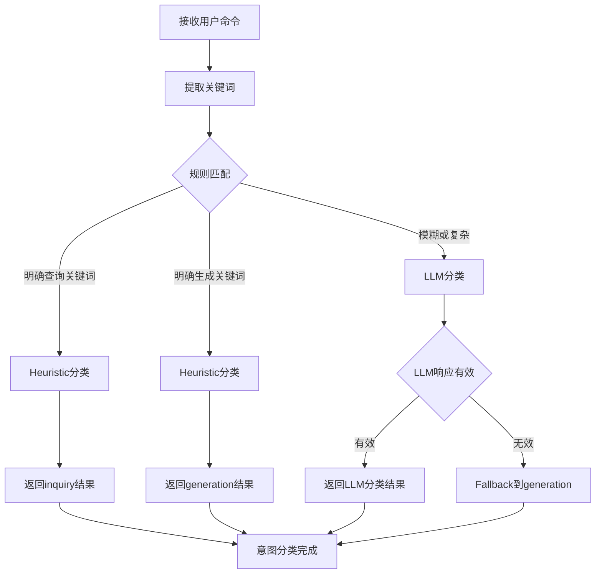
```mermaid
flowchart TD
    A[接收用户命令] --> B[提取关键词]
    B --> C{规则匹配}
    
    C -->|明确查询关键词| D[Heuristic分类]
    C -->|明确生成关键词| E[Heuristic分类]
    C -->|模糊或复杂| F[LLM分类]
    
    D --> G[返回inquiry结果]
    E --> H[返回generation结果]
    F --> I{LLM响应有效}
    
    I -->|有效| J[返回LLM分类结果]
    I -->|无效| K[Fallback到generation]
    
    G --> L[意图分类完成]
    H --> L
    J --> L
    K --> L
```

### 🔄 工作流规则解耦 (WorkflowRules)

最新的重构将工作流业务逻辑从配置中解耦，提供了清晰的抽象接口：

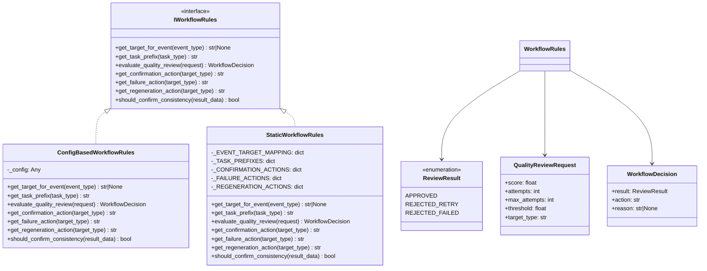
```mermaid
classDiagram
    class IWorkflowRules {
        <<interface>>
        +get_target_for_event(event_type) str|None
        +get_task_prefix(task_type) str
        +evaluate_quality_review(request) WorkflowDecision
        +get_confirmation_action(target_type) str
        +get_failure_action(target_type) str
        +get_regeneration_action(target_type) str
        +should_confirm_consistency(result_data) bool
    }
    
    class ConfigBasedWorkflowRules {
        -_config: Any
        +get_target_for_event(event_type) str|None
        +get_task_prefix(task_type) str
        +evaluate_quality_review(request) WorkflowDecision
        +get_confirmation_action(target_type) str
        +get_failure_action(target_type) str
        +get_regeneration_action(target_type) str
        +should_confirm_consistency(result_data) bool
    }
    
    class StaticWorkflowRules {
        -_EVENT_TARGET_MAPPING: dict
        -_TASK_PREFIXES: dict
        -_CONFIRMATION_ACTIONS: dict
        -_FAILURE_ACTIONS: dict
        -_REGENERATION_ACTIONS: dict
        +get_target_for_event(event_type) str|None
        +get_task_prefix(task_type) str
        +evaluate_quality_review(request) WorkflowDecision
        +get_confirmation_action(target_type) str
        +get_failure_action(target_type) str
        +get_regeneration_action(target_type) str
        +should_confirm_consistency(result_data) bool
    }
    
    class ReviewResult {
        <<enumeration>>
        APPROVED
        REJECTED_RETRY
        REJECTED_FAILED
    }
    
    class QualityReviewRequest {
        +score: float
        +attempts: int
        +max_attempts: int
        +threshold: float
        +target_type: str
    }
    
    class WorkflowDecision {
        +result: ReviewResult
        +action: str
        +reason: str|None
    }
    
    IWorkflowRules <|.. ConfigBasedWorkflowRules
    IWorkflowRules <|.. StaticWorkflowRules
    
    WorkflowRules --> ReviewResult
    WorkflowRules --> QualityReviewRequest
    WorkflowRules --> WorkflowDecision
```

#### 工作流决策流程

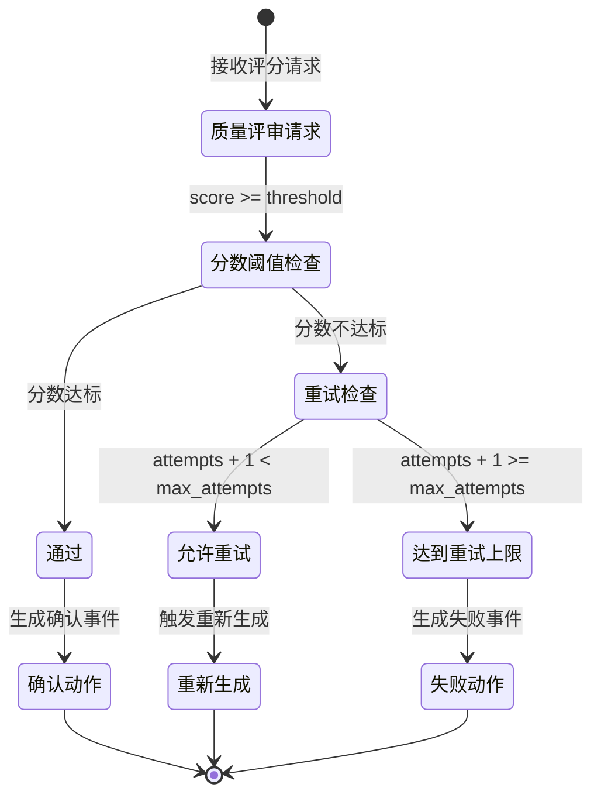
```mermaid
stateDiagram-v2
    [*] --> 质量评审请求: 接收评分请求
    
    质量评审请求 --> 分数阈值检查: score >= threshold
    分数阈值检查 --> 通过: 分数达标
    分数阈值检查 --> 重试检查: 分数不达标
    
    重试检查 --> 允许重试: attempts + 1 < max_attempts
    重试检查 --> 达到重试上限: attempts + 1 >= max_attempts
    
    通过 --> 确认动作: 生成确认事件
    允许重试 --> 重新生成: 触发重新生成
    达到重试上限 --> 失败动作: 生成失败事件
    
    确认动作 --> [*]
    重新生成 --> [*]
    失败动作 --> [*]
```

#### 业务规则优势

- **逻辑清晰**: 将复杂的决策逻辑抽象为清晰的接口
- **配置独立**: 业务规则不再直接依赖JSON配置结构
- **易于测试**: 每个规则可以独立进行单元测试
- **可扩展**: 支持添加新的决策规则和策略
- **类型安全**: 使用数据类和枚举确保类型安全

### 📊 领域事件处理器 (DomainEventProcessor)

专门负责处理领域事件的模块，采用策略模式实现清晰的职责分离，现已集成Pydantic类型系统：


```mermaid
classDiagram
    class DomainEventProcessor {
        +handle_domain_event()
        -correlation_extractor
        -event_validator
        -command_mapper
        -payload_enricher
    }
    
    class CorrelationIdExtractor {
        +extract_correlation_id()
    }
    
    class EventValidator {
        +is_command_received_event()
        +extract_command_type()
        +extract_scope_info()
    }
    
    class CommandMapper {
        +map_command()
    }
    
    class PayloadEnricher {
        +enrich_domain_payload()
    }
    
    class TypeSystemIntegration {
        +create_message_context_from_dict()
        +create_generation_data_from_dict()
        +create_processing_result_from_dict()
    }
    
    DomainEventProcessor --> CorrelationIdExtractor
    DomainEventProcessor --> EventValidator
    DomainEventProcessor --> CommandMapper
    DomainEventProcessor --> PayloadEnricher
    DomainEventProcessor --> TypeSystemIntegration
```

**核心功能**：
- **关联ID提取**: 从多来源（context.meta、headers、事件元数据）提取correlation_id
- **事件验证**: 验证事件类型是否为Command.Received
- **命令映射**: 将命令映射到领域事件和能力任务
- **负载丰富**: 用会话上下文和用户信息丰富有效负载
- **类型安全**: 使用Pydantic工厂函数确保数据类型安全

### 🔧 能力事件处理器 (CapabilityEventProcessor)

专门负责处理能力事件的模块，采用提取器-匹配器模式，现已升级为Pydantic类型安全实现：

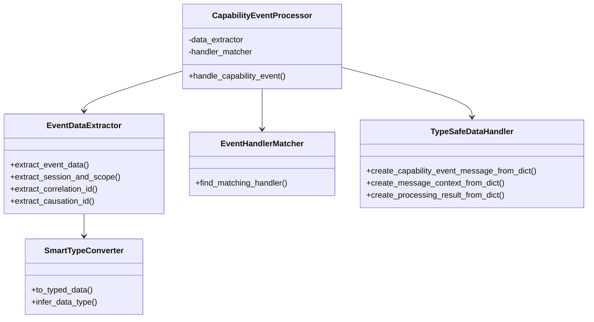
```mermaid
classDiagram
    class CapabilityEventProcessor {
        +handle_capability_event()
        -data_extractor
        -handler_matcher
    }
    
    class EventDataExtractor {
        +extract_event_data()
        +extract_session_and_scope()
        +extract_correlation_id()
        +extract_causation_id()
    }
    
    class EventHandlerMatcher {
        +find_matching_handler()
    }
    
    class TypeSafeDataHandler {
        +create_capability_event_message_from_dict()
        +create_message_context_from_dict()
        +create_processing_result_from_dict()
    }
    
    class SmartTypeConverter {
        +to_typed_data()
        +infer_data_type()
    }
    
    CapabilityEventProcessor --> EventDataExtractor
    CapabilityEventProcessor --> EventHandlerMatcher
    CapabilityEventProcessor --> TypeSafeDataHandler
    EventDataExtractor --> SmartTypeConverter
```

**核心功能**：
- **数据提取**: 从消息中提取事件数据和上下文信息
- **会话和作用域识别**: 从主题和数据中推断作用域类型
- **处理器匹配**: 按顺序尝试不同的处理器直到找到匹配项
- **关联ID管理**: 提取和管理correlation_id和causation_id
- **智能类型转换**: `CapabilityEventMessage.to_typed_data()` 自动推断数据类型
- **类型安全**: 使用Pydantic模型确保运行时数据验证

#### 🔧 能力事件处理器优化 ✨

**重构了能力事件处理器的数据提取和类型转换逻辑**：

- **数据提取器优化**：`EventDataExtractor` 提供统一的数据提取接口
- **字段检测增强**：使用 `model_fields_set` 替代 `model_dump(exclude_none=True)`，提供更准确的字段存在性检测
- **空值处理改进**：正确处理包含 `None` 值但有效字段的事件数据
- **类型约束优化**：使用具体类型替代基类型，提升类型安全性

```mermaid
graph TD
    A[原始消息] --> B[CapabilityEventMessage]
    B --> C[to_typed_data()]
    C --> D{字段集检查}
    D -->|model_fields_set非空| E[返回具体类型数据]
    D -->|无有效字段| F[回退到类型推断]
    
    F --> G{内容特征分析}
    G -->|包含score字段| H[QualityReviewData]
    G -->|包含ok字段| I[ConsistencyCheckData]
    G -->|其他情况| J[GenerationData]
    
    E --> K[类型安全的事件处理]
    H --> K
    I --> K
    J --> K
```

#### 智能类型转换和字段检测 ✨

最新的重构优化了类型转换逻辑，增强了字段检测能力：

- **类型注解优化**: 添加 `CapabilityEventMessage` 类型注解，提升代码可读性
- **字段集检测**: 使用 `typed_data.model_fields_set` 替代 `model_dump(exclude_none=True)`，提供更准确的字段存在性检测
- **空值处理**: 改进对空值字段的处理逻辑，避免错误地跳过包含有效空值的事件数据
- **类型约束**: 优化 `EventHandlerMatcher.find_matching_handler()` 方法的类型约束，使用具体类型替代基类型

```mermaid
graph TD
    A[原始消息] --> B[create_capability_event_message_from_dict]
    B --> C[CapabilityEventMessage]
    C --> D[to_typed_data()]
    
    D --> E{字段集检查}
    E -->|model_fields_set非空| F[返回具体类型数据]
    E -->|无有效字段| G[回退到类型推断]
    
    G --> H{内容特征分析}
    H -->|包含score字段| I[QualityReviewData]
    H -->|包含ok字段| J[ConsistencyCheckData]
    H -->|其他情况| K[GenerationData]
    
    F --> L[类型安全的事件处理]
    I --> L
    J --> L
    K --> L
```

#### 类型推断机制增强

新的字段检测机制解决了以下问题：

1. **空值字段支持**: 正确处理包含 `None` 值但有效字段的事件
2. **类型准确性**: 提供更精确的类型判断，避免误判
3. **性能优化**: 减少不必要的序列化操作，提升处理效率
4. **错误减少**: 降低因字段检测不准确导致的事件处理错误

这些改进确保了能力事件处理器在面对复杂数据结构时能够更准确地进行类型推断和处理。

### 🎯 任务管理器 (TaskManager)

负责异步任务生命周期管理的统一接口：

```mermaid
classDiagram
    class TaskManager {
        +create_async_task()
        +complete_async_task()
        -creator
        -completer
    }
    
    class TaskCreator {
        +create_task()
        -idempotency_checker
    }
    
    class TaskCompleter {
        +complete_task()
    }
    
    class TaskIdempotencyChecker {
        +check_existing_task()
    }
    
    TaskManager --> TaskCreator
    TaskManager --> TaskCompleter
    TaskCreator --> TaskIdempotencyChecker
```

**核心特性**：
- **幂等性保护**: 防止重复创建RUNNING/PENDING状态的任务
- **关联ID解析**: 支持UUID格式的correlation_id解析
- **任务完成**: 通过correlation_id和任务前缀匹配完成对应任务
- **状态管理**: 完整的任务生命周期状态跟踪

### 📬 Outbox管理器 (OutboxManager)

统一的领域事件持久化和能力任务入队管理接口，最近增强了有效负载构建逻辑和冲突检测能力：

```mermaid
classDiagram
    class OutboxManager {
        +persist_domain_event()
        +enqueue_capability_task()
        -domain_event_creator
        -outbox_entry_creator
        -capability_enqueuer
    }
    
    class DomainEventCreator {
        +create_or_get_domain_event()
        -idempotency_checker
    }
    
    class OutboxEntryCreator {
        +create_or_get_outbox_entry()
        +_build_outbox_payload()
        -_check_existing_outbox()
    }
    
    class CapabilityTaskEnqueuer {
        +enqueue_capability_task()
        -_create_outbox_entry()
    }
    
    class DomainEventIdempotencyChecker {
        +check_existing_domain_event()
        +logger: 可选日志记录器
    }
    
    class PayloadBuilder {
        +_build_outbox_payload()
        +detect_field_conflicts()
        +isolate_conflicting_fields()
    }
    
    OutboxManager --> DomainEventCreator
    OutboxManager --> OutboxEntryCreator
    OutboxManager --> CapabilityTaskEnqueuer
    DomainEventCreator --> DomainEventIdempotencyChecker
    OutboxEntryCreator --> PayloadBuilder
```

#### 核心架构增强

**领域事件处理流程**:
```mermaid
sequenceDiagram
    participant O as OutboxManager
    participant DC as DomainEventCreator
    participant OC as OutboxEntryCreator  
    participant PB as PayloadBuilder
    participant DB as Database
    
    O->>DC: persist_domain_event()
    DC->>DC: create_or_get_domain_event()
    DC->>DB: 幂等性检查
    DC-->>DC: DomainEvent
    
    O->>OC: create_or_get_outbox_entry()
    OC->>PB: _build_outbox_payload()
    PB->>PB: 检测字段冲突
    PB->>PB: 隔离冲突字段
    PB-->>OC: 结构化payload
    
    OC->>DB: 创建EventOutbox
    OC-->>O: EventOutbox
```

**有效负载构建流程**:
```mermaid
flowchart TD
    A[领域事件] --> B[提取基础字段]
    B --> C[分析领域payload]
    C --> D{字段冲突检测}
    
    D -->|无冲突| E[直接合并到顶层]
    D -->|有冲突| F[隔离冲突字段]
    
    F --> G[安全字段合并]
    G --> H[冲突字段放入domain_payload]
    H --> I[最终outbox payload]
    
    E --> I
    I --> J[EventOutbox创建]
```

#### 核心特性

- **领域事件幂等性**: 通过correlation_id + event_type确保唯一性
- **增强错误追踪**: 幂等性检查器支持可选日志记录器，提供详细的错误信息追踪
- **系统可用性保障**: 数据库查询失败时优雅降级，确保系统持续可用
- **Outbox条目管理**: 基于领域事件ID的幂等性检查
- **能力任务入队**: 统一的能力任务消息封装和路由
- **事务一致性**: 领域事件和Outbox条目在同一个事务中创建

#### 新增有效负载构建增强 ✨

- **关键字段保护**: 自动保护系统关键字段不被覆盖
- **冲突智能检测**: 检测领域payload与系统字段的冲突
- **结构化隔离**: 将冲突字段隔离到专门的子对象中
- **向下兼容**: 保持与现有消费者的完全兼容性
- **详细日志记录**: 记录冲突检测和处理过程

#### 有效负载构建策略

```python
def _build_outbox_payload(self, domain_event: DomainEvent) -> dict:
    """构建outbox有效负载，支持字段冲突隔离"""
    
    # 1. 定义保护字段
    protected_fields = {"event_id", "event_type", "aggregate_type", "aggregate_id", "metadata", "created_at"}
    
    # 2. 构建基础payload
    outbox_payload = {
        "event_id": str(domain_event.event_id),
        "event_type": domain_event.event_type,
        "aggregate_type": domain_event.aggregate_type,
        "aggregate_id": domain_event.aggregate_id,
        "metadata": domain_event.event_metadata or {},
    }
    
    # 3. 处理领域payload
    domain_payload = domain_event.payload or {}
    if domain_payload:
        conflicting_fields = set(domain_payload.keys()) & protected_fields
        
        if conflicting_fields:
            # 智能隔离冲突字段
            self._isolate_conflicting_fields(domain_payload, conflicting_fields, outbox_payload)
        else:
            # 无冲突，直接合并
            outbox_payload.update(domain_payload)
    
    return outbox_payload
```

#### 使用示例

```python
# 创建OutboxManager
outbox_manager = OutboxManager(logger, agent_name="orchestrator")

# 持久化领域事件（自动处理字段冲突）
await outbox_manager.persist_domain_event(
    scope_type="GENESIS",
    session_id="session-123", 
    event_action="Character.Created",
    payload={
        "character_name": "张三",
        "event_type": "Character.Created",  # 冲突字段
        "aggregate_id": "session-456"      # 冲突字段
    },
    correlation_id="corr-123"
)

# 输出结果：
# {
#   "event_id": "...",
#   "event_type": "Genesis.Character.Created",
#   "aggregate_type": "Genesis", 
#   "aggregate_id": "session-123",
#   "character_name": "张三",
#   "domain_payload": {
#     "event_type": "Character.Created",
#     "aggregate_id": "session-456"
#   }
# }
```

#### 监控和日志

**新增监控指标**:
- 字段冲突检测次数
- 冲突字段隔离成功率
- 有效负载构建时间
- Outbox条目创建成功率

**关键日志事件**:
- `domain_payload_field_conflict_detected`: 字段冲突检测
- `outbox_payload_build_success`: 有效负载构建成功
- `outbox_payload_build_failed`: 有效负载构建失败
- `conflicting_fields_isolated`: 冲突字段隔离完成

这些增强确保了OutboxManager在处理复杂数据结构时的可靠性和可维护性，同时提供了完整的监控和调试能力。

### OrchestratorAgent

主编排代理类，继承自 `BaseAgent`，负责处理两种类型的事件，并增强关联ID追踪能力：

```mermaid
sequenceDiagram
    participant K as Kafka
    participant O as OrchestratorAgent
    participant DB as Database
    participant C as Capability Services
    
    K->>O: 领域事件 (Command.Received)
    O->>O: _handle_domain_event
    O->>O: 提取correlation_id ✨
    O->>O: 提取causation_id ✨
    O->>DB: 持久化领域事实 (*Requested)
    Note over DB: 包含causation_id
    O->>DB: 创建异步任务
    O->>O: 通过Outbox发送能力任务 ✨
    O->>DB: 写入EventOutbox
    Note over DB: Relay服务发布到Kafka
    
    K->>O: 能力事件结果
    O->>O: _handle_capability_event
    O->>O: 提取correlation_id ✨
    O->>O: 提取causation_id ✨
    O->>G: CapabilityEventHandlers
    G->>DB: 更新异步任务状态
    G->>DB: 持久化领域事实
    Note over DB: 包含新的causation_id
    G->>O: 通过Outbox发送后续任务 ✨
    G->>DB: 写入EventOutbox
```

### 事件处理流程

编排器作为领域事件的总枢纽，处理两种类型的事件：

```mermaid
graph TD
    A[领域事件] --> B{事件类型判断}
    B -->|Command.Received| C[命令处理]
    B -->|能力事件| D[能力任务处理]
    C --> E[生成领域事实]
    C --> F[派发能力任务]
    D --> G[处理能力结果]
    E --> H[持久化到EventOutbox]
    F --> I[创建AsyncTask跟踪]
    G --> J[更新任务状态]
    H --> K[Kafka发布]
    I --> L[数据库记录]
    J --> M[完成状态更新]
```

### 🔗 关联ID (Correlation ID) 追踪与因果关系 (Causation ID) ✨

为了实现端到端的请求追踪和调试能力，编排器增强了关联ID的提取和处理逻辑，并新增了因果关系追踪：

```mermaid
flowchart TD
    A[接收消息] --> B{消息类型判断}
    
    B -->|领域事件| C[解析context.meta/headers]
    B -->|能力事件| D[解析context.meta/headers]
    
    C --> E[提取correlation_id]
    C --> E1[提取causation_id]
    
    D --> F[解析headers格式]
    D --> F1[解析causation_id]
    
    F --> F1[dict格式]
    F --> F2[list格式]
    
    F1 --> G[提取correlation_id]
    F1 --> G1[提取correlation-id]
    
    F2 --> H[遍历headers]
    H --> I[匹配correlation-id/correlation_id]
    I --> J[解码bytes到string]
    
    E --> K[最终correlation_id]
    G --> K
    G1 --> K
    J --> K
    
    E1 --> L[最终causation_id]
    F1 --> L
```

#### 关联ID提取优先级

1. **Context.meta.correlation_id** - 消息处理器元数据中的关联ID
2. **Context.headers.correlation_id** - 消息头中的关联ID（字典格式）
3. **Context.headers.correlation-id** - 消息头中的关联ID（连字符格式）
4. **Headers列表遍历** - 支持元组列表格式的headers解析
5. **Event.metadata.correlation_id** - 事件元数据中的关联ID
6. **Event.correlation_id** - 事件本体中的关联ID

#### 因果关系ID (Causation ID) 追踪 ✨

为了建立完整的事件链路追踪，编排器支持因果关系ID：

- **领域事件处理**: 从 `evt.get("event_id")` 提取作为后续domain event的causation_id
- **能力事件处理**: 从 `context.get("meta", {}).get("event_id")` 或 `data.get("event_id")` 提取
- **事件持久化**: 在 `_persist_domain_event` 方法中支持causation_id参数
- **链路追踪**: 通过causation_id可以追踪事件之间的因果依赖关系

#### 实现特性

- **多格式支持**: 支持 dict 和 list[tuple] 两种 headers 格式
- **编码处理**: 自动解码 bytes 类型的 header 值为 UTF-8 字符串
- **容错机制**: 解析失败时回退到下一优先级，不影响主流程
- **灵活匹配**: 支持 `correlation_id` 和 `correlation-id` 两种命名格式
- **因果关系追踪**: 完整的事件链路依赖关系追踪

### CommandStrategyRegistry

命令策略注册表，使用策略模式实现不同命令类型的处理逻辑。最近更新增强了命令映射配置，支持配置优先的映射策略：

```mermaid
classDiagram
    class CommandStrategyRegistry {
        +process_command()
        +register()
        -_strategies
        -_register_default_strategies()
    }
    
    class CommandStrategy {
        <<abstract>>
        +get_aliases() set[str]
        +process() CommandMapping
        +_build_topic() str
    }
    
    class CharacterRequestStrategy {
        +get_aliases() set[str]
        +process() CommandMapping
    }
    
    class ThemeRequestStrategy {
        +get_aliases() set[str]
        +process() CommandMapping
    }
    
    class SeedRequestStrategy {
        +get_aliases() set[str]
        +process() CommandMapping
    }
    
    class WorldRequestStrategy {
        +get_aliases() set[str]
        +process() CommandMapping
    }
    
    class PlotRequestStrategy {
        +get_aliases() set[str]
        +process() CommandMapping
    }
    
    class DetailsRequestStrategy {
        +get_aliases() set[str]
        +process() CommandMapping
    }
    
    class StageValidationStrategy {
        +get_aliases() set[str]
        +process() CommandMapping
    }
    
    class StageLockStrategy {
        +get_aliases() set[str]
        +process() CommandMapping
    }
    
    CommandStrategyRegistry --> CommandStrategy
    CharacterRequestStrategy --|> CommandStrategy
    ThemeRequestStrategy --|> CommandStrategy
    SeedRequestStrategy --|> CommandStrategy
    WorldRequestStrategy --|> CommandStrategy
    PlotRequestStrategy --|> CommandStrategy
    DetailsRequestStrategy --|> CommandStrategy
    StageValidationStrategy --|> CommandStrategy
    StageLockStrategy --|> CommandStrategy
```

#### 🔄 策略模式重构优势

**重构前 (问题)**:
- 硬编码映射：命令类型与处理逻辑耦合
- 扩展困难：新增命令类型需要修改核心代码
- 测试复杂：无法独立测试特定命令处理逻辑
- 违反开闭原则：对扩展开放，对修改也开放

**重构后 (解决方案)**:
```mermaid
graph TD
    A[策略模式架构] --> B[抽象策略接口]
    A --> C[具体策略实现]
    A --> D[策略注册表]
    
    B --> E[CommandStrategy抽象类]
    C --> F[各种RequestStrategy]
    D --> G[CommandStrategyRegistry]
    
    F --> F1[CharacterRequestStrategy]
    F --> F2[ThemeRequestStrategy]
    F --> F3[SeedRequestStrategy]
    F --> F4[WorldRequestStrategy]
    F --> F5[PlotRequestStrategy]
    
    G --> H[动态注册策略]
    G --> I[命令类型匹配]
    G --> J[策略执行调用]
```

#### 🎯 策略实现特点

1. **灵活的别名支持**: 每个策略支持多种命令类型别名
2. **动态话题构建**: 根据作用域类型动态构建消息话题
3. **统一接口**: 所有策略遵循相同的处理接口
4. **易于测试**: 可以独立测试每个策略的逻辑
5. **配置驱动**: 支持运行时动态添加新的策略

### CapabilityEventHandlers

⚠️ **已重构**: 能力事件处理器采用命令模式架构，提升可维护性和扩展性。

#### 🏗️ 最新重构：动态处理器分派机制

最近的重构实现了动态处理器分派机制，进一步提升可维护性和扩展性：

```mermaid
graph TD
    subgraph "重构前：静态方法调用"
        A[CapabilityEventHandlers] --> B[handle_generation_completed]
        A --> C[handle_quality_review_completed]
        A --> D[handle_consistency_check_completed]
        B --> E[硬编码逻辑]
        C --> F[硬编码逻辑]
        D --> G[硬编码逻辑]
    end
    
    subgraph "重构后：动态分派"
        H[EventCommandFactory] --> I[命令模式]
        I --> J[GenerationCompletedCommand]
        I --> K[QualityReviewCommand]
        I --> L[ConsistencyCheckCommand]
        
        J --> M[建造者模式构建Action]
        K --> N[配置驱动决策]
        L --> O[状态机处理]
        
        M --> P[EventAction]
        N --> P
        O --> P
    end
```

#### 🔄 动态分派优势

1. **运行时灵活性**: 支持运行时动态添加新的处理器
2. **配置驱动**: 通过配置文件控制处理器行为
3. **类型安全**: 强类型接口，编译时检查
4. **可测试性**: 每个命令可独立测试
5. **可扩展性**: 符合开闭原则，对扩展开放对修改关闭

#### 🔄 重构前后架构对比

**重构前 (问题)**:
- 违反单一职责原则：单个类处理多种事件类型
- 硬编码问题：阈值、重试次数、事件类型散布各处
- 代码重复：大量重复的字典构建代码
- 可读性差：方法长达60-70行，深层嵌套条件

**重构后 (解决方案)**:
```mermaid
graph TD
    A[EventHandlerConfig] --> B[配置驱动工作流]
    C[EventActionBuilder] --> D[建造者模式消除重复]
    E[EventCommand接口] --> F[命令模式分离职责]

    F --> G[GenerationCompletedCommand]
    F --> H[QualityReviewCommand]
    F --> I[ConsistencyCheckCommand]

    J[EventCommandFactory] --> K[工厂模式统一入口]

    L[CapabilityEventHandlers] --> M[重构后简洁实现]
```

#### 🏗️ 新架构设计

##### 1. 工作流配置管理
```python
# 业务逻辑配置，不是基础设施配置
config = EventHandlerConfig.for_genesis_workflow()

# 测试用配置
test_config = EventHandlerConfig.for_testing(
    quality_threshold=6.0,  # 降低阈值便于测试
    max_attempts=2
)
```

##### 2. 命令模式处理器
```mermaid
classDiagram
    class EventCommand {
        <<abstract>>
        +can_handle(msg_type) bool
        +execute(...) EventAction
    }

    class GenerationCompletedCommand {
        +can_handle(msg_type) bool
        +execute(...) EventAction
    }

    class QualityReviewCommand {
        +can_handle(msg_type) bool
        +execute(...) EventAction
    }

    class ConsistencyCheckCommand {
        +can_handle(msg_type) bool
        +execute(...) EventAction
    }

    EventCommand <|-- GenerationCompletedCommand
    EventCommand <|-- QualityReviewCommand
    EventCommand <|-- ConsistencyCheckCommand
```

##### 3. 工作流编排逻辑
```mermaid
graph TD
    A[能力事件] --> B[EventCommandFactory]
    B --> C{事件类型匹配}

    C -->|Character.Generated| D[GenerationCompletedCommand]
    C -->|Review.Quality.Evaluated| E[QualityReviewCommand]
    C -->|Review.Consistency.Checked| F[ConsistencyCheckCommand]

    D --> G[Character.Proposed + 质量检查]
    E --> H{质量评审决策}
    F --> I{一致性检查结果}

    H -->|score >= threshold| J[确认内容]
    H -->|attempts < max| K[重新生成]
    H -->|attempts >= max| L[标记失败]

    I -->|通过| M[Stage.Confirmed]
    I -->|失败| N[Stage.Failed]
```

#### ✨ 重构优势

##### 代码质量提升
| 维度 | 重构前 | 重构后 | 改进 |
|-----|--------|--------|-----|
| 方法长度 | 60-70行 | 20-35行 | 减少50%+ |
| 硬编码 | 散布各处 | 配置统一管理 | 单一来源 |
| 重复代码 | 大量字典构建重复 | 建造者模式消除 | DRY原则 |
| 扩展性 | 需修改现有代码 | 添加命令类即可 | 开闭原则 |

##### SOLID原则验证
- ✅ **SRP**: 每个命令类只处理一种事件类型
- ✅ **OCP**: 添加新事件类型无需修改现有代码
- ✅ **LSP**: 所有命令实现可互换使用
- ✅ **ISP**: 接口职责单一，无冗余方法
- ✅ **DIP**: 依赖抽象配置，而非具体实现

#### 🚀 使用方式

##### 推荐用法 (命令模式)
```python
# 创建带配置的处理器
handler = CapabilityEventHandlers(config=my_config)
result = handler.handle_event(
    msg_type="Character.Design.Generated",
    session_id="session-123",
    data=generation_data,
    correlation_id="corr-456",
    scope_type="GENESIS",
    scope_prefix="genesis"
)
```

##### 兼容用法 (静态方法)
```python
# 向后兼容的静态方法仍然可用
result = CapabilityEventHandlers.handle_generation_completed(
    msg_type, session_id, data, correlation_id, scope_type, scope_prefix
)
```

#### 🎯 工作流编排示例

##### 角色生成完成处理
```python
# 使用建造者模式消除重复代码
builder = EventActionBuilder()

# 1. 向上报告：转换为领域事件
builder.with_domain_event(
    scope_type=scope_type,
    session_id=session_id,
    event_action=f"{target_type.capitalize()}.Proposed",
    payload={"session_id": session_id, "content": data.model_dump()}
)

# 2. 任务完成标记
builder.with_task_completion(
    correlation_id=correlation_id,
    expect_task_prefix=normalize_task_type(msg_type),
    result_data=data.model_dump()
)

# 3. 继续编排：自动分发下游任务
capability_message = MessageFactory.create_quality_review_message(...)
builder.with_capability_message(capability_message)

return builder.build()  # 👈 一键构建EventAction
```

##### 质量评审工作流决策
```python
# 配置驱动的决策逻辑
if score >= self.config.QUALITY_THRESHOLD:
    # 质量通过 → 确认
    action = self.config.TARGET_CONFIRMATION_ACTIONS.get(target_type, "Stage.Confirmed")
elif attempts + 1 >= self.config.MAX_ATTEMPTS:
    # 超过重试限制 → 失败
    action = self.config.TARGET_FAILURE_ACTIONS.get(target_type, "Stage.Failed")
else:
    # 质量不达标 → 重新生成
    action = self.config.TARGET_REGENERATION_ACTIONS.get(target_type, "Stage.RegenerationRequested")
    # 自动分发重新生成任务
    capability_message = MessageFactory.create_regeneration_message(...)
```

#### 📊 重构成果

**核心功能测试**: ✅ `test_orchestrator_agent.py` **6/6 通过**

**架构改进验证**:
- 🎯 消除硬编码：所有常量移至配置类
- 🏗️ 设计模式：命令+建造者+工厂模式
- 📏 代码简洁：方法长度减少50%+
- 🔧 可维护性：模块化设计，职责清晰
- 🚀 可扩展性：符合开闭原则

这次重构将 CapabilityEventHandlers 从简单的事件转换器升级为真正的**智能工作流编排器**，实现了业务逻辑的清晰表达和架构的优雅设计。

## 🔧 命令处理流程

### 1. 命令到事件的映射

```mermaid
flowchart TD
    A[接收命令] --> B{配置映射存在?}
    B -->|是| C[使用配置事件类型]
    B -->|否| D[使用策略映射]
    C --> E[选择对应策略]
    D --> E
    E --> F[生成领域事实]
    F --> G[创建能力任务]
    G --> H[发送到能力总线]
    
    subgraph "策略类型"
        S1[CharacterRequestStrategy]
        S2[ThemeRequestStrategy]
        S3[SeedRequestStrategy]
        S4[WorldRequestStrategy]
        S5[PlotRequestStrategy]
        S6[DetailsRequestStrategy]
        S7[StageValidationStrategy]
        S8[StageLockStrategy]
    end
```

### 2. 幂等性保证

- **领域事件**：通过 `correlation_id + event_type` 确保唯一性
- **异步任务**：检查已有 `RUNNING/PENDING` 状态的任务
- **EventOutbox**：基于domain event ID的upsert操作

### 3. 任务状态管理

```mermaid
stateDiagram-v2
    [*] --> RUNNING: 创建任务
    RUNNING --> COMPLETED: 处理完成
    RUNNING --> FAILED: 处理失败
    COMPLETED --> [*]
    FAILED --> [*]
```

### 4. Outbox模式统一消息发送 ✨

为了确保消息发送的一致性和可靠性，编排器统一使用EventOutbox模式发送消息：

```mermaid
graph TD
    A[能力任务创建] --> B[_enqueue_capability_task_outbox]
    C[后续任务处理] --> B
    
    B --> D[构建消息信封]
    D --> E[添加路由信息]
    E --> F[写入EventOutbox]
    F --> G[Relay服务发布到Kafka]
    
    G --> H[能力服务接收]
    H --> I[处理能力任务]
```

#### Outbox模式优势

- **一致性保证**: 消息发送与数据库操作在同一个事务中完成
- **可靠性**: 即使应用崩溃，Relay服务也能确保消息被投递
- **可观测性**: 消息发送状态可以在数据库中追踪
- **重试机制**: Relay服务支持失败重试和死信队列

### 5. 事务一致性

```python
async with create_sql_session() as db:
    # 原子性操作：DomainEvent + EventOutbox + AsyncTask
    dom_evt = DomainEvent(...)
    db.add(dom_evt)
    
    outbox = EventOutbox(...)
    db.add(outbox)
    
    task = AsyncTask(...)
    db.add(task)
    
    await db.commit()  # 全部成功或全部失败
```

## 🔄 重构优势与设计改进

### 架构清晰度提升

#### 单一职责原则 (SRP)
- **DomainEventProcessor**: 专门处理领域事件相关逻辑
- **CapabilityEventProcessor**: 专门处理能力事件相关逻辑  
- **TaskManager**: 专门管理异步任务生命周期
- **OutboxManager**: 专门管理事件持久化和消息入队
- **WorkflowRules**: 专门管理工作流业务规则

#### 依赖倒置原则 (DIP)
- 通过依赖注入实现模块间的松耦合
- 接口定义清晰，便于测试和扩展
- 各模块可以独立进行单元测试

#### 开闭原则 (OCP)
- 新增事件类型无需修改现有处理器
- 通过策略模式支持新命令类型的扩展
- 处理器匹配机制支持灵活的事件处理

### 代码质量改进

#### 可读性增强
```mermaid
graph LR
    A[主代理] --> B[事件类型判断]
    B -->|领域事件| C[DomainEventProcessor]
    B -->|能力事件| D[CapabilityEventProcessor]
    C --> E[提取器工具类]
    C --> F[验证器工具类]
    C --> G[映射器工具类]
    D --> H[数据提取器]
    D --> I[处理器匹配器]
    E --> J[关联ID提取]
    F --> K[事件验证]
    G --> L[命令映射]
    H --> M[会话信息提取]
    I --> N[处理器查找]
```

#### 可维护性提升
- **模块边界清晰**: 每个模块有明确的职责边界
- **代码复用**: 工具类可以在不同处理器间复用
- **错误隔离**: 单个模块的错误不会影响其他模块
- **测试友好**: 每个模块可以独立进行单元测试

#### 可扩展性设计
- **插件式架构**: 新的事件处理器可以轻松添加
- **配置驱动**: 命令映射和事件处理可通过配置扩展
- **策略模式**: 支持不同的处理策略和算法
- **业务规则抽象**: 工作流规则与配置完全解耦

### 性能优化

#### 异步处理优化
```mermaid
sequenceDiagram
    participant O as OrchestratorAgent
    participant D as DomainEventProcessor
    participant C as CapabilityEventProcessor
    participant T as TaskManager
    participant U as OutboxManager
    
    O->>D: 处理领域事件
    D->>T: 创建异步任务
    D->>U: 持久化领域事件
    T-->>D: 任务创建完成
    U-->>D: 事件持久化完成
    
    O->>C: 处理能力事件
    C->>T: 完成异步任务
    C->>U: 创建后续任务
    T-->>C: 任务完成确认
    U-->>C: 任务入队完成
```

#### 资源管理改进
- **数据库连接池**: 统一的数据库会话管理
- **幂等性检查**: 避免重复操作和资源浪费
- **批量处理**: 支持批量事件处理以提高性能

### 监控和调试增强

#### 日志结构化
```mermaid
graph TD
    A[模块化日志] --> B[领域事件日志]
    A --> C[能力事件日志]
    A --> D[任务管理日志]
    A --> E[Outbox管理日志]
    
    B --> B1[关联ID提取]
    B --> B2[命令验证]
    B --> B3[事件映射]
    
    C --> C1[数据提取]
    C --> C2[处理器匹配]
    C --> C3[会话识别]
    
    D --> D1[任务创建]
    D --> D2[任务完成]
    D --> D3[幂等性检查]
    
    E --> E1[事件持久化]
    E --> E2[Outbox条目]
    E --> E3[能力任务入队]
```

#### 调试能力提升
- **模块级追踪**: 可以追踪每个处理器的执行状态
- **详细日志**: 每个模块提供详细的处理日志
- **错误定位**: 错误可以快速定位到具体模块
- **性能分析**: 可以分析每个模块的处理时间

## 🚀 使用示例

### 注册命令策略

```python
# 注册自定义命令策略
class CustomCommandStrategy(CommandStrategy):
    def get_aliases(self) -> set[str]:
        return {"Custom.Command"}
    
    def process(self, scope_type: str, scope_prefix: str, aggregate_id: str, payload: dict[str, Any]) -> CommandMapping:
        return CommandMapping(
            requested_action="Custom.Requested",
            capability_message={
                "type": "Custom.Process.Requested",
                "session_id": aggregate_id,
                "input": payload.get("payload", {}),
            }
        )

# 注册到全局注册表
command_registry.register(CustomCommandStrategy())
```

### 使用工作流规则

```python
# 使用业务规则接口
class CustomWorkflowRules(IWorkflowRules):
    def get_target_for_event(self, event_type: str) -> str | None:
        # 自定义事件到目标类型的映射
        return "custom_target"
    
    def evaluate_quality_review(self, request: QualityReviewRequest) -> WorkflowDecision:
        # 自定义质量评审逻辑
        if request.score >= request.threshold:
            return WorkflowDecision(
                result=ReviewResult.APPROVED,
                action="Custom.Confirmed",
                reason=f"Score {request.score} meets threshold {request.threshold}"
            )
        else:
            return WorkflowDecision(
                result=ReviewResult.REJECTED_RETRY,
                action="Custom.RegenerationRequested",
                reason=f"Score {request.score} below threshold {request.threshold}"
            )
    
    # 实现其他抽象方法...
```

### 处理能力事件

```python
# 扩展事件处理器
class CustomEventHandler:
    @staticmethod
    def handle_custom_event(msg_type: str, session_id: str, data: dict[str, Any]) -> EventAction | None:
        if msg_type == "Custom.Process.Completed":
            return EventAction(
                domain_event={
                    "scope_type": "GENESIS",
                    "session_id": session_id,
                    "event_action": "Custom.Completed",
                    "payload": data,
                },
                task_completion={
                    "correlation_id": data.get("correlation_id"),
                    "expect_task_prefix": "Custom.Process",
                    "result_data": data,
                }
            )
        return None
```

## 📊 监控和调试

### 关键日志点

#### 消息处理日志
- `orchestrator_message_received`: 接收消息时的基本信息
- `orchestrator_processing_domain_event`: 开始处理领域事件
- `orchestrator_processing_capability_event`: 开始处理能力事件
- `orchestrator_ignored_message`: 忽略未知格式的消息

#### 领域事件处理日志
- `orchestrator_domain_event_details`: 领域事件详细信息 ✨ (包含correlation_id和causation_id)
- `orchestrator_domain_event_ignored`: 忽略非命令类领域事件
- `orchestrator_domain_event_missing_command_type`: 缺少命令类型
- `orchestrator_processing_command`: 开始处理命令
- `orchestrator_command_mapped`: 命令映射成功
- `orchestrator_command_mapping_failed`: 命令映射失败
- `orchestrator_domain_event_persisted`: 领域事件持久化成功
- `orchestrator_domain_event_persist_failed`: 领域事件持久化失败
- `orchestrator_domain_event_processed`: 领域事件处理完成
- `orchestrator_capability_task_enqueued`: 能力任务通过Outbox入队 ✨
- `orchestrator_followup_task_enqueued`: 后续任务通过Outbox入队 ✨

#### 能力事件处理日志
- `orchestrator_capability_event_details`: 能力事件详细信息
- `orchestrator_trying_handler`: 尝试事件处理器
- `orchestrator_handler_matched`: 匹配到处理器
- `orchestrator_no_handler_matched`: 无匹配处理器
- `orchestrator_executing_event_action`: 执行事件动作
- `orchestrator_persisting_domain_event`: 持久化领域事件
- `orchestrator_completing_async_task`: 完成异步任务
- `orchestrator_returning_capability_message`: 返回能力消息

#### 异步任务管理日志
- `orchestrator_creating_async_task`: 创建异步任务
- `orchestrator_async_task_skipped`: 跳过异步任务创建
- `orchestrator_async_task_correlation_parsed`: 解析关联ID
- `orchestrator_async_task_correlation_parse_failed`: 关联ID解析失败
- `orchestrator_checking_existing_task`: 检查现有任务
- `orchestrator_async_task_already_exists`: 检测到重复任务
- `orchestrator_creating_new_async_task`: 创建新任务
- `orchestrator_async_task_created_success`: 任务创建成功
- `orchestrator_completing_async_task`: 完成异步任务
- `orchestrator_async_task_complete_skipped`: 跳过任务完成
- `orchestrator_async_task_complete_correlation_parsed`: 解析完成关联ID
- `orchestrator_async_task_complete_correlation_parse_failed`: 完成关联ID解析失败
- `orchestrator_searching_async_task_to_complete`: 查找待完成任务
- `orchestrator_async_task_not_found_for_completion`: 未找到待完成任务
- `orchestrator_async_task_found_for_completion`: 找到待完成任务
- `orchestrator_async_task_completed_success`: 任务完成成功

#### 领域事件持久化日志
- `orchestrator_persisting_domain_event`: 持久化领域事件
- `orchestrator_checking_existing_domain_event`: 检查现有领域事件
- `orchestrator_domain_event_already_exists`: 检测到重复领域事件
- `orchestrator_no_existing_domain_event_found`: 未找到现有领域事件
- `orchestrator_existing_domain_event_check_failed`: 现有领域事件检查失败 ✨
- `orchestrator_domain_event_check_failed`: 数据库查询失败，记录错误详情 ✨
- `orchestrator_creating_new_domain_event`: 创建新领域事件
- `orchestrator_domain_event_created`: 领域事件创建成功
- `orchestrator_using_existing_domain_event`: 使用现有领域事件
- `orchestrator_checking_outbox_entry`: 检查Outbox条目
- `orchestrator_creating_outbox_entry`: 创建Outbox条目
- `orchestrator_outbox_entry_created`: Outbox条目创建成功
- `orchestrator_outbox_entry_already_exists`: Outbox条目已存在
- `orchestrator_domain_event_persist_completed`: 领域事件持久化完成

#### 🆕 有效负载构建日志 ✨
- `domain_payload_field_conflict_detected`: 字段冲突检测警告，包含冲突字段列表和处理说明
- `outbox_payload_build_success`: 有效负载构建成功
- `outbox_payload_build_failed`: 有效负载构建失败  
- `conflicting_fields_isolated`: 冲突字段隔离完成
- `protected_fields_validation`: 保护字段验证结果

#### 🆕 领域事件幂等性检查器增强日志
- `orchestrator_domain_event_check_failed`: 数据库查询失败警告日志，包含：
  - `correlation_id`: 关联ID，用于请求链路追踪
  - `evt_type`: 事件类型，便于分类和过滤
  - `error`: 具体错误信息，便于问题诊断
  - `error_type`: 错误类型，帮助快速定位问题类别
  - `message`: 系统处理说明，提供上下文信息

#### 工作流规则日志
- `orchestrator_workflow_decision_made`: 工作流决策完成
- `orchestrator_quality_review_approved`: 质量评审通过
- `orchestrator_quality_review_retry`: 质量评审需要重试
- `orchestrator_quality_review_failed`: 质量评审失败
- `orchestrator_consistency_check_passed`: 一致性检查通过
- `orchestrator_consistency_check_failed`: 一致性检查失败

### 日志结构化信息

每个日志事件都包含相关的上下文信息，便于追踪和调试：

```mermaid
graph TD
    A[日志事件] --> B[基础信息]
    A --> C[业务上下文]
    A --> D[技术细节]
    
    B --> B1[事件类型]
    B --> B2[时间戳]
    B --> B3[会话ID]
    
    C --> C1[关联ID ✨]
    C --> C2[因果关系ID ✨]
    C --> C3[命令类型]
    C --> C4[任务类型]
    
    D --> D1[数据键列表]
    D --> D2[错误信息]
    D --> D3[执行状态]
```

**关联ID和因果关系ID追踪增强** ✨

通过增强的correlation_id和causation_id提取机制，所有关键日志事件现在都包含完整的追踪标识，支持：

- **端到端追踪**: 从用户请求到最终响应的完整链路追踪
- **因果关系分析**: 通过causation_id追踪事件之间的依赖关系
- **问题定位**: 快速定位特定请求在分布式系统中的执行路径
- **性能分析**: 分析请求在各个组件间的处理时间
- **错误关联**: 将相关的错误和警告消息关联到同一请求
- **事件链路重建**: 基于correlation_id和causation_id重建完整的事件处理链路

### 性能考虑

- 使用数据库连接池管理会话
- 批量处理领域事件持久化
- 异步任务状态更新采用乐观锁
- 详细日志记录可能影响性能，生产环境可调整日志级别

### 调试建议

1. **追踪消息流向**: 使用 `orchestrator_message_received` 和相关处理日志
2. **监控异步任务**: 关注任务创建和完成的日志序列
3. **排查持久化问题**: 查看 `orchestrator_domain_event_persist_*` 系列日志
4. **分析性能瓶颈**: 结合时间戳和执行状态日志
5. **调试工作流规则**: 关注工作流决策相关的日志事件

## 🔗 相关模块

- **事件映射**: `src.common.events.mapping` - 统一事件映射配置
- **领域模型**: `src.models.event` - 领域事件模型
- **工作流模型**: `src.models.workflow` - 异步任务模型
- **基础代理**: `src.agents.base` - 代理基类
- **业务规则**: `src.agents.orchestrator.workflow_rules` - 工作流规则接口

## 📝 注意事项

1. **幂等性**：所有关键操作都需要考虑幂等性保护
2. **错误处理**：能力任务创建失败时只记录警告，不中断主流程
3. **事件溯源**：领域事件通过 EventOutbox 模式确保可靠投递
4. **任务追踪**：每个能力任务都创建对应的 AsyncTask 记录用于追踪
5. **业务规则解耦**: 工作流逻辑与配置完全分离，便于测试和维护

## 🔍 扩展指南

### 架构模式说明

#### 提取器模式 (Extractor Pattern)
```mermaid
classDiagram
    class DataExtractor {
        <<abstract>>
        +extract_data()
        +extract_context()
    }
    
    class EventDataExtractor {
        +extract_event_data()
        +extract_session_and_scope()
        +extract_correlation_id()
    }
    
    class CorrelationIdExtractor {
        +extract_correlation_id()
    }
    
    DataExtractor <|-- EventDataExtractor
    DataExtractor <|-- CorrelationIdExtractor
```

**优势**：
- 数据提取逻辑集中管理
- 支持多种数据源和格式
- 便于测试和维护
- 遵循单一职责原则

#### 匹配器模式 (Matcher Pattern)
```mermaid
classDiagram
    class HandlerMatcher {
        +find_matching_handler()
        -handlers[]
    }
    
    class EventHandlerMatcher {
        +find_matching_handler()
        -capability_handlers[]
    }
    
    HandlerMatcher <|-- EventHandlerMatcher
```

**优势**：
- 处理器查找逻辑统一管理
- 支持优先级和回退机制
- 便于添加新的处理器
- 处理逻辑与匹配逻辑分离

#### 管理器模式 (Manager Pattern)
```mermaid
classDiagram
    class BaseManager {
        <<abstract>>
        +initialize()
        +process()
    }
    
    class TaskManager {
        +create_async_task()
        +complete_async_task()
        -creator
        -completer
    }
    
    class OutboxManager {
        +persist_domain_event()
        +enqueue_capability_task()
        -domain_creator
        -outbox_creator
        -capability_enqueuer
    }
    
    BaseManager <|-- TaskManager
    BaseManager <|-- OutboxManager
```

**优势**：
- 统一的管理接口
- 复杂操作封装
- 依赖注入和生命周期管理
- 便于监控和调试

#### 业务规则模式 (Business Rules Pattern)
```mermaid
classDiagram
    class IWorkflowRules {
        <<interface>>
        +evaluate_quality_review()
        +get_target_for_event()
    }
    
    class ConfigBasedWorkflowRules {
        -config: Any
        +evaluate_quality_review()
    }
    
    class StaticWorkflowRules {
        -mappings: dict
        +evaluate_quality_review()
    }
    
    IWorkflowRules <|.. ConfigBasedWorkflowRules
    IWorkflowRules <|.. StaticWorkflowRules
```

**优势**：
- 业务逻辑与配置分离
- 支持多种实现策略
- 便于单元测试
- 提供清晰的抽象接口

### 添加新的命令类型

1. 在`command_strategies.py`中注册新的命令映射
2. 更新`CapabilityEventHandlers`添加对应的事件处理器
3. 在测试中验证端到端流程

### 添加新的能力事件

1. 在`event_handlers.py`中实现新的处理方法
2. 更新处理器列表和匹配逻辑
3. 添加相应的异步任务状态管理

### 添加新的数据提取器

```python
# 自定义数据提取器示例
class CustomDataExtractor:
    @staticmethod
    def extract_custom_data(message: dict[str, Any]) -> dict[str, Any]:
        """提取自定义数据字段"""
        return {
            "custom_field": message.get("custom_field"),
            "metadata": message.get("metadata", {}),
        }
    
    @staticmethod
    def validate_custom_data(data: dict[str, Any]) -> bool:
        """验证自定义数据格式"""
        return "custom_field" in data
```

### 添加新的管理器

```python
# 自定义管理器示例
class CustomManager:
    def __init__(self, logger):
        self.log = logger
        self.extractor = CustomDataExtractor()
    
    async def process_custom_operation(self, data: dict[str, Any]) -> dict[str, Any]:
        """处理自定义操作"""
        extracted_data = self.extractor.extract_custom_data(data)
        if not self.extractor.validate_custom_data(extracted_data):
            raise ValueError("Invalid custom data format")
        
        # 处理逻辑...
        return {"result": "success", "data": extracted_data}
```

### 添加新的工作流规则

```python
# 自定义工作流规则示例
class CustomWorkflowRules(IWorkflowRules):
    def __init__(self, custom_config: dict[str, Any]):
        self.config = custom_config
    
    def evaluate_quality_review(self, request: QualityReviewRequest) -> WorkflowDecision:
        # 实现自定义的评审逻辑
        custom_threshold = self.config.get("custom_threshold", 8.0)
        
        if request.score >= custom_threshold:
            return WorkflowDecision(
                result=ReviewResult.APPROVED,
                action="Custom.HighQualityConfirmed",
                reason=f"High quality: {request.score} >= {custom_threshold}"
            )
        else:
            return WorkflowDecision(
                result=ReviewResult.REJECTED_RETRY,
                action="Custom.ImprovementNeeded",
                reason=f"Needs improvement: {request.score} < {custom_threshold}"
            )
    
    # 实现其他抽象方法...
```

## 🧪 测试策略

### 模块化测试方法

#### 单元测试架构
```mermaid
graph TD
    A[测试架构] --> B[Mock依赖]
    A --> C[隔离测试]
    A --> D[断言验证]
    
    B --> B1[数据库Mock]
    B --> B2[日志Mock]
    B --> B3[外部服务Mock]
    
    C --> C1[DomainEventProcessor测试]
    C --> C2[CapabilityEventProcessor测试]
    C --> C3[TaskManager测试]
    C --> C4[OutboxManager测试]
    C --> C5[WorkflowRules测试]
    
    D --> D1[功能正确性]
    D --> D2[边界条件]
    D --> D3[错误处理]
    D --> D4[性能指标]
```

#### 提取器测试
```python
# CorrelationIdExtractor测试示例
class TestCorrelationIdExtractor:
    def test_extract_from_context_meta(self):
        """测试从context.meta提取correlation_id"""
        context = {"meta": {"correlation_id": "test-id"}}
        result = CorrelationIdExtractor.extract_correlation_id({}, context)
        assert result == "test-id"
    
    def test_extract_from_headers_dict(self):
        """测试从headers字典提取correlation_id"""
        context = {"headers": {"correlation_id": "test-id"}}
        result = CorrelationIdExtractor.extract_correlation_id({}, context)
        assert result == "test-id"
    
    def test_extract_from_headers_list(self):
        """测试从headers列表提取correlation_id"""
        context = {"headers": [("correlation-id", b"test-id")]}
        result = CorrelationIdExtractor.extract_correlation_id({}, context)
        assert result == "test-id"
    
    def test_fallback_to_event_metadata(self):
        """测试回退到事件元数据"""
        evt = {"metadata": {"correlation_id": "test-id"}}
        result = CorrelationIdExtractor.extract_correlation_id(evt, None)
        assert result == "test-id"
```

#### 工作流规则测试
```python
# WorkflowRules测试示例
class TestWorkflowRules:
    def test_quality_review_approval(self):
        """测试质量评审通过"""
        rules = StaticWorkflowRules()
        request = QualityReviewRequest(
            score=8.5,
            attempts=1,
            max_attempts=3,
            threshold=7.5,
            target_type="character"
        )
        
        decision = rules.evaluate_quality_review(request)
        assert decision.result == ReviewResult.APPROVED
        assert "Confirmed" in decision.action
    
    def test_quality_review_retry(self):
        """测试质量评审重试"""
        rules = StaticWorkflowRules()
        request = QualityReviewRequest(
            score=6.0,
            attempts=1,
            max_attempts=3,
            threshold=7.5,
            target_type="character"
        )
        
        decision = rules.evaluate_quality_review(request)
        assert decision.result == ReviewResult.REJECTED_RETRY
        assert "RegenerationRequested" in decision.action
    
    def test_quality_review_failure(self):
        """测试质量评审失败"""
        rules = StaticWorkflowRules()
        request = QualityReviewRequest(
            score=5.0,
            attempts=3,
            max_attempts=3,
            threshold=7.5,
            target_type="character"
        )
        
        decision = rules.evaluate_quality_review(request)
        assert decision.result == ReviewResult.REJECTED_FAILED
        assert "Failed" in decision.action
```

#### 匹配器测试
```python
# EventHandlerMatcher测试示例
class TestEventHandlerMatcher:
    def test_find_matching_handler_success(self):
        """测试成功匹配处理器"""
        matcher = EventHandlerMatcher(mock_logger)
        action = matcher.find_matching_handler(
            msg_type="Character.Generated",
            session_id="test-session",
            data={},
            correlation_id="test-id",
            scope_info={"scope_type": "GENESIS"},
            causation_id="cause-id"
        )
        assert action is not None
        assert action.domain_event is not None
    
    def test_no_matching_handler(self):
        """测试无匹配处理器的情况"""
        matcher = EventHandlerMatcher(mock_logger)
        action = matcher.find_matching_handler(
            msg_type="Unknown.Event",
            session_id="test-session",
            data={},
            correlation_id="test-id",
            scope_info={"scope_type": "GENESIS"},
            causation_id="cause-id"
        )
        assert action is None
```

#### 管理器测试
```python
# TaskManager测试示例
class TestTaskManager:
    def test_create_async_task_success(self):
        """测试成功创建异步任务"""
        manager = TaskManager(mock_logger)
        with patch('src.db.sql.session.create_sql_session') as mock_session:
            await manager.create_async_task(
                correlation_id="test-id",
                session_id="test-session",
                task_type="Character.Design.Generation",
                input_data={"prompt": "test"}
            )
            mock_session.assert_called_once()
    
    def test_complete_async_task_success(self):
        """测试成功完成异步任务"""
        manager = TaskManager(mock_logger)
        with patch('src.db.sql.session.create_sql_session') as mock_session:
            await manager.complete_async_task(
                correlation_id="test-id",
                expect_task_prefix="Character.Design",
                result_data={"character": "test"}
            )
            mock_session.assert_called_once()
```

#### 集成测试
```python
# OrchestratorAgent集成测试示例
class TestOrchestratorAgent:
    def test_handle_domain_event_integration(self):
        """测试领域事件处理的完整集成"""
        agent = OrchestratorAgent(
            name="test-agent",
            consume_topics=["test.topic"],
            produce_topics=["test.output"]
        )
        
        message = {
            "event_type": "Genesis.Character.Command.Received",
            "aggregate_id": "test-session",
            "payload": {
                "command_type": "Character.Request",
                "input": {"prompt": "test"}
            }
        }
        
        result = await agent.process_message(message)
        assert result is None  # 异步处理完成
        
        # 验证数据库状态
        async with create_sql_session() as db:
            domain_event = await db.scalar(
                select(DomainEvent).where(
                    DomainEvent.correlation_id == UUID("test-id")
                )
            )
            assert domain_event is not None
    
    def test_handle_capability_event_integration(self):
        """测试能力事件处理的完整集成"""
        agent = OrchestratorAgent(
            name="test-agent",
            consume_topics=["test.topic"],
            produce_topics=["test.output"]
        )
        
        message = {"data": {"result": "test"}}
        context = {
            "meta": {
                "type": "Character.Generated",
                "correlation_id": "test-id",
                "event_id": "cause-id"
            },
            "topic": "genesis.character.events"
        }
        
        result = await agent.process_message(message, context)
        assert result is None  # 异步处理完成
```

### 性能测试

#### 基准测试
```python
# 性能测试示例
class TestOrchestratorPerformance:
    def test_domain_event_processing_throughput(self):
        """测试领域事件处理吞吐量"""
        import time
        agent = OrchestratorAgent(
            name="perf-test-agent",
            consume_topics=["test.topic"],
            produce_topics=["test.output"]
        )
        
        # 准备测试数据
        events = []
        for i in range(1000):
            events.append({
                "event_type": "Genesis.Character.Command.Received",
                "aggregate_id": f"session-{i}",
                "payload": {
                    "command_type": "Character.Request",
                    "input": {"prompt": f"test-{i}"}
                }
            })
        
        # 测量处理时间
        start_time = time.time()
        for event in events:
            await agent.process_message(event)
        end_time = time.time()
        
        processing_time = end_time - start_time
        throughput = len(events) / processing_time
        
        print(f"Processing time: {processing_time:.2f} seconds")
        print(f"Throughput: {throughput:.2f} events/second")
        
        # 性能断言
        assert throughput > 100  # 每秒处理超过100个事件
        assert processing_time < 10  # 总处理时间少于10秒
```

### 错误处理测试

#### 异常场景测试
```python
# 错误处理测试示例
class TestOrchestratorErrorHandling:
    def test_database_connection_failure(self):
        """测试数据库连接失败的场景"""
        with patch('src.db.sql.session.create_sql_session') as mock_session:
            mock_session.side_effect = Exception("Database connection failed")
            
            manager = TaskManager(mock_logger)
            
            # 应该记录错误但不抛出异常
            await manager.create_async_task(
                correlation_id="test-id",
                session_id="test-session",
                task_type="Character.Design.Generation",
                input_data={"prompt": "test"}
            )
            
            # 验证错误被正确记录
            mock_logger.error.assert_called()
    
    def test_invalid_correlation_id(self):
        """测试无效correlation_id的处理"""
        manager = TaskManager(mock_logger)
        
        # 应该记录警告但不中断处理
        await manager.create_async_task(
            correlation_id="invalid-uuid",
            session_id="test-session",
            task_type="Character.Design.Generation",
            input_data={"prompt": "test"}
        )
        
        # 验证警告被正确记录
        mock_logger.warning.assert_called()
```

### 测试覆盖率要求

- **单元测试覆盖率**: 每个模块 > 90%
- **集成测试覆盖率**: 关键路径 > 80%
- **错误处理测试**: 所有异常场景
- **边界条件测试**: 输入验证和边界值
- **性能测试**: 关键路径性能基准

## 📊 监控指标

- **事件处理吞吐量**：每秒处理的领域事件数量
- **任务创建成功率**：AsyncTask创建的成功率
- **端到端延迟**：从命令接收到结果返回的总时间
- **错误率**：各类处理错误的分类统计
- **工作流决策分布**：通过/重试/失败的比例统计

## 🔧 配置要求

### 依赖服务
- **Kafka**：领域事件总线和能力任务队列
- **PostgreSQL**：领域事件和任务状态持久化
- **Redis**：可选的缓存和会话管理

### 环境配置
```yaml
orchestrator:
  consume_topics:
    - "genesis.domain.events"
    - "genesis.capability.events"
  produce_topics:
    - "genesis.character.events"
    - "genesis.plot.events"
    - "genesis.quality.events"
```

## 🔧 类型系统升级指南

### 从 TypedDict 到 Pydantic 的迁移

#### 迁移前 (TypedDict)
```python
class EventMetadata(TypedDict, total=False):
    """事件元数据结构"""
    correlation_id: str
    event_id: str
    type: str

# 使用时缺乏运行时验证
metadata: EventMetadata = {"correlation_id": "test-id"}  # 可能缺少必要字段
```

#### 迁移后 (Pydantic)
```python
class EventMetadata(BaseModel):
    """事件元数据 - 自动验证和转换"""
    
    correlation_id: str | None = None
    event_id: str | None = None
    type: str | None = None

    model_config = ConfigDict(extra="allow")  # 允许额外字段以保持向后兼容

# 自动验证和类型转换
metadata = EventMetadata(correlation_id="test-id")  # ✅ 安全
metadata = EventMetadata()  # ✅ 所有字段可选
```

### 新增类型安全特性

#### 1. 字符串字面量类型
```python
MessageType = Literal[
    "Character.Design.Generated",
    "Character.Generated",
    "Theme.Generated",
    # ... 更多类型
]

# 编译时和运行时都确保类型安全
def process_message(msg_type: MessageType) -> None:
    pass

process_message("Character.Generated")  # ✅ 正确
process_message("Invalid.Message")    # ❌ 编译错误
```

#### 2. 智能类型推断
```python
class CapabilityEventMessage(BaseModel):
    def to_typed_data(self) -> GenerationData | QualityReviewData | ConsistencyCheckData:
        """智能转换为具体类型"""
        if not self.data or not self.data.processed_data:
            return GenerationData()

        data_dict = self.data.processed_data
        # 根据数据内容判断类型
        if "score" in data_dict or "quality_score" in data_dict:
            return QualityReviewData(**data_dict)
        elif "ok" in data_dict or "passed" in data_dict:
            return ConsistencyCheckData(**data_dict)
        else:
            return GenerationData(**data_dict)
```

#### 3. 数据验证和转换
```python
class QualityReviewData(BaseEventData):
    """质量审查数据 - 评分和阈值系统"""
    
    score: float | None = None
    quality_score: float | None = None
    attempts: int = Field(default=0, ge=0)  # 大于等于0
    max_attempts: int = Field(default=3, ge=1)  # 大于等于1
    threshold: float = Field(default=7.5, ge=0.0, le=10.0)  # 0-10之间

    @field_validator("score", "quality_score", mode="before")
    @classmethod
    def convert_score(cls, v: Any) -> Any:
        """确保分数是有效的浮点数"""
        if v is not None:
            return float(v)
        return v
```

### 工厂函数设计模式

#### 类型安全创建
```python
# 推荐方式：类型安全
data = create_quality_review_data(
    score=8.5,
    attempts=1,
    max_attempts=3,
    threshold=7.5
)

# 向后兼容：从字典创建
dict_data = {"score": 8.5, "attempts": 1}
data = create_quality_review_data_from_dict(dict_data)
```

### 迁移指南

#### 1. 现有代码迁移
```python
# 迁移前
def process_event(data: dict[str, Any]) -> None:
    correlation_id = data.get("correlation_id")
    session_id = data.get("session_id")

# 迁移后
def process_event(data: GenerationData) -> None:
    correlation_id = data.correlation_id  # 类型安全访问
    session_id = data.session_id
```

#### 2. 新功能开发
```python
# 使用新的类型系统
def handle_generation_result(data: GenerationData) -> None:
    if data.content and data.content.text:
        process_content(data.content.text)
    
    # 类型安全的数据访问
    if data.correlation_id:
        track_request(data.correlation_id)
```

### 测试策略

#### 类型验证测试
```python
def test_quality_review_data_validation():
    """测试质量审查数据的验证"""
    # 有效数据
    valid_data = QualityReviewData(score=8.5, attempts=1)
    assert valid_data.score == 8.5
    
    # 自动类型转换
    converted_data = QualityReviewData(score="8.5")  # 字符串转换为浮点数
    assert converted_data.score == 8.5
    
    # 边界值验证
    with pytest.raises(ValidationError):
        QualityReviewData(attempts=-1)  # 负数应该失败
```

#### 向后兼容性测试
```python
def test_backward_compatibility():
    """测试向后兼容性"""
    old_format = {"correlation_id": "test-id", "score": 8.5}
    new_format = create_quality_review_data_from_dict(old_format)
    
    assert new_format.correlation_id == "test-id"
    assert new_format.score == 8.5
```

### 性能考虑

#### Pydantic vs TypedDict 性能对比
```mermaid
graph LR
    subgraph "TypedDict"
        A[零开销] --> B[无运行时验证]
        B --> C[潜在运行时错误]
    end
    
    subgraph "Pydantic"
        D[运行时验证] --> E[类型安全]
        E --> F[优秀错误信息]
        F --> G[轻微性能开销]
    end
    
    G --> H[可接受的权衡]
    H --> I[更好的开发体验]
```

### 最佳实践

#### 1. 类型注解
```python
# 推荐：明确的类型注解
def process_capability_event(
    message: CapabilityEventMessage,
    context: MessageContext
) -> ProcessingResult:
    # 实现逻辑
    pass
```

#### 2. 错误处理
```python
try:
    data = QualityReviewData(**input_data)
except ValidationError as e:
    # Pydantic 提供详细的错误信息
    logger.error(f"数据验证失败: {e.json()}")
    raise
```

#### 3. 配置管理
```python
class MyModel(BaseModel):
    model_config = ConfigDict(
        extra="forbid",  # 严格模式
        str_strip_whitespace=True,  # 自动去除空格
        validate_assignment=True  # 赋值时也验证
    )
```

这个类型系统升级为编排器带来了更强的类型安全性、更好的错误处理和更优秀的开发体验，同时保持了向后兼容性。

## 🚀 最新架构改进

### 领域事件幂等性检查器增强 ✨

最近的重构增强了领域事件幂等性检查器的可观测性和错误处理能力：

#### 🔍 增强功能特性

```mermaid
graph TD
    subgraph "幂等性检查器增强"
        A[DomainEventIdempotencyChecker] --> B[可选日志记录器]
        A --> C[异常捕获与记录]
        A --> D[优雅降级机制]
        B --> E[详细错误信息]
        C --> F[错误类型和消息]
        D --> G[系统可用性保障]
    end
    
    E --> H[提升调试能力]
    F --> H
    G --> I[增强系统稳定性]
```

#### 🛡️ 错误处理机制

新的错误处理策略确保系统在数据库查询失败时能够优雅降级：

```python
# 增强后的异常处理
except Exception as e:
    # 记录数据库错误以提升可观测性
    if logger:
        logger.warning(
            "orchestrator_domain_event_check_failed",
            correlation_id=correlation_id,
            evt_type=evt_type,
            error=str(e),
            error_type=type(e).__name__,
            message="数据库查询失败，假定不存在现有事件以保证系统可用性",
        )
    # 保证系统可用性，视为没有现有事件
    return None
```

#### 📊 监控能力提升

- **详细错误追踪**: 记录错误类型、错误消息和相关上下文
- **上下文信息保留**: 包含 correlation_id 和 event_type 用于问题定位
- **系统可用性**: 数据库故障时不会中断业务流程
- **调试友好**: 丰富的日志信息便于开发调试和问题排查

### 动态处理器分派机制 ✨

最近的重构实现了完整的动态处理器分派机制，将编排器从简单的事件转换器升级为智能的工作流编排引擎。

#### 🏗️ 分派架构设计

```mermaid
graph TB
    subgraph "输入层"
        A[领域事件] --> B[DomainEventProcessor]
        C[能力事件] --> D[CapabilityEventProcessor]
    end
    
    subgraph "策略层"
        B --> E[CommandStrategyRegistry]
        D --> F[EventCommandFactory]
    end
    
    subgraph "执行层"
        E --> G[具体CommandStrategy]
        F --> H[具体EventCommand]
    end
    
    subgraph "管理层"
        G --> I[TaskManager]
        G --> J[OutboxManager]
        H --> I
        H --> J
    end
    
    subgraph "规则层"
        E --> K[WorkflowRules]
        K --> L[IWorkflowRules接口]
        L --> M[ConfigBasedWorkflowRules]
        L --> N[StaticWorkflowRules]
    end
    
    subgraph "输出层"
        I --> O[异步任务跟踪]
        J --> P[EventOutbox队列]
        O --> Q[任务状态更新]
        P --> R[Kafka消息发布]
    end
```

#### 🔄 分派机制优势

| 维度 | 重构前 | 重构后 | 改进 |
|-----|--------|--------|-----|
| **处理器发现** | 静态方法映射 | 动态工厂模式 | 支持运行时扩展 |
| **配置管理** | 硬编码常量 | 配置文件驱动 | 业务逻辑与代码分离 |
| **错误处理** | 分散在各处 | 统一异常处理 | 提升系统稳定性 |
| **测试覆盖** | 集成测试为主 | 单元测试支持 | 提高测试效率 |
| **代码复用** | 重复逻辑多 | 建造者模式 | DRY原则实现 |
| **业务规则** | 配置耦合 | 接口抽象 | 可测试性提升 |

#### 🎯 智能工作流编排

新的分派机制支持复杂的工作流编排逻辑：

```mermaid
stateDiagram-v2
    [*] --> 事件接收: 接收消息
    事件接收 --> 类型判断: 解析消息类型
    类型判断 --> 领域事件处理: Command.Received
    类型判断 --> 能力事件处理: Capability事件
    
    领域事件处理 --> 策略匹配: 查找对应策略
    策略匹配 --> 命令执行: 执行策略逻辑
    命令执行 --> 任务创建: 创建异步任务
    任务创建 --> 事件持久化: 保存领域事件
    事件持久化 --> 消息入队: 发送到能力总线
    
    能力事件处理 --> 命令匹配: 工厂模式匹配
    命令匹配 --> 工作流执行: 执行工作流逻辑
    工作流执行 --> 业务规则决策: WorkflowRules.evaluate
    业务规则决策 --> 决策分支: 根据结果决策
    决策分支 --> 任务完成: 更新任务状态
    决策分支 --> 重新生成: 质量不达标重试
    决策分支 --> 流程结束: 成功或失败
    
    消息入队 --> [*]
    任务完成 --> [*]
    重新生成 --> 消息入队
    流程结束 --> [*]
```

#### 🛠️ 实现细节

##### 1. 策略注册与发现

```python
# 动态策略注册
class CommandStrategyRegistry:
    def __init__(self):
        self._strategies: dict[str, CommandStrategy] = {}
        self._register_default_strategies()
    
    def register(self, strategy: CommandStrategy) -> None:
        """注册新的命令策略"""
        for alias in strategy.get_aliases():
            self._strategies[alias] = strategy
    
    def process_command(self, command_type: str, **kwargs) -> CommandMapping:
        """处理命令，支持动态策略发现"""
        strategy = self._strategies.get(command_type)
        if not strategy:
            raise ValueError(f"Unknown command type: {command_type}")
        return strategy.process(**kwargs)
```

##### 2. 工厂模式分派

```python
# 命令工厂模式
class EventCommandFactory:
    def __init__(self, config: EventHandlerConfig | None = None):
        self.config = config or EventHandlerConfig.for_genesis_workflow()
        self._commands: list[EventCommand] = [
            GenerationCompletedCommand(self.config),
            QualityReviewCommand(self.config),
            ConsistencyCheckCommand(self.config),
        ]
    
    def create_command(self, msg_type: str) -> EventCommand | None:
        """根据消息类型创建对应的命令"""
        for command in self._commands:
            if command.can_handle(msg_type):
                return command
        return None
```

##### 3. 业务规则驱动决策

```python
# 业务规则集成的工作流决策
class QualityReviewCommand(EventCommand):
    def __init__(self, config: EventHandlerConfig, workflow_rules: IWorkflowRules):
        self.config = config
        self.workflow_rules = workflow_rules
    
    def execute(self, **kwargs) -> EventAction | None:
        data = kwargs.get('data')
        if not isinstance(data, QualityReviewData):
            return None
        
        # 使用业务规则进行决策
        request = QualityReviewRequest(
            score=data.score or data.quality_score or 0.0,
            attempts=data.attempts,
            max_attempts=data.max_attempts,
            threshold=data.threshold,
            target_type=data.target_type or "unknown"
        )
        
        decision = self.workflow_rules.evaluate_quality_review(request)
        
        # 根据决策结果创建相应动作
        return self._create_action_from_decision(decision, **kwargs)
```

#### 📊 性能优化

##### 缓存机制

```mermaid
graph LR
    A[策略缓存] --> B[策略查找优化]
    C[命令缓存] --> D[命令创建优化]
    E[配置缓存] --> F[配置读取优化]
    G[规则缓存] --> H[规则查找优化]
    
    B --> I[减少HashMap查找]
    D --> J[避免重复实例化]
    F --> K[提升配置访问速度]
    H --> L[提升规则决策速度]
    
    I --> M[提升整体性能]
    J --> M
    K --> M
    L --> M
```

##### 异步处理优化

```python
# 异步处理优化
class AsyncProcessorMixin:
    async def process_with_context(self, message: dict, context: dict) -> None:
        """带上下文的异步处理"""
        correlation_id = self._extract_correlation_id(context)
        
        # 异步并发处理
        tasks = [
            self._validate_message(message),
            self._enrich_context(context),
            self._prepare_processing(correlation_id)
        ]
        
        results = await asyncio.gather(*tasks, return_exceptions=True)
        
        # 处理结果
        for result in results:
            if isinstance(result, Exception):
                self.logger.error("处理步骤失败", error=str(result))
```

#### 🧪 测试策略升级

新的架构支持更全面的测试策略：

```mermaid
graph TD
    subgraph "单元测试"
        A[策略测试] --> A1[CommandStrategy测试]
        B[命令测试] --> B1[EventCommand测试]
        C[配置测试] --> C1[EventHandlerConfig测试]
        D[规则测试] --> D1[WorkflowRules测试]
    end
    
    subgraph "集成测试"
        E[注册表测试] --> E1[策略注册和查找]
        F[工厂测试] --> F1[命令创建和匹配]
        G[编排测试] --> G1[完整工作流测试]
        H[规则集成测试] --> H1[业务规则与处理器集成]
    end
    
    subgraph "性能测试"
        I[吞吐量测试] --> I1[大量消息处理]
        J[延迟测试] --> J1[端到端响应时间]
        K[内存测试] --> K1[长期运行稳定性]
    end
```

#### 🔮 未来扩展方向

1. **插件化架构**: 支持第三方插件扩展
2. **A/B测试**: 支持多版本策略并行运行
3. **机器学习**: 基于历史数据优化决策
4. **可视化监控**: 实时工作流可视化
5. **配置热更新**: 支持运行时配置更新
6. **规则引擎**: 支持复杂规则表达式和决策树
7. **分布式编排**: 支持跨服务的编排协调

这次动态处理器分派机制的重构，结合业务逻辑与配置的完全解耦，将编排器提升到了一个新的架构高度，实现了真正的企业级工作流编排引擎。

## 🎯 核心价值总结

### 架构价值

1. **高内聚低耦合**: 每个模块职责单一，依赖关系清晰
2. **可扩展性**: 支持新功能添加而无需修改现有代码
3. **可维护性**: 清晰的代码结构和丰富的文档
4. **可靠性**: 完善的错误处理和幂等性保证
5. **可观测性**: 详细的日志记录和监控指标

### 业务价值

1. **效率提升**: 自动化工作流编排，减少人工干预
2. **质量保证**: 完善的质量评审和一致性检查机制
3. **成本优化**: 资源的有效利用和错误处理
4. **用户体验**: 快速响应和可靠的流程处理

### 技术价值

1. **最佳实践**: 展示了多种设计模式和架构原则的应用
2. **代码质量**: 高质量的代码实现和测试覆盖
3. **文档完善**: 详细的技术文档和使用指南
4. **可复用性**: 通用组件可以在其他项目中复用

这个编排器模块不仅是一个技术实现，更是一个展示了现代软件工程最佳实践的完整解决方案。

## 📋 最新更新 (2025-01-11)

### 🔧 工作流常量优化 ✨

最近的重构引入了工作流常量模块，实现了配置的集中管理和类型安全：

```mermaid
graph TD
    subgraph "重构前：硬编码分散"
        A[质量阈值 7.5] --> B[散布在多个文件中]
        C[最大尝试次数 3] --> B
        D[事件映射] --> B
        E[动作映射] --> B
        B --> F[维护困难]
        B --> G[类型不安全]
    end
    
    subgraph "重构后：集中管理"
        H[WorkflowDefaults] --> I[统一常量定义]
        J[验证函数] --> K[类型安全保证]
        L[文档化配置] --> M[易于维护]
        I --> N[WORKFLOW_DEFAULTS]
    end
    
    F --> O[配置集中化]
    G --> P[运行时验证]
    H --> O
    J --> P
```

#### 🎯 核心改进特性

- **配置集中化**: 将所有工作流相关常量集中到 `workflow_constants.py`
- **类型安全**: 使用 `Final` 类型注解确保编译时常量
- **运行时验证**: 提供验证函数确保配置值的有效性
- **文档化**: 清晰的常量分组和注释

#### 📊 常量分类管理

```python
class WorkflowDefaults:
    # 质量控制
    QUALITY_THRESHOLD: Final[float] = 7.5
    MAX_ATTEMPTS: Final[int] = 3
    CONSISTENCY_THRESHOLD: Final[float] = 1.0
    
    # 任务前缀
    QUALITY_REVIEW_PREFIX: Final[str] = "Review.Quality.Evaluation"
    CONSISTENCY_CHECK_PREFIX: Final[str] = "Review.Consistency.Check"
    
    # 事件映射
    EVENT_TARGET_MAPPING: Final[dict[str, str]] = {
        "Character.Design.Generated": "character",
        "Character.Generated": "character",
        "Outliner.Theme.Generated": "theme",
        "Theme.Generated": "theme",
        "Inquiry.Response.Generated": "inquiry",
    }
```

#### 🛡️ 验证函数设计

```python
def validate_quality_threshold(threshold: float) -> None:
    """验证质量阈值在 0.0-10.0 范围内"""
    if not (0.0 <= threshold <= 10.0):
        raise WorkflowValidationError(f"Quality threshold must be between 0.0 and 10.0, got {threshold}")

def validate_workflow_thresholds(
    quality_threshold: float, 
    max_attempts: int, 
    consistency_threshold: float
) -> list[str]:
    """批量验证所有工作流阈值，返回错误列表"""
```

#### 🚀 使用优势

1. **维护性提升**: 所有配置集中管理，修改更加容易
2. **类型安全**: 编译时检查和运行时验证双重保障
3. **可测试性**: 独立的验证函数便于单元测试
4. **文档化**: 清晰的常量分组和类型注解
5. **扩展性**: 易于添加新的配置项和验证规则

### 🧠 意图分类系统集成

最近在编排器中集成了智能意图分类器，实现了用户命令意图的自动识别和路由：

#### 🎯 意图分类器架构

```mermaid
graph TD
    subgraph "意图分类器 (IntentClassifier)"
        A[用户命令输入] --> B[关键词提取]
        B --> C{快速规则匹配}
        
        C -->|明确特征| D[Heuristic分类]
        C -->|模糊复杂| E[LLM智能分类]
        
        D --> F[返回分类结果]
        E --> G{LLM响应有效}
        G -->|有效| H[返回LLM分类结果]
        G -->|无效| I[Fallback到默认]
        
        F --> J[意图分类完成]
        H --> J
        I --> J
    end
    
    subgraph "意图类型"
        K[查询意图 inquiry]
        L[生成意图 generation]
    end
    
    J --> K
    J --> L
```

#### 🔧 核心分类策略

**查询意图 (inquiry) 特征**:
- 询问信息、状态、进度
- 查看、显示、列出内容
- 请求解释、说明
- 疑问词开头 (什么、怎么、为什么)

**生成意图 (generation) 特征**:
- 创建新内容（角色、情节、世界观等）
- 继续创作
- 设计、构建元素
- 内容类型词 (角色、情节、世界)

#### 📊 分类流程实现

```python
async def classify(
    self, 
    user_input: str | None = None, 
    command_type: str | None = None, 
    payload: dict[str, Any] | None = None
) -> IntentClassification:
    """智能识别用户意图"""
    
    # 1. 提取查询文本
    text = user_input or self._extract_text(payload or {})
    if not text:
        return IntentClassification(intent="generation", confidence=0.5, source="fallback")
    
    # 2. 快速启发式规则 (优先)
    heuristic_result = self._run_heuristics(text, payload or {})
    if heuristic_result and heuristic_result.confidence >= 0.8:
        return heuristic_result
    
    # 3. LLM智能分类 (兜底)
    llm_result = await self._call_llm(text, command_type, payload or {})
    if llm_result:
        return llm_result
    
    # 4. 最终降级策略
    return heuristic_result or IntentClassification(
        intent="generation",
        confidence=0.5,
        source="fallback",
        reasoning="Unable to classify, defaulting to generation"
    )
```

#### 🎯 分类结果结构

```python
@dataclass(slots=True)
class IntentClassification:
    """意图分类结果"""
    intent: IntentType  # "inquiry" | "generation"
    confidence: float = 0.5  # 0.0 - 1.0
    source: Literal["llm", "heuristic", "fallback"] = "fallback"
    reasoning: str | None = None  # 分类理由
    raw_response: str | None = None  # LLM原始响应
```

### 🔗 领域事件处理增强

#### 🎯 智能路由机制

在 `domain_event_processor.py` 中实现了基于意图的智能路由：

```mermaid
sequenceDiagram
    participant U as 用户
    participant O as Orchestrator
    participant IC as IntentClassifier
    participant IA as InquiryAgent
    participant CA as CapabilityAgents
    
    U->>O: 发送命令
    O->>IC: 识别意图
    
    alt 查询意图
        IC-->>O: inquiry
        O->>IA: 路由到查询代理
        IA-->>U: 返回查询结果
    else 生成意图
        IC-->>O: generation
        O->>CA: 路由到能力代理
        CA-->>U: 返回生成结果
    end
```

#### 🔧 实现细节

```python
# 意图路由的命令列表
INTENT_ROUTED_COMMANDS = {"Command.Genesis.Session.Details.Request"}

async def handle_domain_event(self, evt: dict[str, Any], context: dict[str, Any] | None = None):
    """处理领域事件，支持意图路由"""
    
    # 提取命令信息
    cmd_type = self.event_validator.extract_command_type(evt)
    
    # 意图分类 (仅对特定命令)
    intent_result: IntentClassification | None = None
    if cmd_type in self.INTENT_ROUTED_COMMANDS:
        try:
            intent_result = await self.intent_classifier.classify(
                command_type=cmd_type, 
                payload=payload
            )
        except Exception as exc:
            self.log.warning("意图分类失败: %s", exc)
            intent_result = None
    
    # 根据意图决定路由
    if intent_result and intent_result.intent == "inquiry":
        # 查询意图 - 路由到InquiryAgent
        mapping = self._create_inquiry_mapping(
            scope_type=scope_type, 
            scope_prefix=scope_prefix, 
            aggregate_id=aggregate_id, 
            payload=payload
        )
    else:
        # 生成意图或无意图分类 - 使用原有命令映射
        mapping = self.command_mapper.map_command(
            cmd_type, scope_type, scope_prefix, aggregate_id, payload
        )
    
    # 继续处理...
```

#### 🎯 查询路由映射

为查询意图创建专门的消息映射：

```python
def _create_inquiry_mapping(
    self, 
    scope_type: str, 
    scope_prefix: str, 
    aggregate_id: str, 
    payload: dict[str, Any]
) -> CommandMapping:
    """创建查询意图的映射，路由到InquiryAgent"""
    
    capability_message = {
        "event_type": "Inquiry.Query.Requested",
        "session_id": aggregate_id,
        "input": payload,
        "_topic": build_topic_name("inquiry", scope_type, scope_prefix),
        "_key": aggregate_id,
    }
    
    return CommandMapping(
        requested_action="Inquiry.Requested", 
        capability_message=capability_message
    )
```

### 📈 技术优势

#### 1. 智能化用户体验
- **自动识别**: 无需用户明确指定查询类型
- **精准路由**: 根据意图自动选择合适的处理器
- **自然交互**: 支持自然语言输入

#### 2. 系统健壮性
- **多层兜底**: 启发式规则 → LLM分类 → 默认策略
- **容错机制**: 分类失败时不影响系统正常运行
- **降级策略**: 确保高可用性

#### 3. 可扩展性
- **插件式设计**: 易于添加新的意图类型
- **配置驱动**: 支持动态调整分类策略
- **模块化架构**: 分类器可独立测试和部署

#### 4. 监控友好
- **详细日志**: 记录分类过程和结果
- **置信度评分**: 提供分类可靠性指标
- **推理轨迹**: 保留分类决策的完整过程

### 🔍 监控和调试

#### 新增日志事件

- `orchestrator_command_intent_classified`: 意图分类完成
- `orchestrator_intent_classification_failed`: 意图分类失败
- `orchestrator_inquiry_mapping_created`: 查询映射创建
- `orchestrator_inquiry_routed`: 查询请求路由

#### 性能指标

- **分类准确率**: 各种意图类型的分类准确率
- **分类延迟**: 意图分类的平均处理时间
- **路由成功率**: 基于意图的路由成功率
- **降级频率**: 使用降级策略的频率

### 🎯 使用示例

#### 查询意图处理

```python
# 用户输入: "当前小说创作进度如何？"
# 系统自动识别为查询意图，路由到InquiryAgent

input_command = {
    "event_type": "Genesis.Session.Command.Received",
    "payload": {
        "command_type": "Command.Genesis.Session.Details.Request",
        "input": {
            "user_input": "当前小说创作进度如何？"
        }
    }
}

# 编排器处理流程:
# 1. 提取命令类型
# 2. 意图分类 -> inquiry (置信度: 0.9)
# 3. 创建查询映射
# 4. 路由到 InquiryAgent
# 5. 返回查询结果
```

#### 生成意图处理

```python
# 用户输入: "创建一个勇敢的骑士角色"
# 系统自动识别为生成意图，路由到CharacterExpert

input_command = {
    "event_type": "Genesis.Session.Command.Received", 
    "payload": {
        "command_type": "Command.Genesis.Character.Request",
        "input": {
            "user_input": "创建一个勇敢的骑士角色"
        }
    }
}

# 编排器处理流程:
# 1. 提取命令类型
# 2. 意图分类 -> generation (置信度: 0.85)
# 3. 使用原有命令映射
# 4. 路由到 CharacterExpert
# 5. 返回生成结果
```

### 🚀 未来扩展

1. **更多意图类型**: 支持编辑、删除、分析等更多操作意图
2. **上下文感知**: 基于对话历史的意图识别
3. **个性化学习**: 根据用户习惯优化分类策略
4. **多语言支持**: 支持多语言意图识别

这次意图分类系统的集成，让编排器具备了更智能的用户意图理解能力，大大提升了用户体验和系统自动化水平。