# 领域代理编排器 (Orchestrator Agent)

负责协调和管理领域事件与能力任务之间的流转，是整个事件驱动架构的核心协调组件。

## 🚀 最新架构增强

### Pydantic 类型系统升级 ✨

最近的重构将原有的 TypedDict 类型系统升级为完整的 Pydantic 实现，实现了"ultrathink"级别的类型安全性：

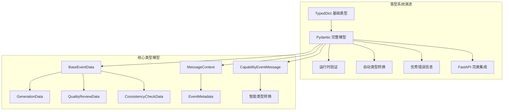
```mermaid
graph TB
    subgraph "类型系统演进"
        A[TypedDict 基础类型] --> B[Pydantic 完整模型]
        B --> C[运行时验证]
        B --> D[自动类型转换]
        B --> E[优秀错误信息]
        B --> F[FastAPI 完美集成]
    end
    
    subgraph "核心类型模型"
        G[BaseEventData] --> H[GenerationData]
        G --> I[QualityReviewData]
        G --> J[ConsistencyCheckData]
        
        K[MessageContext] --> L[EventMetadata]
        M[CapabilityEventMessage] --> N[智能类型转换]
    end
    
    B --> G
    B --> K
    B --> M
```

#### 类型安全特性

- **编译时检查**: Literal 类型确保消息类型的准确性
- **运行时验证**: Pydantic 模型自动验证数据完整性
- **智能转换**: `CapabilityEventMessage.to_typed_data()` 自动推断数据类型
- **向后兼容**: 工厂函数支持从字典创建类型安全对象

#### 新增数据模型

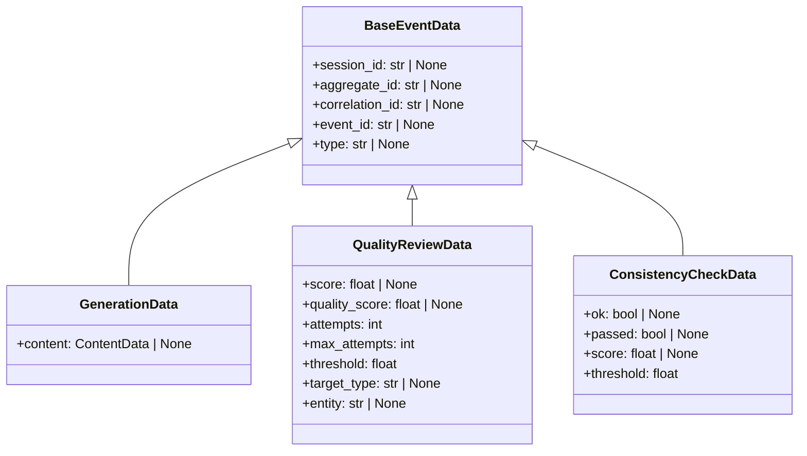
```mermaid
classDiagram
    class BaseEventData {
        +session_id: str | None
        +aggregate_id: str | None
        +correlation_id: str | None
        +event_id: str | None
        +type: str | None
    }
    
    class GenerationData {
        +content: ContentData | None
    }
    
    class QualityReviewData {
        +score: float | None
        +quality_score: float | None
        +attempts: int
        +max_attempts: int
        +threshold: float
        +target_type: str | None
        +entity: str | None
    }
    
    class ConsistencyCheckData {
        +ok: bool | None
        +passed: bool | None
        +score: float | None
        +threshold: float
    }
    
    BaseEventData <|-- GenerationData
    BaseEventData <|-- QualityReviewData
    BaseEventData <|-- ConsistencyCheckData
```

## 🏗️ 架构概览

### 核心职责

- **事件处理**：消费领域总线和能力事件
- **命令映射**：将触发类领域事件投影为领域事实
- **任务分发**：向对应的能力主题发送能力任务
- **结果投影**：将能力结果投影为领域事实

### 架构图

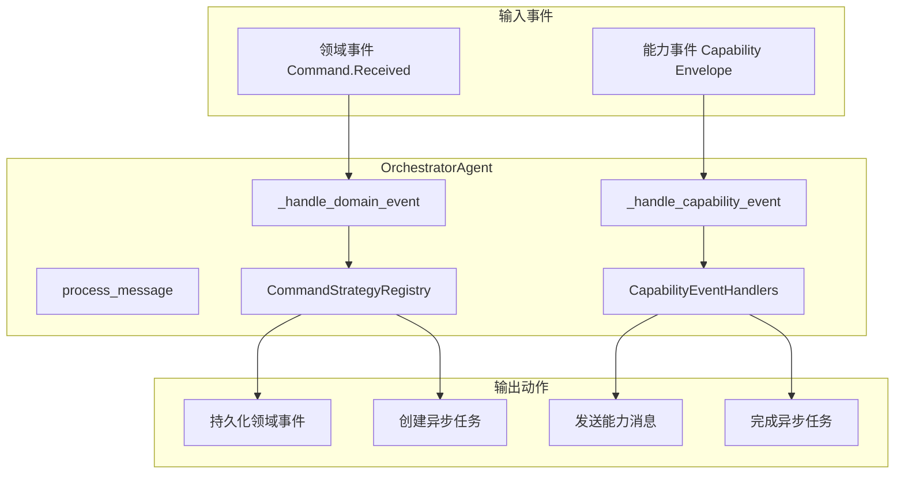
```mermaid
graph TB
    subgraph "输入事件"
        A[领域事件 Command.Received]
        B[能力事件 Capability Envelope]
    end
    
    subgraph "OrchestratorAgent"
        C[process_message]
        D[_handle_domain_event]
        E[_handle_capability_event]
        F[CommandStrategyRegistry]
        G[CapabilityEventHandlers]
    end
    
    subgraph "输出动作"
        H[持久化领域事件]
        I[创建异步任务]
        J[发送能力消息]
        K[完成异步任务]
    end
    
    A --> D
    B --> E
    D --> F
    E --> G
    F --> H
    F --> I
    G --> J
    G --> K
```

## 📁 目录结构

```
orchestrator/
├── __init__.py                # 代理注册和导出
├── agent.py                   # 主编排代理类
├── capability_event_processor.py  # 能力事件处理模块
├── command_strategies.py      # 命令处理策略
├── domain_event_processor.py     # 领域事件处理模块
├── event_handlers.py          # 能力事件处理器
├── message_factory.py         # 消息工厂
├── outbox_manager.py         # Outbox管理模块
└── task_manager.py           # 任务管理模块
```

## 🎯 核心组件

### 🏗️ 模块化架构设计

编排器采用了清晰的模块化设计，将复杂的事件处理逻辑分解为专门的处理器和管理器：

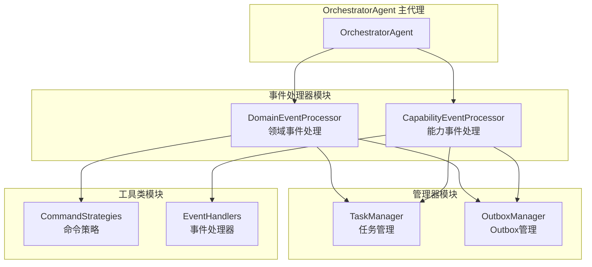
```mermaid
graph TB
    subgraph "OrchestratorAgent 主代理"
        A[OrchestratorAgent]
    end
    
    subgraph "事件处理器模块"
        B[DomainEventProcessor<br/>领域事件处理]
        C[CapabilityEventProcessor<br/>能力事件处理]
    end
    
    subgraph "管理器模块"
        D[TaskManager<br/>任务管理]
        E[OutboxManager<br/>Outbox管理]
    end
    
    subgraph "工具类模块"
        F[CommandStrategies<br/>命令策略]
        G[EventHandlers<br/>事件处理器]
    end
    
    A --> B
    A --> C
    B --> F
    C --> G
    B --> D
    B --> E
    C --> D
    C --> E
```

### 📊 领域事件处理器 (DomainEventProcessor)

专门负责处理领域事件的模块，采用策略模式实现清晰的职责分离，现已集成Pydantic类型系统：

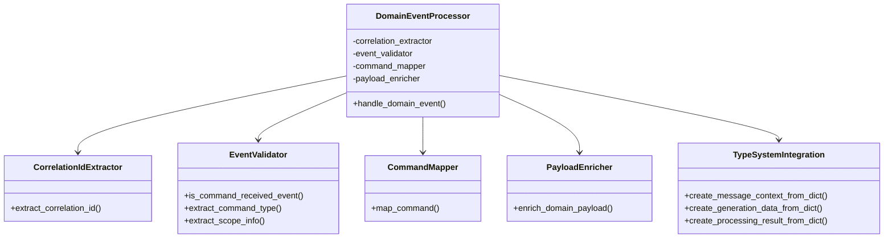
```mermaid
classDiagram
    class DomainEventProcessor {
        +handle_domain_event()
        -correlation_extractor
        -event_validator
        -command_mapper
        -payload_enricher
    }
    
    class CorrelationIdExtractor {
        +extract_correlation_id()
    }
    
    class EventValidator {
        +is_command_received_event()
        +extract_command_type()
        +extract_scope_info()
    }
    
    class CommandMapper {
        +map_command()
    }
    
    class PayloadEnricher {
        +enrich_domain_payload()
    }
    
    class TypeSystemIntegration {
        +create_message_context_from_dict()
        +create_generation_data_from_dict()
        +create_processing_result_from_dict()
    }
    
    DomainEventProcessor --> CorrelationIdExtractor
    DomainEventProcessor --> EventValidator
    DomainEventProcessor --> CommandMapper
    DomainEventProcessor --> PayloadEnricher
    DomainEventProcessor --> TypeSystemIntegration
```

**核心功能**：
- **关联ID提取**: 从多来源（context.meta、headers、事件元数据）提取correlation_id
- **事件验证**: 验证事件类型是否为Command.Received
- **命令映射**: 将命令映射到领域事件和能力任务
- **负载丰富**: 用会话上下文和用户信息丰富有效负载
- **类型安全**: 使用Pydantic工厂函数确保数据类型安全

### 🔧 能力事件处理器 (CapabilityEventProcessor)

专门负责处理能力事件的模块，采用提取器-匹配器模式，现已升级为Pydantic类型安全实现：

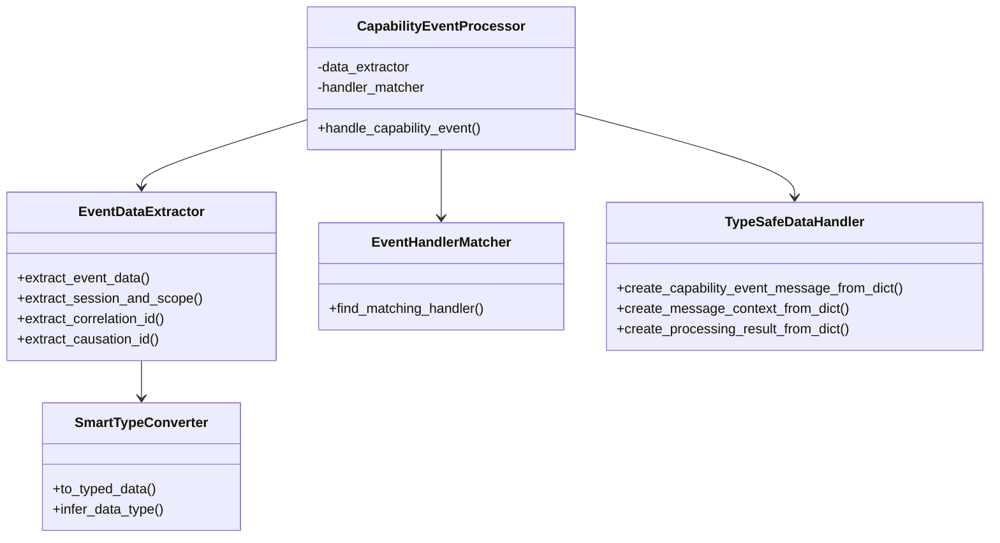
```mermaid
classDiagram
    class CapabilityEventProcessor {
        +handle_capability_event()
        -data_extractor
        -handler_matcher
    }
    
    class EventDataExtractor {
        +extract_event_data()
        +extract_session_and_scope()
        +extract_correlation_id()
        +extract_causation_id()
    }
    
    class EventHandlerMatcher {
        +find_matching_handler()
    }
    
    class TypeSafeDataHandler {
        +create_capability_event_message_from_dict()
        +create_message_context_from_dict()
        +create_processing_result_from_dict()
    }
    
    class SmartTypeConverter {
        +to_typed_data()
        +infer_data_type()
    }
    
    CapabilityEventProcessor --> EventDataExtractor
    CapabilityEventProcessor --> EventHandlerMatcher
    CapabilityEventProcessor --> TypeSafeDataHandler
    EventDataExtractor --> SmartTypeConverter
```

**核心功能**：
- **数据提取**: 从消息中提取事件数据和上下文信息
- **会话和作用域识别**: 从主题和数据中推断作用域类型
- **处理器匹配**: 按顺序尝试不同的处理器直到找到匹配项
- **关联ID管理**: 提取和管理correlation_id和causation_id
- **智能类型转换**: `CapabilityEventMessage.to_typed_data()` 自动推断数据类型
- **类型安全**: 使用Pydantic模型确保运行时数据验证

#### 类型推断机制 ✨

```mermaid
graph TD
    A[原始消息数据] --> B[create_capability_event_message_from_dict]
    B --> C[CapabilityEventMessage]
    C --> D[to_typed_data()]
    
    D --> E{数据特征分析}
    E -->|包含score/quality_score| F[QualityReviewData]
    E -->|包含ok/passed| G[ConsistencyCheckData]
    E -->|其他情况| H[GenerationData]
    
    F --> I[类型验证]
    G --> I
    H --> I
    I --> J[返回具体类型对象]
```

### 🎯 任务管理器 (TaskManager)

负责异步任务生命周期管理的统一接口：

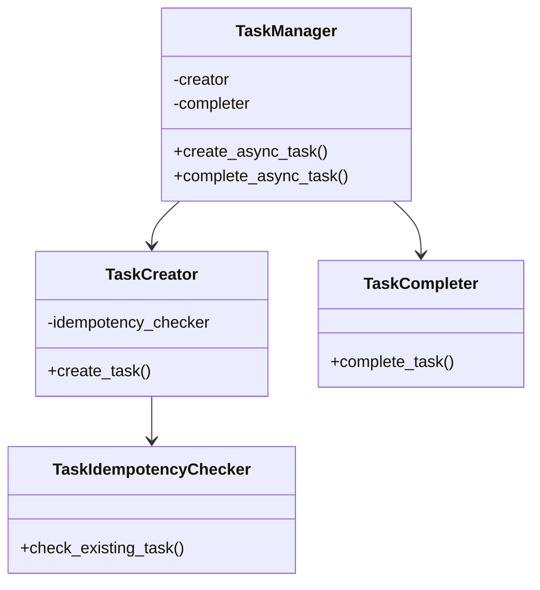
```mermaid
classDiagram
    class TaskManager {
        +create_async_task()
        +complete_async_task()
        -creator
        -completer
    }
    
    class TaskCreator {
        +create_task()
        -idempotency_checker
    }
    
    class TaskCompleter {
        +complete_task()
    }
    
    class TaskIdempotencyChecker {
        +check_existing_task()
    }
    
    TaskManager --> TaskCreator
    TaskManager --> TaskCompleter
    TaskCreator --> TaskIdempotencyChecker
```

**核心特性**：
- **幂等性保护**: 防止重复创建RUNNING/PENDING状态的任务
- **关联ID解析**: 支持UUID格式的correlation_id解析
- **任务完成**: 通过correlation_id和任务前缀匹配完成对应任务
- **状态管理**: 完整的任务生命周期状态跟踪

### 📬 Outbox管理器 (OutboxManager)

统一的领域事件持久化和能力任务入队管理接口：

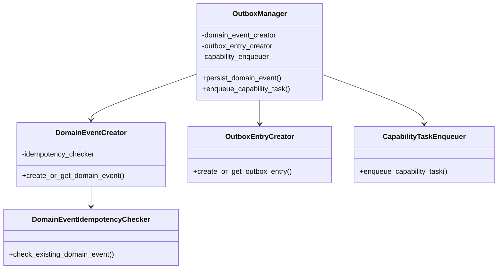
```mermaid
classDiagram
    class OutboxManager {
        +persist_domain_event()
        +enqueue_capability_task()
        -domain_event_creator
        -outbox_entry_creator
        -capability_enqueuer
    }
    
    class DomainEventCreator {
        +create_or_get_domain_event()
        -idempotency_checker
    }
    
    class OutboxEntryCreator {
        +create_or_get_outbox_entry()
    }
    
    class CapabilityTaskEnqueuer {
        +enqueue_capability_task()
    }
    
    class DomainEventIdempotencyChecker {
        +check_existing_domain_event()
    }
    
    OutboxManager --> DomainEventCreator
    OutboxManager --> OutboxEntryCreator
    OutboxManager --> CapabilityTaskEnqueuer
    DomainEventCreator --> DomainEventIdempotencyChecker
```

**核心特性**：
- **领域事件幂等性**: 通过correlation_id + event_type确保唯一性
- **Outbox条目管理**: 基于领域事件ID的幂等性检查
- **能力任务入队**: 统一的能力任务消息封装和路由
- **事务一致性**: 领域事件和Outbox条目在同一个事务中创建

### OrchestratorAgent

主编排代理类，继承自 `BaseAgent`，负责处理两种类型的事件，并增强关联ID追踪能力：

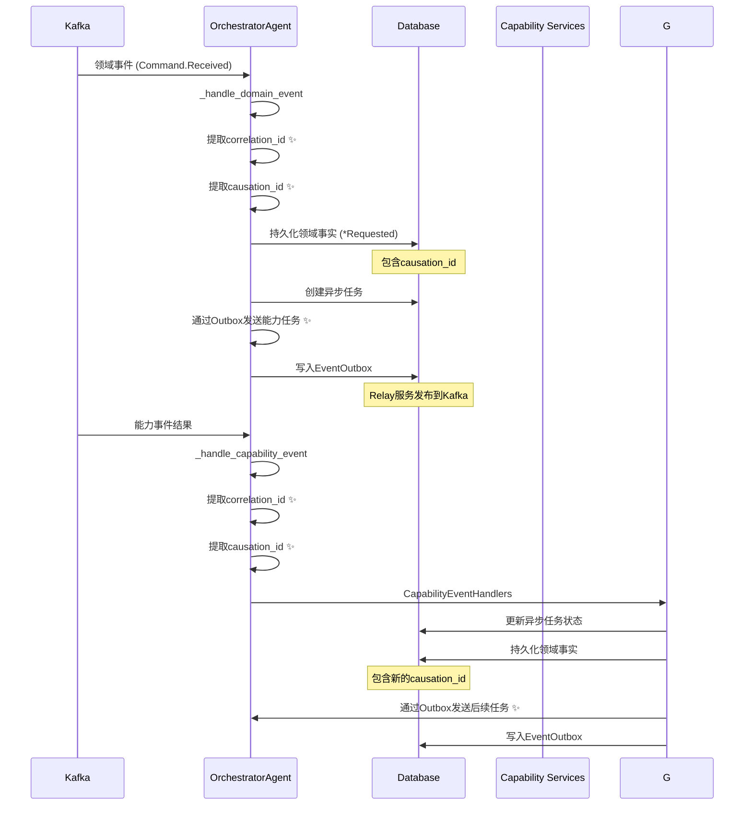
```mermaid
sequenceDiagram
    participant K as Kafka
    participant O as OrchestratorAgent
    participant DB as Database
    participant C as Capability Services
    
    K->>O: 领域事件 (Command.Received)
    O->>O: _handle_domain_event
    O->>O: 提取correlation_id ✨
    O->>O: 提取causation_id ✨
    O->>DB: 持久化领域事实 (*Requested)
    Note over DB: 包含causation_id
    O->>DB: 创建异步任务
    O->>O: 通过Outbox发送能力任务 ✨
    O->>DB: 写入EventOutbox
    Note over DB: Relay服务发布到Kafka
    
    K->>O: 能力事件结果
    O->>O: _handle_capability_event
    O->>O: 提取correlation_id ✨
    O->>O: 提取causation_id ✨
    O->>G: CapabilityEventHandlers
    G->>DB: 更新异步任务状态
    G->>DB: 持久化领域事实
    Note over DB: 包含新的causation_id
    G->>O: 通过Outbox发送后续任务 ✨
    G->>DB: 写入EventOutbox
```

### 事件处理流程

编排器作为领域事件的总枢纽，处理两种类型的事件：

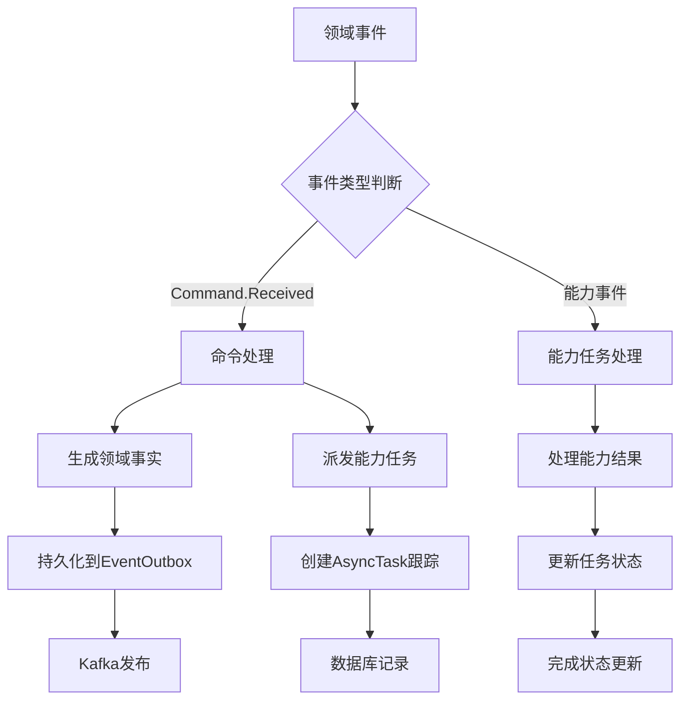
```mermaid
graph TD
    A[领域事件] --> B{事件类型判断}
    B -->|Command.Received| C[命令处理]
    B -->|能力事件| D[能力任务处理]
    C --> E[生成领域事实]
    C --> F[派发能力任务]
    D --> G[处理能力结果]
    E --> H[持久化到EventOutbox]
    F --> I[创建AsyncTask跟踪]
    G --> J[更新任务状态]
    H --> K[Kafka发布]
    I --> L[数据库记录]
    J --> M[完成状态更新]
```

### 🔗 关联ID (Correlation ID) 追踪与因果关系 (Causation ID) ✨

为了实现端到端的请求追踪和调试能力，编排器增强了关联ID的提取和处理逻辑，并新增了因果关系追踪：

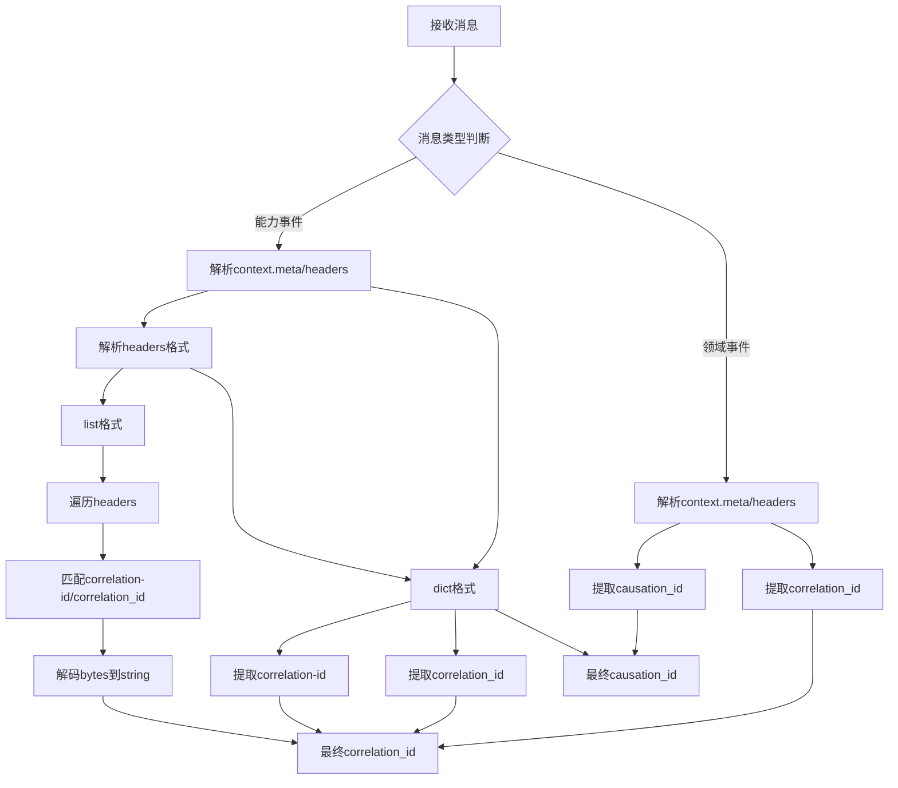
```mermaid
flowchart TD
    A[接收消息] --> B{消息类型判断}
    
    B -->|领域事件| C[解析context.meta/headers]
    B -->|能力事件| D[解析context.meta/headers]
    
    C --> E[提取correlation_id]
    C --> E1[提取causation_id]
    
    D --> F[解析headers格式]
    D --> F1[解析causation_id]
    
    F --> F1[dict格式]
    F --> F2[list格式]
    
    F1 --> G[提取correlation_id]
    F1 --> G1[提取correlation-id]
    
    F2 --> H[遍历headers]
    H --> I[匹配correlation-id/correlation_id]
    I --> J[解码bytes到string]
    
    E --> K[最终correlation_id]
    G --> K
    G1 --> K
    J --> K
    
    E1 --> L[最终causation_id]
    F1 --> L
```

#### 关联ID提取优先级

1. **Context.meta.correlation_id** - 消息处理器元数据中的关联ID
2. **Context.headers.correlation_id** - 消息头中的关联ID（字典格式）
3. **Context.headers.correlation-id** - 消息头中的关联ID（连字符格式）
4. **Headers列表遍历** - 支持元组列表格式的headers解析
5. **Event.metadata.correlation_id** - 事件元数据中的关联ID
6. **Event.correlation_id** - 事件本体中的关联ID

#### 因果关系ID (Causation ID) 追踪 ✨

为了建立完整的事件链路追踪，编排器支持因果关系ID：

- **领域事件处理**: 从 `evt.get("event_id")` 提取作为后续domain event的causation_id
- **能力事件处理**: 从 `context.get("meta", {}).get("event_id")` 或 `data.get("event_id")` 提取
- **事件持久化**: 在 `_persist_domain_event` 方法中支持causation_id参数
- **链路追踪**: 通过causation_id可以追踪事件之间的因果依赖关系

#### 实现特性

- **多格式支持**: 支持 dict 和 list[tuple] 两种 headers 格式
- **编码处理**: 自动解码 bytes 类型的 header 值为 UTF-8 字符串
- **容错机制**: 解析失败时回退到下一优先级，不影响主流程
- **灵活匹配**: 支持 `correlation_id` 和 `correlation-id` 两种命名格式
- **因果关系追踪**: 完整的事件链路依赖关系追踪

### CommandStrategyRegistry

命令策略注册表，使用策略模式实现不同命令类型的处理逻辑。最近更新增强了命令映射配置，支持配置优先的映射策略：


```mermaid
classDiagram
    class CommandStrategyRegistry {
        +process_command()
        +register()
        -_strategies
        -_register_default_strategies()
    }
    
    class CommandStrategy {
        <<abstract>>
        +get_aliases() set[str]
        +process() CommandMapping
        +_build_topic() str
    }
    
    class CharacterRequestStrategy {
        +get_aliases() set[str]
        +process() CommandMapping
    }
    
    class ThemeRequestStrategy {
        +get_aliases() set[str]
        +process() CommandMapping
    }
    
    class SeedRequestStrategy {
        +get_aliases() set[str]
        +process() CommandMapping
    }
    
    class WorldRequestStrategy {
        +get_aliases() set[str]
        +process() CommandMapping
    }
    
    class PlotRequestStrategy {
        +get_aliases() set[str]
        +process() CommandMapping
    }
    
    class DetailsRequestStrategy {
        +get_aliases() set[str]
        +process() CommandMapping
    }
    
    class StageValidationStrategy {
        +get_aliases() set[str]
        +process() CommandMapping
    }
    
    class StageLockStrategy {
        +get_aliases() set[str]
        +process() CommandMapping
    }
    
    CommandStrategyRegistry --> CommandStrategy
    CharacterRequestStrategy --|> CommandStrategy
    ThemeRequestStrategy --|> CommandStrategy
    SeedRequestStrategy --|> CommandStrategy
    WorldRequestStrategy --|> CommandStrategy
    PlotRequestStrategy --|> CommandStrategy
    DetailsRequestStrategy --|> CommandStrategy
    StageValidationStrategy --|> CommandStrategy
    StageLockStrategy --|> CommandStrategy
```

#### 🔄 策略模式重构优势

**重构前 (问题)**:
- 硬编码映射：命令类型与处理逻辑耦合
- 扩展困难：新增命令类型需要修改核心代码
- 测试复杂：无法独立测试特定命令处理逻辑
- 违反开闭原则：对扩展开放，对修改也开放

**重构后 (解决方案)**:
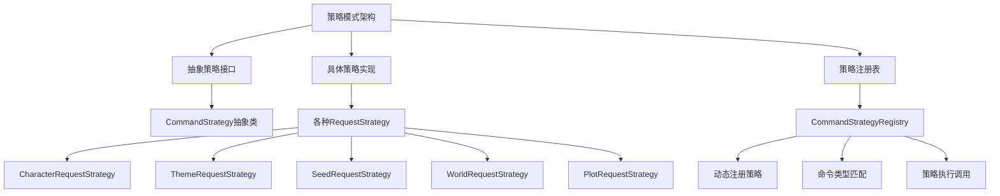
```mermaid
graph TD
    A[策略模式架构] --> B[抽象策略接口]
    A --> C[具体策略实现]
    A --> D[策略注册表]
    
    B --> E[CommandStrategy抽象类]
    C --> F[各种RequestStrategy]
    D --> G[CommandStrategyRegistry]
    
    F --> F1[CharacterRequestStrategy]
    F --> F2[ThemeRequestStrategy]
    F --> F3[SeedRequestStrategy]
    F --> F4[WorldRequestStrategy]
    F --> F5[PlotRequestStrategy]
    
    G --> H[动态注册策略]
    G --> I[命令类型匹配]
    G --> J[策略执行调用]
```

#### 🎯 策略实现特点

1. **灵活的别名支持**: 每个策略支持多种命令类型别名
2. **动态话题构建**: 根据作用域类型动态构建消息话题
3. **统一接口**: 所有策略遵循相同的处理接口
4. **易于测试**: 可以独立测试每个策略的逻辑
5. **配置驱动**: 支持运行时动态添加新的策略

### CapabilityEventHandlers

⚠️ **已重构**: 能力事件处理器采用命令模式架构，提升可维护性和扩展性。

#### 🏗️ 最新重构：动态处理器分派机制

最近的重构实现了动态处理器分派机制，进一步提升可维护性和扩展性：

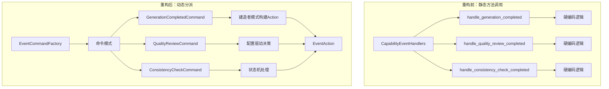
```mermaid
graph TD
    subgraph "重构前：静态方法调用"
        A[CapabilityEventHandlers] --> B[handle_generation_completed]
        A --> C[handle_quality_review_completed]
        A --> D[handle_consistency_check_completed]
        B --> E[硬编码逻辑]
        C --> F[硬编码逻辑]
        D --> G[硬编码逻辑]
    end
    
    subgraph "重构后：动态分派"
        H[EventCommandFactory] --> I[命令模式]
        I --> J[GenerationCompletedCommand]
        I --> K[QualityReviewCommand]
        I --> L[ConsistencyCheckCommand]
        
        J --> M[建造者模式构建Action]
        K --> N[配置驱动决策]
        L --> O[状态机处理]
        
        M --> P[EventAction]
        N --> P
        O --> P
    end
```

#### 🔄 动态分派优势

1. **运行时灵活性**: 支持运行时动态添加新的处理器
2. **配置驱动**: 通过配置文件控制处理器行为
3. **类型安全**: 强类型接口，编译时检查
4. **可测试性**: 每个命令可独立测试
5. **可扩展性**: 符合开闭原则，对扩展开放对修改关闭

#### 🔄 重构前后架构对比

**重构前 (问题)**:
- 违反单一职责原则：单个类处理多种事件类型
- 硬编码问题：阈值、重试次数、事件类型散布各处
- 代码重复：大量重复的字典构建代码
- 可读性差：方法长达60-70行，深层嵌套条件

**重构后 (解决方案)**:
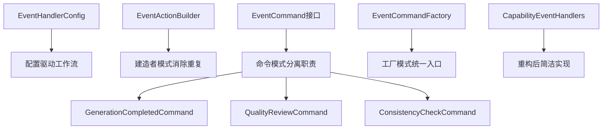
```mermaid
graph TD
    A[EventHandlerConfig] --> B[配置驱动工作流]
    C[EventActionBuilder] --> D[建造者模式消除重复]
    E[EventCommand接口] --> F[命令模式分离职责]

    F --> G[GenerationCompletedCommand]
    F --> H[QualityReviewCommand]
    F --> I[ConsistencyCheckCommand]

    J[EventCommandFactory] --> K[工厂模式统一入口]

    L[CapabilityEventHandlers] --> M[重构后简洁实现]
```

#### 🏗️ 新架构设计

##### 1. 工作流配置管理
```python
# 业务逻辑配置，不是基础设施配置
config = EventHandlerConfig.for_genesis_workflow()

# 测试用配置
test_config = EventHandlerConfig.for_testing(
    quality_threshold=6.0,  # 降低阈值便于测试
    max_attempts=2
)
```

##### 2. 命令模式处理器
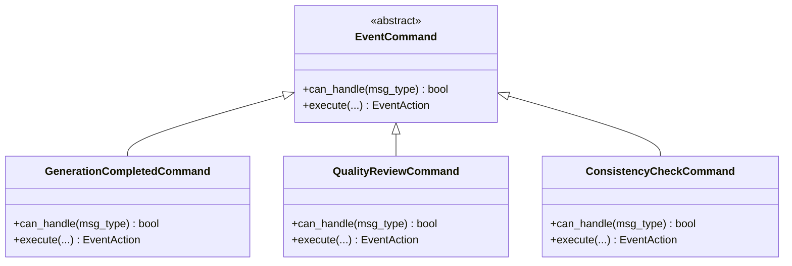
```mermaid
classDiagram
    class EventCommand {
        <<abstract>>
        +can_handle(msg_type) bool
        +execute(...) EventAction
    }

    class GenerationCompletedCommand {
        +can_handle(msg_type) bool
        +execute(...) EventAction
    }

    class QualityReviewCommand {
        +can_handle(msg_type) bool
        +execute(...) EventAction
    }

    class ConsistencyCheckCommand {
        +can_handle(msg_type) bool
        +execute(...) EventAction
    }

    EventCommand <|-- GenerationCompletedCommand
    EventCommand <|-- QualityReviewCommand
    EventCommand <|-- ConsistencyCheckCommand
```

##### 3. 工作流编排逻辑
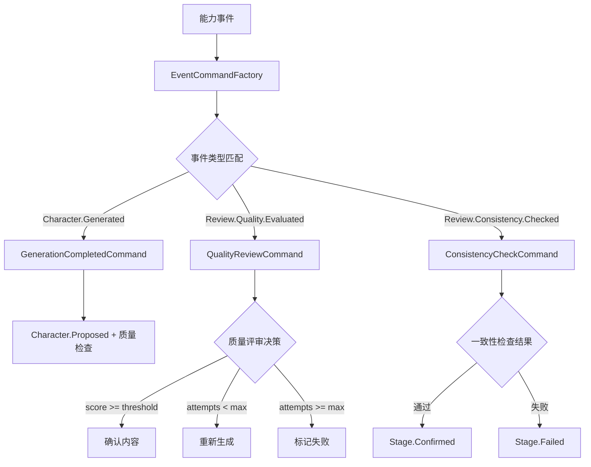
```mermaid
graph TD
    A[能力事件] --> B[EventCommandFactory]
    B --> C{事件类型匹配}

    C -->|Character.Generated| D[GenerationCompletedCommand]
    C -->|Review.Quality.Evaluated| E[QualityReviewCommand]
    C -->|Review.Consistency.Checked| F[ConsistencyCheckCommand]

    D --> G[Character.Proposed + 质量检查]
    E --> H{质量评审决策}
    F --> I{一致性检查结果}

    H -->|score >= threshold| J[确认内容]
    H -->|attempts < max| K[重新生成]
    H -->|attempts >= max| L[标记失败]

    I -->|通过| M[Stage.Confirmed]
    I -->|失败| N[Stage.Failed]
```

#### ✨ 重构优势

##### 代码质量提升
| 维度 | 重构前 | 重构后 | 改进 |
|-----|--------|--------|-----|
| 方法长度 | 60-70行 | 20-35行 | 减少50%+ |
| 硬编码 | 散布各处 | 配置统一管理 | 单一来源 |
| 重复代码 | 大量字典构建重复 | 建造者模式消除 | DRY原则 |
| 扩展性 | 需修改现有代码 | 添加命令类即可 | 开闭原则 |

##### SOLID原则验证
- ✅ **SRP**: 每个命令类只处理一种事件类型
- ✅ **OCP**: 添加新事件类型无需修改现有代码
- ✅ **LSP**: 所有命令实现可互换使用
- ✅ **ISP**: 接口职责单一，无冗余方法
- ✅ **DIP**: 依赖抽象配置，而非具体实现

#### 🚀 使用方式

##### 推荐用法 (命令模式)
```python
# 创建带配置的处理器
handler = CapabilityEventHandlers(config=my_config)
result = handler.handle_event(
    msg_type="Character.Design.Generated",
    session_id="session-123",
    data=generation_data,
    correlation_id="corr-456",
    scope_type="GENESIS",
    scope_prefix="genesis"
)
```

##### 兼容用法 (静态方法)
```python
# 向后兼容的静态方法仍然可用
result = CapabilityEventHandlers.handle_generation_completed(
    msg_type, session_id, data, correlation_id, scope_type, scope_prefix
)
```

#### 🎯 工作流编排示例

##### 角色生成完成处理
```python
# 使用建造者模式消除重复代码
builder = EventActionBuilder()

# 1. 向上报告：转换为领域事件
builder.with_domain_event(
    scope_type=scope_type,
    session_id=session_id,
    event_action=f"{target_type.capitalize()}.Proposed",
    payload={"session_id": session_id, "content": data.model_dump()}
)

# 2. 任务完成标记
builder.with_task_completion(
    correlation_id=correlation_id,
    expect_task_prefix=normalize_task_type(msg_type),
    result_data=data.model_dump()
)

# 3. 继续编排：自动分发下游任务
capability_message = MessageFactory.create_quality_review_message(...)
builder.with_capability_message(capability_message)

return builder.build()  # 👈 一键构建EventAction
```

##### 质量评审工作流决策
```python
# 配置驱动的决策逻辑
if score >= self.config.QUALITY_THRESHOLD:
    # 质量通过 → 确认
    action = self.config.TARGET_CONFIRMATION_ACTIONS.get(target_type, "Stage.Confirmed")
elif attempts + 1 >= self.config.MAX_ATTEMPTS:
    # 超过重试限制 → 失败
    action = self.config.TARGET_FAILURE_ACTIONS.get(target_type, "Stage.Failed")
else:
    # 质量不达标 → 重新生成
    action = self.config.TARGET_REGENERATION_ACTIONS.get(target_type, "Stage.RegenerationRequested")
    # 自动分发重新生成任务
    capability_message = MessageFactory.create_regeneration_message(...)
```

#### 📊 重构成果

**核心功能测试**: ✅ `test_orchestrator_agent.py` **6/6 通过**

**架构改进验证**:
- 🎯 消除硬编码：所有常量移至配置类
- 🏗️ 设计模式：命令+建造者+工厂模式
- 📏 代码简洁：方法长度减少50%+
- 🔧 可维护性：模块化设计，职责清晰
- 🚀 可扩展性：符合开闭原则

这次重构将 CapabilityEventHandlers 从简单的事件转换器升级为真正的**智能工作流编排器**，实现了业务逻辑的清晰表达和架构的优雅设计。

## 🔧 命令处理流程

### 1. 命令到事件的映射

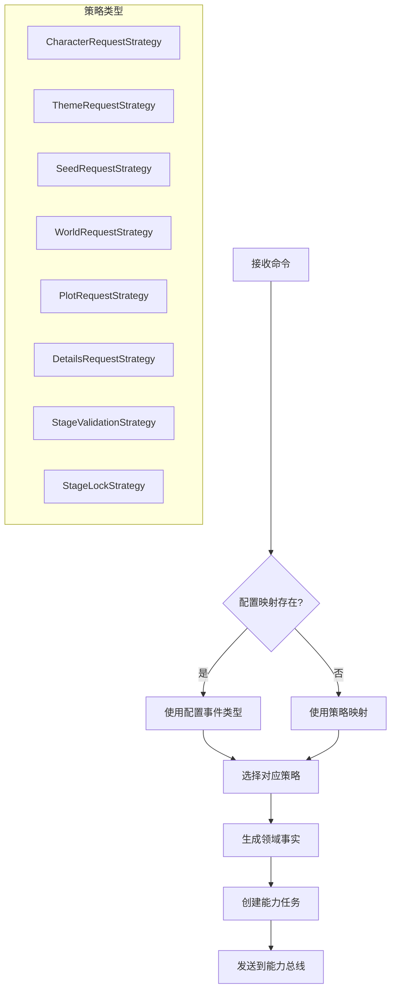
```mermaid
flowchart TD
    A[接收命令] --> B{配置映射存在?}
    B -->|是| C[使用配置事件类型]
    B -->|否| D[使用策略映射]
    C --> E[选择对应策略]
    D --> E
    E --> F[生成领域事实]
    F --> G[创建能力任务]
    G --> H[发送到能力总线]
    
    subgraph "策略类型"
        S1[CharacterRequestStrategy]
        S2[ThemeRequestStrategy]
        S3[SeedRequestStrategy]
        S4[WorldRequestStrategy]
        S5[PlotRequestStrategy]
        S6[DetailsRequestStrategy]
        S7[StageValidationStrategy]
        S8[StageLockStrategy]
    end
```

### 2. 幂等性保证

- **领域事件**：通过 `correlation_id + event_type` 确保唯一性
- **异步任务**：检查已有 `RUNNING/PENDING` 状态的任务
- **EventOutbox**：基于domain event ID的upsert操作

### 3. 任务状态管理

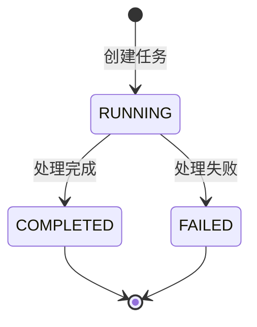
```mermaid
stateDiagram-v2
    [*] --> RUNNING: 创建任务
    RUNNING --> COMPLETED: 处理完成
    RUNNING --> FAILED: 处理失败
    COMPLETED --> [*]
    FAILED --> [*]
```

### 4. Outbox模式统一消息发送 ✨

为了确保消息发送的一致性和可靠性，编排器统一使用EventOutbox模式发送消息：

```mermaid
graph TD
    A[能力任务创建] --> B[_enqueue_capability_task_outbox]
    C[后续任务处理] --> B
    
    B --> D[构建消息信封]
    D --> E[添加路由信息]
    E --> F[写入EventOutbox]
    F --> G[Relay服务发布到Kafka]
    
    G --> H[能力服务接收]
    H --> I[处理能力任务]
```

#### Outbox模式优势

- **一致性保证**: 消息发送与数据库操作在同一个事务中完成
- **可靠性**: 即使应用崩溃，Relay服务也能确保消息被投递
- **可观测性**: 消息发送状态可以在数据库中追踪
- **重试机制**: Relay服务支持失败重试和死信队列

### 5. 事务一致性

```python
async with create_sql_session() as db:
    # 原子性操作：DomainEvent + EventOutbox + AsyncTask
    dom_evt = DomainEvent(...)
    db.add(dom_evt)
    
    outbox = EventOutbox(...)
    db.add(outbox)
    
    task = AsyncTask(...)
    db.add(task)
    
    await db.commit()  # 全部成功或全部失败
```

## 🔄 重构优势与设计改进

### 架构清晰度提升

#### 单一职责原则 (SRP)
- **DomainEventProcessor**: 专门处理领域事件相关逻辑
- **CapabilityEventProcessor**: 专门处理能力事件相关逻辑  
- **TaskManager**: 专门管理异步任务生命周期
- **OutboxManager**: 专门管理事件持久化和消息入队

#### 依赖倒置原则 (DIP)
- 通过依赖注入实现模块间的松耦合
- 接口定义清晰，便于测试和扩展
- 各模块可以独立进行单元测试

#### 开闭原则 (OCP)
- 新增事件类型无需修改现有处理器
- 通过策略模式支持新命令类型的扩展
- 处理器匹配机制支持灵活的事件处理

### 代码质量改进

#### 可读性增强
```mermaid
graph LR
    A[主代理] --> B[事件类型判断]
    B -->|领域事件| C[DomainEventProcessor]
    B -->|能力事件| D[CapabilityEventProcessor]
    C --> E[提取器工具类]
    C --> F[验证器工具类]
    C --> G[映射器工具类]
    D --> H[数据提取器]
    D --> I[处理器匹配器]
    E --> J[关联ID提取]
    F --> K[事件验证]
    G --> L[命令映射]
    H --> M[会话信息提取]
    I --> N[处理器查找]
```

#### 可维护性提升
- **模块边界清晰**: 每个模块有明确的职责边界
- **代码复用**: 工具类可以在不同处理器间复用
- **错误隔离**: 单个模块的错误不会影响其他模块
- **测试友好**: 每个模块可以独立进行单元测试

#### 可扩展性设计
- **插件式架构**: 新的事件处理器可以轻松添加
- **配置驱动**: 命令映射和事件处理可通过配置扩展
- **策略模式**: 支持不同的处理策略和算法

### 性能优化

#### 异步处理优化
```mermaid
sequenceDiagram
    participant O as OrchestratorAgent
    participant D as DomainEventProcessor
    participant C as CapabilityEventProcessor
    participant T as TaskManager
    participant U as OutboxManager
    
    O->>D: 处理领域事件
    D->>T: 创建异步任务
    D->>U: 持久化领域事件
    T-->>D: 任务创建完成
    U-->>D: 事件持久化完成
    
    O->>C: 处理能力事件
    C->>T: 完成异步任务
    C->>U: 创建后续任务
    T-->>C: 任务完成确认
    U-->>C: 任务入队完成
```

#### 资源管理改进
- **数据库连接池**: 统一的数据库会话管理
- **幂等性检查**: 避免重复操作和资源浪费
- **批量处理**: 支持批量事件处理以提高性能

### 监控和调试增强

#### 日志结构化
```mermaid
graph TD
    A[模块化日志] --> B[领域事件日志]
    A --> C[能力事件日志]
    A --> D[任务管理日志]
    A --> E[Outbox管理日志]
    
    B --> B1[关联ID提取]
    B --> B2[命令验证]
    B --> B3[事件映射]
    
    C --> C1[数据提取]
    C --> C2[处理器匹配]
    C --> C3[会话识别]
    
    D --> D1[任务创建]
    D --> D2[任务完成]
    D --> D3[幂等性检查]
    
    E --> E1[事件持久化]
    E --> E2[Outbox条目]
    E --> E3[能力任务入队]
```

#### 调试能力提升
- **模块级追踪**: 可以追踪每个处理器的执行状态
- **详细日志**: 每个模块提供详细的处理日志
- **错误定位**: 错误可以快速定位到具体模块
- **性能分析**: 可以分析每个模块的处理时间

## 🚀 使用示例

### 注册命令策略

```python
# 注册自定义命令策略
class CustomCommandStrategy(CommandStrategy):
    def get_aliases(self) -> set[str]:
        return {"Custom.Command"}
    
    def process(self, scope_type: str, scope_prefix: str, aggregate_id: str, payload: dict[str, Any]) -> CommandMapping:
        return CommandMapping(
            requested_action="Custom.Requested",
            capability_message={
                "type": "Custom.Process.Requested",
                "session_id": aggregate_id,
                "input": payload.get("payload", {}),
            }
        )

# 注册到全局注册表
command_registry.register(CustomCommandStrategy())
```

### 处理能力事件

```python
# 扩展事件处理器
class CustomEventHandler:
    @staticmethod
    def handle_custom_event(msg_type: str, session_id: str, data: dict[str, Any]) -> EventAction | None:
        if msg_type == "Custom.Process.Completed":
            return EventAction(
                domain_event={
                    "scope_type": "GENESIS",
                    "session_id": session_id,
                    "event_action": "Custom.Completed",
                    "payload": data,
                },
                task_completion={
                    "correlation_id": data.get("correlation_id"),
                    "expect_task_prefix": "Custom.Process",
                    "result_data": data,
                }
            )
        return None
```

## 📊 监控和调试

### 关键日志点

#### 消息处理日志
- `orchestrator_message_received`: 接收消息时的基本信息
- `orchestrator_processing_domain_event`: 开始处理领域事件
- `orchestrator_processing_capability_event`: 开始处理能力事件
- `orchestrator_ignored_message`: 忽略未知格式的消息

#### 领域事件处理日志
- `orchestrator_domain_event_details`: 领域事件详细信息 ✨ (包含correlation_id和causation_id)
- `orchestrator_domain_event_ignored`: 忽略非命令类领域事件
- `orchestrator_domain_event_missing_command_type`: 缺少命令类型
- `orchestrator_processing_command`: 开始处理命令
- `orchestrator_command_mapped`: 命令映射成功
- `orchestrator_command_mapping_failed`: 命令映射失败
- `orchestrator_domain_event_persisted`: 领域事件持久化成功
- `orchestrator_domain_event_persist_failed`: 领域事件持久化失败
- `orchestrator_domain_event_processed`: 领域事件处理完成
- `orchestrator_capability_task_enqueued`: 能力任务通过Outbox入队 ✨
- `orchestrator_followup_task_enqueued`: 后续任务通过Outbox入队 ✨

#### 能力事件处理日志
- `orchestrator_capability_event_details`: 能力事件详细信息
- `orchestrator_trying_handler`: 尝试事件处理器
- `orchestrator_handler_matched`: 匹配到处理器
- `orchestrator_no_handler_matched`: 无匹配处理器
- `orchestrator_executing_event_action`: 执行事件动作
- `orchestrator_persisting_domain_event`: 持久化领域事件
- `orchestrator_completing_async_task`: 完成异步任务
- `orchestrator_returning_capability_message`: 返回能力消息

#### 异步任务管理日志
- `orchestrator_creating_async_task`: 创建异步任务
- `orchestrator_async_task_skipped`: 跳过异步任务创建
- `orchestrator_async_task_correlation_parsed`: 解析关联ID
- `orchestrator_async_task_correlation_parse_failed`: 关联ID解析失败
- `orchestrator_checking_existing_task`: 检查现有任务
- `orchestrator_async_task_already_exists`: 检测到重复任务
- `orchestrator_creating_new_async_task`: 创建新任务
- `orchestrator_async_task_created_success`: 任务创建成功
- `orchestrator_completing_async_task`: 完成异步任务
- `orchestrator_async_task_complete_skipped`: 跳过任务完成
- `orchestrator_async_task_complete_correlation_parsed`: 解析完成关联ID
- `orchestrator_async_task_complete_correlation_parse_failed`: 完成关联ID解析失败
- `orchestrator_searching_async_task_to_complete`: 查找待完成任务
- `orchestrator_async_task_not_found_for_completion`: 未找到待完成任务
- `orchestrator_async_task_found_for_completion`: 找到待完成任务
- `orchestrator_async_task_completed_success`: 任务完成成功

#### 领域事件持久化日志
- `orchestrator_persisting_domain_event`: 持久化领域事件
- `orchestrator_checking_existing_domain_event`: 检查现有领域事件
- `orchestrator_domain_event_already_exists`: 检测到重复领域事件
- `orchestrator_no_existing_domain_event_found`: 未找到现有领域事件
- `orchestrator_existing_domain_event_check_failed`: 现有领域事件检查失败
- `orchestrator_creating_new_domain_event`: 创建新领域事件
- `orchestrator_domain_event_created`: 领域事件创建成功
- `orchestrator_using_existing_domain_event`: 使用现有领域事件
- `orchestrator_checking_outbox_entry`: 检查Outbox条目
- `orchestrator_creating_outbox_entry`: 创建Outbox条目
- `orchestrator_outbox_entry_created`: Outbox条目创建成功
- `orchestrator_outbox_entry_already_exists`: Outbox条目已存在
- `orchestrator_domain_event_persist_completed`: 领域事件持久化完成

### 日志结构化信息

每个日志事件都包含相关的上下文信息，便于追踪和调试：

```mermaid
graph TD
    A[日志事件] --> B[基础信息]
    A --> C[业务上下文]
    A --> D[技术细节]
    
    B --> B1[事件类型]
    B --> B2[时间戳]
    B --> B3[会话ID]
    
    C --> C1[关联ID ✨]
    C --> C2[因果关系ID ✨]
    C --> C3[命令类型]
    C --> C4[任务类型]
    
    D --> D1[数据键列表]
    D --> D2[错误信息]
    D --> D3[执行状态]
```

**关联ID和因果关系ID追踪增强** ✨

通过增强的correlation_id和causation_id提取机制，所有关键日志事件现在都包含完整的追踪标识，支持：

- **端到端追踪**: 从用户请求到最终响应的完整链路追踪
- **因果关系分析**: 通过causation_id追踪事件之间的依赖关系
- **问题定位**: 快速定位特定请求在分布式系统中的执行路径
- **性能分析**: 分析请求在各个组件间的处理时间
- **错误关联**: 将相关的错误和警告消息关联到同一请求
- **事件链路重建**: 基于correlation_id和causation_id重建完整的事件处理链路

### 性能考虑

- 使用数据库连接池管理会话
- 批量处理领域事件持久化
- 异步任务状态更新采用乐观锁
- 详细日志记录可能影响性能，生产环境可调整日志级别

### 调试建议

1. **追踪消息流向**: 使用 `orchestrator_message_received` 和相关处理日志
2. **监控异步任务**: 关注任务创建和完成的日志序列
3. **排查持久化问题**: 查看 `orchestrator_domain_event_persist_*` 系列日志
4. **分析性能瓶颈**: 结合时间戳和执行状态日志

## 🔗 相关模块

- **事件映射**: `src.common.events.mapping` - 统一事件映射配置
- **领域模型**: `src.models.event` - 领域事件模型
- **工作流模型**: `src.models.workflow` - 异步任务模型
- **基础代理**: `src.agents.base` - 代理基类

## 📝 注意事项

1. **幂等性**：所有关键操作都需要考虑幂等性保护
2. **错误处理**：能力任务创建失败时只记录警告，不中断主流程
3. **事件溯源**：领域事件通过 EventOutbox 模式确保可靠投递
4. **任务追踪**：每个能力任务都创建对应的 AsyncTask 记录用于追踪

## 🔍 扩展指南

### 架构模式说明

#### 提取器模式 (Extractor Pattern)
```mermaid
classDiagram
    class DataExtractor {
        <<abstract>>
        +extract_data()
        +extract_context()
    }
    
    class EventDataExtractor {
        +extract_event_data()
        +extract_session_and_scope()
        +extract_correlation_id()
    }
    
    class CorrelationIdExtractor {
        +extract_correlation_id()
    }
    
    DataExtractor <|-- EventDataExtractor
    DataExtractor <|-- CorrelationIdExtractor
```

**优势**：
- 数据提取逻辑集中管理
- 支持多种数据源和格式
- 便于测试和维护
- 遵循单一职责原则

#### 匹配器模式 (Matcher Pattern)
```mermaid
classDiagram
    class HandlerMatcher {
        +find_matching_handler()
        -handlers[]
    }
    
    class EventHandlerMatcher {
        +find_matching_handler()
        -capability_handlers[]
    }
    
    HandlerMatcher <|-- EventHandlerMatcher
```

**优势**：
- 处理器查找逻辑统一管理
- 支持优先级和回退机制
- 便于添加新的处理器
- 处理逻辑与匹配逻辑分离

#### 管理器模式 (Manager Pattern)
```mermaid
classDiagram
    class BaseManager {
        <<abstract>>
        +initialize()
        +process()
    }
    
    class TaskManager {
        +create_async_task()
        +complete_async_task()
        -creator
        -completer
    }
    
    class OutboxManager {
        +persist_domain_event()
        +enqueue_capability_task()
        -domain_creator
        -outbox_creator
        -capability_enqueuer
    }
    
    BaseManager <|-- TaskManager
    BaseManager <|-- OutboxManager
```

**优势**：
- 统一的管理接口
- 复杂操作封装
- 依赖注入和生命周期管理
- 便于监控和调试

### 添加新的命令类型

1. 在`command_strategies.py`中注册新的命令映射
2. 更新`CapabilityEventHandlers`添加对应的事件处理器
3. 在测试中验证端到端流程

### 添加新的能力事件

1. 在`event_handlers.py`中实现新的处理方法
2. 更新处理器列表和匹配逻辑
3. 添加相应的异步任务状态管理

### 添加新的数据提取器

```python
# 自定义数据提取器示例
class CustomDataExtractor:
    @staticmethod
    def extract_custom_data(message: dict[str, Any]) -> dict[str, Any]:
        """提取自定义数据字段"""
        return {
            "custom_field": message.get("custom_field"),
            "metadata": message.get("metadata", {}),
        }
    
    @staticmethod
    def validate_custom_data(data: dict[str, Any]) -> bool:
        """验证自定义数据格式"""
        return "custom_field" in data
```

### 添加新的管理器

```python
# 自定义管理器示例
class CustomManager:
    def __init__(self, logger):
        self.log = logger
        self.extractor = CustomDataExtractor()
    
    async def process_custom_operation(self, data: dict[str, Any]) -> dict[str, Any]:
        """处理自定义操作"""
        extracted_data = self.extractor.extract_custom_data(data)
        if not self.extractor.validate_custom_data(extracted_data):
            raise ValueError("Invalid custom data format")
        
        # 处理逻辑...
        return {"result": "success", "data": extracted_data}
```

## 🧪 测试策略

### 模块化测试方法

#### 单元测试架构
```mermaid
graph TD
    A[测试架构] --> B[Mock依赖]
    A --> C[隔离测试]
    A --> D[断言验证]
    
    B --> B1[数据库Mock]
    B --> B2[日志Mock]
    B --> B3[外部服务Mock]
    
    C --> C1[DomainEventProcessor测试]
    C --> C2[CapabilityEventProcessor测试]
    C --> C3[TaskManager测试]
    C --> C4[OutboxManager测试]
    
    D --> D1[功能正确性]
    D --> D2[边界条件]
    D --> D3[错误处理]
    D --> D4[性能指标]
```

#### 提取器测试
```python
# CorrelationIdExtractor测试示例
class TestCorrelationIdExtractor:
    def test_extract_from_context_meta(self):
        """测试从context.meta提取correlation_id"""
        context = {"meta": {"correlation_id": "test-id"}}
        result = CorrelationIdExtractor.extract_correlation_id({}, context)
        assert result == "test-id"
    
    def test_extract_from_headers_dict(self):
        """测试从headers字典提取correlation_id"""
        context = {"headers": {"correlation_id": "test-id"}}
        result = CorrelationIdExtractor.extract_correlation_id({}, context)
        assert result == "test-id"
    
    def test_extract_from_headers_list(self):
        """测试从headers列表提取correlation_id"""
        context = {"headers": [("correlation-id", b"test-id")]}
        result = CorrelationIdExtractor.extract_correlation_id({}, context)
        assert result == "test-id"
    
    def test_fallback_to_event_metadata(self):
        """测试回退到事件元数据"""
        evt = {"metadata": {"correlation_id": "test-id"}}
        result = CorrelationIdExtractor.extract_correlation_id(evt, None)
        assert result == "test-id"
```

#### 匹配器测试
```python
# EventHandlerMatcher测试示例
class TestEventHandlerMatcher:
    def test_find_matching_handler_success(self):
        """测试成功匹配处理器"""
        matcher = EventHandlerMatcher(mock_logger)
        action = matcher.find_matching_handler(
            msg_type="Character.Generated",
            session_id="test-session",
            data={},
            correlation_id="test-id",
            scope_info={"scope_type": "GENESIS"},
            causation_id="cause-id"
        )
        assert action is not None
        assert action.domain_event is not None
    
    def test_no_matching_handler(self):
        """测试无匹配处理器的情况"""
        matcher = EventHandlerMatcher(mock_logger)
        action = matcher.find_matching_handler(
            msg_type="Unknown.Event",
            session_id="test-session",
            data={},
            correlation_id="test-id",
            scope_info={"scope_type": "GENESIS"},
            causation_id="cause-id"
        )
        assert action is None
```

#### 管理器测试
```python
# TaskManager测试示例
class TestTaskManager:
    def test_create_async_task_success(self):
        """测试成功创建异步任务"""
        manager = TaskManager(mock_logger)
        with patch('src.db.sql.session.create_sql_session') as mock_session:
            await manager.create_async_task(
                correlation_id="test-id",
                session_id="test-session",
                task_type="Character.Design.Generation",
                input_data={"prompt": "test"}
            )
            mock_session.assert_called_once()
    
    def test_complete_async_task_success(self):
        """测试成功完成异步任务"""
        manager = TaskManager(mock_logger)
        with patch('src.db.sql.session.create_sql_session') as mock_session:
            await manager.complete_async_task(
                correlation_id="test-id",
                expect_task_prefix="Character.Design",
                result_data={"character": "test"}
            )
            mock_session.assert_called_once()
```

#### 集成测试
```python
# OrchestratorAgent集成测试示例
class TestOrchestratorAgent:
    def test_handle_domain_event_integration(self):
        """测试领域事件处理的完整集成"""
        agent = OrchestratorAgent(
            name="test-agent",
            consume_topics=["test.topic"],
            produce_topics=["test.output"]
        )
        
        message = {
            "event_type": "Genesis.Character.Command.Received",
            "aggregate_id": "test-session",
            "payload": {
                "command_type": "Character.Request",
                "input": {"prompt": "test"}
            }
        }
        
        result = await agent.process_message(message)
        assert result is None  # 异步处理完成
        
        # 验证数据库状态
        async with create_sql_session() as db:
            domain_event = await db.scalar(
                select(DomainEvent).where(
                    DomainEvent.correlation_id == UUID("test-id")
                )
            )
            assert domain_event is not None
    
    def test_handle_capability_event_integration(self):
        """测试能力事件处理的完整集成"""
        agent = OrchestratorAgent(
            name="test-agent",
            consume_topics=["test.topic"],
            produce_topics=["test.output"]
        )
        
        message = {"data": {"result": "test"}}
        context = {
            "meta": {
                "type": "Character.Generated",
                "correlation_id": "test-id",
                "event_id": "cause-id"
            },
            "topic": "genesis.character.events"
        }
        
        result = await agent.process_message(message, context)
        assert result is None  # 异步处理完成
```

### 性能测试

#### 基准测试
```python
# 性能测试示例
class TestOrchestratorPerformance:
    def test_domain_event_processing_throughput(self):
        """测试领域事件处理吞吐量"""
        import time
        agent = OrchestratorAgent(
            name="perf-test-agent",
            consume_topics=["test.topic"],
            produce_topics=["test.output"]
        )
        
        # 准备测试数据
        events = []
        for i in range(1000):
            events.append({
                "event_type": "Genesis.Character.Command.Received",
                "aggregate_id": f"session-{i}",
                "payload": {
                    "command_type": "Character.Request",
                    "input": {"prompt": f"test-{i}"}
                }
            })
        
        # 测量处理时间
        start_time = time.time()
        for event in events:
            await agent.process_message(event)
        end_time = time.time()
        
        processing_time = end_time - start_time
        throughput = len(events) / processing_time
        
        print(f"Processing time: {processing_time:.2f} seconds")
        print(f"Throughput: {throughput:.2f} events/second")
        
        # 性能断言
        assert throughput > 100  # 每秒处理超过100个事件
        assert processing_time < 10  # 总处理时间少于10秒
```

### 错误处理测试

#### 异常场景测试
```python
# 错误处理测试示例
class TestOrchestratorErrorHandling:
    def test_database_connection_failure(self):
        """测试数据库连接失败的场景"""
        with patch('src.db.sql.session.create_sql_session') as mock_session:
            mock_session.side_effect = Exception("Database connection failed")
            
            manager = TaskManager(mock_logger)
            
            # 应该记录错误但不抛出异常
            await manager.create_async_task(
                correlation_id="test-id",
                session_id="test-session",
                task_type="Character.Design.Generation",
                input_data={"prompt": "test"}
            )
            
            # 验证错误被正确记录
            mock_logger.error.assert_called()
    
    def test_invalid_correlation_id(self):
        """测试无效correlation_id的处理"""
        manager = TaskManager(mock_logger)
        
        # 应该记录警告但不中断处理
        await manager.create_async_task(
            correlation_id="invalid-uuid",
            session_id="test-session",
            task_type="Character.Design.Generation",
            input_data={"prompt": "test"}
        )
        
        # 验证警告被正确记录
        mock_logger.warning.assert_called()
```

### 测试覆盖率要求

- **单元测试覆盖率**: 每个模块 > 90%
- **集成测试覆盖率**: 关键路径 > 80%
- **错误处理测试**: 所有异常场景
- **边界条件测试**: 输入验证和边界值
- **性能测试**: 关键路径性能基准

## 📊 监控指标

- **事件处理吞吐量**：每秒处理的领域事件数量
- **任务创建成功率**：AsyncTask创建的成功率
- **端到端延迟**：从命令接收到结果返回的总时间
- **错误率**：各类处理错误的分类统计

## 🔧 配置要求

### 依赖服务
- **Kafka**：领域事件总线和能力任务队列
- **PostgreSQL**：领域事件和任务状态持久化
- **Redis**：可选的缓存和会话管理

### 环境配置
```yaml
orchestrator:
  consume_topics:
    - "genesis.domain.events"
    - "genesis.capability.events"
  produce_topics:
    - "genesis.character.events"
    - "genesis.plot.events"
    - "genesis.quality.events"
```

## 🔧 类型系统升级指南

### 从 TypedDict 到 Pydantic 的迁移

#### 迁移前 (TypedDict)
```python
class EventMetadata(TypedDict, total=False):
    """事件元数据结构"""
    correlation_id: str
    event_id: str
    type: str

# 使用时缺乏运行时验证
metadata: EventMetadata = {"correlation_id": "test-id"}  # 可能缺少必要字段
```

#### 迁移后 (Pydantic)
```python
class EventMetadata(BaseModel):
    """事件元数据 - 自动验证和转换"""
    
    correlation_id: str | None = None
    event_id: str | None = None
    type: str | None = None

    model_config = ConfigDict(extra="allow")  # 允许额外字段以保持向后兼容

# 自动验证和类型转换
metadata = EventMetadata(correlation_id="test-id")  # ✅ 安全
metadata = EventMetadata()  # ✅ 所有字段可选
```

### 新增类型安全特性

#### 1. 字符串字面量类型
```python
MessageType = Literal[
    "Character.Design.Generated",
    "Character.Generated",
    "Theme.Generated",
    # ... 更多类型
]

# 编译时和运行时都确保类型安全
def process_message(msg_type: MessageType) -> None:
    pass

process_message("Character.Generated")  # ✅ 正确
process_message("Invalid.Message")    # ❌ 编译错误
```

#### 2. 智能类型推断
```python
class CapabilityEventMessage(BaseModel):
    def to_typed_data(self) -> GenerationData | QualityReviewData | ConsistencyCheckData:
        """智能转换为具体类型"""
        if not self.data or not self.data.processed_data:
            return GenerationData()

        data_dict = self.data.processed_data
        # 根据数据内容判断类型
        if "score" in data_dict or "quality_score" in data_dict:
            return QualityReviewData(**data_dict)
        elif "ok" in data_dict or "passed" in data_dict:
            return ConsistencyCheckData(**data_dict)
        else:
            return GenerationData(**data_dict)
```

#### 3. 数据验证和转换
```python
class QualityReviewData(BaseEventData):
    """质量审查数据 - 评分和阈值系统"""
    
    score: float | None = None
    quality_score: float | None = None
    attempts: int = Field(default=0, ge=0)  # 大于等于0
    max_attempts: int = Field(default=3, ge=1)  # 大于等于1
    threshold: float = Field(default=7.5, ge=0.0, le=10.0)  # 0-10之间

    @field_validator("score", "quality_score", mode="before")
    @classmethod
    def convert_score(cls, v: Any) -> Any:
        """确保分数是有效的浮点数"""
        if v is not None:
            return float(v)
        return v
```

### 工厂函数设计模式

#### 类型安全创建
```python
# 推荐方式：类型安全
data = create_quality_review_data(
    score=8.5,
    attempts=1,
    max_attempts=3,
    threshold=7.5
)

# 向后兼容：从字典创建
dict_data = {"score": 8.5, "attempts": 1}
data = create_quality_review_data_from_dict(dict_data)
```

### 迁移指南

#### 1. 现有代码迁移
```python
# 迁移前
def process_event(data: dict[str, Any]) -> None:
    correlation_id = data.get("correlation_id")
    session_id = data.get("session_id")

# 迁移后
def process_event(data: GenerationData) -> None:
    correlation_id = data.correlation_id  # 类型安全访问
    session_id = data.session_id
```

#### 2. 新功能开发
```python
# 使用新的类型系统
def handle_generation_result(data: GenerationData) -> None:
    if data.content and data.content.text:
        process_content(data.content.text)
    
    # 类型安全的数据访问
    if data.correlation_id:
        track_request(data.correlation_id)
```

### 测试策略

#### 类型验证测试
```python
def test_quality_review_data_validation():
    """测试质量审查数据的验证"""
    # 有效数据
    valid_data = QualityReviewData(score=8.5, attempts=1)
    assert valid_data.score == 8.5
    
    # 自动类型转换
    converted_data = QualityReviewData(score="8.5")  # 字符串转换为浮点数
    assert converted_data.score == 8.5
    
    # 边界值验证
    with pytest.raises(ValidationError):
        QualityReviewData(attempts=-1)  # 负数应该失败
```

#### 向后兼容性测试
```python
def test_backward_compatibility():
    """测试向后兼容性"""
    old_format = {"correlation_id": "test-id", "score": 8.5}
    new_format = create_quality_review_data_from_dict(old_format)
    
    assert new_format.correlation_id == "test-id"
    assert new_format.score == 8.5
```

### 性能考虑

#### Pydantic vs TypedDict 性能对比
```mermaid
graph LR
    subgraph "TypedDict"
        A[零开销] --> B[无运行时验证]
        B --> C[潜在运行时错误]
    end
    
    subgraph "Pydantic"
        D[运行时验证] --> E[类型安全]
        E --> F[优秀错误信息]
        F --> G[轻微性能开销]
    end
    
    G --> H[可接受的权衡]
    H --> I[更好的开发体验]
```

### 最佳实践

#### 1. 类型注解
```python
# 推荐：明确的类型注解
def process_capability_event(
    message: CapabilityEventMessage,
    context: MessageContext
) -> ProcessingResult:
    # 实现逻辑
    pass
```

#### 2. 错误处理
```python
try:
    data = QualityReviewData(**input_data)
except ValidationError as e:
    # Pydantic 提供详细的错误信息
    logger.error(f"数据验证失败: {e.json()}")
    raise
```

#### 3. 配置管理
```python
class MyModel(BaseModel):
    model_config = ConfigDict(
        extra="forbid",  # 严格模式
        str_strip_whitespace=True,  # 自动去除空格
        validate_assignment=True  # 赋值时也验证
    )
```

这个类型系统升级为编排器带来了更强的类型安全性、更好的错误处理和更优秀的开发体验，同时保持了向后兼容性。

## 🚀 最新架构改进

### 动态处理器分派机制 ✨

最近的重构实现了完整的动态处理器分派机制，将编排器从简单的事件转换器升级为智能的工作流编排引擎。

#### 🏗️ 分派架构设计

```mermaid
graph TB
    subgraph "输入层"
        A[领域事件] --> B[DomainEventProcessor]
        C[能力事件] --> D[CapabilityEventProcessor]
    end
    
    subgraph "策略层"
        B --> E[CommandStrategyRegistry]
        D --> F[EventCommandFactory]
    end
    
    subgraph "执行层"
        E --> G[具体CommandStrategy]
        F --> H[具体EventCommand]
    end
    
    subgraph "管理层"
        G --> I[TaskManager]
        G --> J[OutboxManager]
        H --> I
        H --> J
    end
    
    subgraph "输出层"
        I --> K[异步任务跟踪]
        J --> L[EventOutbox队列]
        K --> M[任务状态更新]
        L --> N[Kafka消息发布]
    end
```

#### 🔄 分派机制优势

| 维度 | 重构前 | 重构后 | 改进 |
|-----|--------|--------|-----|
| **处理器发现** | 静态方法映射 | 动态工厂模式 | 支持运行时扩展 |
| **配置管理** | 硬编码常量 | 配置文件驱动 | 业务逻辑与代码分离 |
| **错误处理** | 分散在各处 | 统一异常处理 | 提升系统稳定性 |
| **测试覆盖** | 集成测试为主 | 单元测试支持 | 提高测试效率 |
| **代码复用** | 重复逻辑多 | 建造者模式 | DRY原则实现 |

#### 🎯 智能工作流编排

新的分派机制支持复杂的工作流编排逻辑：

```mermaid
stateDiagram-v2
    [*] --> 事件接收: 接收消息
    事件接收 --> 类型判断: 解析消息类型
    类型判断 --> 领域事件处理: Command.Received
    类型判断 --> 能力事件处理: Capability事件
    
    领域事件处理 --> 策略匹配: 查找对应策略
    策略匹配 --> 命令执行: 执行策略逻辑
    命令执行 --> 任务创建: 创建异步任务
    任务创建 --> 事件持久化: 保存领域事件
    事件持久化 --> 消息入队: 发送到能力总线
    
    能力事件处理 --> 命令匹配: 工厂模式匹配
    命令匹配 --> 工作流执行: 执行工作流逻辑
    工作流执行 --> 决策分支: 根据结果决策
    决策分支 --> 任务完成: 更新任务状态
    决策分支 --> 重新生成: 质量不达标重试
    决策分支 --> 流程结束: 成功或失败
    
    消息入队 --> [*]
    任务完成 --> [*]
    重新生成 --> 消息入队
    流程结束 --> [*]
```

#### 🛠️ 实现细节

##### 1. 策略注册与发现

```python
# 动态策略注册
class CommandStrategyRegistry:
    def __init__(self):
        self._strategies: dict[str, CommandStrategy] = {}
        self._register_default_strategies()
    
    def register(self, strategy: CommandStrategy) -> None:
        """注册新的命令策略"""
        for alias in strategy.get_aliases():
            self._strategies[alias] = strategy
    
    def process_command(self, command_type: str, **kwargs) -> CommandMapping:
        """处理命令，支持动态策略发现"""
        strategy = self._strategies.get(command_type)
        if not strategy:
            raise ValueError(f"Unknown command type: {command_type}")
        return strategy.process(**kwargs)
```

##### 2. 工厂模式分派

```python
# 命令工厂模式
class EventCommandFactory:
    def __init__(self, config: EventHandlerConfig | None = None):
        self.config = config or EventHandlerConfig.for_genesis_workflow()
        self._commands: list[EventCommand] = [
            GenerationCompletedCommand(self.config),
            QualityReviewCommand(self.config),
            ConsistencyCheckCommand(self.config),
        ]
    
    def create_command(self, msg_type: str) -> EventCommand | None:
        """根据消息类型创建对应的命令"""
        for command in self._commands:
            if command.can_handle(msg_type):
                return command
        return None
```

##### 3. 配置驱动决策

```python
# 配置驱动的工作流决策
class QualityReviewCommand(EventCommand):
    def execute(self, **kwargs) -> EventAction | None:
        data = kwargs.get('data')
        if not isinstance(data, QualityReviewData):
            return None
        
        score = data.score or data.quality_score or 0.0
        attempts = data.attempts
        
        # 配置驱动的决策逻辑
        if score >= self.config.QUALITY_THRESHOLD:
            # 质量通过 → 确认
            return self._create_confirmation_action(**kwargs)
        elif attempts + 1 >= self.config.MAX_ATTEMPTS:
            # 超过重试限制 → 失败
            return self._create_failure_action(**kwargs)
        else:
            # 质量不达标 → 重新生成
            return self._create_regeneration_action(**kwargs)
```

#### 📊 性能优化

##### 缓存机制

```mermaid
graph LR
    A[策略缓存] --> B[策略查找优化]
    C[命令缓存] --> D[命令创建优化]
    E[配置缓存] --> F[配置读取优化]
    
    B --> G[减少HashMap查找]
    D --> H[避免重复实例化]
    F --> I[提升配置访问速度]
    
    G --> J[提升整体性能]
    H --> J
    I --> J
```

##### 异步处理优化

```python
# 异步处理优化
class AsyncProcessorMixin:
    async def process_with_context(self, message: dict, context: dict) -> None:
        """带上下文的异步处理"""
        correlation_id = self._extract_correlation_id(context)
        
        # 异步并发处理
        tasks = [
            self._validate_message(message),
            self._enrich_context(context),
            self._prepare_processing(correlation_id)
        ]
        
        results = await asyncio.gather(*tasks, return_exceptions=True)
        
        # 处理结果
        for result in results:
            if isinstance(result, Exception):
                self.logger.error("处理步骤失败", error=str(result))
```

#### 🧪 测试策略升级

新的架构支持更全面的测试策略：

```mermaid
graph TD
    subgraph "单元测试"
        A[策略测试] --> A1[CommandStrategy测试]
        B[命令测试] --> B1[EventCommand测试]
        C[配置测试] --> C1[EventHandlerConfig测试]
    end
    
    subgraph "集成测试"
        D[注册表测试] --> D1[策略注册和查找]
        E[工厂测试] --> E1[命令创建和匹配]
        F[编排测试] --> F1[完整工作流测试]
    end
    
    subgraph "性能测试"
        G[吞吐量测试] --> G1[大量消息处理]
        H[延迟测试] --> H1[端到端响应时间]
        I[内存测试] --> I1[长期运行稳定性]
    end
```

#### 🔮 未来扩展方向

1. **插件化架构**: 支持第三方插件扩展
2. **A/B测试**: 支持多版本策略并行运行
3. **机器学习**: 基于历史数据优化决策
4. **可视化监控**: 实时工作流可视化
5. **配置热更新**: 支持运行时配置更新

这次动态处理器分派机制的重构，将编排器提升到了一个新的架构高度，实现了真正的企业级工作流编排引擎。