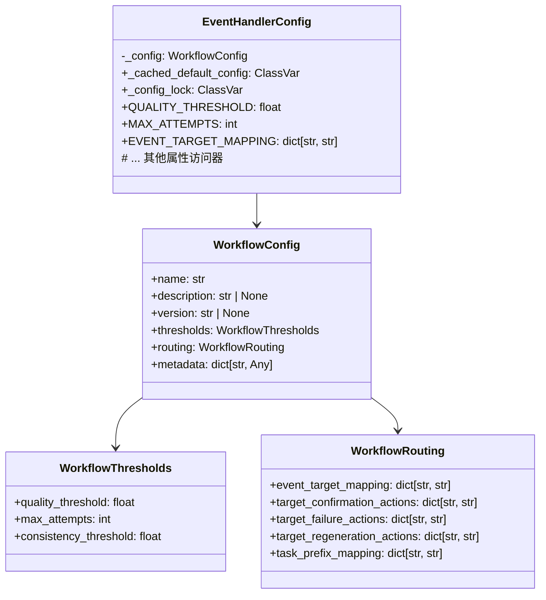
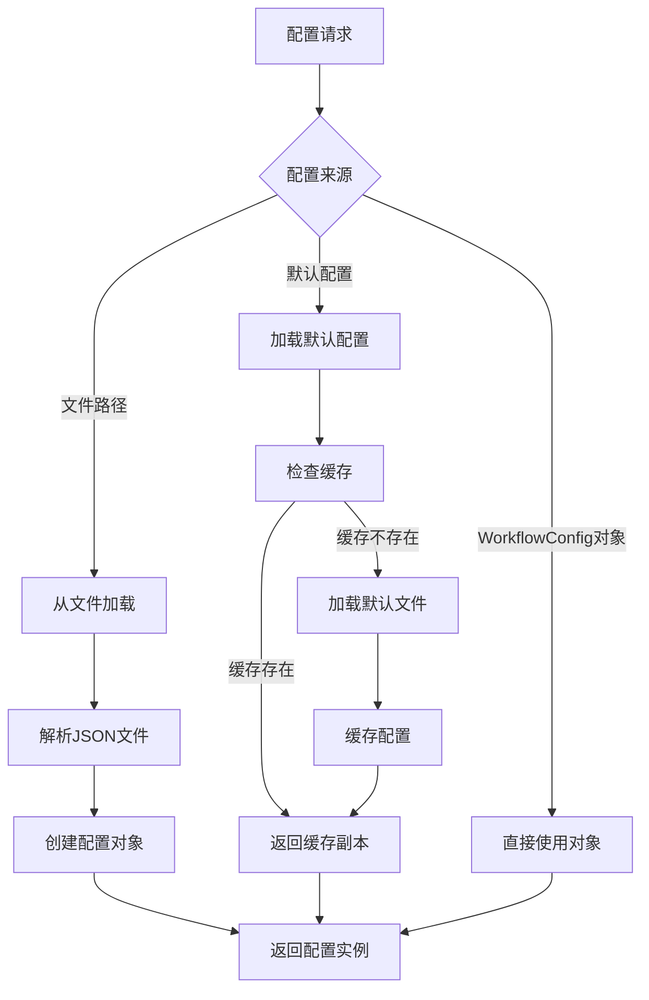

# 工作流配置管理

负责编排器工作流配置的加载、管理和访问，提供配置驱动的业务决策机制。

## 🎯 核心功能

- **配置加载**: 从 JSON 文件加载工作流配置
- **阈值管理**: 管理质量阈值、最大重试次数等数值配置
- **路由规则**: 定义事件到目标的映射和下游动作路由
- **线程安全**: 支持多线程环境下的配置缓存和访问
- **测试支持**: 提供测试专用的配置覆盖机制

## 📁 目录结构

```
workflows/
├── __init__.py                # 模块初始化
├── actions.py                 # 工作流动作定义
├── config.py                  # 配置管理核心类
├── genesis-workflow.json      # Genesis 工作流配置
└── test-workflow.json         # 测试工作流配置
```

## 🏗️ 架构设计

### 配置数据模型



### 配置管理流程



## 🔧 核心组件

### EventHandlerConfig

配置管理的主入口类，提供多种配置加载方式和便捷的属性访问。

#### 配置加载方式
```python
# 从文件加载
config = EventHandlerConfig.from_file("/path/to/workflow.json")

# 从配置对象创建
config_obj = WorkflowConfig(...)
config = EventHandlerConfig.from_config(config_obj)

# 使用默认的 Genesis 工作流
config = EventHandlerConfig.for_genesis_workflow()

# 测试专用配置（支持参数覆盖）
config = EventHandlerConfig.for_testing(
    quality_threshold=6.0,
    max_attempts=2
)
```

#### 线程安全缓存
```python
class EventHandlerConfig:
    _cached_default_config: ClassVar[WorkflowConfig | None] = None
    _config_lock: ClassVar[threading.Lock] = threading.Lock()
    
    @classmethod
    def _get_default_config(cls) -> WorkflowConfig:
        """使用双重检查锁定模式的线程安全配置加载"""
        if cls._cached_default_config is None:
            with cls._config_lock:
                # 双重检查锁定模式
                if cls._cached_default_config is None:
                    cls._cached_default_config = cls._load_from_file(cls.default_config_path())
        # 返回深拷贝避免意外修改
        return copy.deepcopy(cls._cached_default_config)
```

### 配置数据结构

#### WorkflowThresholds
数值阈值配置，驱动工作流的决策逻辑：

```python
@dataclass
class WorkflowThresholds:
    quality_threshold: float           # 质量评审阈值
    max_attempts: int                  # 最大重试次数
    consistency_threshold: float = 1.0  # 一致性检查阈值
```

#### WorkflowRouting
路由规则配置，定义事件流向和下游动作：

```python
@dataclass
class WorkflowRouting:
    event_target_mapping: dict[str, str]           # 事件到目标映射
    target_confirmation_actions: dict[str, str]    # 确认动作映射
    target_failure_actions: dict[str, str]          # 失败动作映射
    target_regeneration_actions: dict[str, str]     # 重生成动作映射
    task_prefix_mapping: dict[str, str]            # 任务前缀映射
```

## 📊 配置示例

### Genesis 工作流配置 (genesis-workflow.json)
```json
{
  "name": "genesis-workflow",
  "description": "Genesis stage workflow configuration",
  "version": "1.0.0",
  "thresholds": {
    "quality_threshold": 7.5,
    "max_attempts": 3,
    "consistency_threshold": 1.0
  },
  "routing": {
    "event_target_mapping": {
      "Genesis.Character.Command.Received": "character",
      "Genesis.Theme.Command.Received": "theme",
      "Genesis.World.Command.Received": "world"
    },
    "target_confirmation_actions": {
      "character": "Stage.Confirmed",
      "theme": "Stage.Confirmed",
      "world": "Stage.Confirmed"
    },
    "target_failure_actions": {
      "character": "Stage.Failed",
      "theme": "Stage.Failed",
      "world": "Stage.Failed"
    },
    "target_regeneration_actions": {
      "character": "Stage.RegenerationRequested",
      "theme": "Stage.RegenerationRequested",
      "world": "Stage.RegenerationRequested"
    },
    "task_prefix_mapping": {
      "Character.Design": "Character.Design",
      "Theme.Creation": "Theme.Creation",
      "World.Building": "World.Building"
    }
  },
  "metadata": {
    "created_by": "system",
    "environment": "production"
  }
}
```

## 🔧 使用方式

### 基本使用
```python
# 初始化配置
config = EventHandlerConfig.for_genesis_workflow()

# 访问阈值
quality_threshold = config.QUALITY_THRESHOLD
max_attempts = config.MAX_ATTEMPTS

# 访问路由规则
event_mapping = config.EVENT_TARGET_MAPPING
confirmation_actions = config.TARGET_CONFIRMATION_ACTIONS

# 工作流决策
if score >= quality_threshold:
    action = confirmation_actions.get(target_type)
elif attempts < max_attempts:
    action = config.TARGET_REGENERATION_ACTIONS.get(target_type)
else:
    action = config.TARGET_FAILURE_ACTIONS.get(target_type)
```

### 测试环境使用
```python
# 创建测试配置（降低阈值便于测试）
test_config = EventHandlerConfig.for_testing(
    quality_threshold=6.0,    # 降低质量阈值
    max_attempts=2,           # 减少重试次数
    consistency_threshold=0.8  # 降低一致性要求
)

# 覆盖特定路由规则
test_config = EventHandlerConfig.for_testing(
    event_target_mapping={
        "Test.Event": "test_target"
    }
)
```

### 动态配置
```python
# 从自定义文件加载
custom_config = EventHandlerConfig.from_file("/custom/path/workflow.json")

# 环境变量覆盖配置路径
os.environ["ORCHESTRATOR_WORKFLOW_CONFIG"] = "/custom/path/workflow.json"
config = EventHandlerConfig.for_genesis_workflow()  # 将加载自定义路径
```

## 🔍 配置验证

### 文件存在性检查
```python
@classmethod
def _load_from_file(cls, file_path: Path) -> WorkflowConfig:
    if not file_path.exists():
        raise WorkflowConfigError(f"Workflow config file not found: {file_path}")
    # ... 加载逻辑
```

### 必需字段验证
```python
try:
    thresholds_data = config_data["thresholds"]
    routing_data = config_data["routing"]
except KeyError as exc:
    raise WorkflowConfigError(f"Missing required workflow section: {exc}") from exc
```

### 类型安全访问
通过属性访问器确保类型安全：
```python
@property
def QUALITY_THRESHOLD(self) -> float:
    return self._config.thresholds.quality_threshold

@property
def MAX_ATTEMPTS(self) -> int:
    return self._config.thresholds.max_attempts
```

## 🚀 性能优化

### 缓存机制
- **默认配置缓存**: 避免重复文件 I/O
- **深拷贝返回**: 防止缓存被意外修改
- **线程安全**: 使用锁保证并发安全

### 内存管理
- **按需加载**: 只有在需要时才加载配置
- **配置复用**: 相同配置的实例共享内存

## 📊 监控和调试

### 配置导出
```python
def to_dict(self) -> dict[str, Any]:
    """导出配置为可序列化字典（主要用于测试/调试）"""
    return {
        "name": self._config.name,
        "thresholds": {
            "quality_threshold": self.QUALITY_THRESHOLD,
            "max_attempts": self.MAX_ATTEMPTS,
        },
        "routing": {
            "event_target_mapping": copy.deepcopy(self.EVENT_TARGET_MAPPING),
            # ... 其他路由配置
        }
    }
```

### 调试信息
```python
# 检查配置来源
config = EventHandlerConfig.for_genesis_workflow()
print(f"Config name: {config._config.name}")
print(f"Config version: {config._config.version}")
print(f"Quality threshold: {config.QUALITY_THRESHOLD}")

# 验证路由规则
print(f"Event mappings: {config.EVENT_TARGET_MAPPING}")
print(f"Confirmation actions: {config.TARGET_CONFIRMATION_ACTIONS}")
```

## 🔧 扩展指南

### 添加新的配置字段
1. 在对应的数据类中添加新字段
2. 更新 JSON 配置文件格式
3. 修改配置加载逻辑（如需要）
4. 添加相应的属性访问器

### 自定义配置验证
```python
@dataclass
class CustomWorkflowThresholds(WorkflowThresholds):
    custom_threshold: float = 5.0
    
    def __post_init__(self):
        if self.custom_threshold < 0:
            raise ValueError("Custom threshold must be non-negative")
```

### 配置热更新
```python
class HotReloadConfig(EventHandlerConfig):
    def __init__(self, config_source: str | Path | WorkflowConfig | None = None):
        super().__init__(config_source)
        self._watcher = self._setup_file_watcher()
    
    def _setup_file_watcher(self):
        """设置文件监听器实现配置热更新"""
        # 实现文件变化监听
        pass
    
    def reload_config(self):
        """重新加载配置"""
        with self._config_lock:
            self._cached_default_config = None
            self._config = self._load_config_from_source(self._config_source)
```

## 🧪 测试策略

### 单元测试
```python
def test_config_loading():
    """测试配置加载"""
    config = EventHandlerConfig.for_testing()
    assert config.QUALITY_THRESHOLD == 7.5
    assert config.MAX_ATTEMPTS == 3

def test_config_override():
    """测试配置覆盖"""
    config = EventHandlerConfig.for_testing(
        quality_threshold=6.0,
        max_attempts=2
    )
    assert config.QUALITY_THRESHOLD == 6.0
    assert config.MAX_ATTEMPTS == 2
```

### 集成测试
```python
def test_config_integration():
    """测试配置与工作流集成"""
    config = EventHandlerConfig.for_genesis_workflow()
    
    # 模拟工作流决策
    score = 8.0
    attempts = 1
    target_type = "character"
    
    if score >= config.QUALITY_THRESHOLD:
        action = config.TARGET_CONFIRMATION_ACTIONS.get(target_type)
        assert action == "Stage.Confirmed"
```

## 📝 最佳实践

### 配置管理
1. **环境隔离**: 为不同环境（开发、测试、生产）使用不同配置
2. **版本控制**: 将配置文件纳入版本控制
3. **配置验证**: 实施配置文件的格式和逻辑验证
4. **文档化**: 为复杂的配置规则提供详细文档

### 性能考虑
1. **缓存策略**: 合理使用缓存减少文件 I/O
2. **内存优化**: 避免在内存中保存过多配置副本
3. **并发控制**: 确保多线程环境下的配置访问安全

### 错误处理
1. **优雅降级**: 配置加载失败时提供合理的默认值
2. **详细日志**: 记录配置加载和使用的关键信息
3. **快速失败**: 对于致命的配置错误应该快速失败

这个工作流配置管理模块为编排器提供了灵活、可靠且高性能的配置管理能力，支持复杂的工作流决策逻辑。