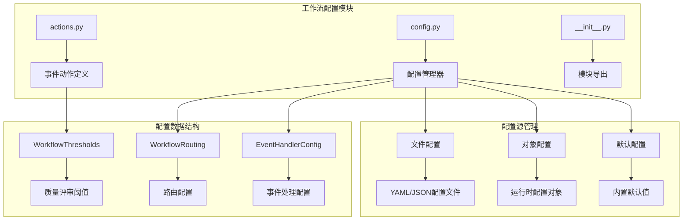
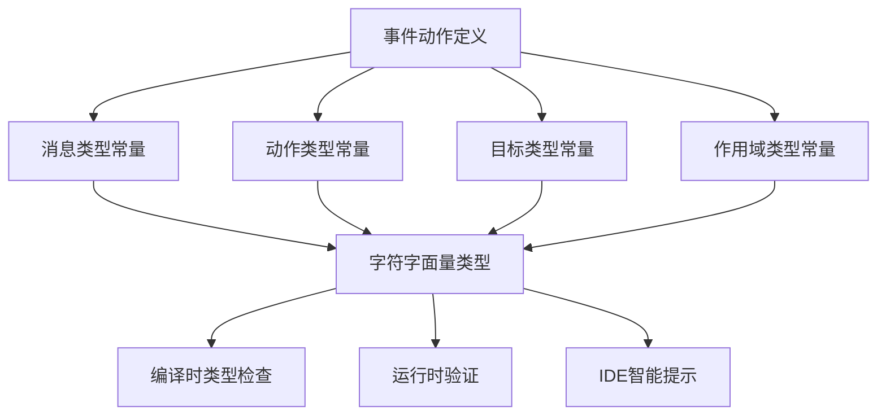
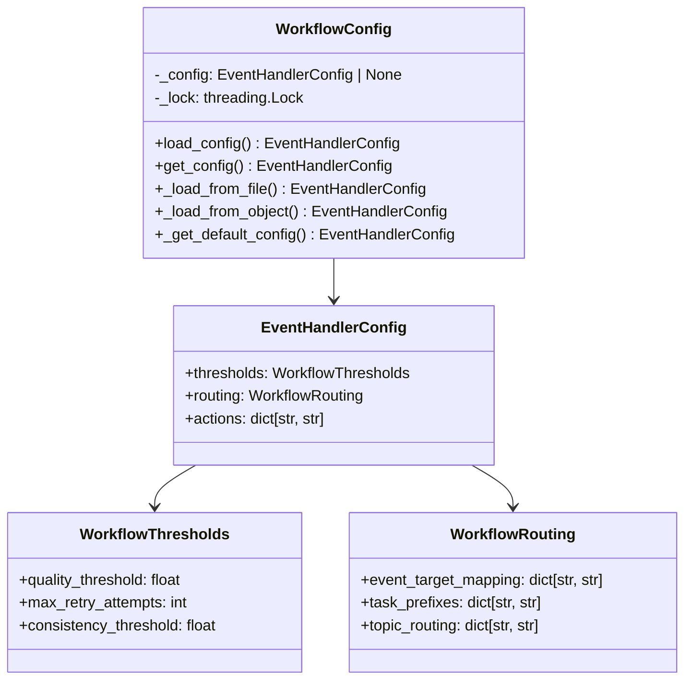
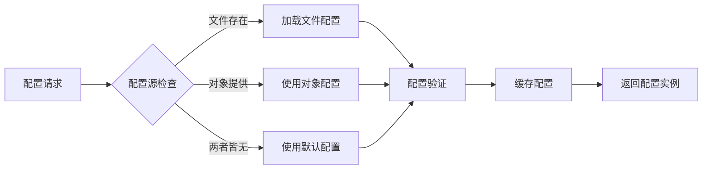
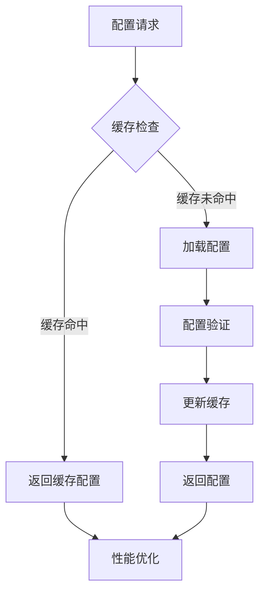

# 工作流配置模块 (Workflows Configuration)

工作流配置模块是编排器的核心配置管理组件，负责定义和管理业务流程中的规则、阈值、路由策略等关键配置信息。通过统一的配置管理，实现了业务逻辑与配置数据的完全解耦。

## 🏗️ 模块架构

### 核心组件架构



## 📁 目录结构

```
workflows/
├── __init__.py           # 模块导出和公共接口
├── actions.py            # 事件动作定义和常量
├── config.py             # 配置管理器和数据类
└── README.md             # 模块文档
```

## 🎯 核心组件详解

### 📋 actions.py - 事件动作定义

负责定义工作流中的各种事件动作类型和常量，提供统一的动作标识体系。

#### 核心功能



#### 主要常量定义

**消息类型 (MessageType)**:
- 生成完成事件: `Character.Generated`, `Theme.Generated`, `Plot.Generated`
- 质量评审事件: `QualityReview.Completed`, `QualityReview.Requested`
- 一致性检查事件: `ConsistencyCheck.Completed`, `ConsistencyCheck.Requested`

**动作类型 (EventActionType)**:
- 确认动作: `Confirmed`, `Accepted`
- 重新生成: `RegenerationRequested`, `RetryRequested`
- 失败处理: `Failed`, `Rejected`

**目标类型 (TargetType)**:
- 实体类型: `character`, `theme`, `plot`, `world`, `seed`
- 抽象类型: `genesis`, `story`, `chapter`

### ⚙️ config.py - 配置管理器

核心配置管理组件，提供线程安全的配置加载、缓存和管理功能。

#### 配置管理架构



#### 线程安全设计

**双检锁模式**:
```python
def get_config(self) -> EventHandlerConfig:
    """线程安全的配置获取，使用双检锁模式"""
    if self._config is None:
        with self._lock:
            if self._config is None:
                self._config = self.load_config()
    return self._config
```

**配置源优先级**:
1. **文件配置**: 从指定的配置文件加载
2. **对象配置**: 从传入的配置对象加载
3. **默认配置**: 使用内置的默认配置

#### 配置数据结构

**工作流阈值配置**:
```python
@dataclass
class WorkflowThresholds:
    """工作流阈值配置"""
    quality_threshold: float = 7.5           # 质量评审阈值
    max_retry_attempts: int = 3              # 最大重试次数
    consistency_threshold: float = 0.8       # 一致性检查阈值
    timeout_seconds: int = 300               # 超时时间
    batch_size: int = 10                     # 批处理大小
```

**工作流路由配置**:
```python
@dataclass
class WorkflowRouting:
    """工作流路由配置"""
    event_target_mapping: dict[str, str]     # 事件到目标的映射
    task_prefixes: dict[str, str]           # 任务前缀定义
    topic_routing: dict[str, str]           # 主题路由规则
    default_target: str = "genesis"         # 默认目标
    fallback_action: str = "retry"          # 降级动作
```

## 🚀 核心特性

### 1. 配置源管理

支持多种配置源，提供灵活的配置管理策略：



### 2. 线程安全保证

使用双检锁模式确保多线程环境下的配置访问安全：

- **初始化安全**: 避免重复加载配置
- **读写安全**: 配置读取时的线程保护
- **性能优化**: 避免不必要的锁竞争

### 3. 类型安全设计

使用 Pydantic 数据类确保配置的类型安全：

```python
class EventHandlerConfig(BaseModel):
    """事件处理配置 - 类型安全的配置管理"""
    
    thresholds: WorkflowThresholds = Field(default_factory=WorkflowThresholds)
    routing: WorkflowRouting = Field(default_factory=WorkflowRouting)
    actions: Dict[str, str] = Field(default_factory=dict)
    
    class Config:
        extra = "forbid"  # 严格模式，禁止额外字段
        validate_assignment = True  # 赋值时验证
```

### 4. 向后兼容性

提供平滑的配置迁移和兼容性保证：

- **字段别名**: 支持旧配置文件格式
- **默认值**: 为新增字段提供合理默认值
- **验证警告**: 对废弃配置给出警告信息

## 📊 使用示例

### 基本配置使用

```python
from src.agents.orchestrator.workflows import WorkflowConfig, EventHandlerConfig

# 1. 使用默认配置
config_manager = WorkflowConfig()
config = config_manager.get_config()

# 2. 从文件加载配置
config_manager = WorkflowConfig(config_file="workflow.yaml")
config = config_manager.get_config()

# 3. 使用对象配置
custom_config = EventHandlerConfig(
    thresholds=WorkflowThresholds(quality_threshold=8.0),
    routing=WorkflowRouting(default_target="custom")
)
config_manager = WorkflowConfig(config_obj=custom_config)
config = config_manager.get_config()
```

### 配置文件示例

**YAML 配置文件**:
```yaml
# workflow.yaml
thresholds:
  quality_threshold: 8.0
  max_retry_attempts: 5
  consistency_threshold: 0.9
  timeout_seconds: 600

routing:
  event_target_mapping:
    "Character.Generated": "character"
    "Theme.Generated": "theme"
    "Plot.Generated": "plot"
  
  task_prefixes:
    "Character.Design": "character.design"
    "Theme.Development": "theme.development"
    "Plot.Creation": "plot.creation"
  
  default_target: "genesis"
  fallback_action: "retry"

actions:
  confirmation_action: "Confirmed"
  regeneration_action: "RegenerationRequested"
  failure_action: "Failed"
```

### 运行时配置修改

```python
# 获取配置管理器
config_manager = WorkflowConfig()

# 获取当前配置
config = config_manager.get_config()

# 修改阈值（注意：这会创建新的配置实例）
new_thresholds = WorkflowThresholds(
    quality_threshold=9.0,
    max_retry_attempts=10
)

# 创建新的配置实例
new_config = EventHandlerConfig(
    thresholds=new_thresholds,
    routing=config.routing,
    actions=config.actions
)

# 使用新配置创建新的配置管理器
new_config_manager = WorkflowConfig(config_obj=new_config)
```

## 🔧 扩展指南

### 添加新的配置项

1. **扩展数据类**:
```python
@dataclass
class WorkflowThresholds:
    # 现有字段...
    new_threshold: float = 5.0  # 新增阈值
```

2. **更新默认配置**:
```python
def _get_default_config(self) -> EventHandlerConfig:
    return EventHandlerConfig(
        thresholds=WorkflowThresholds(
            # 现有配置...
            new_threshold=5.0  # 新字段默认值
        )
    )
```

3. **添加验证逻辑**:
```python
def validate_config(self, config: EventHandlerConfig) -> bool:
    if config.thresholds.new_threshold < 0:
        raise ValueError("new_threshold must be positive")
    return True
```

### 自定义配置源

```python
class DatabaseConfigLoader:
    """从数据库加载配置的自定义加载器"""
    
    def __init__(self, db_connection):
        self.db = db_connection
    
    def load_config(self) -> EventHandlerConfig:
        # 从数据库查询配置数据
        config_data = self.db.query("SELECT * FROM workflow_config")
        
        # 转换为配置对象
        return EventHandlerConfig(**config_data)
```

### 配置热更新

```python
class HotReloadConfigManager(WorkflowConfig):
    """支持热重载的配置管理器"""
    
    def __init__(self, config_file: str | None = None):
        super().__init__(config_file)
        self._file_watcher = None
        self._setup_file_watcher()
    
    def _setup_file_watcher(self):
        """设置文件监控"""
        if self.config_file:
            self._file_watcher = FileWatcher(self.config_file, self._reload_config)
    
    def _reload_config(self):
        """配置文件变更时重新加载"""
        with self._lock:
            self._config = None  # 清除缓存，触发重新加载
```

## 📈 性能优化

### 配置缓存策略



### 最佳实践

1. **配置分离**: 将不同环境的配置分离管理
2. **敏感信息**: 敏感配置使用环境变量或密钥管理
3. **版本控制**: 配置文件纳入版本控制，但敏感信息除外
4. **文档同步**: 配置变更时同步更新文档
5. **测试覆盖**: 为配置逻辑编写充分的测试

## 🧪 测试策略

### 单元测试

```python
class TestWorkflowConfig:
    def test_default_config_loading(self):
        """测试默认配置加载"""
        config_manager = WorkflowConfig()
        config = config_manager.get_config()
        
        assert config.thresholds.quality_threshold == 7.5
        assert config.routing.default_target == "genesis"
    
    def test_file_config_loading(self, tmp_path):
        """测试文件配置加载"""
        config_file = tmp_path / "test_config.yaml"
        config_file.write_text("""
        thresholds:
          quality_threshold: 9.0
        """)
        
        config_manager = WorkflowConfig(config_file=str(config_file))
        config = config_manager.get_config()
        
        assert config.thresholds.quality_threshold == 9.0
    
    def test_thread_safety(self):
        """测试线程安全性"""
        import threading
        
        config_manager = WorkflowConfig()
        results = []
        
        def worker():
            config = config_manager.get_config()
            results.append(id(config))
        
        threads = [threading.Thread(target=worker) for _ in range(10)]
        for t in threads:
            t.start()
        for t in threads:
            t.join()
        
        # 所有线程应该得到同一个配置实例
        assert len(set(results)) == 1
```

### 集成测试

```python
class TestWorkflowConfigIntegration:
    def test_config_with_orchestrator(self):
        """测试配置与编排器的集成"""
        config = WorkflowConfig().get_config()
        
        # 验证配置可以正确用于工作流决策
        from src.agents.orchestrator.workflow_rules import StaticWorkflowRules
        rules = StaticWorkflowRules(config)
        
        decision = rules.evaluate_quality_review(mock_request)
        assert decision is not None
```

## 📝 总结

工作流配置模块通过统一的配置管理机制，实现了业务逻辑与配置数据的完全解耦：

**核心价值**:
- **灵活配置**: 支持多种配置源和动态加载
- **类型安全**: 完整的类型验证和运行时检查
- **线程安全**: 多线程环境下的安全配置访问
- **易于扩展**: 清晰的架构设计便于功能扩展

**架构优势**:
- **单一职责**: 专注于配置管理，职责明确
- **依赖注入**: 支持外部配置注入，便于测试
- **向后兼容**: 平滑的配置迁移和升级路径
- **性能优化**: 智能缓存和延迟加载机制

这个模块为整个编排器系统提供了坚实的配置基础，确保了系统的灵活性和可维护性。