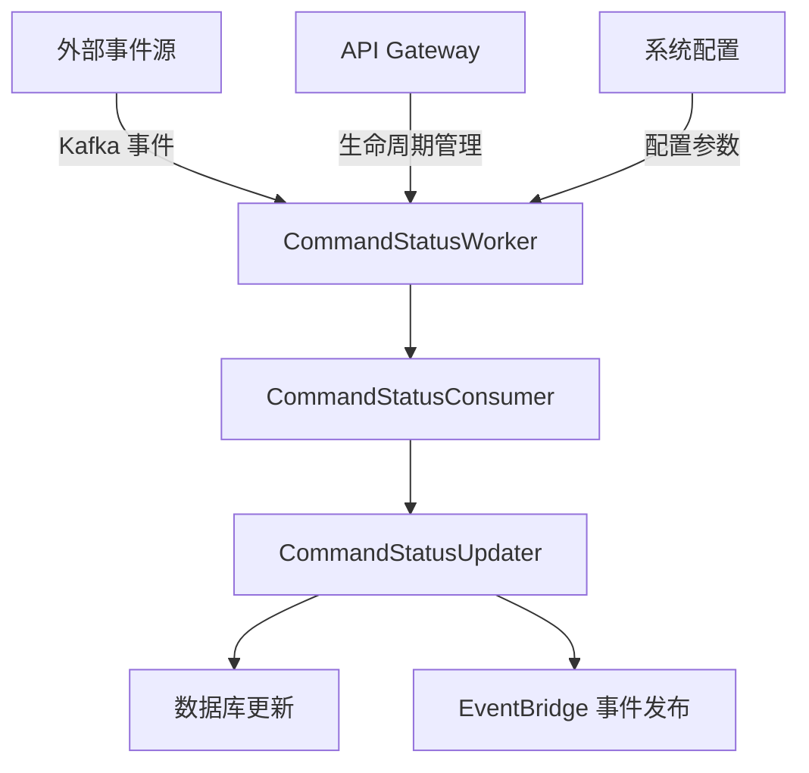
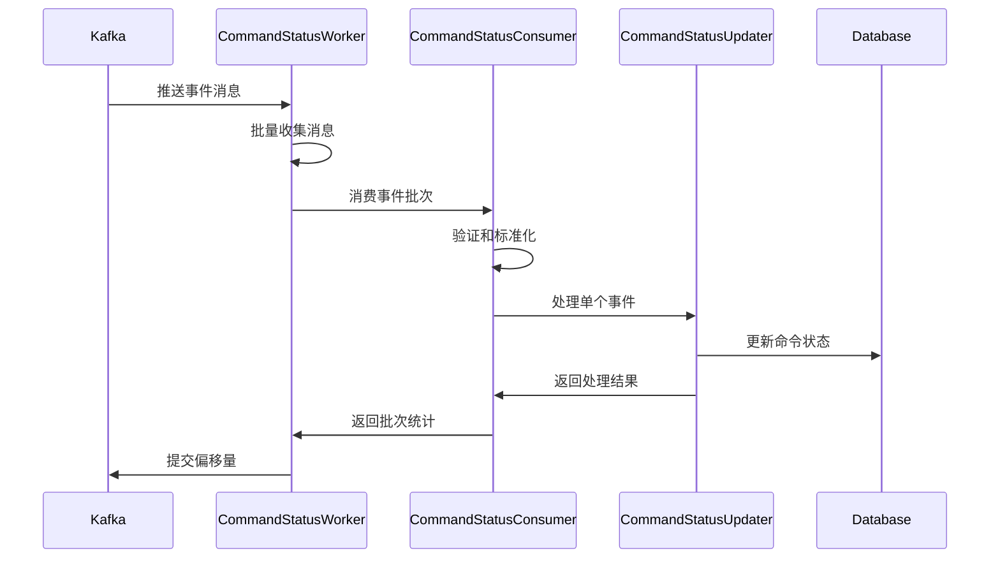

# Background Workers

后台工作模块负责处理异步任务和定时作业，实现系统的后台处理能力。

## 🏗️ 架构概述

### 核心职责
- 处理长时间运行的后台任务
- 监听和处理事件驱动的异步作业
- 实现可靠的任务执行和错误恢复机制

### 技术架构


## 📁 目录结构

```
background/
└── command_status_worker.py    # 命令状态后台工作器
```

## 🔧 核心组件

### CommandStatusWorker

负责监听和处理命令状态事件的后台工作器。

#### 主要功能
- 订阅 Kafka 命令状态事件主题
- 批量消费和处理事件消息
- 实现事件格式标准化和验证
- 提供优雅的启动和关闭机制

#### 关键特性
- **批量处理**: 支持可配置的批处理大小和超时设置
- **错误恢复**: 实现指数退避重试机制
- **格式兼容**: 支持多种事件格式（Canonical 和 Envelope）
- **性能优化**: 异步处理和连接池管理

#### 配置参数
```python
# 主题配置
topics: list[str] = ["command.status.events"]
group_id_suffix: str = "command-status"

# 性能配置
batch_size: int = 100
poll_timeout_ms: int = 1000
```

#### 事件格式支持

**标准格式**：
```json
{
  "event_type": "Command.Started|Completed|Failed",
  "correlation_id": "command_uuid",
  "payload": { ... }
}
```

**信封格式**：
```json
{
  "id": "event_id",
  "type": "Command.Started",
  "data": { ... },
  "correlation_id": "command_uuid"
}
```

## 🔄 处理流程



## 📊 监控和统计

### 处理指标
- **成功事件数**: 成功处理的事件计数
- **失败事件数**: 处理失败的事件计数
- **重试事件数**: 需要重试的事件计数
- **处理时间**: 批次处理耗时统计

### 健康检查
```python
# 检查点
- Kafka 连接状态
- 数据库连接状态
- 任务运行状态
- 内存使用情况
```

## 🚀 使用指南

### 启动工作器
```python
worker = CommandStatusWorker(
    session_factory=session_factory,
    shutdown_event=shutdown_event,
    event_publisher=event_publisher,
    topics=["command.status.events"],
    batch_size=100
)

await worker.start()
```

### 停止工作器
```python
await worker.stop()
```

### 配置示例
```python
# 环境变量配置
COMMAND_STATUS_TOPICS="command.status.events,command.priority.events"
COMMAND_STATUS_BATCH_SIZE=200
COMMAND_STATUS_POLL_TIMEOUT=2000
```

## 🔧 开发指南

### 添加新的事件类型
1. 在 `CommandEventType` 枚举中添加新类型
2. 更新事件验证逻辑
3. 实现对应的处理逻辑
4. 添加测试用例

### 性能优化建议
- 根据负载调整批处理大小
- 监控内存使用和连接池状态
- 实现合理的重试和超时策略
- 考虑使用连接池优化数据库访问

## 📝 最佳实践

### 错误处理
- 实现完善的错误分类和处理
- 使用结构化日志记录错误信息
- 提供清晰的错误恢复机制

### 配置管理
- 使用环境变量配置关键参数
- 实现配置验证和默认值
- 支持动态配置更新

### 监控和告警
- 监控关键性能指标
- 设置合理的告警阈值
- 实现健康检查端点

## 🔗 相关组件

- **CommandStatusConsumer**: 事件消费者实现
- **CommandStatusUpdater**: 状态更新逻辑
- **EventBridgePublisher**: 事件发布器
- **KafkaClientManager**: Kafka 客户端管理器