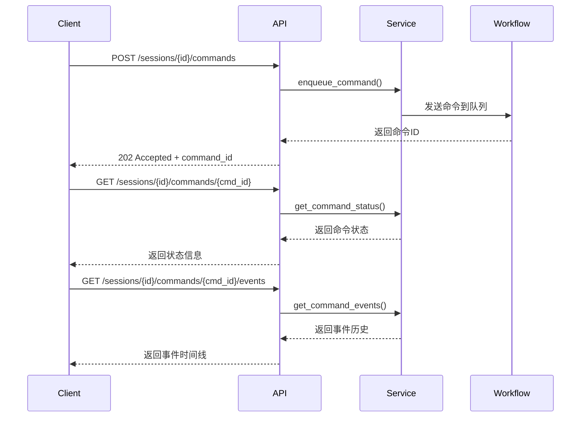
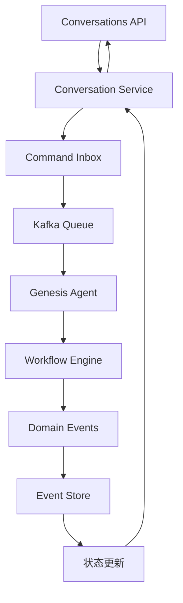
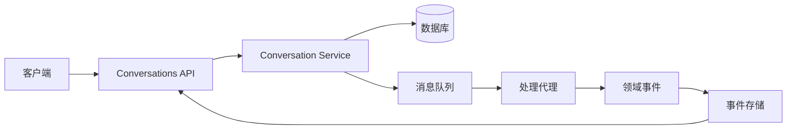

# Conversations API

## 概述

Conversations API 模块提供对话会话管理的完整 RESTful 接口，支持会话创建、命令执行、状态追踪等功能。该模块采用 CQRS（命令查询职责分离）架构模式，与 Genesis 工作流引擎深度集成。

## 核心功能

### 💬 会话管理

- **会话创建**：创建 GENESIS 范围的对话会话
- **会话查询**：获取会话状态和详细信息
- **会话更新**：修改会话属性和状态
- **会话删除**：安全删除会话数据

### 🎯 命令系统

- **异步命令**：支持长时间运行的异步命令执行
- **命令状态**：实时追踪命令执行状态
- **命令历史**：完整的命令执行事件时间线
- **幂等性**：支持命令重复提交的幂等性保证

### 📊 内容管理

- **对话内容**：获取会话的完整对话历史
- **版本管理**：会话版本控制和乐观并发
- **质量评估**：对话质量的量化评估
- **轮次管理**：分层对话轮次的组织和管理

### 🔄 状态流转

- **状态追踪**：会话和命令的实时状态监控
- **事件驱动**：基于领域事件的状态变更通知
- **阶段管理**：复杂的会话阶段控制

## API 端点

### 会话管理端点

```mermaid
graph TD
    A[会话管理] --> B[POST /sessions]
    A --> C[GET /sessions/{session_id}]
    A --> D[PUT /sessions/{session_id}]
    A --> E[DELETE /sessions/{session_id}]
    A --> F[GET /sessions]
    
    B --> G[创建新会话]
    C --> H[获取会话详情]
    D --> I[更新会话信息]
    E --> J[删除会话]
    F --> K[会话列表查询]
```

### 命令系统端点



### 内容查询端点

- `GET /sessions/{session_id}/content` - 获取对话内容
- `GET /sessions/{session_id}/rounds` - 获取对话轮次
- `GET /sessions/{session_id}/versions` - 获取版本历史
- `GET /sessions/{session_id}/quality` - 获取质量评估

## 核心概念

### 会话 (Session)

对话会话是 API 的核心抽象，包含：

- **scope_type**: 会话范围类型（如 GENESIS）
- **scope_id**: 业务实体 ID
- **status**: 会话状态
- **stage**: 当前阶段
- **state**: 会话聚合状态
- **version**: 乐观并发版本

### 命令 (Command)

异步命令执行机制：

- **command_type**: 命令类型
- **payload**: 命令载荷
- **status**: 执行状态
- **correlation_id**: 关联 ID
- **幂等性**: 支持重复提交

### 事件 (Event)

领域事件驱动架构：

- **event_type**: 事件类型
- **correlation_id**: 因果关联
- **payload**: 事件载荷
- **timestamp**: 事件时间戳

## 数据模型

### 会话响应模型

```python
class SessionResponse(BaseSchema):
    id: UUID                              # 会话ID
    scope_type: ScopeType                 # 范围类型
    scope_id: str                        # 业务实体ID
    status: SessionStatus                # 会话状态
    version: int                         # 版本号
    created_at: str                      # 创建时间
    updated_at: str                      # 更新时间
    novel_id: UUID | None                # 关联小说ID
```

### 命令状态模型

```python
class CommandStatusResponse(BaseSchema):
    command_id: UUID                     # 命令ID
    type: str                           # 命令类型
    status: str                         # 执行状态
    submitted_at: str                   # 提交时间
    correlation_id: str                  # 关联ID
```

### 对话历史模型

```python
class DialogueHistory(BaseSchema):
    session: ConversationSessionResponse  # 会话信息
    rounds: list[ConversationRoundResponse]  # 对话轮次
    total_tokens_in: int                # 总输入token
    total_tokens_out: int               # 总输出token
    total_cost: Decimal                 # 总成本
```

## 安全和认证

### 认证机制

- **JWT Token**: 基于JWT的用户认证
- **权限验证**: 会话访问权限检查
- **用户隔离**: 确保用户只能访问自己的会话

### 安全特性

- **关联ID追踪**: 请求链路追踪
- **幂等性保护**: 防止重复操作
- **输入验证**: 严格的参数验证
- **错误处理**: 统一的错误响应格式

## 集成架构

### 与 Genesis 工作流集成



### 数据流架构



## 使用示例

### 创建会话

```python
import requests

response = requests.post(
    "http://localhost:8000/api/v1/conversations/sessions",
    headers={
        "Authorization": "Bearer your_token",
        "X-Correlation-Id": "req-123"
    },
    json={
        "scope_type": "GENESIS",
        "scope_id": "novel-123",
        "title": "新小说创作"
    }
)
```

### 提交命令

```python
response = requests.post(
    "http://localhost:8000/api/v1/conversations/sessions/{session_id}/commands",
    headers={
        "Authorization": "Bearer your_token",
        "Idempotency-Key": "cmd-456"
    },
    json={
        "type": "continue_dialogue",
        "payload": {
            "user_input": "继续故事发展"
        }
    }
)
```

### 查询命令状态

```python
response = requests.get(
    "http://localhost:8000/api/v1/conversations/sessions/{session_id}/commands/{command_id}",
    headers={
        "Authorization": "Bearer your_token"
    }
)
```

## 错误处理

### 标准错误响应

```python
class ErrorResponse(BaseSchema):
    code: int                          # 错误代码
    msg: str                           # 错误消息
    data: dict | None                  # 错误详情
    correlation_id: str                # 关联ID
```

### 常见错误类型

- **401 Unauthorized**: 认证失败
- **403 Forbidden**: 权限不足
- **404 Not Found**: 资源不存在
- **422 Unprocessable Entity**: 参数验证失败
- **500 Internal Server Error**: 服务器内部错误

## 性能特性

### 缓存策略

- **Redis 缓存**: 会话状态缓存
- **TTL 管理**: 自动过期机制
- **缓存键**: 基于会话ID的缓存键生成

### 异步处理

- **非阻塞操作**: 命令执行不阻塞API响应
- **消息队列**: 基于Kafka的异步处理
- **状态追踪**: 实时状态更新通知

### 优化措施

- **分页查询**: 支持大数据集的分页获取
- **选择性加载**: 按需加载关联数据
- **批量操作**: 支持批量命令提交

## 监控和可观测性

### 日志记录

- **结构化日志**: 统一日志格式
- **请求追踪**: 完整的请求链路追踪
- **性能指标**: 响应时间和吞吐量监控

### 指标监控

- **API 调用**: 请求量和响应时间
- **错误率**: 各类错误的统计
- **系统健康**: 服务状态和资源使用