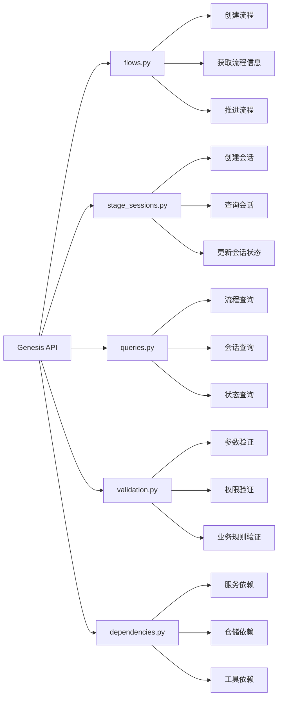
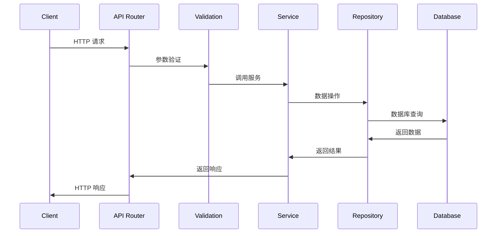

# Genesis API 路由

## 概述

Genesis API 路由模块负责处理小说创作流程的管理和控制，提供流程创建、阶段推进、会话管理等核心功能。

## 功能模块

### 核心功能

- **流程管理**：创建、查询和管理 Genesis 创作流程
- **阶段控制**：推进和监控创作阶段的进展
- **会话管理**：处理创作会话的生命周期
- **依赖注入**：提供统一的依赖管理机制

### API 端点



## 文件说明

### `flows.py`
处理 Genesis 流程相关的 API 端点：
- 流程创建和初始化
- 流程状态查询
- 流程推进控制

### `stage_sessions.py`
管理创作阶段会话：
- 阶段会话的创建和绑定
- 会话状态管理
- 会话查询和更新

### `queries.py`
提供查询功能：
- 流程信息查询
- 会话状态查询
- 历史记录查询

### `validation.py`
处理请求验证：
- 参数格式验证
- 业务规则验证
- 权限检查

### `dependencies.py`
管理依赖注入：
- 服务实例化
- 仓储注入
- 工具组件管理

## 数据流程



## 配置说明

### 路由配置

```python
# 路由注册
router = APIRouter(prefix="/genesis", tags=["genesis"])

# 端点示例
@router.post("/flows")
async def create_flow(flow_data: FlowCreate):
    # 创建流程逻辑
    pass

@router.get("/flows/{flow_id}")
async def get_flow(flow_id: UUID):
    # 获取流程信息
    pass
```

### 依赖配置

```python
# 依赖注入示例
def get_flow_service(
    db: AsyncSession = Depends(get_db),
    flow_repository: GenesisFlowRepository = Depends(),
) -> GenesisFlowService:
    return GenesisFlowService(
        flow_repository=flow_repository,
        db_session=db,
    )
```

## 错误处理

### 常见错误类型

- **验证错误**：请求参数格式错误或业务规则违反
- **权限错误**：用户无权访问特定资源
- **状态错误**：流程或会话处于不允许操作的状态
- **并发错误**：资源冲突或乐观锁失败

### 错误响应格式

```json
{
    "error": {
        "code": "VALIDATION_ERROR",
        "message": "详细错误信息",
        "details": {
            "field": "具体字段错误"
        }
    }
}
```

## 性能优化

### 缓存策略

- 流程状态缓存
- 会话信息缓存
- 查询结果缓存

### 数据库优化

- 索引优化
- 查询优化
- 批量操作

## 开发指南

### 添加新端点

1. 在对应的文件中添加路由函数
2. 实现验证逻辑
3. 添加必要的依赖注入
4. 编写测试用例
5. 更新 API 文档

### 错误处理最佳实践

- 使用适当的 HTTP 状态码
- 提供清晰的错误信息
- 记录错误日志
- 实现重试机制

### 安全考虑

- 输入参数验证
- 权限检查
- 敏感信息过滤
- 请求频率限制

---

*该模块是 InfiniteScribe 创作流程控制的核心 API 层，为前端应用提供完整的流程管理功能。*