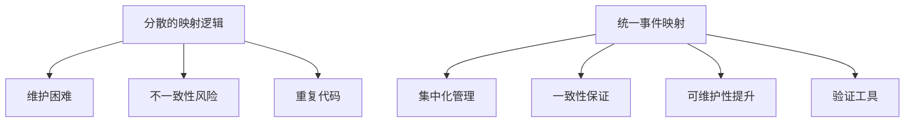
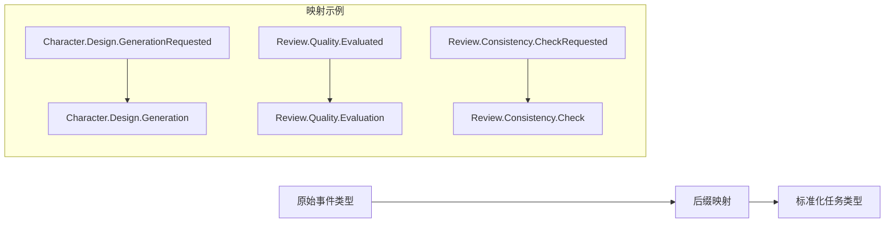
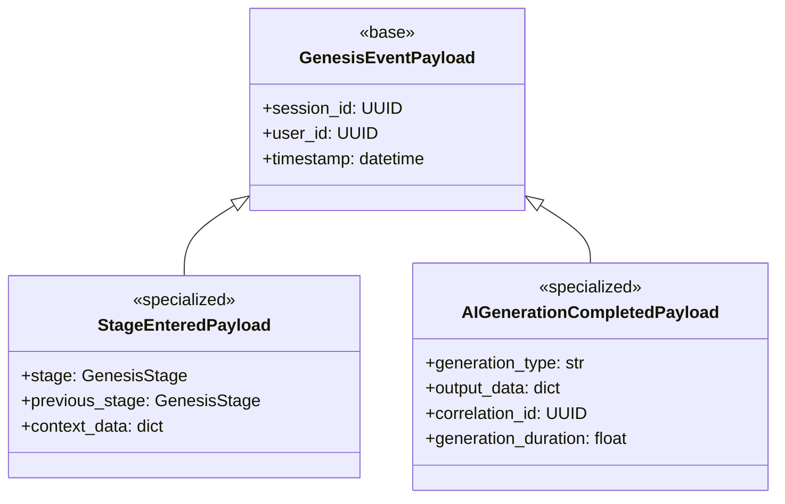
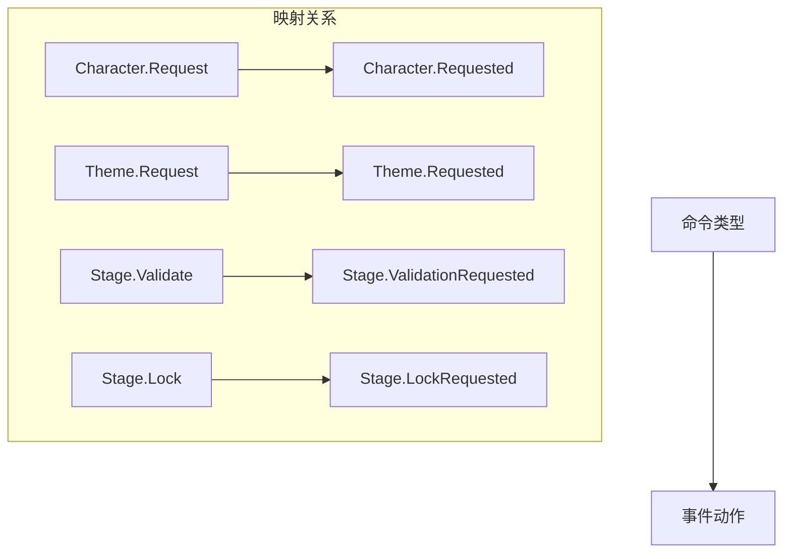
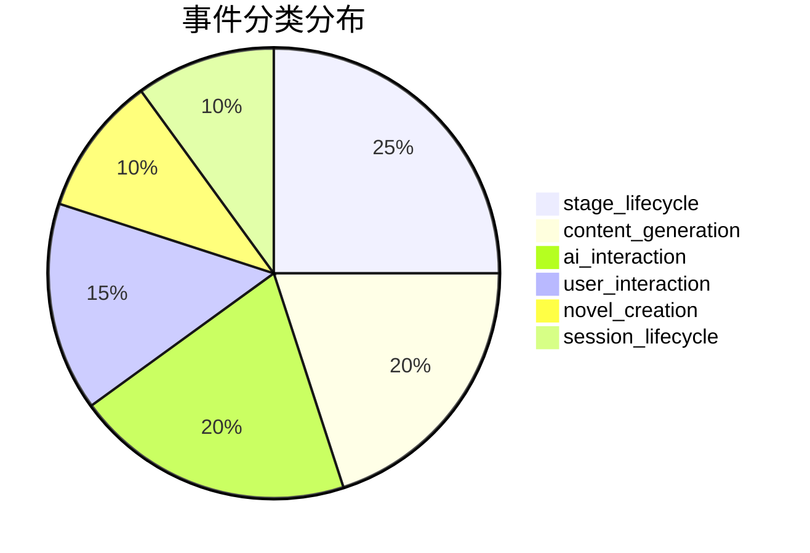

# 统一事件映射 (Unified Event Mapping)

提供集中化的事件相关转换映射，包括任务类型标准化、事件-载荷映射、命令-事件映射和事件验证工具。

## 🎯 核心功能

### 统一映射策略

为了避免映射逻辑分散，该模块实现了集中化的映射配置：



## 📊 映射类别

### 1. 任务类型标准化

将能力事件/任务类型标准化为异步任务的基础类型：



**映射规则**：
- `GenerationRequested/Generated` → `Generation`
- `EvaluationRequested/Evaluated` → `Evaluation`
- `CheckRequested/Checked` → `Check`
- `AnalysisRequested/Analyzed` → `Analysis`
- `ValidationRequested/Validated` → `Validation`

### 2. 事件-载荷映射

高频事件类型到专用载荷类的映射：



### 3. 命令-事件映射

命令类型到事件动作的映射：



### 4. 事件分类

事件类型按功能分类：



## 📁 目录结构

```
events/
├── mapping.py    # 统一事件映射配置
└── config.py     # 事件配置工具
```

## 🔧 核心函数

### 任务类型标准化

```python
def normalize_task_type(event_type: str) -> str:
    """标准化能力事件/任务类型
    
    Examples:
      - "Character.Design.GenerationRequested" -> "Character.Design.Generation"
      - "Review.Quality.Evaluated" -> "Review.Quality.Evaluation"
    """
```

### 事件载荷类获取

```python
def get_event_payload_class(event_type: str | GenesisEventType) -> type:
    """获取事件类型对应的载荷类
    
    Args:
        event_type: 事件类型（字符串或枚举）
    
    Returns:
        载荷类，未映射时返回通用 GenesisEventPayload
    """
```

### 命令事件映射

```python
def get_event_by_command(command: str) -> str | None:
    """从命令类型获取对应的事件动作"""
```

### 事件分类管理

```python
def get_event_category(event_type: str | GenesisEventType) -> str:
    """获取事件类型所属分类"""

def list_events_by_category(category: str) -> list[str]:
    """列出指定分类的所有事件"""
```

## 🛠️ 验证和调试工具

### 映射完整性验证

```python
def validate_event_mappings() -> dict[str, list[str]]:
    """验证映射完整性，返回问题列表"""
    
    issues = {
        "missing_high_frequency_mapping": [],  # 缺失高频事件映射
        "orphaned_payload_mappings": [],      # 孤立的载荷映射
        "orphaned_command_mappings": [],      # 孤立的命令映射
        "missing_category_mapping": [],       # 缺失分类映射
    }
```

### 统计信息

```python
def get_mapping_statistics() -> dict[str, int]:
    """获取映射统计信息"""
    
    return {
        "total_task_type_mappings": 15,      # 任务类型映射数量
        "total_event_payload_mappings": 9,   # 事件载荷映射数量
        "total_command_event_mappings": 8,   # 命令事件映射数量
        "total_event_categories": 6,          # 事件分类数量
        "total_categorized_events": 16,       # 已分类事件数量
        "total_genesis_event_types": 18,      # Genesis 事件类型总数
    }
```

## 🔄 集成使用

### 在 OrchestratorAgent 中使用

```python
from src.common.events.mapping import normalize_task_type, get_event_by_command

# 任务类型标准化
task_type = normalize_task_type("Character.Design.GenerationRequested")
# 结果: "Character.Design.Generation"

# 命令事件映射
event_action = get_event_by_command("Character.Request")
# 结果: "Character.Requested"
```

### 在事件序列化中使用

```python
from src.common.events.mapping import get_event_payload_class

# 获取载荷类
payload_class = get_event_payload_class(GenesisEventType.STAGE_ENTERED)
# 结果: StageEnteredPayload

# 反序列化
payload = payload_class(**payload_data)
```

## 📊 性能优化

### 缓存策略

- 使用 `Final` 类型注解确保映射表在运行时不可变
- 字典查找提供 O(1) 时间复杂度
- 避免运行时映射表重建

### 内存使用

- 映射表在模块加载时初始化，占用少量内存
- 无状态函数设计，避免实例化开销

## 🔄 版本兼容性

### 向后兼容

- 保持现有函数签名不变
- 新增映射不影响现有代码
- 提供降级处理（如载荷类回退到通用类）

### 扩展性

- 支持动态添加新的映射关系
- 模块化设计便于维护
- 提供验证工具确保新增映射的正确性

## 🧪 测试策略

### 单元测试

- 测试每个映射函数的正确性
- 验证边界条件和异常情况
- 确保回退逻辑正常工作

### 集成测试

- 测试与 OrchestratorAgent 的集成
- 验证事件序列化/反序列化流程
- 确保幂等性保护机制

## 🔗 相关模块

- **Genesis 事件模型**: `src.schemas.genesis_events` - 事件载荷类定义
- **枚举定义**: `src.schemas.enums` - 事件类型枚举
- **编排代理**: `src.agents.orchestrator` - 事件处理逻辑
- **领域事件**: `src.models.event` - 领域事件模型

## 📝 最佳实践

1. **集中管理**: 所有映射逻辑都在此模块中维护
2. **类型安全**: 使用类型注解确保编译时检查
3. **文档更新**: 添加新映射时同步更新文档
4. **验证工具**: 定期运行验证工具确保映射完整性
5. **性能考虑**: 避免在热路径中动态构建映射表