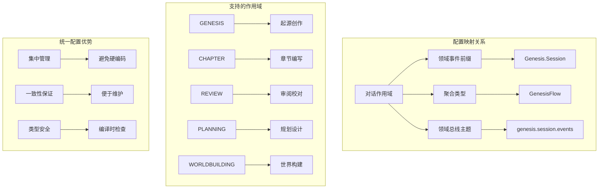
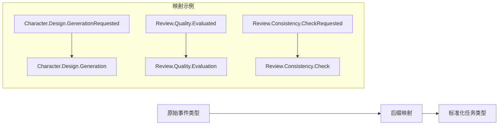
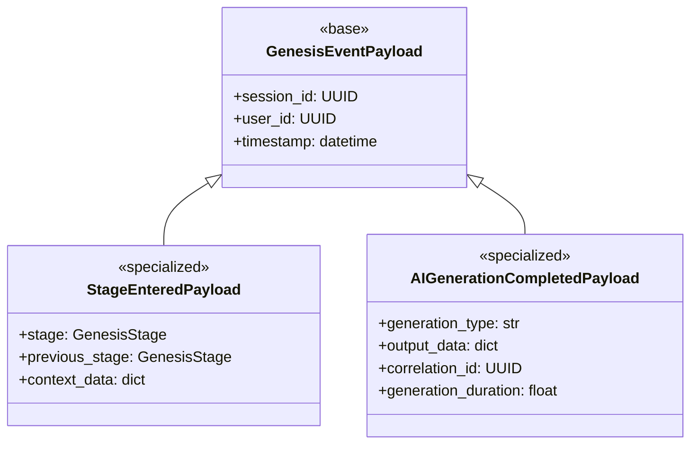
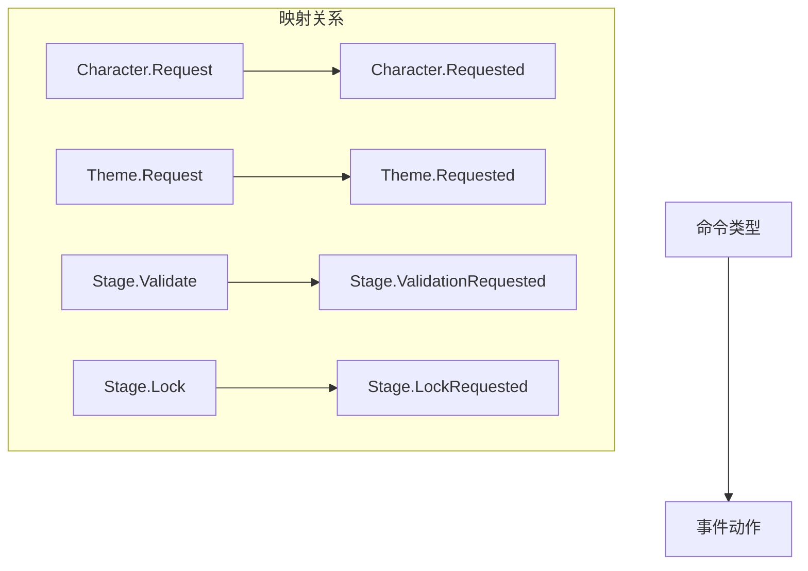
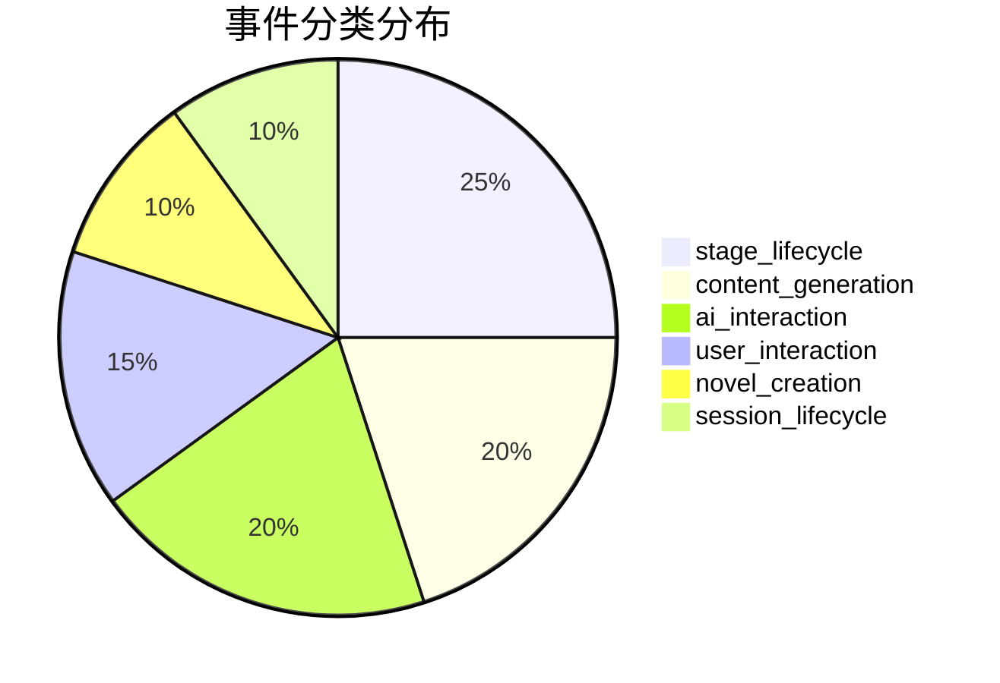

# 事件处理与配置模块 (Events & Configuration)

提供项目中事件的统一配置、映射和管理功能，确保事件驱动架构的一致性和可维护性。

## 🚀 最新功能增强

### 领域事件配置统一 ✨

最近的更新新增了领域事件配置模块，提供了从对话作用域到领域事件的统一映射：


```mermaid
graph TB
    subgraph "配置映射关系"
        A[对话作用域] --> B[领域事件前缀]
        A --> C[聚合类型]
        A --> D[领域总线主题]
        
        B --> E[Genesis.Session]
        C --> F[GenesisFlow]
        D --> G[genesis.session.events]
    end
    
    subgraph "支持的作用域"
        H[GENESIS] --> I[起源创作]
        J[CHAPTER] --> K[章节编写]
        L[REVIEW] --> M[审阅校对]
        N[PLANNING] --> O[规划设计]
        P[WORLDBUILDING] --> Q[世界构建]
    end
    
    subgraph "统一配置优势"
        R[集中管理] --> S[避免硬编码]
        T[一致性保证] --> U[便于维护]
        V[类型安全] --> W[编译时检查]
    end
```

#### 核心配置功能

- **作用域到事件映射**: `ScopeType.GENESIS → "Genesis.Session"`
- **聚合类型管理**: 动态聚合类型映射（如`GenesisSession` → `GenesisFlow`）
- **话题路由**: 统一的事件总线主题命名规则
- **策略配置**: 编排器命令策略的完整配置

## 🎯 核心功能

### 统一事件映射 (Unified Event Mapping)

提供集中化的事件相关转换映射，包括任务类型标准化、事件-载荷映射、命令-事件映射和事件验证工具。

### 事件配置管理 (Event Configuration)

提供领域事件和系统配置的统一管理，包括作用域映射、策略配置和事件模式匹配。

## 📁 目录结构

```
events/
├── mapping.py    # 统一事件映射配置
└── config.py     # 事件配置工具
```

## 📊 统一事件映射

### 映射类别

#### 1. 任务类型标准化

将能力事件/任务类型标准化为异步任务的基础类型：


```mermaid
flowchart LR
    A[原始事件类型] --> B[后缀映射]
    B --> C[标准化任务类型]
    
    subgraph "映射示例"
        D["Character.Design.GenerationRequested"] --> E["Character.Design.Generation"]
        F["Review.Quality.Evaluated"] --> G["Review.Quality.Evaluation"]
        H["Review.Consistency.CheckRequested"] --> I["Review.Consistency.Check"]
    end
```

**映射规则**：
- `GenerationRequested/Generated` → `Generation`
- `EvaluationRequested/Evaluated` → `Evaluation`
- `CheckRequested/Checked` → `Check`
- `AnalysisRequested/Analyzed` → `Analysis`
- `ValidationRequested/Validated` → `Validation`

#### 2. 事件-载荷映射

高频事件类型到专用载荷类的映射：


```mermaid
classDiagram
    class GenesisEventPayload {
        <<base>>
        +session_id: UUID
        +user_id: UUID
        +timestamp: datetime
    }
    
    class StageEnteredPayload {
        <<specialized>>
        +stage: GenesisStage
        +previous_stage: GenesisStage
        +context_data: dict
    }
    
    class AIGenerationCompletedPayload {
        <<specialized>>
        +generation_type: str
        +output_data: dict
        +correlation_id: UUID
        +generation_duration: float
    }
    
    GenesisEventPayload <|-- StageEnteredPayload
    GenesisEventPayload <|-- AIGenerationCompletedPayload
```

#### 3. 命令-事件映射

命令类型到事件动作的映射：


```mermaid
graph TD
    A[命令类型] --> B[事件动作]
    
    subgraph "映射关系"
        C["Character.Request"] --> D["Character.Requested"]
        E["Theme.Request"] --> F["Theme.Requested"]
        G["Stage.Validate"] --> H["Stage.ValidationRequested"]
        I["Stage.Lock"] --> J["Stage.LockRequested"]
    end
```

#### 4. 事件分类

事件类型按功能分类：


```mermaid
pie
    title 事件分类分布
    "stage_lifecycle" : 25
    "content_generation" : 20
    "ai_interaction" : 20
    "user_interaction" : 15
    "novel_creation" : 10
    "session_lifecycle" : 10
```

### 核心函数

#### 任务类型标准化

```python
def normalize_task_type(event_type: str) -> str:
    """标准化能力事件/任务类型
    
    Examples:
      - "Character.Design.GenerationRequested" -> "Character.Design.Generation"
      - "Review.Quality.Evaluated" -> "Review.Quality.Evaluation"
    """
```

#### 事件载荷类获取

```python
def get_event_payload_class(event_type: str | GenesisEventType) -> type:
    """获取事件类型对应的载荷类
    
    Args:
        event_type: 事件类型（字符串或枚举）
    
    Returns:
        载荷类，未映射时返回通用 GenesisEventPayload
    """
```

#### 命令事件映射

```python
def get_event_by_command(command: str) -> str | None:
    """从命令类型获取对应的事件动作"""
```

#### 事件分类管理

```python
def get_event_category(event_type: str | GenesisEventType) -> str:
    """获取事件类型所属分类"""

def list_events_by_category(category: str) -> list[str]:
    """列出指定分类的所有事件"""
```

### 验证和调试工具

#### 映射完整性验证

```python
def validate_event_mappings() -> dict[str, list[str]]:
    """验证映射完整性，返回问题列表"""
    
    issues = {
        "missing_high_frequency_mapping": [],  # 缺失高频事件映射
        "orphaned_payload_mappings": [],      # 孤立的载荷映射
        "orphaned_command_mappings": [],      # 孤立的命令映射
        "missing_category_mapping": [],       # 缺失分类映射
    }
```

#### 统计信息

```python
def get_mapping_statistics() -> dict[str, int]:
    """获取映射统计信息"""
    
    return {
        "total_task_type_mappings": 15,      # 任务类型映射数量
        "total_event_payload_mappings": 9,   # 事件载荷映射数量
        "total_command_event_mappings": 8,   # 命令事件映射数量
        "total_event_categories": 6,          # 事件分类数量
        "total_categorized_events": 16,       # 已分类事件数量
        "total_genesis_event_types": 18,      # Genesis 事件类型总数
    }
```

### Orchestrator 集成使用

#### 在 OrchestratorAgent 中使用

```python
from src.common.events.mapping import normalize_task_type, get_event_by_command

# 任务类型标准化
task_type = normalize_task_type("Character.Design.GenerationRequested")
# 结果: "Character.Design.Generation"

# 命令事件映射
event_action = get_event_by_command("Character.Request")
# 结果: "Character.Requested"
```

#### 在事件序列化中使用

```python
from src.common.events.mapping import get_event_payload_class

# 获取载荷类
payload_class = get_event_payload_class(GenesisEventType.STAGE_ENTERED)
# 结果: StageEnteredPayload

# 反序列化
payload = payload_class(**payload_data)
```

## 🏗️ 事件配置管理

### 作用域映射

#### 领域事件前缀映射

将不同的对话作用域映射到对应的领域事件前缀：

```python
# 作用域到领域事件前缀映射
SCOPE_EVENT_PREFIX: Final[dict[str, str]] = {
    ScopeType.GENESIS.value: "Genesis.Session",
    ScopeType.CHAPTER.value: "Chapter.Session",
    ScopeType.REVIEW.value: "Review.Session",
    ScopeType.PLANNING.value: "Planning.Session",
    ScopeType.WORLDBUILDING.value: "Worldbuilding.Session",
}
```

#### 聚合类型映射

每个作用域对应的聚合实体类型：

```python
# 聚合类型映射
SCOPE_AGGREGATE_TYPE: Final[dict[str, str]] = {
    ScopeType.GENESIS.value: "GenesisFlow",  # 更新从GenesisSession到GenesisFlow
    ScopeType.CHAPTER.value: "ChapterSession",
    ScopeType.REVIEW.value: "ReviewSession",
    ScopeType.PLANNING.value: "PlanningSession",
    ScopeType.WORLDBUILDING.value: "WorldbuildingSession",
}
```

#### 领域总线主题

每个作用域对应的事件总线主题：

```python
# 领域总线主题映射
SCOPE_DOMAIN_TOPIC: Final[dict[str, str]] = {
    ScopeType.GENESIS.value: "genesis.session.events",
    ScopeType.CHAPTER.value: "chapter.session.events",
    ScopeType.REVIEW.value: "review.session.events",
    ScopeType.PLANNING.value: "planning.session.events",
    ScopeType.WORLDBUILDING.value: "worldbuilding.session.events",
}
```

### 辅助函数

#### 事件类型构建

```python
def build_event_type(scope_type: str | ScopeType, action: str) -> str:
    """构建完整的点分号事件类型，例如：Genesis.Session.Round.Created。
    
    Args:
        scope_type: 对话作用域（字符串或ScopeType枚举）
        action: 点分号动作部分，例如："Round.Created"或"Command.Received"
    """
    prefix = get_domain_prefix(scope_type)
    action_str = action.strip(".")
    return f"{prefix}.{action_str}"
```

#### 策略配置管理

##### 策略配置结构

```python
# 编排器命令映射的策略配置
STRATEGY_CONFIG: Final[dict[str, dict[str, str]]] = {
    "character": {
        "base_topic": "character",
        "capability_type": "Character.Design.GenerationRequested",
        "requested_action": "Character.Requested",
    },
    "theme": {
        "base_topic": "outline",
        "capability_type": "Outliner.Theme.GenerationRequested",
        "requested_action": "Theme.Requested",
    },
    "seed": {
        "base_topic": "outline",
        "capability_type": "Outliner.Concept.GenerationRequested",
        "requested_action": "Seed.Requested",
    },
    "world": {
        "base_topic": "world",
        "capability_type": "Worldbuilder.World.GenerationRequested",
        "requested_action": "World.Requested",
    },
    "plot": {
        "base_topic": "plot",
        "capability_type": "Plot.Structure.GenerationRequested",
        "requested_action": "Plot.Requested",
    },
    "details": {
        "base_topic": "writer",
        "capability_type": "Writer.Content.GenerationRequested",
        "requested_action": "Details.Requested",
    },
    "stage_validation": {
        "base_topic": "review",
        "capability_type": "Review.Consistency.CheckRequested",
        "requested_action": "Stage.ValidationRequested",
    },
    "stage_lock": {
        "base_topic": "review",
        "capability_type": "Review.Consistency.CheckRequested",
        "requested_action": "Stage.LockRequested",
    },
}
```

##### 事件模式匹配

```python
# 事件模式常量
EVENT_PATTERNS: Final[dict[str, str | list[str]]] = {
    "command_received_suffix": ".Command.Received",
    "generation_completed_patterns": [
        "Character.Design.Generated",
        "Character.Generated",
        "Outliner.Theme.Generated",
        "Theme.Generated",
    ],
    "quality_review_patterns": [
        "Review.Quality.Evaluated",
        "Review.Quality.Result",
    ],
    "state_change_suffixes": [
        ".Confirmed",
        ".Updated",
        ".Revised",
        ".Completed",
        ".Created",
    ],
}
```

#### 便捷函数

```python
def get_strategy_config(strategy_key: str) -> dict[str, str] | None:
    """根据键获取策略配置"""

def get_strategy_keys() -> list[str]:
    """获取所有可用的策略键"""

def is_command_received_event(event_type: str) -> bool:
    """检查事件类型是否为命令接收事件"""

def is_state_change_event(event_type: str) -> bool:
    """检查事件类型是否表示不需要能力任务的状态变更"""

def extract_strategy_key_from_event_type(event_type: str) -> str | None:
    """从事件类型中提取策略键"""
```

### 配置使用示例

#### 作用域映射使用

```python
from src.common.events.config import (
    get_domain_prefix,
    get_aggregate_type,
    get_domain_topic,
    build_event_type,
    ScopeType
)

# 获取作用域配置
scope_type = ScopeType.GENESIS

# 获取领域事件前缀
event_prefix = get_domain_prefix(scope_type)
# 结果: "Genesis.Session"

# 获取聚合类型
aggregate_type = get_aggregate_type(scope_type)
# 结果: "GenesisFlow"

# 获取领域总线主题
topic = get_domain_topic(scope_type)
# 结果: "genesis.session.events"

# 构建完整事件类型
event_type = build_event_type(scope_type, "Round.Created")
# 结果: "Genesis.Session.Round.Created"
```

#### 策略配置使用

```python
from src.common.events.config import (
    get_strategy_config,
    get_strategy_keys,
    EVENT_PATTERNS,
    STRATEGY_CONFIG
)

# 获取策略配置
character_config = get_strategy_config("character")
# 结果: {"base_topic": "character", "capability_type": "...", "requested_action": "..."}

# 获取所有策略键
all_strategies = get_strategy_keys()
# 结果: ["character", "theme", "seed", "world", "plot", "details", "stage_validation", "stage_lock"]

# 检查事件模式
is_command = is_command_received_event("Command.Genesis.Session.Character.Requested")
# 结果: True

is_generation = "Character.Generated" in EVENT_PATTERNS["generation_completed_patterns"]
# 结果: True
```

## 🔄 集成使用模式

### 在编排器中使用

```python
from src.common.events.mapping import (
    normalize_task_type,
    get_event_by_command,
    get_command_aliases_for_action
)
from src.common.events.config import (
    get_strategy_config,
    build_event_type,
    get_domain_topic
)

# 综合使用示例
def process_orchestrator_command(scope_type, command_type, session_id):
    # 1. 获取策略配置
    strategy_config = get_strategy_config("character")
    
    # 2. 构建事件类型
    event_type = build_event_type(scope_type, "Command.Received")
    
    # 3. 获取对应的动作
    event_action = get_event_by_command(command_type)
    
    # 4. 标准化任务类型
    task_type = normalize_task_type(strategy_config["capability_type"])
    
    # 5. 获取领域总线主题
    topic = get_domain_topic(scope_type)
    
    return {
        "event_type": event_type,
        "event_action": event_action,
        "task_type": task_type,
        "topic": topic,
        "session_id": session_id
    }
```

### 在事件处理器中使用

```python
from src.common.events.mapping import (
    get_event_payload_class,
    get_event_category,
    list_events_by_category
)

def handle_domain_event(event_type, payload):
    # 获取载荷类
    payload_class = get_event_payload_class(event_type)
    
    # 反序列化载荷
    typed_payload = payload_class(**payload)
    
    # 获取事件分类
    category = get_event_category(event_type)
    
    # 根据分类处理
    if category == "stage_lifecycle":
        handle_stage_event(typed_payload)
    elif category == "content_generation":
        handle_content_event(typed_payload)
    
    return typed_payload
```

## 📊 性能优化

### 缓存策略

- **Final类型注解**: 确保映射表在运行时不可变
- **字典查找**: 提供O(1)时间复杂度
- **避免重建**: 运行时不重建映射表

### 内存使用

- **轻量级**: 映射表在模块加载时初始化，占用少量内存
- **无状态**: 工具函数设计，避免实例化开销
- **共享使用**: 多个模块共享同一份配置

## 🔧 类型安全

### 编译时检查

```python
from typing import Literal
from src.schemas.enums import GenesisEventType

# 字符串字面量类型确保编译时安全
EventType = Literal[
    "STAGE_ENTERED",
    "STAGE_COMPLETED",
    "AI_GENERATION_STARTED",
    "AI_GENERATION_COMPLETED"
]

def process_event(event_type: EventType) -> None:
    # 编译时确保只能传入有效的事件类型
    pass

process_event("STAGE_ENTERED")    # ✅ 正确
process_event("INVALID_EVENT")   # ❌ 编译错误
```

### 运行时验证

```python
# 运行时类型验证和转换
def safe_event_processing(event_type: str, payload: dict):
    try:
        payload_class = get_event_payload_class(event_type)
        validated_payload = payload_class(**payload)
        return validated_payload
    except Exception as e:
        logger.error(f"事件验证失败: {e}")
        return None
```

## 🔄 扩展指南

### 添加新的映射关系

#### 1. 任务类型映射

```python
# 在TASK_TYPE_SUFFIX_MAPPING中添加新映射
TASK_TYPE_SUFFIX_MAPPING: Final[dict[str, str]] = {
    # 现有映射...
    "NewActionRequested": "NewAction",
    "NewActionCompleted": "NewAction",
}
```

#### 2. 事件载荷映射

```python
# 在EVENT_PAYLOAD_MAPPING中添加新映射
EVENT_PAYLOAD_MAPPING: Final[dict[str, type]] = {
    # 现有映射...
    "NEW_EVENT_TYPE": NewEventPayload,
}
```

#### 3. 命令事件映射

```python
# 在COMMAND_EVENT_MAPPING中添加新映射
COMMAND_EVENT_MAPPING: Final[dict[str, str]] = {
    # 现有映射...
    "New.Command": "New.Requested",
}
```

### 添加新的作用域配置

```python
# 在SCOPE_*映射中添加新作用域
SCOPE_EVENT_PREFIX[ScopeType.NEW_SCOPE.value] = "NewScope.Session"
SCOPE_AGGREGATE_TYPE[ScopeType.NEW_SCOPE.value] = "NewScopeSession"
SCOPE_DOMAIN_TOPIC[ScopeType.NEW_SCOPE.value] = "newscope.session.events"
```

### 添加新的策略配置

```python
# 在STRATEGY_CONFIG中添加新策略
STRATEGY_CONFIG["new_strategy"] = {
    "base_topic": "new_topic",
    "capability_type": "NewCapability.GenerationRequested",
    "requested_action": "New.Requested",
}
```

## 🧪 测试策略

### 单元测试

```python
import pytest
from src.common.events.mapping import (
    normalize_task_type,
    get_event_payload_class,
    get_event_by_command
)
from src.common.events.config import (
    get_domain_prefix,
    get_strategy_config,
    build_event_type
)

def test_normalize_task_type():
    """测试任务类型标准化"""
    assert normalize_task_type("Character.Design.GenerationRequested") == "Character.Design.Generation"
    assert normalize_task_type("Review.Quality.Evaluated") == "Review.Quality.Evaluation"
    assert normalize_task_type("Unknown.Type") == "Unknown.Type"

def test_event_payload_mapping():
    """测试事件载荷映射"""
    from src.schemas.genesis_events import StageEnteredPayload
    
    payload_class = get_event_payload_class("STAGE_ENTERED")
    assert payload_class == StageEnteredPayload
    
    # 未映射的事件返回通用载荷类
    generic_class = get_event_payload_class("UNKNOWN_EVENT")
    assert generic_class.__name__ == "GenesisEventPayload"

def test_command_event_mapping():
    """测试命令事件映射"""
    assert get_event_by_command("Character.Request") == "Character.Requested"
    assert get_event_by_command("THEME_REQUEST") == "Theme.Requested"
    assert get_event_by_command("Unknown.Command") is None

def test_scope_config():
    """测试作用域配置"""
    from src.schemas.novel.dialogue import ScopeType
    
    assert get_domain_prefix(ScopeType.GENESIS) == "Genesis.Session"
    assert get_aggregate_type(ScopeType.GENESIS) == "GenesisFlow"
    assert get_domain_topic(ScopeType.GENESIS) == "genesis.session.events"

def test_strategy_config():
    """测试策略配置"""
    config = get_strategy_config("character")
    assert config["base_topic"] == "character"
    assert config["capability_type"] == "Character.Design.GenerationRequested"
    assert config["requested_action"] == "Character.Requested"
    
    assert get_strategy_config("unknown_strategy") is None

def test_build_event_type():
    """测试事件类型构建"""
    event_type = build_event_type("GENESIS", "Round.Created")
    assert event_type == "Genesis.Session.Round.Created"
    
    event_type = build_event_type(ScopeType.GENESIS, "Command.Received")
    assert event_type == "Genesis.Session.Command.Received"
```

### 集成测试

```python
def test_orchestrator_integration():
    """测试与编排器的集成"""
    from src.agents.orchestrator.command_strategies import CommandStrategyRegistry
    
    # 测试映射配置能够正确支持编排器策略
    registry = CommandStrategyRegistry()
    
    # 验证映射结果能够被策略正确使用
    character_config = get_strategy_config("character")
    assert character_config is not None
    
    # 验证事件类型构建
    event_type = build_event_type("GENESIS", "Command.Received")
    assert "Command.Received" in event_type
```

### 验证测试

```python
def test_mapping_validation():
    """测试映射完整性验证"""
    from src.common.events.mapping import validate_event_mappings
    
    issues = validate_event_mappings()
    
    # 检查是否有严重问题
    assert not issues.get("missing_high_frequency_mapping", [])
    assert not issues.get("orphaned_payload_mappings", [])
    
    # 打印其他问题用于调试
    if issues:
        print(f"映射验证问题: {issues}")
```

## 📊 监控和统计

### 使用统计

```python
from src.common.events.mapping import get_mapping_statistics

stats = get_mapping_statistics()
print(f"任务类型映射数量: {stats['total_task_type_mappings']}")
print(f"事件载荷映射数量: {stats['total_event_payload_mappings']}")
print(f"命令事件映射数量: {stats['total_command_event_mappings']}")
print(f"事件分类数量: {stats['total_event_categories']}")
```

### 性能监控

```python
import time
from src.common.events.mapping import normalize_task_type, get_event_by_command

def benchmark_mappings():
    """映射性能基准测试"""
    iterations = 10000
    
    # 测试任务类型标准化性能
    start_time = time.time()
    for _ in range(iterations):
        normalize_task_type("Character.Design.GenerationRequested")
    task_type_time = time.time() - start_time
    
    # 测试命令事件映射性能
    start_time = time.time()
    for _ in range(iterations):
        get_event_by_command("Character.Request")
    command_time = time.time() - start_time
    
    print(f"任务类型标准化 {iterations} 次耗时: {task_type_time:.4f}秒")
    print(f"命令事件映射 {iterations} 次耗时: {command_time:.4f}秒")
    print(f"平均每次操作: {(task_type_time + command_time) / (2 * iterations) * 1000:.2f}毫秒")
```

## 🔗 相关模块

- **事件模型**: `src.schemas.genesis_events` - 事件载荷类定义
- **枚举定义**: `src.schemas.enums` - 事件类型和作用域枚举
- **编排代理**: `src.agents.orchestrator` - 事件处理逻辑
- **领域事件**: `src.models.event` - 领域事件模型
- **对话模型**: `src.schemas.novel.dialogue` - 对话作用域定义

## 📝 最佳实践

### 1. 配置管理

```python
# 推荐：使用配置获取映射信息
config = get_strategy_config("character")
capability_type = config["capability_type"]

# 避免：硬编码映射
capability_type = "Character.Design.GenerationRequested"  # 硬编码
```

### 2. 类型安全

```python
# 推荐：使用类型注解
def process_event(event_type: str) -> None:
    payload_class = get_event_payload_class(event_type)
    # 处理逻辑...

# 避免：缺少类型信息
def process_event(event_type):
    payload_class = get_event_payload_class(event_type)
    # 处理逻辑...
```

### 3. 错误处理

```python
# 推荐：处理可能的None返回
event_action = get_event_by_command(command_type)
if event_action is None:
    # 处理未知命令的情况
    handle_unknown_command(command_type)

# 避免：假设返回值总是有效
event_action = get_event_by_command(command_type)
process_action(event_action)  # 可能抛出异常
```

### 4. 验证工具

```python
# 推荐：定期运行验证工具
issues = validate_event_mappings()
if issues:
    # 记录并修复问题
    log_mapping_issues(issues)
    fix_mapping_issues(issues)

# 避免：忽视映射完整性
# 直接使用，可能导致运行时错误
```

### 5. 性能考虑

```python
# 推荐：批量处理时缓存配置
def process_events_batch(events):
    config_cache = {}
    for event in events:
        strategy_key = extract_strategy_key(event["type"])
        if strategy_key not in config_cache:
            config_cache[strategy_key] = get_strategy_config(strategy_key)
        # 使用缓存的配置处理事件...

# 避免：重复获取相同配置
def process_events_batch_inefficient(events):
    for event in events:
        strategy_key = extract_strategy_key(event["type"])
        config = get_strategy_config(strategy_key)  # 重复获取
        # 处理事件...
```

这个事件处理与配置模块为整个应用提供了统一、类型安全、高性能的事件管理解决方案，确保了事件驱动架构的一致性和可维护性。