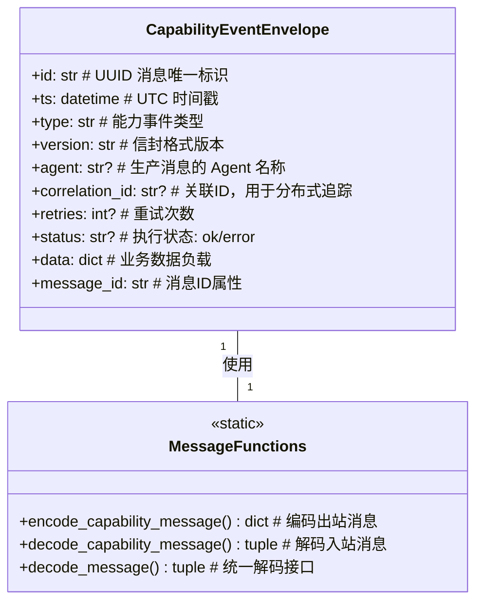
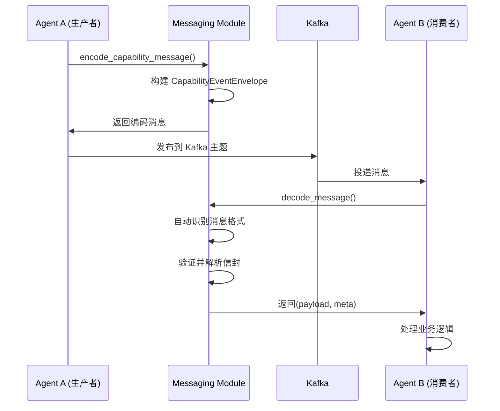
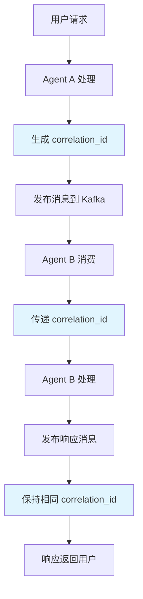
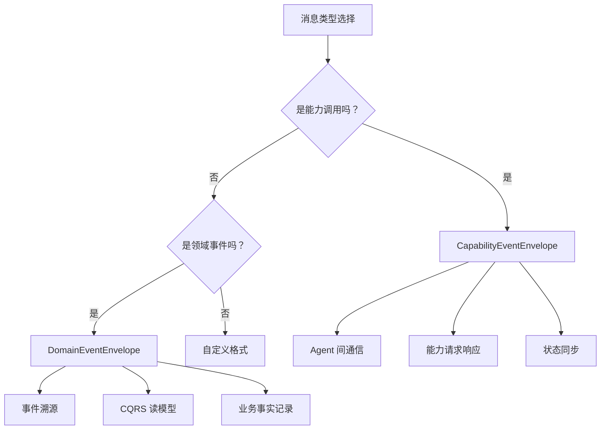

# 消息传递模块 (Messaging Module)

提供 Agent 间异步通信的标准化消息格式和编解码工具，确保系统内消息传递的一致性和可靠性。

## 🎯 核心功能

### CapabilityEventEnvelope - 能力事件信封

为 Agent 间异步通信提供结构化的消息格式，支持能力调用、状态管理和重试机制：



## 📁 目录结构

```
messaging/
├── __init__.py          # 模块导出和接口定义
├── envelope.py          # CapabilityEventEnvelope 定义和编解码
└── protocol.py          # 统一的消息协议和解码接口
```

## 🔧 核心实现

### 消息编码

```python
def encode_capability_message(
    agent: str, 
    result: dict[str, Any], 
    *, 
    correlation_id: str | None, 
    retries: int
) -> dict[str, Any]:
    """将 Agent 的业务结果编码为 CapabilityEventEnvelope 格式
    
    Args:
        agent: 生产消息的 Agent 名称
        result: 业务结果字典，必须包含 'type' 字段
        correlation_id: 用于分布式追踪的关联 ID
        retries: 成功前的重试次数
    
    Returns:
        编码后的消息字典（JSON 序列化友好）
    """
```

### 消息解码

```python
def decode_capability_message(
    value: dict[str, Any],
) -> tuple[dict[str, Any], dict[str, Any]]:
    """将 CapabilityEventEnvelope 格式的消息解码为 (业务数据, 元数据) 元组
    
    Args:
        value: 消息字典，应符合 CapabilityEventEnvelope 格式
    
    Returns:
        (payload, meta): 业务数据字典和元数据字典
    """
```

### 统一解码接口

```python
def decode_message(value: dict[str, Any]) -> tuple[dict[str, Any], dict[str, Any]]:
    """统一的消息解码接口，自动识别并解码不同格式的消息

    支持的消息格式：
    1. CapabilityEventEnvelope: {id, ts, type, data, ...} - Agent 能力调用消息
    2. DomainEventEnvelope: {system, data, schema_version} - 领域事件消息

    设计理念：
    - 自动检测消息格式，无需调用方手动判断
    - 返回统一的 (payload, meta) 结构，简化消费方代码
    - 使用 Pydantic 验证，确保类型安全和数据完整性

    Args:
        value: 消息字典，可以是任何支持的格式

    Returns:
        (payload, meta): 业务数据字典和元数据字典
            - payload 为消息的 data 字段内容
            - meta 包含所有元数据字段（id, type, correlation_id 等）

    Raises:
        ValidationError: 当消息不符合任何已知格式时

    使用示例：
        ```python
        # 自动识别 CapabilityEventEnvelope
        capability_msg = {
            "id": "msg-123",
            "ts": "2025-01-01T00:00:00Z",
            "type": "capability.executed",
            "data": {"result": "success"}
        }
        payload, meta = decode_message(capability_msg)

        # 自动识别 DomainEventEnvelope
        domain_event = {
            "system": {
                "event_id": "evt-456",
                "event_type": "Order.Created",
                ...
            },
            "data": {"order_id": "123"},
            "schema_version": "v1"
        }
        payload, meta = decode_message(domain_event)
        ```
    """
```

## 🚀 使用示例

### 编码能力消息

```python
from src.common.messaging import encode_capability_message

# 业务结果
result = {
    "type": "Character.Generated",
    "character": {
        "name": "Arthur",
        "age": 30,
        "profession": "knight"
    },
    "session_id": "session_123"
}

# 编码为标准信封格式
envelope = encode_capability_message(
    agent="character_expert",
    result=result,
    correlation_id="req-456",
    retries=0
)

# 输出结构
{
    "id": "uuid-generated",
    "ts": "2025-01-12T10:30:00Z",
    "type": "Character.Generated",
    "version": "v1",
    "agent": "character_expert",
    "correlation_id": "req-456",
    "retries": 0,
    "status": "ok",
    "data": {
        "character": {
            "name": "Arthur",
            "age": 30,
            "profession": "knight"
        },
        "session_id": "session_123"
    }
}
```

### 解码消息

```python
from src.common.messaging import decode_capability_message

# 解码收到的消息
payload, meta = decode_capability_message(received_message)

# payload: 业务数据
{
    "character": {
        "name": "Arthur",
        "age": 30,
        "profession": "knight"
    },
    "session_id": "session_123"
}

# meta: 元数据
{
    "id": "msg-uuid-789",
    "message_id": "msg-uuid-789",
    "type": "Character.Generated",
    "version": "v1",
    "correlation_id": "req-456",
    "agent": "character_expert",
    "retries": 0,
    "status": "ok"
}
```

## 🔄 消息流转架构

### 统一消息处理流程

```mermaid
graph TD
    A[原始消息] --> B{消息格式检测}
    
    B -->|包含system字段| C[DomainEventEnvelope]
    B -->|其他格式| D[CapabilityEventEnvelope]
    
    C --> E[使用to_envelope_meta获取元数据]
    D --> F[构建标准元数据字典]
    
    E --> G[返回(payload, meta)]
    F --> G
    
    G --> H[统一的消息处理接口]
    
    subgraph "消息格式特征"
        I[DomainEventEnvelope<br/>system + data + schema_version]
        J[CapabilityEventEnvelope<br/>id + ts + type + data]
    end
    
    C --> I
    D --> J
```

### Agent 间通信流程



### 智能格式识别

```mermaid
flowchart TD
    A[接收消息字典] --> B{检查system字段}
    
    B -->|存在system且schema_version| C[识别为DomainEventEnvelope]
    B -->|其他情况| D[识别为CapabilityEventEnvelope]
    
    C --> E[导入DomainEventEnvelope]
    E --> F[使用to_envelope_meta方法]
    F --> G[返回结构化元数据]
    
    D --> H[导入CapabilityEventEnvelope]
    H --> I[构建标准元数据字典]
    I --> J[返回(payload, meta)结构]
    
    G --> K[统一输出格式]
    J --> K
    
    style C fill:#e1f5fe
    style D fill:#f3e5f5
    style K fill:#e8f5e8
```

### 分布式追踪



## ⚙️ 配置参数

### 消息格式常量

```python
# 消息格式版本
ENVELOPE_VERSION = "v1"

# 默认事件类型
DEFAULT_EVENT_TYPE = "unknown"

# 保留字段类型
RESERVED_FIELD_TYPE = "type"

# 状态常量
STATUS_OK = "ok"
STATUS_ERROR = "error"
```

### 字段说明

| 字段 | 类型 | 必需 | 说明 |
|------|------|------|------|
| `id` | str | ✅ | UUID 消息唯一标识符 |
| `ts` | datetime | ✅ | UTC 时间戳 |
| `type` | str | ✅ | 能力事件类型 |
| `version` | str | ❌ | 信封格式版本，默认 "v1" |
| `agent` | str | ❌ | 生产消息的 Agent 名称 |
| `correlation_id` | str | ❌ | 关联ID，用于分布式追踪 |
| `retries` | int | ❌ | 重试次数 |
| `status` | str | ❌ | 执行状态: "ok" 或 "error" |
| `data` | dict | ❌ | 业务数据负载 |

## 🔍 错误处理

### 验证错误

```python
from pydantic import ValidationError

try:
    envelope = CapabilityEventEnvelope.model_validate(message)
except ValidationError as e:
    # 处理消息格式验证失败
    logger.error(f"消息验证失败: {e}")
    raise InvalidMessageFormatError(f"消息格式无效: {e}")
```

### 兜底处理

```python
def safe_decode_message(message: dict) -> tuple[dict, dict]:
    """安全的消息解码，包含错误处理"""
    try:
        return decode_capability_message(message)
    except Exception as e:
        logger.warning(f"消息解码失败，使用默认格式: {e}")
        # 返回默认结构
        return {}, {"type": "unknown", "error": str(e)}
```

## 📊 监控指标

### 消息处理指标

- **编码/解码成功率**: 消息处理的成功比例
- **处理延迟**: 消息编码/解码的平均时间
- **错误率**: 验证失败和其他错误的频率
- **消息大小分布**: 不同大小消息的处理性能

### 业务指标

- **Agent 通信频率**: 各 Agent 间的消息传递频率
- **correlation_id 追踪完整性**: 端到端追踪的成功率
- **重试消息比例**: 需要重试的消息占比

## 🔗 与 DomainEventEnvelope 的区别

| 特性 | CapabilityEventEnvelope | DomainEventEnvelope |
|------|-------------------------|-------------------|
| **用途** | Agent 间能力调用 | 领域事件记录 |
| **语义** | 请求/响应 | 已发生的业务事实 |
| **追踪** | correlation_id | causation_id + correlation_id |
| **状态** | status 字段 | 无状态字段 |
| **重试** | retries 字段 | 无重试信息 |
| **聚合** | 无聚合信息 | aggregate_type + aggregate_id |

### 使用场景对比



## 🧪 测试策略

### 单元测试

```python
import pytest
from src.common.messaging import encode_capability_message, decode_capability_message

def test_message_encode_decode():
    """测试消息编码解码的一致性"""
    result = {
        "type": "Test.Event",
        "data": {"key": "value"}
    }
    
    # 编码
    encoded = encode_capability_message(
        agent="test_agent",
        result=result,
        correlation_id="test-123",
        retries=0
    )
    
    # 解码
    payload, meta = decode_capability_message(encoded)
    
    # 验证
    assert payload["data"]["key"] == "value"
    assert meta["type"] == "Test.Event"
    assert meta["agent"] == "test_agent"
    assert meta["correlation_id"] == "test-123"

def test_message_validation():
    """测试消息格式验证"""
    # 测试有效消息
    valid_message = {
        "id": "test-id",
        "ts": "2025-01-12T10:00:00Z",
        "type": "Test.Event",
        "data": {}
    }
    payload, meta = decode_capability_message(valid_message)
    assert meta["type"] == "Test.Event"
    
    # 测试无效消息
    with pytest.raises(ValidationError):
        invalid_message = {"type": "Test.Event"}  # 缺少必需字段
        decode_capability_message(invalid_message)
```

### 集成测试

```python
def test_agent_communication():
    """测试 Agent 间通信的完整流程"""
    # Agent A 编码消息
    result = {"type": "Task.Completed", "output": "success"}
    message = encode_capability_message(
        agent="agent_a",
        result=result,
        correlation_id="integration-test"
    )
    
    # 模拟 Kafka 传输
    transported_message = simulate_kafka_transport(message)
    
    # Agent B 解码消息
    payload, meta = decode_capability_message(transported_message)
    
    # 验证通信完整性
    assert payload["output"] == "success"
    assert meta["agent"] == "agent_a"
    assert meta["correlation_id"] == "integration-test"
```

## 📈 性能优化

### 编码优化

- **UUID 生成**: 使用高效的 UUID 生成算法
- **时间戳**: 使用 UTC 时间避免时区转换开销
- **字段验证**: 最小化验证逻辑，确保高性能

### 解码优化

- **类型转换**: 优化数据类型转换逻辑
- **错误处理**: 快速失败机制，避免无效处理
- **内存使用**: 避免不必要的数据复制

## 🔮 扩展指南

### 添加新的消息字段

```python
class CapabilityEventEnvelope(BaseModel):
    """扩展现有信封格式"""
    # 现有字段...
    
    # 新增字段
    priority: int = Field(default=0, description="消息优先级")
    tags: list[str] = Field(default_factory=list, description="消息标签")
    expires_at: datetime | None = Field(default=None, description="消息过期时间")
```

### 自定义消息格式

```python
def encode_custom_message(
    agent: str,
    result: dict[str, Any],
    *,
    custom_field: str,
    **kwargs
) -> dict[str, Any]:
    """自定义消息编码"""
    envelope = CapabilityEventEnvelope(
        # 标准字段...
        data={
            **result,
            "custom_field": custom_field
        }
    )
    return envelope.model_dump(mode="json")
```

---

*消息传递模块为 InfiniteScribe 系统提供了统一、可靠、高性能的 Agent 间通信基础设施，确保了分布式架构中消息传递的一致性和可追溯性。*