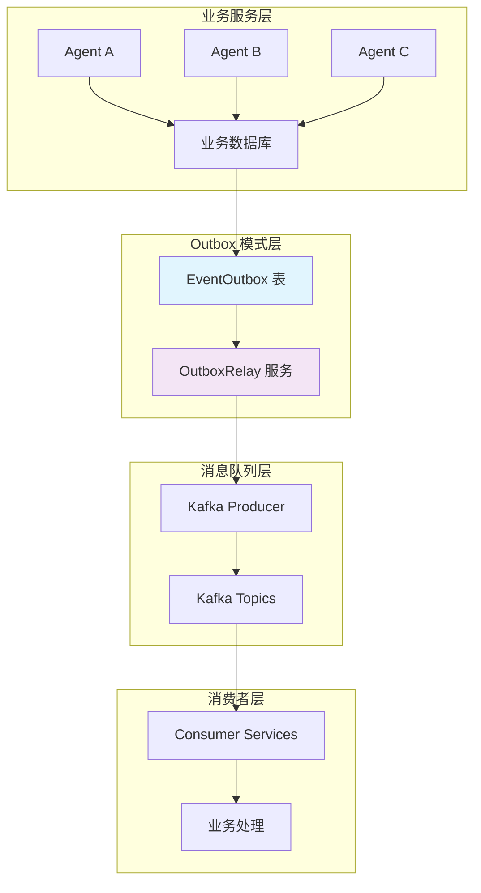
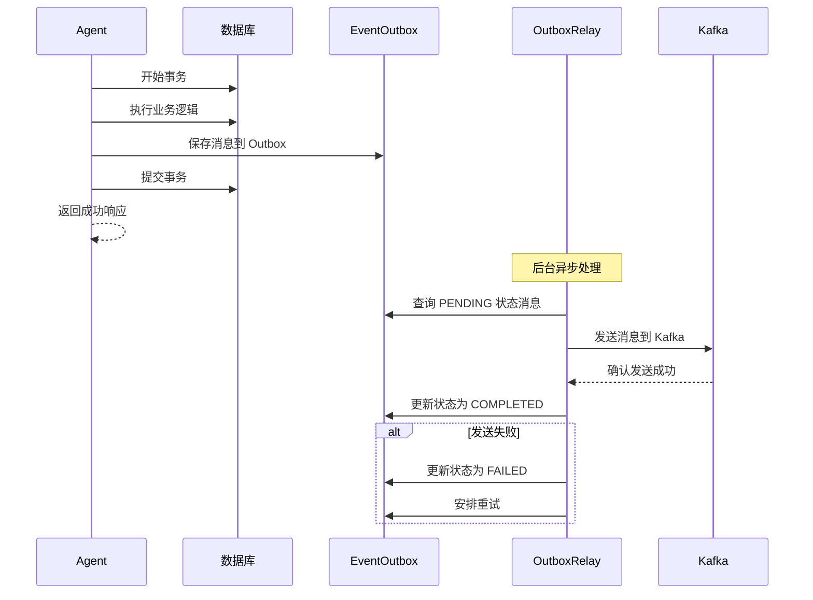
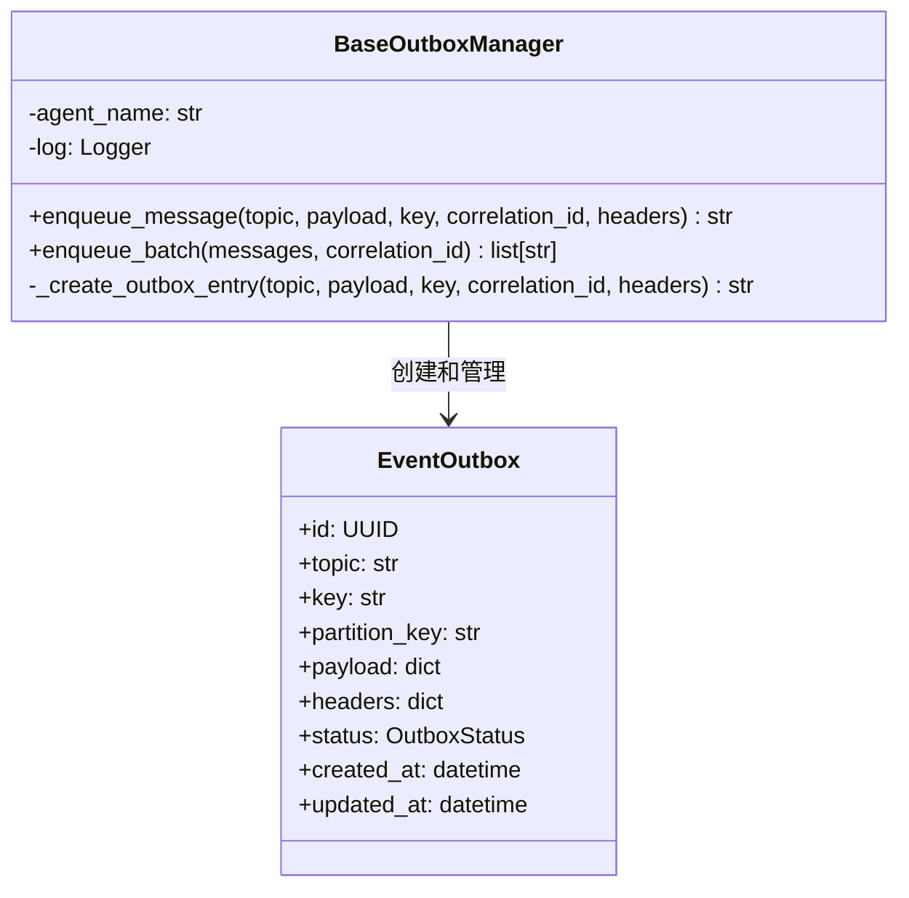
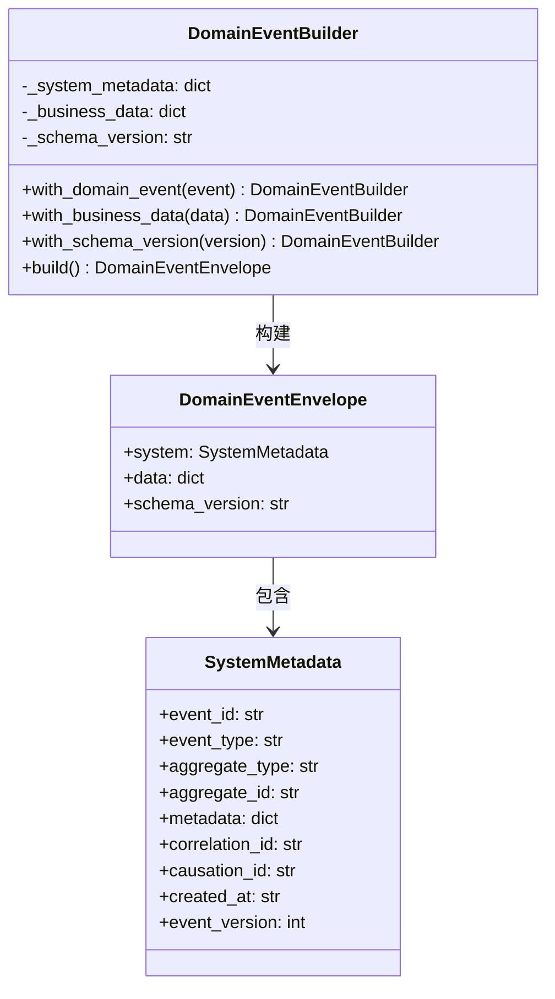
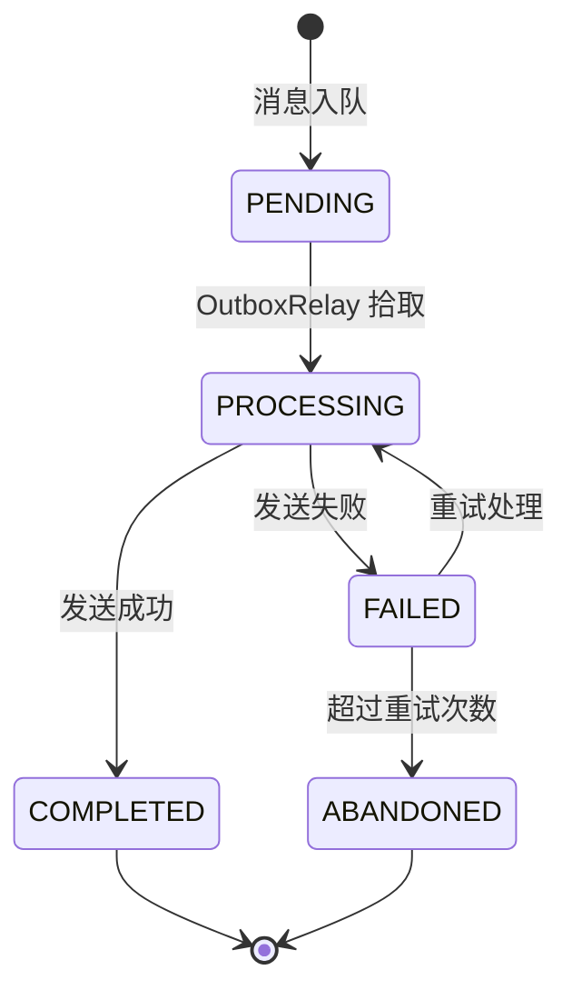
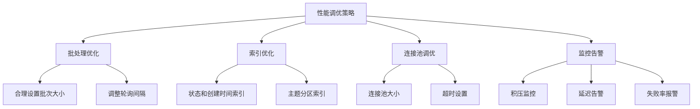
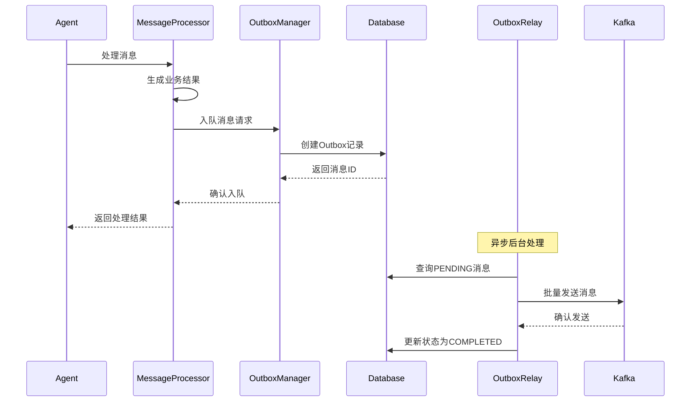

# Outbox 模式 - 可靠消息传递系统

## 🎯 概述

Outbox 模式是 InfiniteScribe 平台中确保可靠消息传递的核心组件。通过将消息持久化到数据库后再异步发送到 Kafka，解决了分布式系统中的消息丢失问题，提供了事务性消息传递保证。

## 🏗️ 架构设计

### 核心原理

Outbox 模式基于以下核心原理：

1. **本地事务**: 消息与业务数据在同一数据库事务中持久化
2. **异步传递**: 独立的 OutboxRelay 服务负责将消息发送到 Kafka
3. **幂等性**: 消息处理具有幂等性，支持重试而不产生副作用
4. **可靠性**: 即使 Kafka 不可用，消息也不会丢失

### 架构图



### 数据流程图



## 📁 目录结构

```
outbox/
├── __init__.py            # 模块导出
├── manager.py             # 基础 Outbox 管理器
├── payload.py             # 消息载荷封装工具
└── README.md              # 本文档
```

## 🚀 核心组件

### 1. BaseOutboxManager - 消息管理器

核心的消息持久化管理器，提供统一的入队接口：



#### 主要功能

1. **消息入队**: 将消息持久化到 EventOutbox 表
2. **批量处理**: 支持批量消息入队以提高性能
3. **元数据管理**: 自动添加代理名称、时间戳等元数据
4. **错误处理**: 完善的错误验证和日志记录

### 2. DomainEventEnvelope - 消息封装

标准化的消息载荷结构，分离系统元数据和业务数据：



#### 数据分离原则

- **系统元数据**: 包含事件追踪、关联等系统级信息
- **业务数据**: 纯业务逻辑相关的数据
- **版本控制**: 支持载荷结构的版本演进

## 🔧 使用指南

### 基础用法

#### 单条消息发送

```python
from src.common.outbox import BaseOutboxManager

# 初始化管理器
outbox_mgr = BaseOutboxManager("character-expert")

# 发送消息
outbox_id = await outbox_mgr.enqueue_message(
    topic="genesis.character.events",
    payload={
        "type": "Character.Created",
        "character_id": "char-123",
        "name": "Arthur",
        "traits": ["brave", "intelligent"]
    },
    key="session-456",  # 分区键，确保消息顺序
    correlation_id="req-789"  # 请求追踪
)

print(f"Message enqueued with ID: {outbox_id}")
```

#### 批量消息发送

```python
# 准备批量消息
messages = [
    {
        "topic": "genesis.character.events",
        "payload": {"type": "Character.Created", "character_id": "char-1"},
        "key": "session-1"
    },
    {
        "topic": "genesis.plot.events", 
        "payload": {"type": "Plot.Point.Added", "plot_id": "plot-1"},
        "key": "session-1"
    },
    {
        "topic": "genesis.world.events",
        "payload": {"type": "World.Location.Created", "location_id": "loc-1"},
        "key": "session-1"
    }
]

# 批量入队
outbox_ids = await outbox_mgr.enqueue_batch(
    messages=messages,
    correlation_id="batch-req-123"
)

print(f"Batch messages enqueued: {len(outbox_ids)}")
```

### 高级用法

#### 使用载荷构建器

```python
from src.common.messaging.domain_envelope import DomainEventBuilder
from src.models.event import DomainEvent

# 从领域事件构建载荷
domain_event = DomainEvent(
    event_type="Character.Generated",
    aggregate_type="Character",
    aggregate_id="char-123",
    payload={"name": "Arthur", "class": "Knight"},
    correlation_id="req-456"
)

# 使用构建器创建标准化载荷
envelope = (DomainEventBuilder
    .from_domain_event(domain_event)
    .with_schema_version("v2")
    .build())

# 发送结构化消息
await outbox_mgr.enqueue_message(
    topic="genesis.character.events",
    payload=envelope.model_dump(),
    key=domain_event.aggregate_id
)
```

#### 错误处理

```python
try:
    outbox_id = await outbox_mgr.enqueue_message(
        topic="invalid-topic",  # 可能无效的主题
        payload={"data": "test"}
    )
except ValueError as e:
    logger.error(f"Message validation failed: {e}")
except Exception as e:
    logger.error(f"Database operation failed: {e}")
    # 实现重试或降级策略
```

## 📊 数据模型

### EventOutbox 表结构

```sql
CREATE TABLE event_outbox (
    id UUID PRIMARY KEY DEFAULT gen_random_uuid(),
    topic VARCHAR(255) NOT NULL,
    key VARCHAR(255),
    partition_key VARCHAR(255),
    payload JSONB NOT NULL,
    headers JSONB,
    status VARCHAR(50) NOT NULL DEFAULT 'PENDING',
    created_at TIMESTAMP WITH TIME ZONE DEFAULT NOW(),
    updated_at TIMESTAMP WITH TIME ZONE DEFAULT NOW(),
    
    INDEX idx_outbox_status_created (status, created_at),
    INDEX idx_outbox_topic_created (topic, created_at)
);
```

### 状态流转



## 🔍 监控和运维

### 关键指标

1. **入队性能**: 每秒入队的消息数量
2. **处理延迟**: 消息从入队到发送的平均时间
3. **失败率**: 发送失败的消息比例
4. **积压量**: PENDING 状态的消息数量

### 监控查询

```sql
-- 查看待处理消息积压
SELECT 
    topic,
    status,
    COUNT(*) as count,
    AVG(EXTRACT(EPOCH FROM (NOW() - created_at))) as avg_age_seconds
FROM event_outbox 
WHERE status = 'PENDING'
GROUP BY topic, status
ORDER BY avg_age_seconds DESC;

-- 查询失败消息
SELECT 
    topic,
    status,
    COUNT(*) as failed_count,
    MAX(updated_at) as last_failure
FROM event_outbox 
WHERE status = 'FAILED'
GROUP BY topic, status;

-- 清理旧消息（已完成状态超过7天）
DELETE FROM event_outbox 
WHERE status = 'COMPLETED' 
AND updated_at < NOW() - INTERVAL '7 days';
```

### 日志监控

```python
# 关键日志事件
logger.info(
    "message_enqueued_to_outbox",
    extra={
        "agent": "character-expert",
        "outbox_id": outbox_id,
        "topic": "genesis.character.events",
        "key": "session-123",
        "correlation_id": "req-456"
    }
)

logger.warning(
    "message_enqueue_skipped",
    extra={
        "reason": "missing_topic",
        "agent": self.agent_name,
        "payload_keys": list(payload.keys())
    }
)
```

## 🔧 配置说明

### 环境变量

```bash
# OutboxRelay 配置
OUTBOX_RELAY_INTERVAL=5          # 轮询间隔（秒）
OUTBOX_BATCH_SIZE=100            # 批处理大小
OUTBOX_MAX_RETRIES=3             # 最大重试次数
OUTBOX_RETRY_DELAY=60            # 重试延迟（秒）

# 数据库配置
OUTBOX_DB_POOL_SIZE=20           # 连接池大小
OUTBOX_DB_MAX_OVERFLOW=30        # 最大溢出连接
```

### 性能调优



## 📋 最新更新 (2025-01-11)

### 🔧 统一Outbox模式实现

最近对 `manager.py` 进行了重要重构，实现了所有Agent的统一Outbox模式：

#### 🎯 核心改进

1. **统一接口**: 所有Agent现在使用相同的OutboxManager
2. **分区键支持**: 完善的分区键机制，确保消息顺序性
3. **批量处理**: 支持批量消息入队，提升性能
4. **事务安全**: 消息与业务数据在同一事务中持久化
5. **监控集成**: 详细的日志记录和指标收集

#### 🔧 关键技术特性

```python
# 分区键智能处理
key_value = result.pop("_key", None)
if not key_value:
    # 智能回退：使用session_id或user_id
    key_value = result.get("session_id") or result.get("user_id")

# 事务性消息入队
async def enqueue_message(self, topic: str, payload: dict, key: str = None) -> str:
    async with create_sql_session() as db:
        outbox_entry = EventOutbox(
            topic=topic,
            key=str(key) if key else None,
            partition_key=str(key) if key else None,
            payload=payload,
            status=OutboxStatus.PENDING
        )
        db.add(outbox_entry)
        await db.flush()
        return str(outbox_entry.id)
```

#### 📊 架构优势

1. **消息可靠性**: 数据库持久化确保消息不丢失
2. **系统解耦**: 发送方与Kafka解耦，提升系统可用性
3. **顺序保证**: 基于分区键的消息顺序性
4. **性能优化**: 批量处理和异步发送
5. **监控完善**: 全链路追踪和性能指标

#### 🔄 处理流程优化



这次重构实现了完整的Outbox模式统一，为所有Agent提供了可靠的消息传递能力，大大提升了系统的稳定性和数据一致性保证。

## 🔮 未来规划

### 功能增强

1. **消息路由**: 基于内容的智能消息路由
2. **优先级队列**: 支持消息优先级处理
3. **死信处理**: 完善的死信队列机制
4. **消息压缩**: 大消息的自动压缩存储

### 性能优化

1. **分片策略**: 基于主题的表分片
2. **缓存优化**: 热点数据的缓存机制
3. **连接复用**: 数据库连接的智能复用
4. **异步IO**: 全异步化的处理流程

### 运维增强

1. **自动扩容**: 基于负载的自动扩容
2. **故障恢复**: 自动故障检测和恢复
3. **数据迁移**: 零停机的数据迁移工具
4. **监控面板**: 可视化的运维监控面板

## 📝 最佳实践

### 1. 消息设计

- **幂等性**: 确保消息处理具有幂等性
- **大小控制**: 单个消息大小不超过1MB
- **版本兼容**: 使用schema_version支持向后兼容
- **追踪完整**: 包含完整的correlation_id链路

### 2. 性能优化

- **批量操作**: 尽可能使用批量入队
- **分区策略**: 合理设计分区键确保负载均衡
- **索引优化**: 为查询模式创建合适的索引
- **连接池**: 合理配置数据库连接池

### 3. 错误处理

- **重试策略**: 实现指数退避的重试机制
- **降级方案**: 准备好服务降级策略
- **监控告警**: 设置完善的监控和告警
- **日志记录**: 详细记录错误信息便于排查

## 🔗 相关模块

- **领域事件**: `src.models.event` - 领域事件模型
- **数据库**: `src.db.sql` - 数据库会话管理
- **消息处理**: `src.agents.message_processor` - 消息处理器
- **OutboxRelay**: `src.services.outbox_relay` - 消息中继服务
- **监控**: `src.core.metrics` - 指标收集系统

---

*此文档描述了 InfiniteScribe 平台中 Outbox 模式的实现和使用方法。通过可靠的消息持久化和异步传递机制，确保分布式系统中的数据一致性和消息可靠性。*