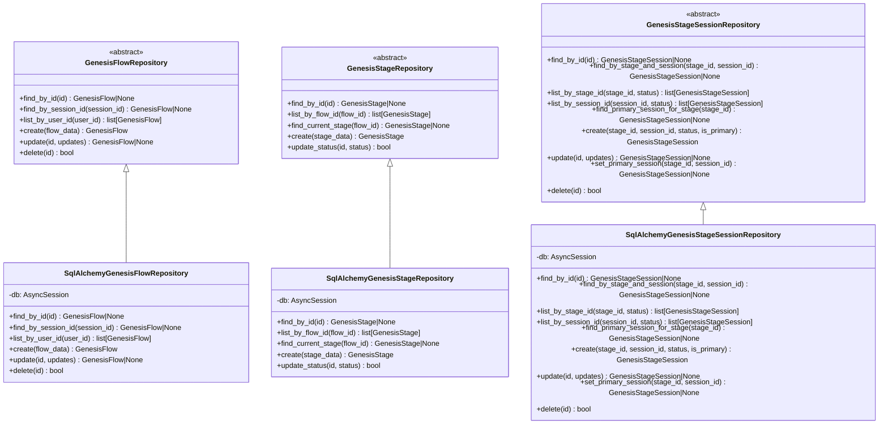
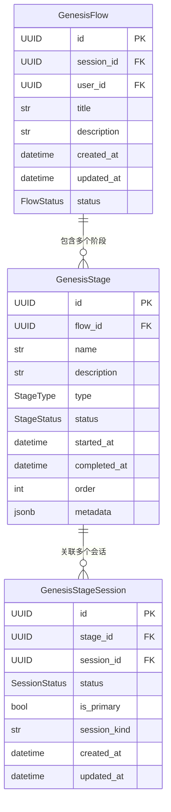
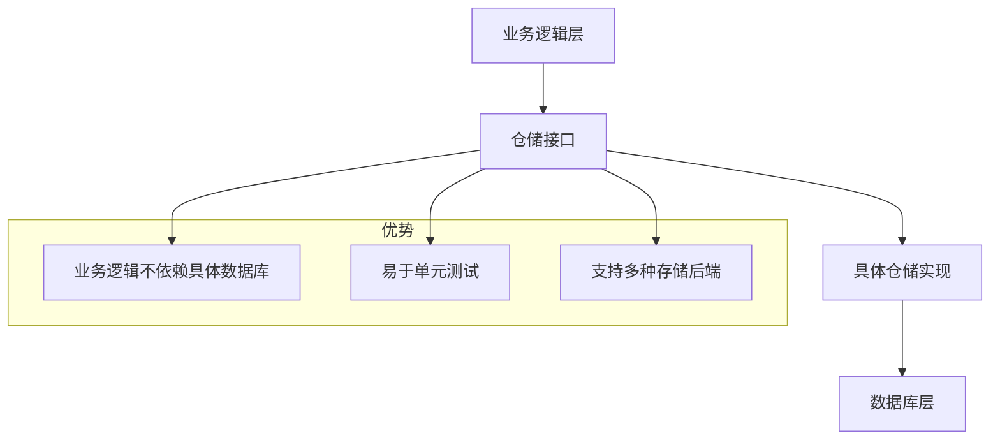
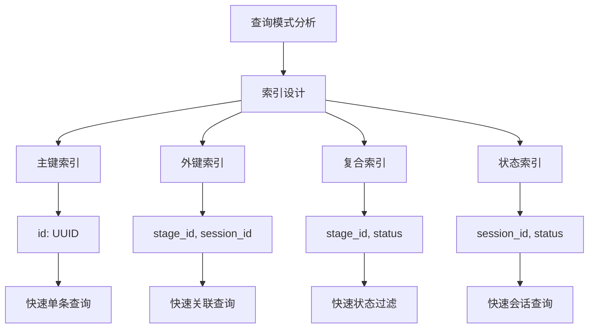

# Genesis 仓储模块

提供 Genesis 流程相关的数据访问层实现，采用仓储模式管理数据库操作。

## 🎯 核心功能

- **流程仓储**: 管理 GenesisFlow 实体的生命周期
- **阶段仓储**: 处理 GenesisStage 的 CRUD 操作
- **阶段会话关联**: 管理阶段与对话会话的多对多关系
- **数据持久化**: 提供异步数据库访问接口
- **业务逻辑封装**: 封装复杂的数据操作逻辑

## 📁 目录结构

```
genesis/
├── __init__.py                     # 模块初始化和导出
├── flow_repository.py              # GenesisFlow 数据访问
├── stage_repository.py             # GenesisStage 数据访问
└── stage_session_repository.py     # 阶段会话关联数据访问
```

## 🏗️ 架构设计

### 仓储模式架构



### 数据模型关系



## 🔧 核心组件

### GenesisStageSessionRepository

专门管理 Genesis 阶段与对话会话关联关系的仓储实现。

#### 核心功能
- **关联查询**: 按阶段ID或会话ID查找关联关系
- **状态管理**: 支持关联状态的动态更新
- **主会话管理**: 支持设置和查询主会话关联
- **分页查询**: 提供分页和排序功能

#### 主要接口
```python
@abstractmethod
async def find_by_stage_and_session(
    self, stage_id: UUID, session_id: UUID
) -> GenesisStageSession | None:
    """根据阶段ID和会话ID查找关联"""

@abstractmethod
async def list_by_stage_id(
    self, stage_id: UUID, status: StageSessionStatus | None = None
) -> list[GenesisStageSession]:
    """按阶段ID列出关联，支持状态过滤"""

@abstractmethod
async def find_primary_session_for_stage(
    self, stage_id: UUID
) -> GenesisStageSession | None:
    """查找阶段的主会话关联"""

@abstractmethod
async def set_primary_session(
    self, stage_id: UUID, session_id: UUID
) -> GenesisStageSession | None:
    """设置指定会话为阶段的主会话"""
```

### 查询优化

#### 条件构建
```python
async def list_by_stage_id(
    self,
    stage_id: UUID,
    status: StageSessionStatus | None = None,
    limit: int = 50,
    offset: int = 0,
) -> list[GenesisStageSession]:
    """按阶段ID列出关联，支持状态过滤和分页"""
    query = select(GenesisStageSession).where(GenesisStageSession.stage_id == stage_id)
    
    # 动态添加状态过滤
    if status is not None:
        query = query.where(GenesisStageSession.status == status)
    
    # 添加排序和分页
    query = query.order_by(GenesisStageSession.created_at.desc()).offset(offset).limit(limit)
    
    result = await self.db.execute(query)
    return list(result.scalars().all())
```

#### 批量更新操作
```python
async def set_primary_session(self, stage_id: UUID, session_id: UUID) -> GenesisStageSession | None:
    """设置主会话，先清除所有主会话标记"""
    # 原子性操作：先清除所有主会话标记
    await self.db.execute(
        sql_update(GenesisStageSession)
        .where(GenesisStageSession.stage_id == stage_id)
        .values(is_primary=False)
    )
    
    # 然后设置新的主会话
    result = await self.db.execute(
        sql_update(GenesisStageSession)
        .where(
            and_(
                GenesisStageSession.stage_id == stage_id,
                GenesisStageSession.session_id == session_id,
            )
        )
        .values(is_primary=True)
        .returning(GenesisStageSession)
    )
    
    return result.scalar_one_or_none()
```

## 🚀 使用示例

### 基本查询操作
```python
from src.common.repositories.genesis import SqlAlchemyGenesisStageSessionRepository
from src.schemas.enums import StageSessionStatus

async with create_sql_session() as db:
    repo = SqlAlchemyGenesisStageSessionRepository(db)
    
    # 查找特定关联
    association = await repo.find_by_stage_and_session(stage_id, session_id)
    
    # 列出阶段的所有关联会话
    sessions = await repo.list_by_stage_id(
        stage_id=stage_id,
        status=StageSessionStatus.ACTIVE,
        limit=100
    )
    
    # 查找主会话
    primary_session = await repo.find_primary_session_for_stage(stage_id)
```

### 创建和更新关联
```python
# 创建新的阶段会话关联
association = await repo.create(
    stage_id=stage_id,
    session_id=session_id,
    status=StageSessionStatus.ACTIVE,
    is_primary=False,
    session_kind="genesis_character"
)

# 更新关联状态
updated = await repo.update(
    association_id=association.id,
    status=StageSessionStatus.COMPLETED,
    is_primary=True
)

# 设置主会话
primary = await repo.set_primary_session(stage_id, session_id)
```

### 复杂查询场景
```python
# 获取阶段的所有活跃会话
active_sessions = await repo.list_by_stage_id(
    stage_id=stage_id,
    status=StageSessionStatus.ACTIVE
)

# 获取会话参与的所有阶段
stages_for_session = await repo.list_by_session_id(
    session_id=session_id,
    limit=50
)

# 检查会话是否为某阶段的主会话
is_primary = await repo.find_by_stage_and_session(stage_id, session_id)
is_primary_association = is_primary and is_primary.is_primary
```

## 🔍 设计模式

### 仓储模式优势

#### 1. 关注点分离


#### 2. 依赖倒置
```python
# 业务逻辑依赖抽象接口，不依赖具体实现
class GenesisFlowService:
    def __init__(self, flow_repo: GenesisFlowRepository):
        self.flow_repo = flow_repo  # 依赖注入
    
    async def get_flow_by_session(self, session_id: UUID):
        return await self.flow_repo.find_by_session_id(session_id)

# 可以轻松替换实现
sql_repo = SqlAlchemyGenesisFlowRepository(db)
memory_repo = InMemoryGenesisFlowRepository()  # 测试用
service = GenesisFlowService(sql_repo)
```

## 🧪 测试策略

### 单元测试
```python
import pytest
from unittest.mock import AsyncMock, MagicMock
from src.common.repositories.genesis import GenesisStageSessionRepository

class TestGenesisStageSessionRepository:
    @pytest.fixture
    def mock_db(self):
        db = AsyncMock()
        db.scalar = AsyncMock()
        db.execute = AsyncMock()
        db.add = MagicMock()
        db.delete = MagicMock()
        return db
    
    @pytest.fixture
    def repository(self, mock_db):
        return SqlAlchemyGenesisStageSessionRepository(mock_db)
    
    async def test_find_by_stage_and_session(self, repository, mock_db):
        """测试按阶段和会话查找关联"""
        stage_id = UUID('12345678-1234-5678-9012-123456789012')
        session_id = UUID('87654321-4321-8765-2109-876543210987')
        
        expected_association = GenesisStageSession(
            stage_id=stage_id,
            session_id=session_id,
            status=StageSessionStatus.ACTIVE
        )
        mock_db.scalar.return_value = expected_association
        
        result = await repository.find_by_stage_and_session(stage_id, session_id)
        
        assert result == expected_association
        mock_db.scalar.assert_called_once()
    
    async def test_create_association(self, repository, mock_db):
        """测试创建关联"""
        stage_id = UUID('12345678-1234-5678-9012-123456789012')
        session_id = UUID('87654321-4321-8765-2109-876543210987')
        
        # Mock flush and refresh
        mock_db.flush = AsyncMock()
        mock_db.refresh = AsyncMock()
        
        association = await repository.create(
            stage_id=stage_id,
            session_id=session_id,
            status=StageSessionStatus.ACTIVE
        )
        
        assert association.stage_id == stage_id
        assert association.session_id == session_id
        mock_db.add.assert_called_once()
        mock_db.flush.assert_called_once()
        mock_db.refresh.assert_called_once()
```

### 集成测试
```python
import pytest
from sqlalchemy.ext.asyncio import AsyncSession, create_async_engine
from sqlalchemy.orm import sessionmaker

@pytest.fixture
async def test_db():
    """创建测试数据库"""
    engine = create_async_engine("sqlite+aiosqlite:///:memory:")
    async_session = sessionmaker(engine, class_=AsyncSession)
    
    # 创建表结构
    async with engine.begin() as conn:
        await conn.run_sync(Base.metadata.create_all)
    
    yield async_session
    
    # 清理
    await engine.dispose()

async def test_repository_integration(test_db):
    """测试仓储与数据库的集成"""
    async with test_db() as session:
        repo = SqlAlchemyGenesisStageSessionRepository(session)
        
        # 创建测试数据
        stage = GenesisStage(name="Test Stage")
        session.add(stage)
        await session.flush()
        
        session_obj = DialogueSession(session_id=UUID.uuid4())
        session.add(session_obj)
        await session.flush()
        
        # 测试创建关联
        association = await repo.create(
            stage_id=stage.id,
            session_id=session_obj.id,
            status=StageSessionStatus.ACTIVE
        )
        
        assert association.id is not None
        
        # 测试查询
        found = await repo.find_by_stage_and_session(stage.id, session_obj.id)
        assert found is not None
        assert found.id == association.id
```

## 🔧 性能优化

### 查询优化

#### 1. 索引策略


#### 2. 分页优化
```python
async def list_by_stage_id_optimized(
    self,
    stage_id: UUID,
    status: StageSessionStatus | None = None,
    limit: int = 50,
    offset: int = 0,
) -> list[GenesisStageSession]:
    """优化后的分页查询"""
    # 使用游标分页替代offset（对大数据集更高效）
    query = select(GenesisStageSession).where(
        GenesisStageSession.stage_id == stage_id
    )
    
    if status is not None:
        query = query.where(GenesisStageSession.status == status)
    
    # 使用游标分页
    if offset > 0:
        query = query.where(GenesisStageSession.id > offset)
    
    query = query.order_by(GenesisStageSession.id).limit(limit)
    
    result = await self.db.execute(query)
    return list(result.scalars().all())
```

### 缓存策略

```python
from functools import lru_cache
from typing import Optional

class CachedGenesisStageSessionRepository(SqlAlchemyGenesisStageSessionRepository):
    """带缓存的仓储实现"""
    
    @lru_cache(maxsize=1000)
    async def find_by_stage_and_session_cached(
        self, stage_id: UUID, session_id: UUID
    ) -> Optional[GenesisStageSession]:
        """缓存查找结果"""
        return await self.find_by_stage_and_session(stage_id, session_id)
    
    async def create(self, *args, **kwargs):
        """创建后清除相关缓存"""
        result = await super().create(*args, **kwargs)
        # 清除可能相关的缓存
        self.find_by_stage_and_session_cached.cache_clear()
        return result
```

## 🔗 相关模块

- **数据模型**: `src.models.genesis_flows` - Genesis 流程数据模型
- **枚举定义**: `src.schemas.enums` - 状态和类型枚举
- **会话模型**: `src.models.dialogue` - 对话会话模型
- **数据库**: `src.db.sql.session` - 数据库会话管理
- **业务服务**: `src.services.genesis` - Genesis 业务逻辑

## 📝 最佳实践

### 1. 事务管理
```python
# 推荐：在事务中执行多个操作
async with create_sql_session() as db:
    repo = SqlAlchemyGenesisStageSessionRepository(db)
    
    try:
        # 创建关联
        association = await repo.create(stage_id, session_id)
        
        # 设置为主会话
        await repo.set_primary_session(stage_id, session_id)
        
        await db.commit()  # 提交事务
    except Exception:
        await db.rollback()  # 回滚事务
        raise
```

### 2. 错误处理
```python
# 推荐：处理可能的None返回
async def safe_get_primary_session(stage_id: UUID):
    association = await repo.find_primary_session_for_stage(stage_id)
    if association is None:
        # 处理没有主会话的情况
        return await create_default_primary_session(stage_id)
    return association
```

### 3. 批量操作
```python
# 推荐：批量处理时考虑性能
async def batch_create_associations(stage_id: UUID, session_ids: list[UUID]):
    """批量创建关联"""
    associations = []
    for session_id in session_ids:
        association = await repo.create(stage_id, session_id)
        associations.append(association)
    
    # 批量刷新
    await repo.db.flush()
    return associations
```

### 4. 查询优化
```python
# 推荐：只查询需要的字段
async def get_session_kinds_for_stage(stage_id: UUID):
    """只获取会话类型，避免加载完整对象"""
    result = await repo.db.execute(
        select(GenesisStageSession.session_kind)
        .where(GenesisStageSession.stage_id == stage_id)
        .distinct()
    )
    return [row[0] for row in result.fetchall()]
```

这个 Genesis 仓储模块为系统提供了完整的数据访问层抽象，确保了业务逻辑与数据存储的解耦，同时提供了优秀的可测试性和可维护性。