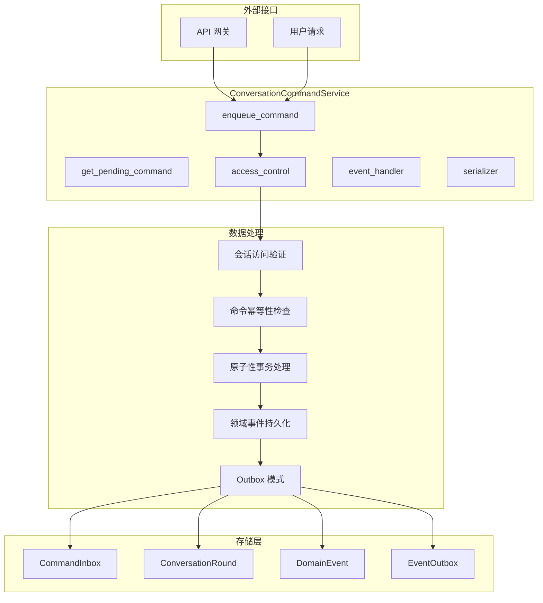
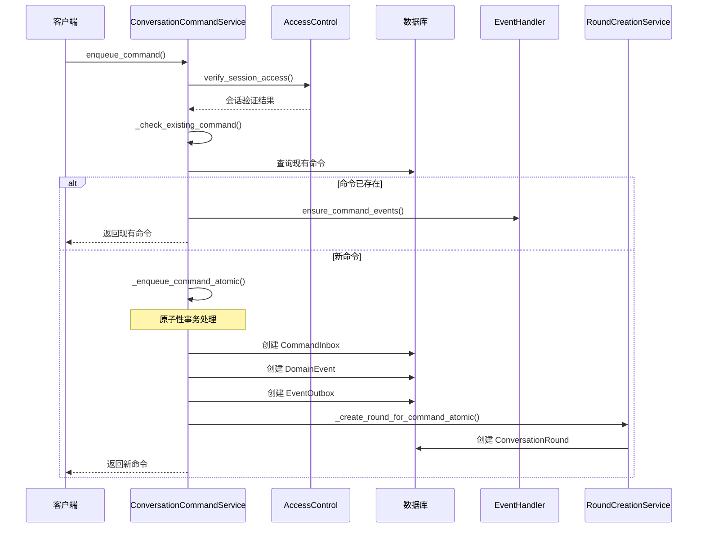
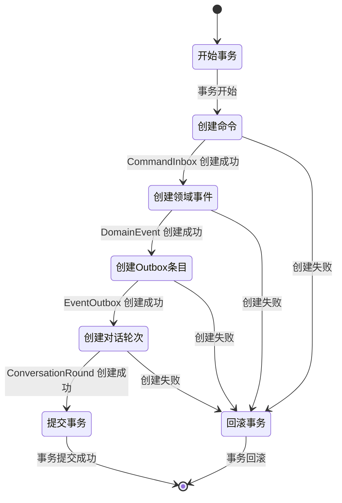
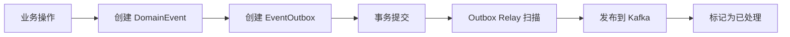
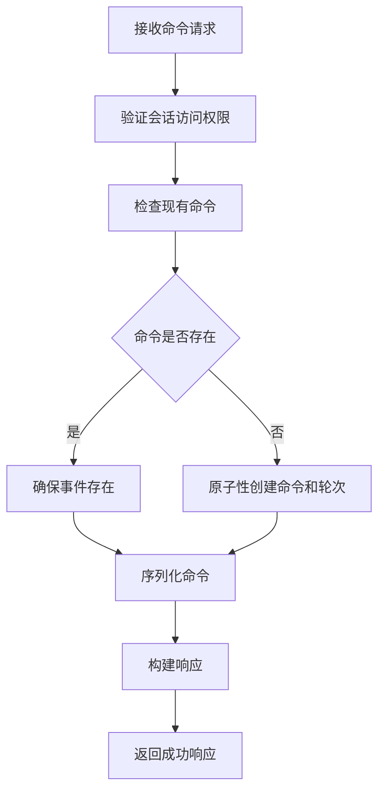
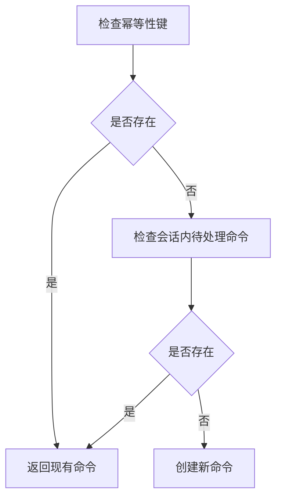
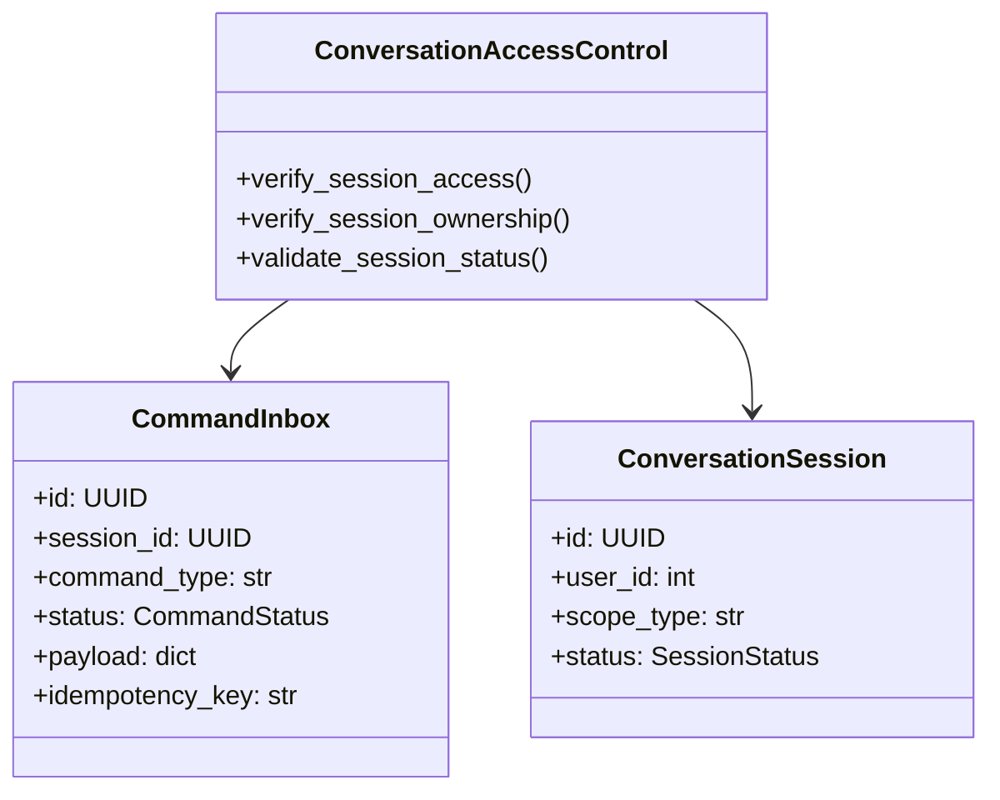
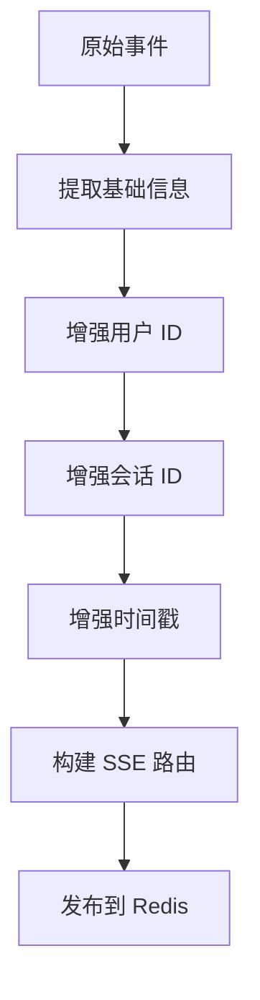
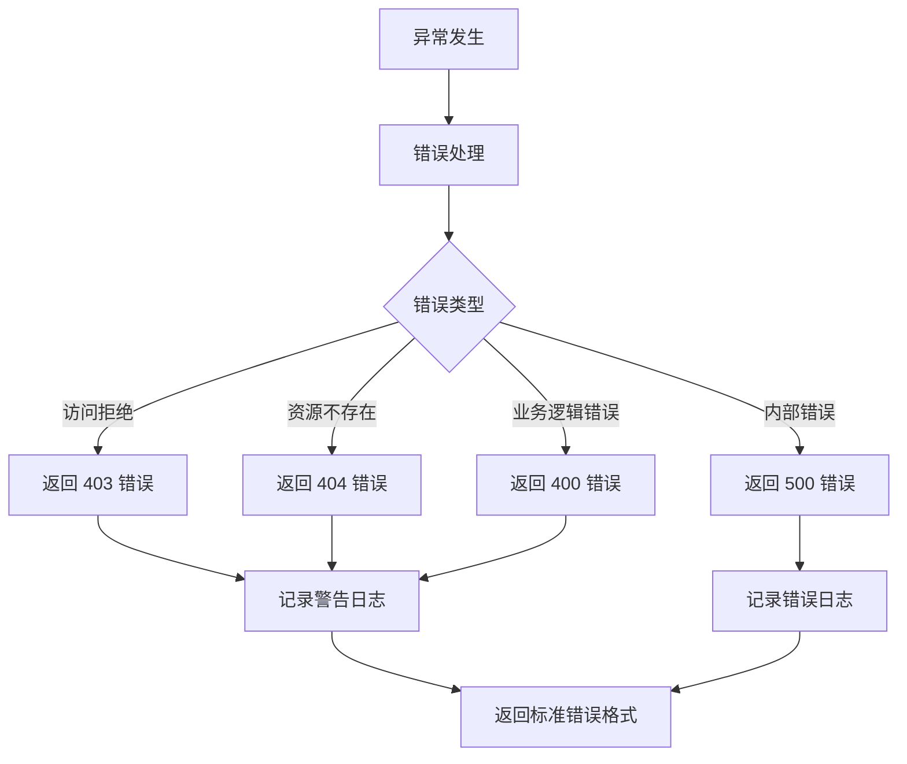

# 对话服务 (Conversation Service)

提供完整的对话管理功能，包括命令处理、会话控制、事件处理和错误处理，采用 Outbox 模式确保数据一致性。

## 🏗️ 架构概览

### 核心职责

- **命令管理**：基于 Outbox 模式的命令入队和幂等性处理
- **会话控制**：访问权限验证和会话生命周期管理
- **事件处理**：领域事件的持久化和 SSE 路由
- **错误处理**：统一的错误处理和用户友好响应

### 架构图



## 📁 目录结构

```
conversation/
├── __init__.py                           # 服务导出和注册
├── conversation_access_control.py       # 会话访问控制
├── conversation_command_service.py      # 命令服务（主要变更）
├── conversation_error_handler.py         # 统一错误处理
├── conversation_event_handler.py        # 事件处理器（主要变更）
├── conversation_round_creation_service.py # 对话轮次创建
├── conversation_round_query_service.py   # 对话轮次查询
├── conversation_round_service.py         # 对话轮次管理
├── conversation_serializers.py          # 序列化器
├── conversation_service.py              # 对话服务
└── conversation_session_service.py        # 会话服务
├── cache/                               # 缓存相关
│   ├── __init__.py
│   ├── cache_manager.py
│   ├── round_cache.py
│   └── session_cache.py
└── session/                             # 会话操作
    ├── __init__.py
    ├── access_operations.py
    ├── cache_operations.py
    ├── create_handler.py
    ├── crud_handler.py
    ├── read_handler.py
    ├── update_delete_handler.py
    └── validator.py
```

## 🎯 核心组件

### ConversationCommandService

命令服务的核心实现，采用 Outbox 模式和原子性事务处理：



### 原子性命令处理

确保命令和对话轮次在同一事务中创建：



### Outbox 模式实现

通过 EventOutbox 确保事件可靠投递：



## 🔧 核心功能

### 1. 命令入队 (enqueue_command)



### 2. 幂等性保护



### 3. 会话访问控制



### 4. 事件处理增强

支持用户 ID 和时间戳的增强路由：



## 🚀 使用示例

### 基础命令入队

```python
# 创建命令服务
command_service = ConversationCommandService()

# 入队命令
result = await command_service.enqueue_command(
    db=db_session,
    user_id=123,
    session_id=UUID("550e8400-e29b-41d4-a716-446655440000"),
    command_type="Character.Design.Requested",
    payload={"character_name": "主角", "description": "勇敢的战士"},
    idempotency_key="cmd-unique-key"
)

if result["success"]:
    command = result["command"]
    print(f"命令已创建: {command.id}")
```

### 获取待处理命令

```python
# 获取当前待处理命令
pending = await command_service.get_pending_command(
    db=db_session,
    user_id=123,
    session_id=UUID("550e8400-e29b-41d4-a716-446655440000")
)

if pending["success"]:
    command_data = pending["command"]
    if command_data["command_id"]:
        print(f"待处理命令: {command_data['command_type']}")
```

### 自定义访问控制

```python
class CustomAccessControl(ConversationAccessControl):
    async def verify_session_access(self, db, user_id, session_id):
        # 自定义访问控制逻辑
        result = await super().verify_session_access(db, user_id, session_id)
        if result["success"]:
            # 添加额外的验证逻辑
            session = result["session"]
            if not self._validate_session_permissions(session):
                return self._access_denied("权限不足")
        return result
```

## 📊 错误处理策略

### 统一错误响应



### 错误响应格式

```json
{
  "success": false,
  "error": {
    "code": "ACCESS_DENIED",
    "message": "用户会话访问被拒绝",
    "context": {
      "session_id": "550e8400-e29b-41d4-a716-446655440000",
      "user_id": 123
    }
  }
}
```

## 🔍 关键变更点

### 1. 命令服务增强 (conversation_command_service.py)

- **原子性事务处理**：命令和对话轮次在同一事务中创建
- **幂等性保护**：增强的重复命令检测机制
- **事件路由增强**：支持用户 ID 和时间戳的 SSE 路由
- **错误处理**：更完善的错误处理和日志记录

### 2. 事件处理器优化 (conversation_event_handler.py)

- **事件确保机制**：为现有命令确保事件存在
- **上下文传播**：用户 ID 和时间戳的向下传播
- **幂等性操作**：事件创建的幂等性保护

## 📝 最佳实践

### 1. 事务管理

```python
# 使用事务装饰器确保数据一致性
@transactional
async def create_command_with_round(db, session_id, command_type, payload):
    # 所有操作在同一事务中执行
    command = CommandInbox(...)
    round = ConversationRound(...)
    db.add(command)
    db.add(round)
    # 事务自动提交或回滚
```

### 2. 错误恢复

```python
# 实现重试机制
async def enqueue_with_retry(service, max_retries=3):
    for attempt in range(max_retries):
        try:
            return await service.enqueue_command(...)
        except Exception as e:
            if attempt == max_retries - 1:
                raise
            await asyncio.sleep(2 ** attempt)
```

### 3. 监控指标

- **命令处理时间**：跟踪命令从创建到完成的耗时
- **事务成功率**：监控原子性操作的成功率
- **幂等性命中率**：统计重复命令的检测率
- **错误率**：按错误类型分类统计

## 🔗 相关模块

- **访问控制**：`ConversationAccessControl` - 会话权限验证
- **事件处理**：`ConversationEventHandler` - 事件持久化
- **序列化**：`ConversationSerializer` - 命令序列化
- **错误处理**：`ConversationErrorHandler` - 统一错误处理
- **轮次管理**：`ConversationRoundCreationService` - 对话轮次创建

## ⚠️ 注意事项

1. **事务边界**：确保所有相关操作在同一事务中执行
2. **幂等性键**：为每个命令提供唯一的幂等性键
3. **错误恢复**：实现适当的重试和错误恢复机制
4. **性能考虑**：批量处理和缓存优化以提高性能
5. **监控告警**：设置关键指标监控和异常告警