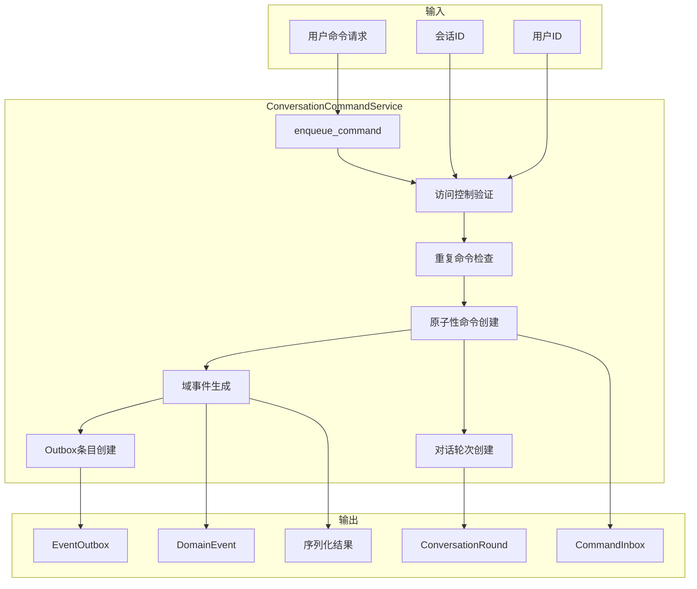
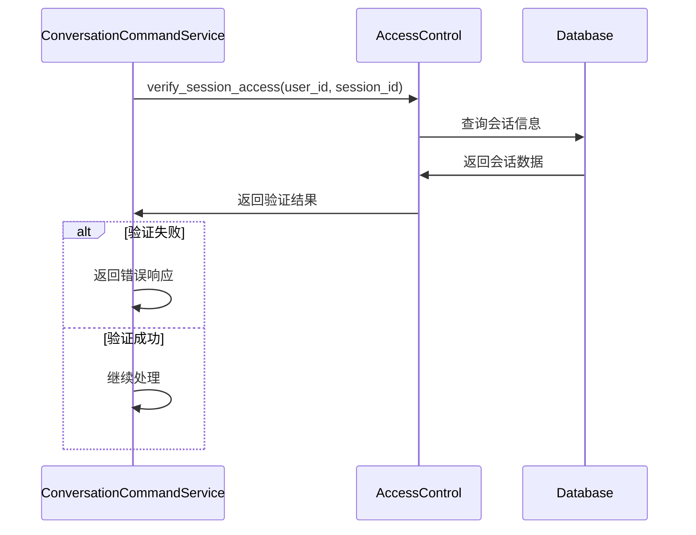
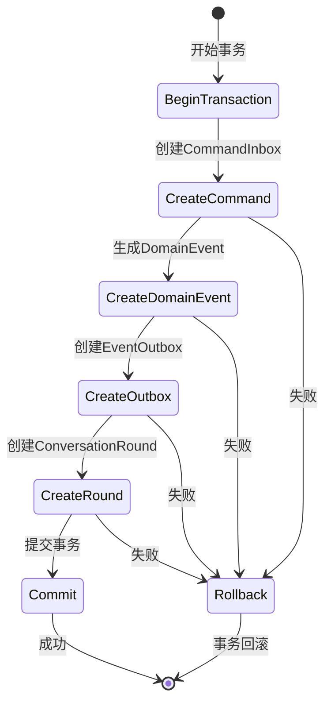
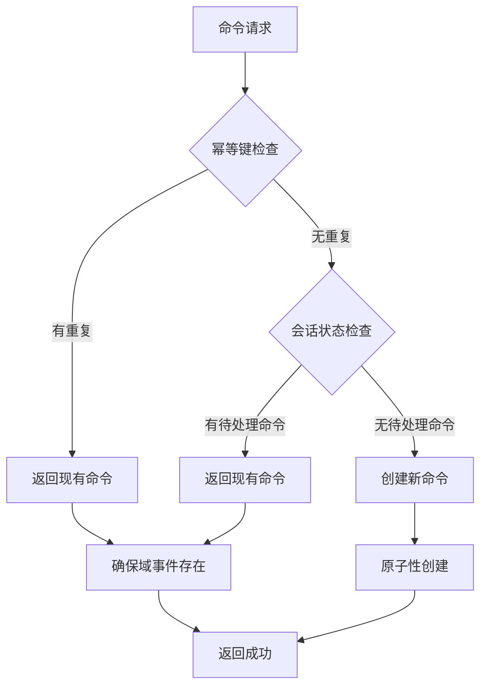
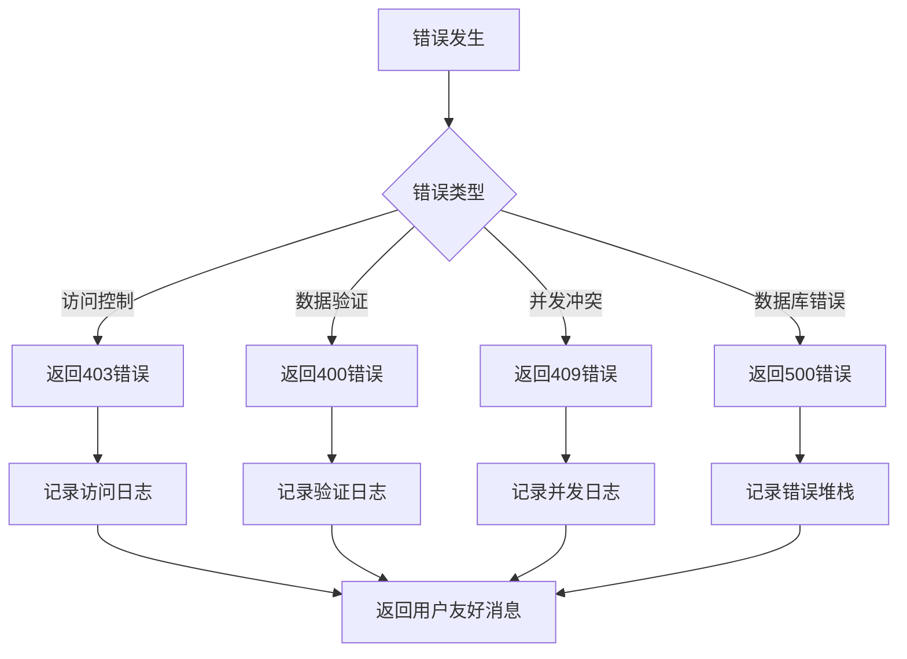

# 对话命令服务 (Conversation Command Service)

负责处理对话相关的命令操作，实现命令的可靠排队、域事件生成和异步处理模式。

## 🏗️ 架构概览

### 核心功能

对话命令服务实现了完整的命令处理流水线，包含以下核心功能：

- **命令排队**：采用 Outbox 模式确保命令的可靠传递
- **域事件生成**：为每个命令生成对应的域事件
- **幂等性保护**：防止重复命令处理
- **原子性操作**：命令、域事件和对话轮次的原子性创建
- **序列化支持**：可选的命令序列化功能

### 架构图



## 📁 核心组件

### ConversationCommandService

主服务类，协调整个命令处理流程：

```python
class ConversationCommandService:
    async def enqueue_command(
        self,
        db: AsyncSession,
        user_id: int,
        session_id: UUID,
        *,
        command_type: str,
        payload: dict[str, Any] | None,
        idempotency_key: str | None = None,
    ) -> dict[str, Any]:
```

### 关键处理流程

#### 1. 访问控制验证



#### 2. 幂等性检查

```python
# 检查重复命令的优先级
if idempotency_key:
    # 1. 优先通过幂等键查找
    existing_cmd = await db.scalar(
        select(CommandInbox).where(
            CommandInbox.idempotency_key == idempotency_key
        )
    )
    
# 2. 检查会话内的待处理命令
existing_cmd = await db.scalar(
    select(CommandInbox).where(
        CommandInbox.session_id == session_id,
        CommandInbox.status.in_([CommandStatus.RECEIVED, CommandStatus.PROCESSING]),
    )
)
```

#### 3. 原子性命令创建



## 🔧 关键特性

### 1. Outbox 模式实现

使用 Outbox 模式确保域事件的可靠传递：

```python
# 1. 创建域事件
dom_evt = DomainEvent(
    event_type=event_type,
    aggregate_type=aggregate_type,
    aggregate_id=str(session.id),
    payload=enriched_payload,
    correlation_id=cmd.id,
)

# 2. 创建 Outbox 条目
out = EventOutbox(
    id=dom_evt.event_id,  # 使用域事件ID作为Outbox ID
    topic=topic,
    key=str(session.id),
    payload=outbox_payload,
    status=OutboxStatus.PENDING,
)
```

### 2. 原子性保证

通过事务确保多个操作的原子性：

```python
async with transactional(db):
    # 在单个事务中创建：
    # 1. CommandInbox - 命令记录
    # 2. DomainEvent - 域事件
    # 3. EventOutbox - 事件出箱
    # 4. ConversationRound - 对话轮次
    
    cmd = CommandInbox(...)
    dom_evt = DomainEvent(...)
    out = EventOutbox(...)
    round_obj = ConversationRound(...)
    
    db.add_all([cmd, dom_evt, out, round_obj])
    await db.flush()  # 确保所有对象获得ID
```

### 3. 幂等性保护

多层幂等性保护机制：



## 🚀 使用示例

### 基本命令提交

```python
# 创建服务实例
command_service = ConversationCommandService()

# 提交命令
result = await command_service.enqueue_command(
    db=db,
    user_id=123,
    session_id=uuid.uuid4(),
    command_type="CHARACTER_REQUEST",
    payload={
        "user_input": "创建一个勇敢的主角",
        "preferences": {"genre": "fantasy"},
    },
    idempotency_key=f"cmd-{uuid.uuid4()}",
)

if result["success"]:
    command = result["command"]
    print(f"命令已创建: {command.id}")
else:
    print(f"命令创建失败: {result['error']}")
```

### 获取待处理命令

```python
# 查询会话的待处理命令
result = await command_service.get_pending_command(
    db=db,
    user_id=123,
    session_id=session_id,
)

if result["success"]:
    command_data = result["command"]
    if command_data["command_id"]:
        print(f"待处理命令: {command_data['command_type']}")
    else:
        print("无待处理命令")
```

## 📊 错误处理

### 错误类型

1. **访问控制错误**：用户无权访问指定会话
2. **数据验证错误**：命令格式或数据无效
3. **并发冲突**：多个请求同时创建命令
4. **数据库错误**：持久化操作失败

### 错误处理策略



## 🔍 监控和调试

### 关键日志点

- **命令接收**：`command_received` - 记录命令基本信息
- **访问验证**：`access_verification` - 访问控制结果
- **幂等检查**：`idempotency_check` - 重复命令检测结果
- **命令创建**：`command_created` - 新命令创建成功
- **事件生成**：`event_generated` - 域事件生成成功
- **轮次创建**：`round_created` - 对话轮次创建成功

### 性能指标

- **命令处理延迟**：从接收到完成的处理时间
- **数据库事务时间**：原子性操作的执行时间
- **幂等检查命中率**：重复命令的检测率
- **错误率**：各类错误的发生频率

## 🔗 相关模块

- **访问控制**：`ConversationAccessControl` - 会话访问权限验证
- **错误处理**：`ConversationErrorHandler` - 统一错误处理
- **事件处理**：`ConversationEventHandler` - 域事件管理
- **序列化**：`ConversationSerializer` - 命令序列化
- **轮次创建**：`ConversationRoundCreationService` - 对话轮次管理

## 📝 最佳实践

1. **幂等键生成**：使用足够随机的幂等键避免冲突
2. **事务范围**：保持事务简短，避免长时间锁定
3. **错误恢复**：实现适当的重试机制
4. **监控覆盖**：确保关键路径都有日志记录
5. **性能优化**：批量处理和缓存常用数据