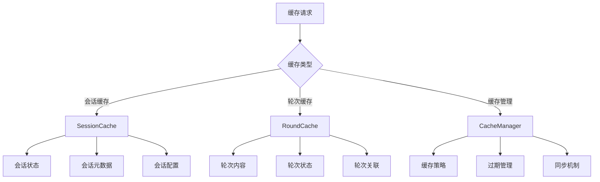
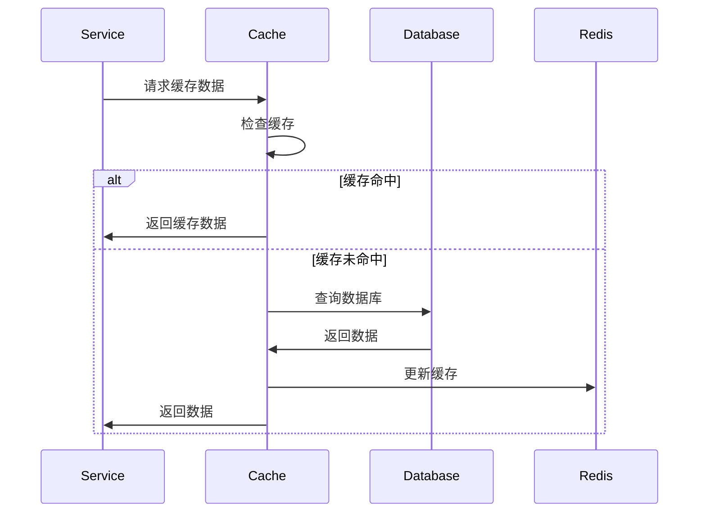

# Conversation Cache Module

## 概述

Conversation Cache 模块提供会话数据的高效缓存管理，支持会话、轮次等关键数据的快速访问和状态同步。

## 核心功能

### 主要组件

- **会话缓存**：管理会话级别数据的缓存
- **轮次缓存**：管理对话轮次数据的缓存
- **缓存同步**：确保缓存与数据库的一致性

### 缓存策略



## 文件说明

### `session_cache.py`

**会话缓存管理器**，负责：

- **会话数据缓存**：缓存会话的基本信息、状态、配置等
- **缓存操作**：提供 get、set、delete、exists 等基本操作
- **缓存同步**：确保缓存与数据库数据的一致性
- **性能优化**：通过缓存减少数据库访问

#### 核心方法

```python
class SessionCache:
    async def get_session(self, session_id: UUID) -> SessionData | None
    async def set_session(self, session_id: UUID, data: SessionData) -> None
    async def delete_session(self, session_id: UUID) -> None
    async def exists_session(self, session_id: UUID) -> bool
```

### `round_cache.py`

**轮次缓存管理器**，提供：

- **轮次数据缓存**：缓存对话轮次的内容、状态等
- **批量操作**：支持批量获取和设置轮次数据
- **关联查询**：缓存轮次之间的关联关系

### `cache_manager.py`

**统一缓存管理器**，负责：

- **缓存策略管理**：统一的缓存策略配置
- **缓存生命周期**：缓存创建、更新、过期管理
- **性能监控**：缓存命中率和性能统计

## 数据流程



## 配置说明

### 缓存配置

```python
# 缓存配置示例
CACHE_CONFIG = {
    "session_ttl": 3600,  # 会话缓存过期时间（秒）
    "round_ttl": 1800,    # 轮次缓存过期时间（秒）
    "max_size": 10000,    # 最大缓存条目数
    "eviction_policy": "lru",  # 淘汰策略
}
```

### Redis 连接

```python
# Redis 配置
REDIS_CONFIG = {
    "host": "localhost",
    "port": 6379,
    "db": 0,
    "password": None,
    "decode_responses": True,
}
```

## 错误处理

### 常见错误类型

- **连接错误**：Redis 连接失败
- **序列化错误**：数据序列化/反序列化失败
- **缓存错误**：缓存操作失败
- **同步错误**：缓存与数据库同步失败

### 错误处理策略

```python
try:
    # 缓存操作
    result = await cache.get_session(session_id)
except RedisConnectionError:
    # 降级到数据库查询
    result = await db.get_session(session_id)
except Exception as e:
    # 记录错误日志
    logger.error(f"Cache operation failed: {e}")
    raise
```

## 性能优化

### 缓存策略

- **分层缓存**：热点数据在内存缓存，冷数据在 Redis
- **预加载**：预加载相关数据到缓存
- **批量操作**：减少网络请求次数
- **惰性加载**：按需加载数据

### 监控指标

- **缓存命中率**：衡量缓存效果
- **平均响应时间**：缓存操作性能
- **内存使用**：缓存内存占用
- **错误率**：缓存操作失败率

## 开发指南

### 添加新的缓存类型

1. 创建对应的缓存管理器类
2. 实现必要的缓存操作方法
3. 添加到统一缓存管理器
4. 编写测试用例
5. 更新配置和文档

### 缓存键设计

- 使用清晰的命名规则
- 包含必要的上下文信息
- 避免键冲突
- 支持批量操作

### 缓存更新策略

- **写穿透**：更新数据库同时更新缓存
- **写回**：先更新缓存，异步更新数据库
- **失效**：删除缓存，下次重新加载

---

*该模块为会话系统提供高性能的缓存支持，确保系统在高并发场景下的稳定性和响应速度。*