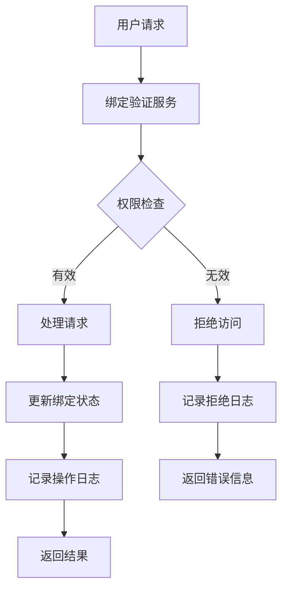
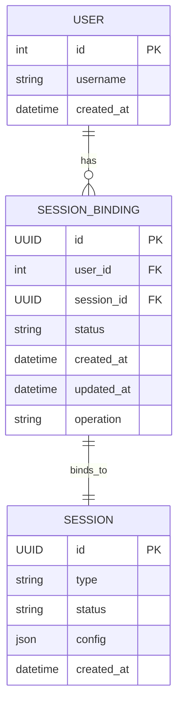
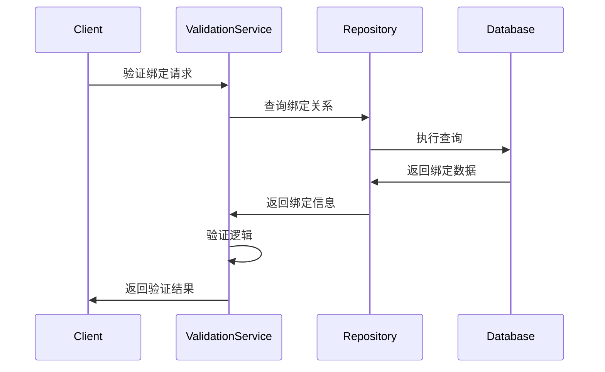
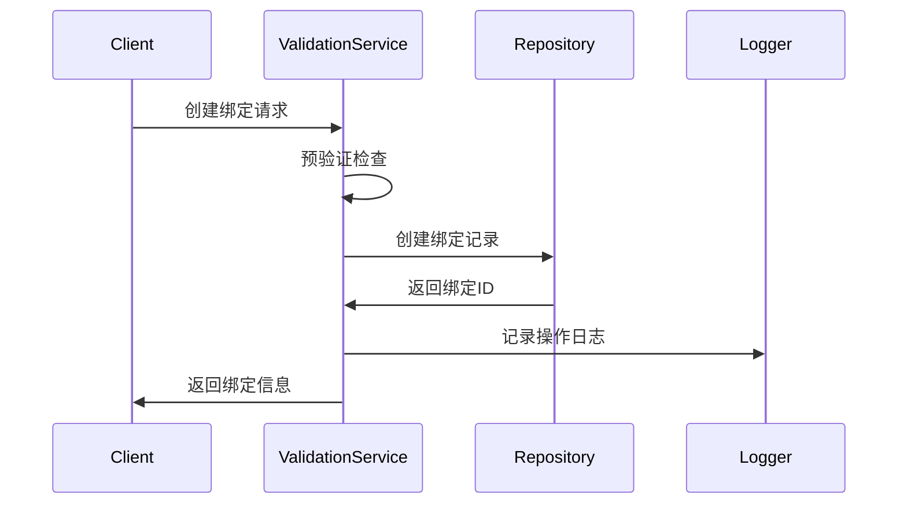

# Session Binding Module

## 概述

Session Binding 模块负责管理创作会话与用户之间的绑定关系，确保会话的正确分配和权限控制。

## 核心功能

### 主要职责

- **会话绑定验证**：验证用户对特定会话的访问权限
- **绑定关系管理**：创建、更新、删除会话绑定关系
- **并发控制**：处理会话绑定的并发访问和状态同步
- **权限检查**：确保用户只能访问其绑定的会话

### 业务逻辑



## 文件说明

### `binding_validation_service.py`

**绑定验证服务**，核心功能包括：

- **绑定关系验证**：检查用户与会话的绑定关系是否存在且有效
- **状态验证**：验证会话状态是否允许当前操作
- **并发控制**：使用乐观锁或悲观锁控制并发访问
- **异常处理**：处理各种绑定相关的异常情况

#### 核心方法

```python
class BindingValidationService:
    async def validate_binding(
        self, 
        user_id: int, 
        session_id: UUID, 
        operation: str
    ) -> ValidationResult
    
    async def create_binding(
        self, 
        user_id: int, 
        session_id: UUID
    ) -> BindingInfo
    
    async def update_binding_status(
        self, 
        binding_id: UUID, 
        status: str
    ) -> bool
```

## 数据模型

### 绑定关系模型



## 业务流程

### 绑定验证流程



### 绑定创建流程



## 配置说明

### 绑定策略配置

```python
BINDING_CONFIG = {
    "max_bindings_per_user": 10,  # 用户最大绑定数
    "binding_ttl": 3600,         # 绑定有效期（秒）
    "concurrent_limit": 5,       # 并发访问限制
    "allowed_operations": ["read", "write", "admin"],  # 允许的操作
}
```

### 状态定义

```python
class BindingStatus:
    ACTIVE = "active"          # 活跃状态
    SUSPENDED = "suspended"    # 暂停状态
    EXPIRED = "expired"        # 过期状态
    REVOKED = "revoked"        # 撤销状态
```

## 错误处理

### 常见错误类型

- **绑定不存在**：用户与会话无绑定关系
- **权限不足**：用户无权执行请求的操作
- **绑定过期**：绑定关系已过期
- **并发冲突**：多个请求同时修改绑定状态

### 错误响应格式

```python
class BindingError(Exception):
    def __init__(self, error_code: str, message: str, details: dict = None):
        self.error_code = error_code
        self.message = message
        self.details = details or {}
        super().__init__(self.message)
```

### 错误处理示例

```python
try:
    await validation_service.validate_binding(user_id, session_id, "write")
except BindingNotFoundError:
    raise HTTPException(status_code=404, detail="绑定关系不存在")
except PermissionDeniedError:
    raise HTTPException(status_code=403, detail="权限不足")
except BindingExpiredError:
    raise HTTPException(status_code=410, detail="绑定已过期")
```

## 性能优化

### 缓存策略

- **绑定关系缓存**：缓存活跃的绑定关系
- **权限缓存**：缓存用户权限信息
- **状态缓存**：缓存会话状态信息

### 数据库优化

- **索引优化**：为常用查询字段添加索引
- **查询优化**：使用 JOIN 减少查询次数
- **批量操作**：支持批量查询和更新

## 安全考虑

### 权限控制

- **最小权限原则**：只授予必要的权限
- **权限继承**：支持权限继承机制
- **权限审计**：记录权限变更历史

### 数据保护

- **敏感信息过滤**：不返回敏感信息
- **数据加密**：敏感数据加密存储
- **访问日志**：记录所有访问操作

## 开发指南

### 添加新的验证规则

1. 在 `BindingValidationService` 中添加新的验证方法
2. 更新验证逻辑
3. 添加相应的测试用例
4. 更新错误处理
5. 更新文档

### 扩展绑定类型

1. 定义新的绑定类型和状态
2. 实现对应的验证逻辑
3. 更新数据模型
4. 添加迁移脚本
5. 更新 API 接口

### 监控和调试

- **监控绑定操作**：记录绑定创建、更新、删除操作
- **监控验证性能**：跟踪验证操作的性能指标
- **错误统计**：统计各种错误类型的频率
- **日志分析**：分析绑定相关的日志数据

---

*该模块确保会话系统的安全性和稳定性，通过严格的绑定验证和权限控制，保护用户数据和创作内容。*