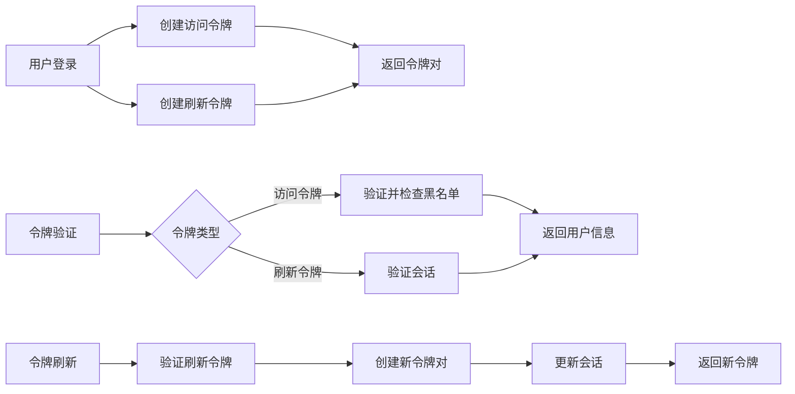
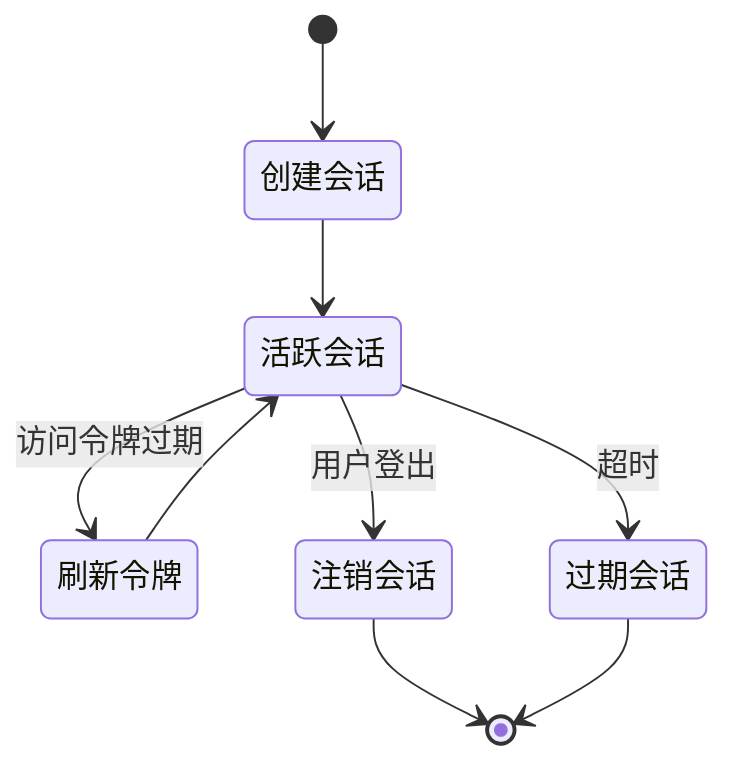
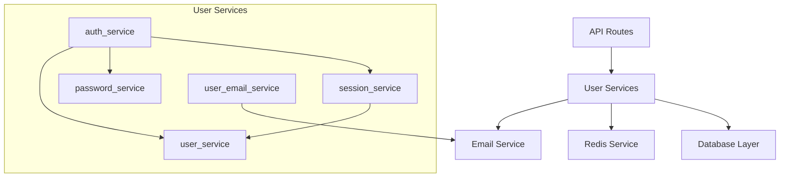

# 用户服务模块

## 概述

`apps/backend/src/common/services/user/` 目录包含 InfiniteScribe 后端用户相关的核心业务逻辑服务。该模块负责处理用户认证、会话管理、密码管理等关键功能，为上层 API 路由提供统一的业务逻辑抽象。

## 目录结构

```
user/
├── __init__.py                 # 服务模块初始化，导出主要服务实例
├── auth_service.py             # JWT 令牌管理和认证服务
├── password_service.py         # 密码管理和验证服务
├── session_service.py          # 用户会话管理服务
├── user_email_service.py       # 用户邮件服务
└── user_service.py             # 用户基础信息服务
```

## 核心服务

### 1. 认证服务 (`auth_service.py`)

负责 JWT 令牌的创建、验证和管理，支持访问令牌和刷新令牌机制。

**核心功能**:
- 创建和验证访问令牌
- 创建和验证刷新令牌
- 令牌黑名单管理
- 令牌刷新机制



**关键特性**:
- 支持令牌轮换（Token Rotation）
- Redis 黑名单机制防止令牌重放攻击
- 自动令牌过期和清理
- 支持自定义声明和过期时间

### 2. 会话服务 (`session_service.py`)

管理用户会话的创建、验证、更新和销毁。



**核心功能**:
- 会话创建和持久化
- 会话状态管理
- 会话缓存机制
- 会话过期处理

### 3. 密码服务 (`password_service.py`)

处理密码相关的安全操作，包括加密、验证和重置。

**核心功能**:
- 密码加密和验证
- 密码强度检查
- 密码重置令牌管理
- 安全密码生成

### 4. 邮件服务 (`user_email_service.py`)

处理用户相关的邮件发送功能。

**核心功能**:
- 邮箱验证邮件发送
- 密码重置邮件发送
- 邮件模板管理
- 发送状态跟踪

### 5. 用户服务 (`user_service.py`)

提供用户基础信息的 CRUD 操作。

**核心功能**:
- 用户创建和查询
- 用户信息更新
- 用户状态管理
- 用户关联数据处理

## 服务架构

### 依赖关系



### 服务特性

- **依赖注入**: 所有服务支持依赖注入，便于测试和扩展
- **异步支持**: 全面支持异步操作，提高并发性能
- **错误处理**: 统一的错误处理和日志记录
- **缓存机制**: Redis 缓存提高访问性能
- **事务支持**: 数据库操作支持事务管理

## 使用示例

### 认证流程

```python
from src.common.services.user import auth_service, session_service

# 创建访问令牌
access_token, jti, expires_at = auth_service.create_access_token(
    subject="user_id",
    additional_claims={"email": "user@example.com"}
)

# 验证令牌
payload = await auth_service.verify_token(access_token, "access")

# 刷新令牌
result = await auth_service.refresh_access_token(
    db=session,
    refresh_token=refresh_token,
    old_access_token=old_access_token
)
```

### 会话管理

```python
from src.common.services.user import session_service

# 创建会话
session = await session_service.create_session(
    db=db,
    user_id=user_id,
    refresh_token=refresh_token,
    user_agent=request.headers.get("User-Agent"),
    ip_address=request.client.host
)

# 获取活跃会话
sessions = await session_service.get_active_sessions(db, user_id)

# 注销会话
await session_service.revoke_session(db, session_id)
```

## 配置说明

服务通过 `src.core.config.settings` 获取配置参数：

- `auth.jwt_secret_key`: JWT 签名密钥
- `auth.jwt_algorithm`: JWT 算法（默认 HS256）
- `auth.access_token_expire_minutes`: 访问令牌过期时间
- `auth.refresh_token_expire_days`: 刷新令牌过期时间
- `auth.sse_token_expire_seconds`: SSE 令牌过期时间

## 安全特性

### 令牌安全

- 使用强随机密钥签名
- 支持令牌黑名单防止重放攻击
- 令牌轮换机制提高安全性
- 短期访问令牌 + 长期刷新令牌设计

### 密码安全

- 使用 bcrypt 进行密码哈希
- 支持密码强度验证
- 防止密码重用
- 安全的密码重置流程

### 会话安全

- 会话过期自动清理
- 支持单设备登录限制
- 异常登录检测
- 会话日志记录

## 性能优化

### 缓存策略

- Redis 缓存活跃会话
- 用户信息缓存
- 令牌黑名单缓存
- 邮件发送状态缓存

### 数据库优化

- 合理的索引设计
- 批量操作支持
- 连接池管理
- 查询优化

## 扩展指南

### 添加新服务

1. 创建新的服务文件
2. 实现服务类和方法
3. 在 `__init__.py` 中导出
4. 添加相应的测试用例
5. 更新文档

### 服务集成

```python
# 在新服务中依赖注入现有服务
class NewUserService:
    def __init__(self, auth_service=auth_service, user_service=user_service):
        self.auth_service = auth_service
        self.user_service = user_service
```

## 相关模块

- [`src.api.routes.v1`](../../../api/routes/v1/) - API 路由层
- [`src.models`](../../../models/) - 数据模型定义
- [`src.database`](../../../database/) - 数据库配置
- [`src.core.config`](../../../core/config/) - 配置管理
- [`src.db.redis`](../../../db/redis/) - Redis 服务