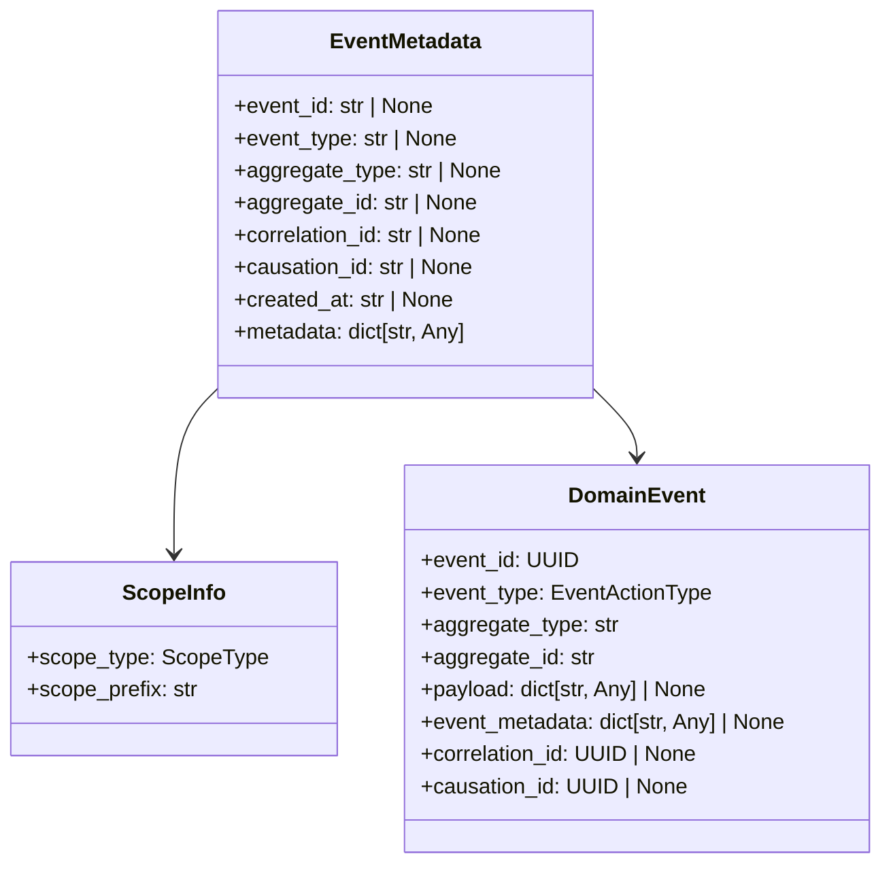
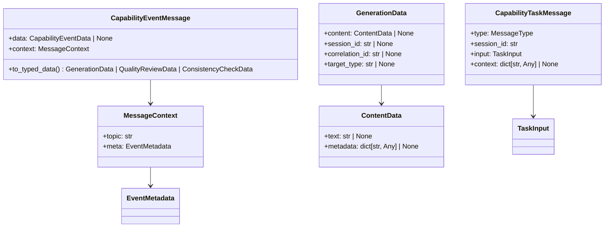
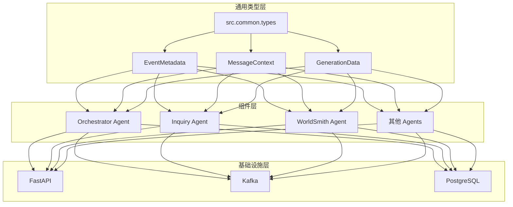

# 通用类型定义 (Common Types)

本目录包含整个后端系统使用的通用类型定义，遵循依赖倒置原则，为 InfiniteScribe 平台提供统一的类型系统。通过 Pydantic 实现"ultrathink"级别的类型安全性，确保任何 agent 或服务都可以使用这些类型，而无需依赖特定的组件实现。

## 🎯 核心价值

- **类型安全**：运行时验证、自动类型转换、优秀的错误信息
- **架构解耦**：依赖倒置原则，组件间通过类型接口通信
- **开发效率**：与 FastAPI 完美集成，提供优秀的开发体验
- **可维护性**：统一的类型定义，减少重复代码

## 目录结构

```
common/types/
├── __init__.py        # 统一导出所有通用类型
├── events.py          # 事件相关的通用类型
├── messages.py        # 消息相关的通用类型
└── README.md          # 本文档
```

## 📁 模块架构

### 🔄 events.py - 事件类型系统

事件类型模块采用 Pydantic 模型实现完整的事件生命周期管理：



**核心类型定义：**

- **字面量类型**：提供编译时类型检查
  - `EventActionType`：事件动作类型（如 Character.Proposed, Theme.Failed）
  - `TargetType`：目标类型（character, theme, content）
  - `ScopeType`：作用域类型（GENESIS）

- **元数据模型**：统一的事件元数据管理
  - `EventMetadata`：事件元数据基类，支持关联追踪
  - `DomainEventMetadata`：向后兼容别名
  - `ScopeInfo`：作用域信息封装

- **事件结构**：完整的事件数据模型
  - `EventPayloadData`：事件负载数据基类
  - `DomainEventPayload`：领域事件专用负载
  - `EventOutboxHeaders`：Outbox 模式头部信息
  - `DomainEvent`：完整的领域事件结构

### 📨 messages.py - 消息类型系统

消息类型模块实现了事件驱动架构中的消息传递标准：



**消息类型层次：**

- **消息上下文**：
  - `MessageContext`：包含主题和元数据的消息上下文
  - 支持消息路由和追踪

- **内容数据**：
  - `ContentData`：基础内容数据结构
  - `GenerationData`：生成过程的数据模型
  - 支持多种内容格式和元数据

- **任务消息**：
  - `TaskInput`：任务输入数据规范
  - `CapabilityTaskMessage`：能力任务消息
  - `TaskResultData`：任务执行结果
  - `TaskCompletionPayload`：任务完成通知

- **能力事件**：
  - `CapabilityEventData`：能力事件数据
  - `CapabilityEventMessage`：智能类型转换消息
  - 支持自动类型推断和转换

## 🚀 使用指南

### 📥 推荐的导入方式

```python
# ✅ 推荐：直接从 common.types 导入通用类型
from src.common.types import (
    EventMetadata,
    MessageContext,
    CapabilityTaskMessage,
    GenerationData,
    DomainEvent
)

# ✅ 也可以：从子模块导入
from src.common.types.events import EventMetadata, DomainEvent
from src.common.types.messages import MessageContext, GenerationData
```

### 🔄 向后兼容性保证

为了保持向后兼容，`src.agents.orchestrator.types` 模块重新导出了所有通用类型。
这意味着现有代码无需修改即可继续工作：

```python
# ✅ 仍然有效（向后兼容）
from src.agents.orchestrator.types import EventMetadata, MessageContext

# ✅ 新代码推荐使用
from src.common.types import EventMetadata, MessageContext
```

### 🎯 组件特有类型

组件特有的类型应该保留在各自的模块中，例如：

```python
# Orchestrator 特有类型
from src.agents.orchestrator.types import ProcessingResult

# InquiryAgent 特有类型  
from src.agents.inquiry.types import InquiryResult
```

### 💡 最佳实践

#### 1. 类型注解示例

```python
from typing import Any
from src.common.types import EventMetadata, MessageContext, GenerationData

def handle_capability_event(
    message: dict[str, Any],
    context: MessageContext
) -> GenerationData:
    """处理能力事件，类型安全的函数签名"""
    metadata = context.meta
    if metadata.correlation_id:
        track_request(metadata.correlation_id)
    
    return GenerationData(
        session_id=metadata.aggregate_id,
        correlation_id=metadata.correlation_id
    )
```

#### 2. 数据验证示例

```python
from pydantic import ValidationError
from src.common.types.events import DomainEvent

try:
    event = DomainEvent(**event_data)
    # 自动验证数据完整性
    process_domain_event(event)
except ValidationError as e:
    logger.error(f"事件数据验证失败: {e.json()}")
    raise
```

#### 3. 智能类型转换

```python
from src.common.types.messages import CapabilityEventMessage

# 创建能力事件消息
msg = CapabilityEventMessage(
    data=capability_data,
    context=message_context
)

# 智能类型转换
typed_data = msg.to_typed_data()
if isinstance(typed_data, GenerationData):
    handle_generation_result(typed_data)
elif isinstance(typed_data, QualityReviewData):
    handle_quality_review(typed_data)
```

## 🏗️ 设计原则

### 🔄 1. 依赖倒置原则 (Dependency Inversion Principle)

通用类型不依赖于特定的组件实现，而是由各个组件依赖通用类型：



### 📦 2. 单一职责原则 (Single Responsibility Principle)

每个模块都有明确的职责边界：

- `events.py` - 专门负责事件生命周期管理
- `messages.py` - 专门负责消息传递和转换
- `__init__.py` - 统一导出和类型管理

### 🔓 3. 开闭原则 (Open/Closed Principle)

- **对扩展开放**：通过 Pydantic 的 `extra="allow"` 支持字段扩展
- **对修改关闭**：向后兼容的别名确保现有代码无需修改
- **渐进式迁移**：支持从旧类型系统平滑迁移

### 🛡️ 4. 类型安全保证

使用 Pydantic 实现"ultrathink"级别的类型安全：

- **编译时检查**：Literal 类型确保枚举值的准确性
- **运行时验证**：自动类型转换和字段验证
- **错误处理**：提供详细的验证错误信息
- **框架集成**：与 FastAPI 无缝集成

### 🔗 5. 接口隔离原则 (Interface Segregation Principle)

```python
# 事件相关接口
from src.common.types.events import EventMetadata, DomainEvent

# 消息相关接口  
from src.common.types.messages import MessageContext, GenerationData

# 客户端只依赖需要的接口
class EventProcessor:
    def __init__(self, metadata: EventMetadata):
        self.metadata = metadata

class MessageHandler:
    def __init__(self, context: MessageContext):
        self.context = context
```

## 🔄 迁移指南

### 📋 从 orchestrator.types 迁移到 common.types

#### 迁移步骤

**第一步：更新导入语句**
```python
# 之前
from src.agents.orchestrator.types import (
    EventMetadata,
    MessageContext,
    CapabilityTaskMessage,
    GenerationData,
    DomainEvent
)

# 之后
from src.common.types import (
    EventMetadata,
    MessageContext,
    CapabilityTaskMessage,
    GenerationData,
    DomainEvent
)
```

**第二步：利用新的类型系统特性**
```python
# 利用智能类型转换
from src.common.types.messages import CapabilityEventMessage

msg = CapabilityEventMessage(**data)
typed_data = msg.to_typed_data()  # 自动类型推断

# 利用运行时验证
from src.common.types.events import DomainEvent
from pydantic import ValidationError

try:
    event = DomainEvent(**event_data)
except ValidationError as e:
    logger.error(f"数据验证失败: {e}")
```

**第三步：验证迁移结果**
- 运行现有测试确保兼容性
- 检查类型注解是否正确
- 验证运行时行为是否一致

#### 迁移优势

- **更好的类型安全**：完整的 Pydantic 验证
- **清晰的模块划分**：事件和消息类型分离
- **更好的可维护性**：减少代码重复
- **未来扩展性**：为新的类型系统奠定基础

## 📈 性能优化

### 🚀 类型验证优化

```python
# 使用 Pydantic 的模式缓存
from pydantic import BaseModel

class OptimizedEventMetadata(BaseModel):
    model_config = ConfigDict(
        frozen=True,  # 不可变对象，提升哈希性能
        extra="allow"  # 允许额外字段
    )
```

### 💾 内存优化

```python
# 使用 __slots__ 减少内存占用
from dataclasses import dataclass

@dataclass(slots=True)
class CompactScopeInfo:
    scope_type: str
    scope_prefix: str
```

## 📚 技术文档

### 🔧 API 参考

#### EventMetadata 类

```python
class EventMetadata(BaseModel):
    """统一的事件元数据模型"""
    
    event_id: str | None = None        # 事件唯一标识
    event_type: str | None = None      # 事件类型
    aggregate_type: str | None = None  # 聚合类型
    aggregate_id: str | None = None    # 聚合ID
    correlation_id: str | None = None  # 关联ID
    causation_id: str | None = None    # 因果关系ID
    created_at: str | None = None      # 创建时间
    metadata: dict[str, Any] = {}      # 扩展元数据
```

#### MessageContext 类

```python
class MessageContext(BaseModel):
    """消息上下文"""
    
    topic: str                          # 消息主题
    meta: EventMetadata                 # 事件元数据
```

#### CapabilityEventMessage.to_typed_data()

```python
def to_typed_data(self) -> GenerationData | QualityReviewData | ConsistencyCheckData:
    """智能转换为具体的数据类型
    
    Returns:
        GenerationData: 生成结果数据
        QualityReviewData: 质量评审数据  
        ConsistencyCheckData: 一致性检查数据
    """
```

## 🧪 测试指南

### 📋 单元测试示例

```python
import pytest
from src.common.types.events import EventMetadata, DomainEvent
from src.common.types.messages import MessageContext, GenerationData

class TestEventTypes:
    def test_event_metadata_validation(self):
        """测试事件元数据验证"""
        metadata = EventMetadata(
            event_id="test-id",
            event_type="test.event",
            correlation_id="corr-id"
        )
        assert metadata.event_id == "test-id"
        assert metadata.correlation_id == "corr-id"
    
    def test_domain_event_creation(self):
        """测试领域事件创建"""
        event = DomainEvent(
            event_type="Character.Proposed",
            aggregate_type="Genesis",
            aggregate_id="session-123",
            payload={"name": "test"}
        )
        assert event.event_type == "Character.Proposed"
        assert event.aggregate_id == "session-123"

class TestMessageTypes:
    def test_message_context(self):
        """测试消息上下文"""
        meta = EventMetadata(event_id="test-id")
        context = MessageContext(topic="test.topic", meta=meta)
        assert context.topic == "test.topic"
        assert context.meta.event_id == "test-id"
    
    def test_generation_data(self):
        """测试生成数据"""
        data = GenerationData(
            session_id="session-123",
            correlation_id="corr-456"
        )
        assert data.session_id == "session-123"
        assert data.correlation_id == "corr-456"
```

### 🔍 集成测试

```python
def test_end_to_end_type_flow():
    """端到端类型流程测试"""
    # 1. 创建事件元数据
    metadata = EventMetadata(
        event_id="550e8400-e29b-41d4-a716-446655440000",
        event_type="Character.Generated",
        correlation_id="corr-123"
    )
    
    # 2. 创建消息上下文
    context = MessageContext(topic="genesis.character.events", meta=metadata)
    
    # 3. 创建能力事件消息
    capability_msg = CapabilityEventMessage(
        data=capability_data,
        context=context
    )
    
    # 4. 智能类型转换
    typed_data = capability_msg.to_typed_data()
    
    # 5. 验证类型转换结果
    assert isinstance(typed_data, GenerationData)
    assert typed_data.correlation_id == "corr-123"
```

## 📊 监控和调试

### 📈 性能监控

```python
import time
from functools import wraps

def monitor_type_validation(func):
    """监控类型验证性能"""
    @wraps(func)
    def wrapper(*args, **kwargs):
        start_time = time.time()
        result = func(*args, **kwargs)
        duration = time.time() - start_time
        
        logger.info(
            "type_validation_performance",
            function=func.__name__,
            duration_ms=duration * 1000,
            args_count=len(args)
        )
        return result
    return wrapper

@monitor_type_validation
def validate_domain_event(data: dict) -> DomainEvent:
    return DomainEvent(**data)
```

### 🔍 调试工具

```python
def debug_type_conversion(data: dict) -> None:
    """调试类型转换过程"""
    print("=== 类型转换调试信息 ===")
    print(f"输入数据: {data}")
    
    try:
        msg = CapabilityEventMessage(**data)
        print(f"消息创建成功: {msg}")
        
        typed_data = msg.to_typed_data()
        print(f"转换后类型: {type(typed_data).__name__}")
        print(f"转换后数据: {typed_data}")
        
    except Exception as e:
        print(f"转换失败: {e}")
        print(f"错误类型: {type(e).__name__}")
```

## 📅 更新历史

### 🆕 2025-01-12：重大架构重构

**核心改进：**
- ✅ 将通用类型从 `src.agents.orchestrator.types` 迁移到 `src.common.types`
- ✅ 拆分为 `events.py` 和 `messages.py` 两个专门模块
- ✅ 实现 Pydantic 完整类型系统
- ✅ 添加智能类型转换功能
- ✅ 保持 100% 向后兼容性

**代码质量提升：**
- 📉 `orchestrator/types.py` 从 437 行减少到 115 行（减少 74%）
- 📈 类型安全性从 TypedDict 升级到 Pydantic 完整验证
- 🔧 新增运行时数据验证和自动类型转换
- 📚 完善的类型文档和使用示例

**架构优势：**
- 🏗️ 清晰的模块边界和职责分离
- 🔄 更好的依赖倒置实现
- 🚀 为未来扩展奠定坚实基础
- 🛡️ 企业级类型安全保障

## 🔗 相关文档

- **后端架构**: [Backend Architecture](../../CLAUDE.md)
- **编排器文档**: [Orchestrator README](../../agents/orchestrator/README.md)
- **事件系统**: [Event System Documentation](../events/README.md)
- **API 文档**: [FastAPI Integration Guide](../api/README.md)
- **开发指南**: [Development Standards](../../../docs/development/)
