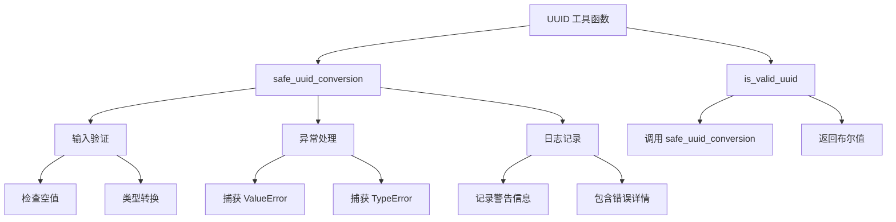
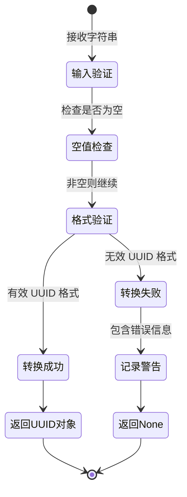

# 通用工具模块 (Common Utils)

提供项目中常用的工具函数和实用工具，确保代码的复用性和一致性。

## 🏗️ 模块概述

### 核心功能

- **UUID 工具**: 安全的 UUID 转换和验证
- **日期时间工具**: 日期时间处理和格式化
- **API 工具**: HTTP 请求处理和响应格式化

### 设计原则

- **安全性**: 所有工具函数都考虑了边界情况和错误处理
- **可复用性**: 通用功能抽象为可复用的工具函数
- **类型安全**: 使用类型注解确保编译时类型检查
- **日志友好**: 集成日志记录，便于调试和监控

## 📁 目录结构

```
utils/
├── __init__.py          # 工具模块导出
├── uuid_utils.py        # UUID 工具函数
├── datetime_utils.py    # 日期时间工具
└── api_utils.py         # API 相关工具
```

## 🛠️ 核心模块

### UUID 工具 (uuid_utils.py)

提供安全的 UUID 转换和验证功能，防止非法 UUID 格式导致的运行时错误。

#### 核心功能

```python
# 安全的 UUID 转换
uuid_obj = safe_uuid_conversion("123e4567-e89b-12d3-a456-426614174000", logger)
# 返回: UUID('123e4567-e89b-12d3-a456-426614174000')

# 处理非法格式
invalid_uuid = safe_uuid_conversion("invalid-uuid", logger)
# 返回: None，并记录警告日志

# UUID 格式验证
is_valid = is_valid_uuid("123e4567-e89b-12d3-a456-426614174000")
# 返回: True
```

#### 设计特点



#### 使用场景

1. **数据库查询**: 从字符串转换为 UUID 用于数据库查询
2. **API 参数验证**: 验证客户端传入的 UUID 格式
3. **日志追踪**: 安全处理关联 ID 和追踪标识
4. **缓存键生成**: 基于 UUID 生成缓存键

#### 错误处理策略



### 日期时间工具 (datetime_utils.py)

提供日期时间处理、格式化和解析功能。

### API 工具 (api_utils.py)

提供 HTTP 请求处理、响应格式化和错误处理功能。

## 🔧 使用示例

### UUID 工具使用

```python
from src.common.utils.uuid_utils import safe_uuid_conversion, is_valid_uuid
import logging

# 设置日志
logger = logging.getLogger(__name__)

# 安全转换 UUID
def process_user_request(user_id_str: str) -> None:
    """处理用户请求，安全转换用户 ID"""
    user_id = safe_uuid_conversion(user_id_str, logger)
    
    if user_id is None:
        logger.warning(f"无效的用户 ID 格式: {user_id_str}")
        return
    
    # 继续处理...
    process_user_data(user_id)

# 验证 UUID 格式
def validate_session_id(session_id: str) -> bool:
    """验证会话 ID 格式"""
    if not is_valid_uuid(session_id):
        return False
    
    # 格式验证通过，继续其他验证...
    return True
```

### 批量处理示例

```python
from src.common.utils.uuid_utils import safe_uuid_conversion
from typing import List

def batch_process_uuids(uuid_strings: List[str]) -> List[UUID]:
    """批量处理 UUID 字符串，过滤无效格式"""
    valid_uuids = []
    
    for uuid_str in uuid_strings:
        uuid_obj = safe_uuid_conversion(uuid_str, logger)
        if uuid_obj is not None:
            valid_uuids.append(uuid_obj)
    
    return valid_uuids
```

## 🧪 测试策略

### 单元测试

```python
import pytest
from src.common.utils.uuid_utils import safe_uuid_conversion, is_valid_uuid

def test_safe_uuid_conversion_valid():
    """测试有效 UUID 转换"""
    valid_uuid = "123e4567-e89b-12d3-a456-426614174000"
    result = safe_uuid_conversion(valid_uuid)
    assert result is not None
    assert str(result) == valid_uuid

def test_safe_uuid_conversion_invalid():
    """测试无效 UUID 转换"""
    invalid_uuid = "invalid-uuid-format"
    result = safe_uuid_conversion(invalid_uuid)
    assert result is None

def test_safe_uuid_conversion_none():
    """测试 None 输入"""
    result = safe_uuid_conversion(None)
    assert result is None

def test_is_valid_uuid():
    """测试 UUID 验证"""
    assert is_valid_uuid("123e4567-e89b-12d3-a456-426614174000") is True
    assert is_valid_uuid("invalid-uuid") is False
    assert is_valid_uuid(None) is False
```

## 📊 性能考虑

### 优化策略

- **缓存优化**: 对于频繁使用的 UUID，考虑缓存转换结果
- **批量处理**: 提供批量处理接口减少函数调用开销
- **惰性验证**: 只在需要时进行验证，避免不必要的计算

### 内存使用

- **轻量级设计**: 工具函数无状态，内存占用最小
- **异常处理**: 避免异常处理带来的性能开销
- **日志记录**: 合理控制日志级别，避免 I/O 瓶颈

## 🔗 相关模块

- **数据库层**: `src.db.sql` - 数据库操作和查询
- **代理层**: `src.agents` - 代理和消息处理
- **事件系统**: `src.common.events` - 事件处理和分发
- **配置管理**: `src.common.config` - 应用配置和设置

## 📝 最佳实践

### 1. 错误处理

```python
# 推荐：使用 safe_uuid_conversion 进行安全转换
user_id = safe_uuid_conversion(user_id_str, logger)
if user_id is None:
    # 处理无效 UUID 的情况
    handle_invalid_uuid(user_id_str)

# 避免：直接转换可能导致异常
try:
    user_id = UUID(user_id_str)
except ValueError:
    # 处理异常
```

### 2. 日志记录

```python
# 推荐：集成日志记录
correlation_id = safe_uuid_conversion(correlation_id_str, logger)
if correlation_id is None:
    logger.warning("无效的关联 ID", correlation_id=correlation_id_str)

# 避免：静默失败
correlation_id = safe_uuid_conversion(correlation_id_str)  # 缺少日志
```

### 3. 类型安全

```python
# 推荐：使用类型注解
def process_user(user_id: str) -> None:
    uuid_obj = safe_uuid_conversion(user_id, logger)
    # ...

# 避免：缺少类型信息
def process_user(user_id):
    uuid_obj = safe_uuid_conversion(user_id, logger)
    # ...
```

## 🔄 扩展指南

### 添加新的工具函数

1. **命名规范**: 使用描述性的函数名，如 `process_xxx` 或 `convert_xxx`
2. **参数设计**: 支持可选的 logger 参数用于日志记录
3. **错误处理**: 考虑所有可能的错误情况
4. **类型注解**: 提供完整的类型注解
5. **文档字符串**: 包含详细的文档和示例

### 示例：新的工具函数

```python
def safe_int_conversion(value: str | None, logger: Any = None) -> int | None:
    """安全地将字符串转换为整数。
    
    Args:
        value: 要转换的字符串
        logger: 可选的日志记录器
        
    Returns:
        转换后的整数或 None
        
    Examples:
        >>> safe_int_conversion("123")
        123
        >>> safe_int_conversion("invalid")
        None
    """
    if not value:
        return None
    
    try:
        return int(value)
    except (ValueError, TypeError) as e:
        if logger:
            logger.warning("invalid_int_format", value=value, error=str(e))
        return None
```

这个通用工具模块为整个应用提供了可靠、安全的工具函数支持，确保代码的一致性和可维护性。