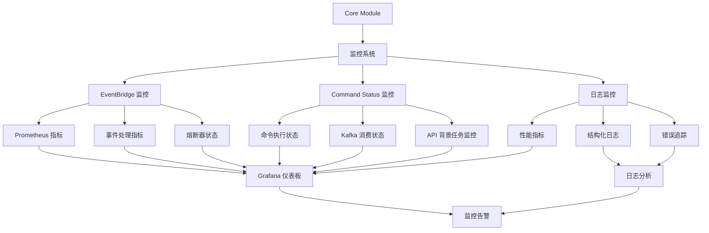
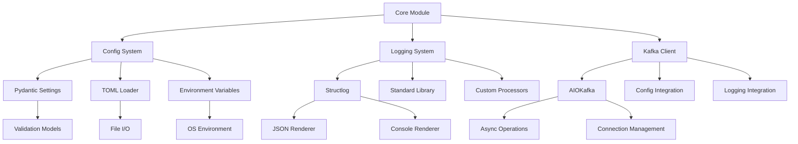

# Core 模块

## 概述

Core 模块是 InfiniteScribe 后端的核心基础设施层，提供配置管理、日志记录、消息队列等基础服务。该模块为整个应用提供统一的基础设施支持。

## 📊 监控配置

### EventBridge 监控

EventBridge 服务支持 Prometheus 监控配置，提供详细的性能指标收集：

```python
# 启用 Prometheus 监控
settings.eventbridge.prometheus_enabled = True

# 配置监控参数
settings.eventbridge.metrics_log_interval = 100  # 每 100 个事件记录一次指标
settings.eventbridge.log_level = "INFO"  # 监控日志级别
```

### Command Status 监控

API 嵌入式命令状态消费者也支持 Prometheus 监控：

```python
# 启用命令状态监控
settings.command_status.prometheus_enabled = True
settings.command_status.prometheus_port = 9090  # 监控端口
settings.command_status.prometheus_host = "0.0.0.0"  # 监控地址
```

## 核心功能

### 🔧 配置管理 (config.py)

统一的配置管理系统，支持多种配置源和验证机制：

- **多源配置加载**：环境变量、.env 文件、TOML 配置文件
- **分层配置**：认证、数据库、LLM、嵌入服务等独立配置模块
- **环境感知**：开发/生产环境自动切换和验证
- **类型安全**：基于 Pydantic 的配置验证和类型检查

#### 配置加载优先级
1. 初始化参数
2. 环境变量
3. .env 文件
4. config.toml 文件（支持环境变量插值）
5. 密钥文件
6. 模型默认值

#### 主要配置模块
- **AuthSettings**: JWT 认证、邮件服务、安全设置
- **DatabaseSettings**: PostgreSQL、Neo4j、Redis 连接配置
- **EmbeddingSettings**: 嵌入服务提供商配置（Ollama、OpenAI、Anthropic）
- **LLMSettings**: 大语言模型提供商配置
- **RelaySettings**: Outbox 消息中继服务配置
- **EventBridgeSettings**: 事件桥接服务配置，包含 Kafka 域事件处理和监控配置
- **CommandStatusSettings**: API 嵌入式命令状态消费者配置

### 📋 日志系统 (logging/)

结构化日志系统，支持多种输出格式和目标：

- **结构化日志**：基于 structlog 的 JSON 格式日志
- **多格式支持**：控制台、文件、JSON、键值对等多种格式
- **时区支持**：北京时间（CST）时间戳
- **线程安全**：单例模式确保配置一致性
- **文件轮转**：按日轮转的日志文件管理

#### 日志特性
- 统一日志处理器链
- 序列化回退机制
- 北京时间戳
- 多目标输出（控制台 + 文件）
- UVicorn 日志集成

### 📨 Kafka 客户端 (kafka/)

异步 Kafka 消息队列客户端管理：

- **连接管理**：消费者和生产者的生命周期管理
- ** Topic 自动创建**：确保所需 Topic 存在
- **分区管理**：动态分区分配跟踪
- **错误处理**：完善的异常处理和重试机制
- **结构化日志**：集成统一日志系统

#### 核心类
- **KafkaClientManager**: Kafka 客户端统一管理器
- **消费者管理**：订阅、分区分配、偏移量提交
- **生产者管理**：消息发送、确认机制
- **Topic 管理**：自动创建和验证

### 🔧 TOML 配置加载器 (toml_loader.py)

TOML 配置文件加载器，支持环境变量插值。

## 目录结构

```
apps/backend/src/core/
├── __init__.py
├── config.py              # 统一配置管理系统
├── toml_loader.py         # TOML 配置文件加载器
├── kafka/                 # Kafka 消息队列客户端
│   ├── __init__.py
│   └── client.py          # Kafka 客户端管理器
└── logging/               # 结构化日志系统
    ├── __init__.py
    ├── config.py          # 日志配置管理
    ├── context.py         # 日志上下文
    ├── processors.py      # 日志处理器
    └── types.py           # 日志类型定义
```

## 配置使用示例

### 基本配置访问

```python
from apps.backend.src.core.config import settings

# 访问数据库配置
db_url = settings.database.postgres_url

# 访问 LLM 配置
llm_provider = settings.llm.provider
default_model = settings.llm.default_model

# 访问嵌入服务配置
embedding_url = settings.embedding.ollama_url
```

### 日志使用

```python
from apps.backend.src.core.logging.config import get_logger

logger = get_logger("my_service")

# 结构化日志记录
logger.info("operation_started", 
           user_id="123", 
           operation="data_processing",
           metadata={"size": 1024})
```

### Kafka 客户端使用

```python
from apps.backend.src.core.kafka.client import KafkaClientManager

# 创建 Kafka 客户端管理器
client_manager = KafkaClientManager(
    client_id="my-agent",
    consume_topics=["input.topic"],
    produce_topics=["output.topic"],
    logger_context={"agent": "my-agent"}
)

# 创建消费者
consumer = await client_manager.create_consumer()
client_manager.subscribe_consumer()

# 创建生产者
producer = await client_manager.create_producer()
```

## 配置验证

系统在启动时会自动验证关键配置：

- **生产环境检查**：确保安全配置不为默认值
- **连接测试**：验证数据库和外部服务连接
- **格式验证**：检查配置值的格式和类型
- **依赖检查**：确保必需的服务配置完整

## 环境变量

系统支持通过环境变量覆盖配置，命名规则：

- 顶层配置：`NODE_ENV`、`API_PORT`
- 嵌套配置：`AUTH__JWT_SECRET_KEY`、`DATABASE__POSTGRES_HOST`

示例：
```bash
export NODE_ENV=production
export AUTH__JWT_SECRET_KEY="your-secure-secret"
export DATABASE__POSTGRES_HOST="prod.db.example.com"
```

## 开发指南

### 添加新配置

1. 在相应的配置类中添加字段
2. 添加类型注解和默认值
3. 添加验证器（如需要）
4. 更新配置文档

### 添加新日志处理器

1. 在 `logging/processors.py` 中实现处理器
2. 在 `logging/config.py` 中注册
3. 添加相应的测试

### 扩展 Kafka 功能

1. 在 `kafka/client.py` 中添加新方法
2. 确保适当的错误处理
3. 添加结构化日志记录
4. 编写集成测试

## 监控和可观测性

### 监控架构



### 日志监控

- **结构化字段**：统一字段命名约定
- **错误追踪**：完整的异常堆栈记录
- **性能指标**：操作耗时和吞吐量记录
- **上下文传播**：请求 ID 和用户 ID 追踪

### 配置监控

- **配置变更**：记录配置加载和变更
- **连接状态**：外部服务连接状态监控
- **验证失败**：配置验证错误记录

### 事件桥接监控

- **事件处理指标**：处理成功/失败计数、延迟统计
- **熔断器状态**：故障率、熔断/恢复状态
- **Kafka 监控**：分区分配、偏移量提交、消费延迟
- **Prometheus 集成**：指标导出和健康检查

## 依赖关系



## 安全考虑

- **敏感信息**：配置中不记录密码和 API 密钥
- **环境隔离**：不同环境的配置严格隔离
- **访问控制**：配置文件权限适当设置
- **密钥管理**：生产环境使用安全的密钥管理