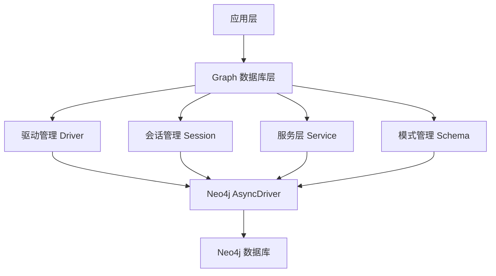
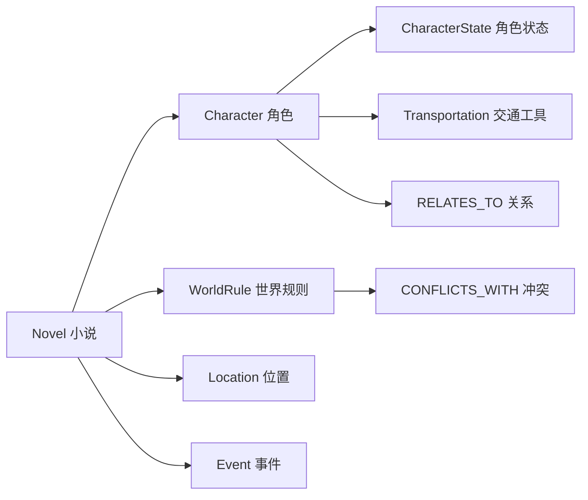
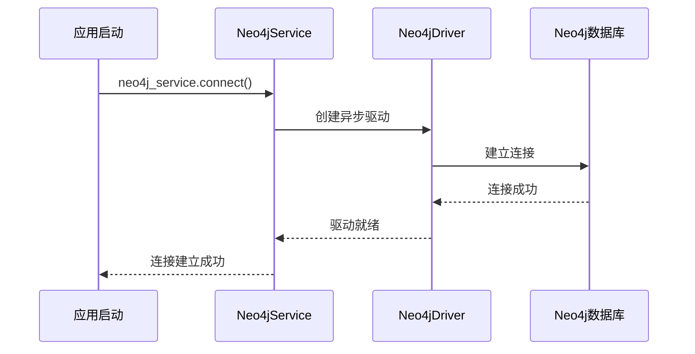
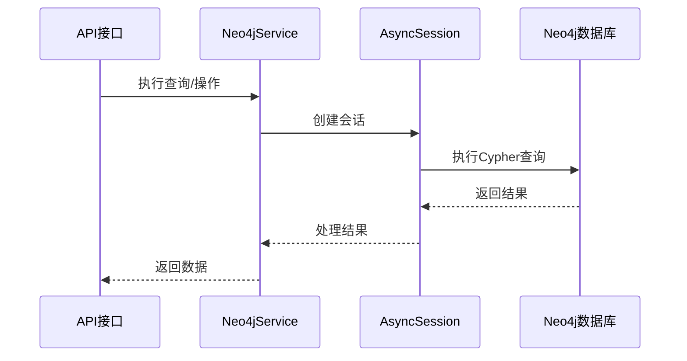

# Graph 数据库层

Neo4j 图数据库基础设施层，为 InfiniteScribe 小说创作平台提供图数据库服务。

## 📋 概述

本模块负责 Neo4j 图数据库的连接管理、会话处理、数据模型定义和业务逻辑操作。它是整个平台图数据存储的核心组件。

### 核心功能

- **连接管理**: 高效的 Neo4j 数据库连接池和驱动管理
- **会话处理**: 异步会话管理和 FastAPI 依赖注入支持
- **数据模型**: 小说创作相关的图数据结构定义
- **业务服务**: 提供高级别的图数据库操作接口

## 🏗️ 架构设计



## 📁 目录结构

```
apps/backend/src/db/graph/
├── __init__.py           # 模块导出和初始化
├── driver.py            # Neo4j 驱动管理
├── session.py           # 会话管理和依赖注入
├── service.py           # 核心服务类
└── schema.py            # 数据模式定义和管理
```

## 🔧 核心组件

### 1. 驱动管理 (driver.py)

提供 Neo4j 异步驱动的创建和配置：

```python
from src.db.graph import create_neo4j_driver, neo4j_driver

# 创建自定义驱动
driver = create_neo4j_driver(
    uri="bolt://localhost:7687",
    auth=("neo4j", "password"),
    max_connection_pool_size=100
)

# 使用默认驱动
result = await neo4j_driver.execute_query("MATCH (n) RETURN n LIMIT 10")
```

### 2. 会话管理 (session.py)

支持多种使用场景的会话管理：

```python
# FastAPI 依赖注入
async def some_endpoint(session: AsyncSession = Depends(get_neo4j_session)):
    result = await session.run("MATCH (n:Novel) RETURN n")
    return await result.data()

# 上下文管理器
async with create_neo4j_session() as session:
    result = await session.run("MATCH (n:Character) RETURN n")
    records = await result.data()

# 简单查询执行
results = await execute_query("MATCH (n:Novel {novel_id: $id}) RETURN n", {"id": "123"})
```

### 3. 服务层 (service.py)

高级别的数据库操作服务：

```python
from src.db.graph import neo4j_service

# 连接管理
await neo4j_service.connect()
is_connected = await neo4j_service.check_connection()

# 约束验证
constraints_ok = await neo4j_service.verify_constraints()

# 查询执行
results = await neo4j_service.execute(
    "MATCH (n:Novel {novel_id: $id})-[:HAS_CHARACTER]->(c:Character) RETURN c",
    {"id": "novel_123"}
)
```

### 4. 模式管理 (schema.py)

图数据结构和模式管理：

```python
async with create_neo4j_session() as session:
    # 模式管理器
    schema_manager = Neo4jSchemaManager(session)
    await schema_manager.initialize_schema()
    
    # 节点创建器
    node_creator = Neo4jNodeCreator(session)
    novel = await node_creator.create_novel_node(
        novel_id="novel_123",
        title="我的小说",
        genre="科幻"
    )
    
    # 关系管理器
    rel_manager = Neo4jRelationshipManager(session)
    await rel_manager.create_character_relationship(
        "char_1", "char_2", strength=5, rel_type="朋友"
    )
```

## 📊 数据模型

### 节点类型



### 核心节点属性

#### Novel（小说）
- `novel_id`: 唯一标识符
- `app_id`: 应用标识
- `title`: 小说标题
- `genre`: 类型
- `created_at`: 创建时间

#### Character（角色）
- `id`: 角色ID
- `novel_id`: 所属小说ID
- `name`: 角色名称
- `appearance`: 外貌描述
- `personality`: 性格特征
- `background`: 背景故事
- `motivation`: 动机
- `goals`: 目标
- `obstacles`: 障碍
- `arc`: 角色弧线
- `wounds`: 创伤

#### WorldRule（世界规则）
- `id`: 规则ID
- `novel_id`: 所属小说ID
- `dimension`: 维度
- `rule`: 规则内容
- `priority`: 优先级
- `scope`: 作用范围
- `examples`: 示例
- `constraints`: 约束条件

## 🔌 使用流程

### 初始化流程



### 数据操作流程



## 🚀 快速开始

### 基本设置

```python
# 1. 导入必要的模块
from src.db.graph import neo4j_service, create_neo4j_session
from src.db.graph.schema import Neo4jNodeCreator

# 2. 连接数据库
await neo4j_service.connect()

# 3. 验证连接
if await neo4j_service.check_connection():
    print("Neo4j 连接成功")
```

### 创建小说数据

```python
async with create_neo4j_session() as session:
    # 创建节点管理器
    node_creator = Neo4jNodeCreator(session)
    
    # 创建小说
    novel = await node_creator.create_novel_node(
        novel_id="novel_001",
        title="星际冒险",
        genre="科幻小说"
    )
    
    # 创建角色
    character = await node_creator.create_character_node(
        character_id="char_001",
        novel_id="novel_001",
        name="艾莉亚",
        personality="勇敢、聪明",
        background="来自未来的科学家"
    )
    
    # 创建世界规则
    rule = await node_creator.create_world_rule_node(
        rule_id="rule_001",
        novel_id="novel_001",
        dimension="科技",
        rule="时间旅行只能用于观测",
        priority=10
    )
```

### 查询数据

```python
# 查询小说的所有角色
characters = await neo4j_service.execute(
    """
    MATCH (n:Novel {novel_id: $novel_id})-[:HAS_CHARACTER]->(c:Character)
    RETURN c.name, c.personality
    """,
    {"novel_id": "novel_001"}
)

# 查询角色关系
relationships = await neo4j_service.execute(
    """
    MATCH (c1:Character)-[r:RELATES_TO]->(c2:Character)
    WHERE c1.novel_id = $novel_id
    RETURN c1.name, r.type, c2.name, r.strength
    """,
    {"novel_id": "novel_001"}
)
```

## ⚙️ 配置

### 数据库配置

```python
# 在 src/core/config.py 中配置
DATABASE_NEO4J_URL = "bolt://localhost:7687"
DATABASE_NEO4J_USER = "neo4j"
DATABASE_NEO4J_PASSWORD = "password"
```

### 连接池配置

```python
# 创建自定义配置的驱动
driver = create_neo4j_driver(
    max_connection_lifetime=3600,    # 连接最大生命周期（秒）
    max_connection_pool_size=50,    # 连接池大小
    connection_acquisition_timeout=60,  # 连接获取超时
    connection_timeout=30,          # 连接超时
    keep_alive=True                 # 保持连接
)
```

## 🛠️ 开发指南

### 添加新的节点类型

1. 在 `schema.py` 中的 `NODE_TEMPLATES` 添加定义
2. 在 `SCHEMA_CONFIG` 中添加约束和索引
3. 在 `Neo4jNodeCreator` 中添加创建方法
4. 更新相关的关系定义

### 性能优化

- 使用适当的索引
- 批量操作时使用事务
- 合理设置连接池大小
- 使用参数化查询防止注入

### 错误处理

```python
try:
    await neo4j_service.connect()
    results = await neo4j_service.execute(query, parameters)
except Exception as e:
    logger.error(f"Neo4j 操作失败: {e}")
    # 处理错误或重试
```

## 📝 注意事项

- 所有数据库操作都是异步的
- 使用上下文管理器确保会话正确关闭
- 生产环境中建议使用连接池
- 定期验证约束和索引的完整性
- 注意处理并发访问时的数据一致性

## 🔗 相关链接

- [Neo4j 官方文档](https://neo4j.com/docs/)
- [Cypher 查询语言参考](https://neo4j.com/docs/cypher-refcard/current/)
- [Python Neo4j 驱动文档](https://neo4j.com/docs/python-manual/current/)