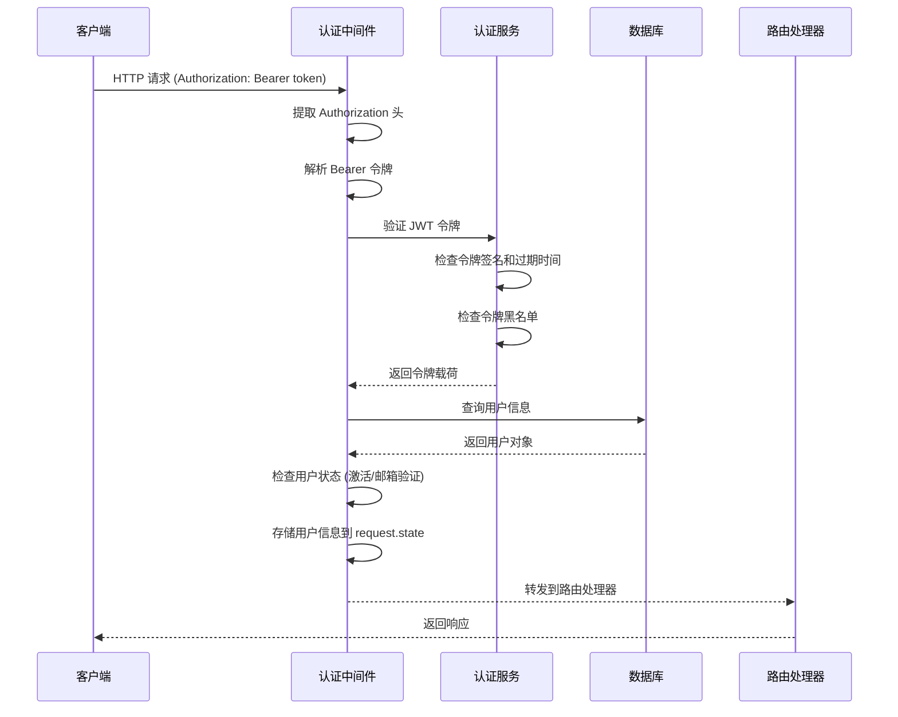
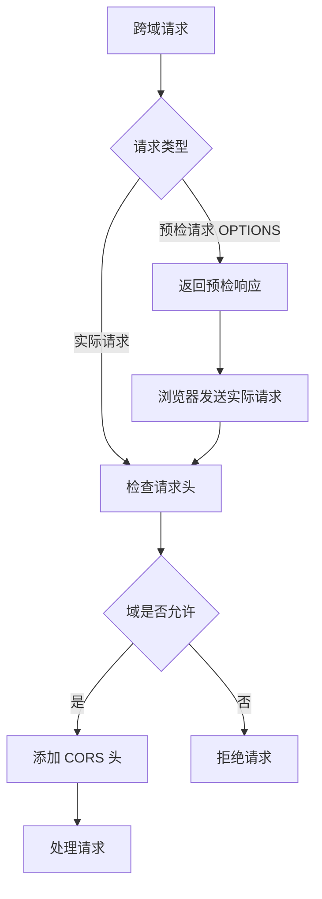
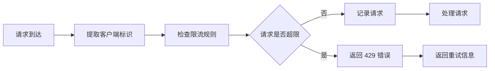
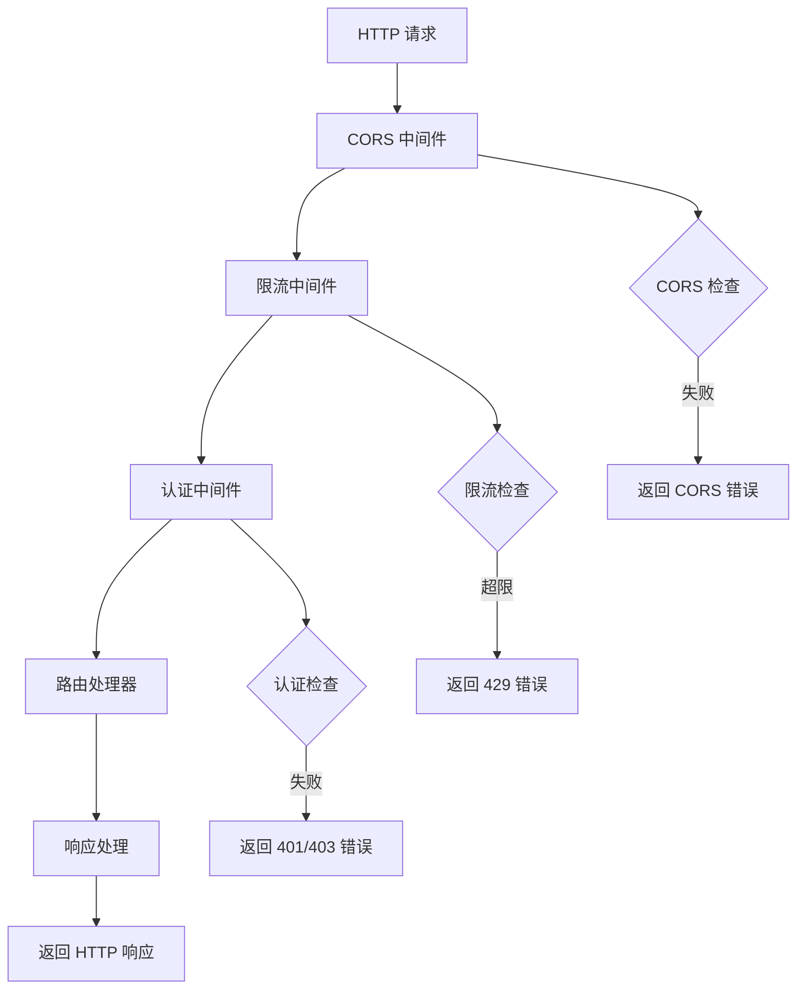
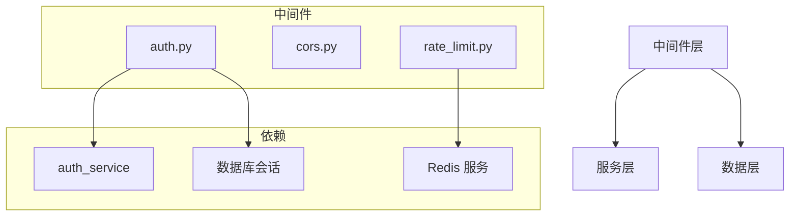

# 中间件模块

## 概述

`apps/backend/src/middleware/` 目录包含 InfiniteScribe 后端的 FastAPI 中间件实现。该模块提供请求处理过程中的横切关注点，包括身份认证、跨域处理、请求限流等功能，确保 API 的安全性、性能和可靠性。

## 目录结构

```
middleware/
├── __init__.py                 # 中间件模块初始化
├── auth.py                     # 身份认证中间件
├── cors.py                     # 跨域资源共享中间件
└── rate_limit.py               # 请求限流中间件
```

## 核心中间件

### 1. 认证中间件 (`auth.py`)

负责处理基于 JWT 的用户身份认证，提供多层次的身份验证和授权机制。

#### 核心功能

- **JWT 令牌验证**: 解析和验证 Bearer 令牌
- **用户身份获取**: 从数据库加载用户信息
- **权限检查**: 支持基于角色的访问控制
- **状态管理**: 在请求上下文中存储用户信息

#### 认证流程



#### 依赖函数

**1. `get_current_user`**
- 从 JWT 令牌中提取用户身份
- 验证用户存在且处于激活状态
- 返回当前用户对象

**2. `require_auth`**
- 在 `get_current_user` 基础上增加邮箱验证要求
- 确保用户已完成邮箱验证流程

**3. `require_admin`**
- 在 `require_auth` 基础上增加管理员权限检查
- 限制只有超级用户可以访问的管理功能

#### 使用示例

```python
from fastapi import APIRouter, Depends
from src.middleware.auth import get_current_user, require_auth, require_admin

router = APIRouter()

# 需要基本认证
@router.get("/profile")
async def get_profile(current_user: User = Depends(get_current_user)):
    return {"user": current_user}

# 需要邮箱验证
@router.post("/protected-action")
async def protected_action(
    current_user: User = Depends(require_auth)
):
    return {"message": "邮箱已验证用户才能访问"}

# 需要管理员权限
@router.delete("/admin/users/{user_id}")
async def delete_user(
    user_id: int,
    current_user: User = Depends(require_admin)
):
    return {"message": "管理员操作成功"}
```

### 2. CORS 中间件 (`cors.py`)

处理跨域资源共享（CORS）配置，控制前端应用的访问权限。

#### 核心功能

- **预检请求处理**: 自动响应 OPTIONS 请求
- **域白名单控制**: 限制允许的源域名
- **头部配置**: 配置允许的请求头和响应头
- **方法控制**: 限制允许的 HTTP 方法

#### CORS 处理流程



#### 配置示例

```python
# 开发环境 - 允许所有本地开发域名
origins = [
    "http://localhost:3000",
    "http://localhost:5173",
    "http://127.0.0.1:3000",
]

# 生产环境 - 严格限制允许的域名
origins = [
    "https://app.infinite-scribe.com",
    "https://admin.infinite-scribe.com",
]
```

### 3. 限流中间件 (`rate_limit.py`)

实现请求频率限制，防止 API 滥用和 DDoS 攻击。

#### 核心功能

- **多维度限流**: 支持 IP、用户、端点等多维度限制
- **滑动窗口**: 基于时间窗口的请求计数
- **Redis 存储**: 分布式限流支持
- **智能响应**: 返回限流信息和重试时间

#### 限流策略



#### 限流配置

```python
# 限流规则配置
rate_limits = {
    "global": {"requests": 1000, "window": 3600},  # 全局限制
    "ip": {"requests": 100, "window": 60},         # IP 限制
    "user": {"requests": 200, "window": 60},       # 用户限制
    "auth": {"requests": 10, "window": 300},       # 认证端点限制
}
```

## 中间件架构

### 执行顺序



### 依赖关系



## 配置管理

### 环境配置

中间件通过 `src.core.config.settings` 获取配置：

```python
# 认证配置
auth.jwt_secret_key = "your-secret-key"
auth.jwt_algorithm = "HS256"
auth.access_token_expire_minutes = 30

# CORS 配置
cors.allow_origins = ["http://localhost:3000"]
cors.allow_methods = ["GET", "POST", "PUT", "DELETE"]
cors.allow_headers = ["*"]

# 限流配置
rate_limit.enabled = True
rate_limit.default_requests = 100
rate_limit.default_window = 60
```

### 动态配置

支持运行时配置更新：

```python
# 动态添加允许的域名
add_cors_origin("https://new-domain.com")

# 动态调整限流规则
update_rate_limit("auth", requests=20, window=300)
```

## 性能优化

### 认证优化

- **用户信息缓存**: 缓存活跃用户信息减少数据库查询
- **令牌验证优化**: 使用高效 JWT 库和验证算法
- **批量验证**: 支持批量令牌验证（如 WebSocket 连接）

### 限流优化

- **Redis 管道**: 使用 Redis Pipeline 提高性能
- **内存缓存**: 热点限流规则内存缓存
- **异步处理**: 异步限流检查不阻塞主流程

### CORS 优化

- **预检缓存**: 缓存预检请求响应
- **规则优化**: 简化 CORS 规则匹配算法

## 监控和日志

### 认证监控

```python
# 认证失败监控
auth_failures = {
    "invalid_token": 0,
    "expired_token": 0,
    "user_inactive": 0,
    "email_not_verified": 0,
}
```

### 限流监控

```python
# 限流触发监控
rate_limit_violations = {
    "ip_violations": 0,
    "user_violations": 0,
    "endpoint_violations": {},
}
```

### 日志格式

```
[INFO] Authentication: user_id=123, ip=192.168.1.1, endpoint=/api/v1/profile
[WARNING] Rate limit: ip=192.168.1.1, endpoint=/api/v1/auth/login, remaining=5
[ERROR] CORS violation: origin=https://malicious.com, method=POST
```

## 安全最佳实践

### 认证安全

- **令牌过期控制**: 合理设置令牌过期时间
- **黑名单机制**: 及时撤销可疑令牌
- **状态检查**: 验证用户激活和邮箱验证状态
- **最小权限原则**: 严格控制管理员权限

### CORS 安全

- **严格域名控制**: 生产环境限制允许的域名
- **方法限制**: 只允许必要的 HTTP 方法
- **头部控制**: 限制自定义请求头
- **凭据控制**: 谨慎处理凭据请求

### 限流安全

- **多层防护**: IP、用户、端点多层限流
- **智能调整**: 根据请求模式动态调整限流
- **异常检测**: 识别异常请求模式
- **自动封禁**: 恶意请求自动封禁

## 扩展指南

### 添加新中间件

1. 创建中间件文件
2. 实现 FastAPI 中间件接口
3. 在应用中注册中间件
4. 添加配置选项
5. 编写测试用例

```python
from fastapi import Request, Response
from starlette.middleware.base import BaseHTTPMiddleware

class CustomMiddleware(BaseHTTPMiddleware):
    async def dispatch(self, request: Request, call_next):
        # 前处理逻辑
        response = await call_next(request)
        # 后处理逻辑
        return response
```

### 中间件集成

```python
from fastapi import FastAPI
from src.middleware import auth_middleware, cors_middleware, rate_limit_middleware

app = FastAPI()

# 按顺序注册中间件
app.add_middleware(cors_middleware)
app.add_middleware(rate_limit_middleware)
# auth 中间件通过依赖注入实现
```

## 相关模块

- [`src.api.routes.v1`](../api/routes/v1/) - API 路由层
- [`src.common.services`](../common/services/) - 业务逻辑服务
- [`src.core.config`](../core/config/) - 配置管理
- [`src.database`](../database/) - 数据库配置
- [`src.db.redis`](../db/redis/) - Redis 服务