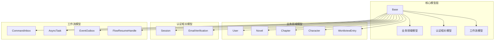
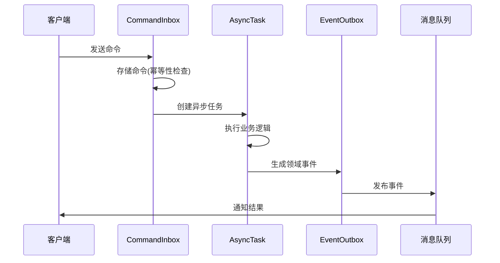
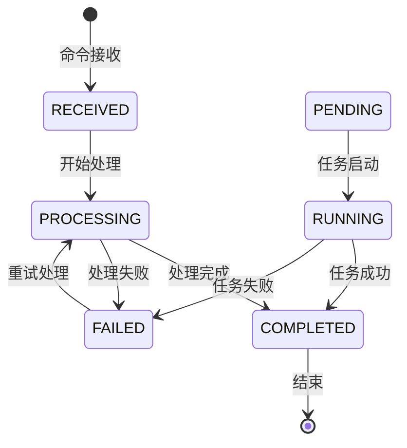
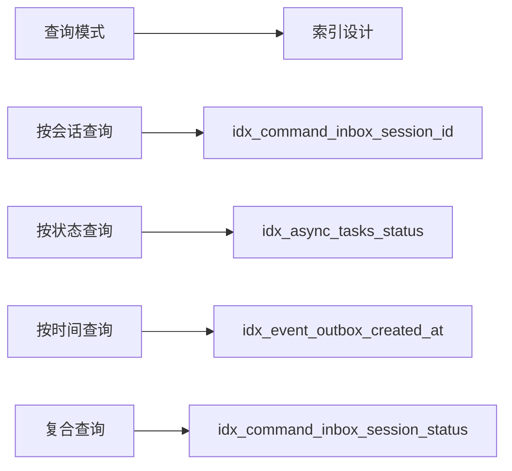

# 📚 数据库模型 (Models)

本目录包含 InfiniteScribe 后端系统的 SQLAlchemy ORM 模型定义，实现了领域驱动设计(DDD)和 CQRS 架构模式。

## 🏗️ 架构概览



## 📋 模型分类

### 1. 基础模型
- **`base.py`** - 认证相关的基础模型类
- **`__init__.py`** - 模型包导出配置

### 2. 业务领域模型
- **`user.py`** - 用户实体模型
- **`novel.py`** - 小说作品模型
- **`chapter.py`** - 章节内容模型
- **`character.py`** - 角色信息模型
- **`worldview.py`** - 世界观设定模型
- **`session.py`** - 会话管理模型

### 3. 认证相关模型
- **`email_verification.py`** - 邮箱验证模型

### 4. 事件和流程模型
- **`event.py`** - 领域事件模型
- **`genesis.py`** - 创作流程模板模型
- **`genesis_flows.py`** - 创作流程执行模型

### 5. 工作流模型
- **`workflow.py`** - CQRS 工作流和任务管理模型
- **`conversation.py`** - 对话交互模型

## 🔧 核心功能特性

### CQRS 架构实现



### 工作流状态管理



## 📊 主要模型说明

### CommandInbox (命令收件箱)
- **功能**: CQRS 架构的命令侧，接收和存储待处理命令
- **特性**: 幂等性保证、状态追踪、重试机制
- **索引优化**: 针对会话、状态、命令类型的多维度索引

### AsyncTask (异步任务)
- **功能**: 跟踪和管理系统中的异步任务执行
- **特性**: 进度跟踪、分布式执行、错误处理
- **状态管理**: PENDING → RUNNING → COMPLETED/FAILED

### EventOutbox (事件发件箱)
- **功能**: 事务性发件箱模式，确保事件可靠发布
- **特性**: 消息分区、延迟发送、重试机制
- **可靠性保证**: 数据库事务与消息发布的一致性

### FlowResumeHandle (工作流恢复句柄)
- **功能**: 支持长时间运行的工作流暂停和恢复
- **特性**: 超时控制、状态恢复、上下文保持
- **应用场景**: 用户交互等待、外部系统集成

## 🔧 使用示例

### 创建命令
```python
from src.models import CommandInbox, CommandStatus
from uuid import uuid4

command = CommandInbox(
    session_id=uuid4(),
    command_type="GenerateChapter",
    idempotency_key="unique-command-key",
    payload={"chapter_id": 123, "prompt": "写一个精彩的开头"},
    status=CommandStatus.RECEIVED
)
```

### 创建异步任务
```python
from src.models import AsyncTask, TaskStatus

task = AsyncTask(
    task_type="GenerateChapter",
    triggered_by_command_id=command.id,
    input_data={"chapter_id": 123},
    max_retries=3
)
```

### 发布事件
```python
from src.models import EventOutbox, OutboxStatus

event = EventOutbox(
    topic="chapter.events",
    key="chapter-generated",
    payload={"chapter_id": 123, "status": "completed"},
    headers={"event_type": "ChapterGenerated", "version": "1.0"}
)
```

## 🚀 高级特性

### 1. 幂等性保证
- 所有命令都通过 `idempotency_key` 确保幂等性
- 防止重复处理同一命令

### 2. 分布式任务执行
- 支持 `execution_node` 标识执行节点
- 适用于分布式任务调度系统

### 3. 消息分区和路由
- EventOutbox 支持消息分区键
- 确保相关消息的顺序处理

### 4. 工作流恢复机制
- 支持长时间运行的工作流
- 可暂停等待用户输入或外部事件

## 📈 性能优化

### 数据库索引策略


### 数据约束完整性
- 使用 CheckConstraint 确保数据完整性
- UniqueConstraint 防止数据重复
- 外键约束维护关系完整性

## 🔍 监控和调试

### 关键指标
- 命令处理成功率
- 任务执行时间和重试率
- 事件发布延迟
- 工作流恢复成功率

### 日志追踪
- 所有模型都包含 `created_at` 和 `updated_at`
- 支持按时间范围查询和调试

## 🛠️ 开发指南

### 添加新模型
1. 继承 `Base` 基类
2. 定义适当的字段和约束
3. 添加必要的索引优化查询
4. 在 `__init__.py` 中导出新模型

### 模型设计原则
- 单一职责：每个模型专注一个业务领域
- 数据完整性：使用约束确保数据有效性
- 性能优化：根据查询模式设计索引
- 可维护性：清晰的字段命名和注释

## 🔗 相关文档

- [后端架构文档](../../docs/architecture/)
- [API 文档](../../api-docs/)
- [数据库设计文档](../../docs/database/)
- [CQRS 模式说明](../../docs/patterns/cqrs.md)