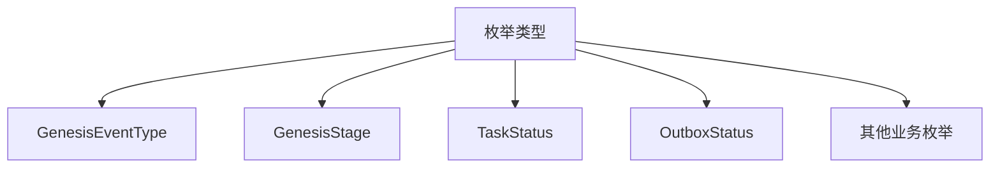
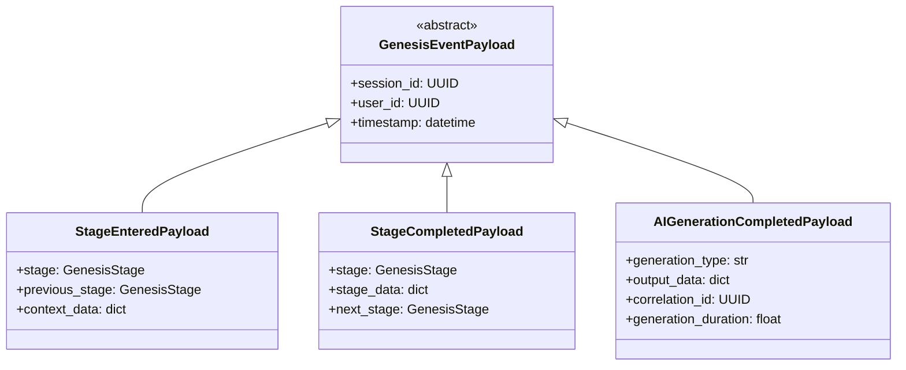
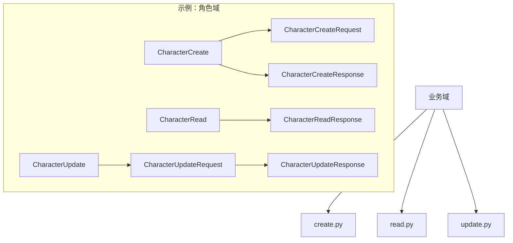
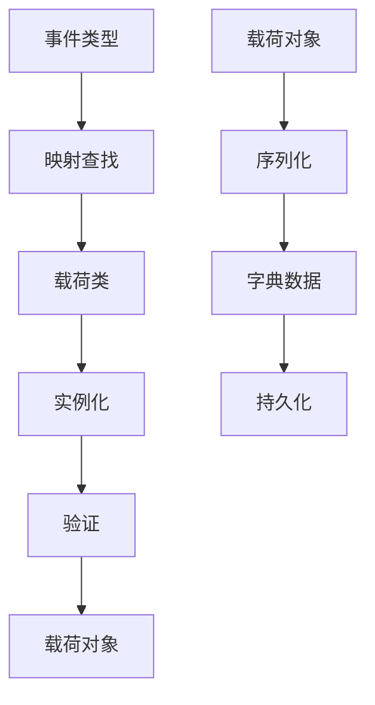

# 数据模式 (Schemas)

定义系统中所有数据结构的 Pydantic 模型，包括 API 请求/响应、领域事件载荷、数据库实体等。

## 🏗️ 架构概览

### 核心设计原则

- **类型安全**: 使用 Pydantic 提供运行时类型验证
- **模块化**: 按功能域组织模式定义
- **一致性**: 统一的命名和结构约定
- **可扩展**: 支持模式版本控制和向后兼容

## 📁 目录结构

```
schemas/
├── __init__.py              # 公共导出
├── base.py                  # 基础模式类
├── enums.py                 # 枚举定义
├── domain_event.py          # 领域事件模式
├── events.py                # 通用事件模式
├── genesis_events.py        # Genesis 工作流事件模式
├── session.py               # 会话管理模式
├── sse.py                   # Server-Sent Events 模式
├── workflow/                # 工作流相关模式
│   ├── __init__.py
│   ├── create.py
│   ├── read.py
│   └── update.py
├── genesis/                 # Genesis 工作流模式
│   ├── __init__.py
│   ├── create.py
│   ├── read.py
│   ├── update.py
│   ├── flow_schemas.py
│   ├── stage_schemas.py
│   ├── stage_session_schemas.py
│   └── stage_config_schemas.py
├── character/               # 角色相关模式
│   ├── __init__.py
│   ├── create.py
│   ├── read.py
│   └── update.py
├── chapter/                # 章节相关模式
│   ├── __init__.py
│   ├── create.py
│   ├── read.py
│   └── update.py
├── novel/                  # 小说相关模式
│   ├── __init__.py
│   ├── create.py
│   ├── read.py
│   ├── update.py
│   ├── dialogue/
│   ├── embedding.py
│   ├── graph.py
│   └── version.py
└── worldview/              # 世界观相关模式
    ├── __init__.py
    ├── create.py
    ├── read.py
    └── update.py
```

## 🎯 核心模块

### 基础模式 (base.py)

```python
class BaseSchema(BaseModel):
    """所有模式的基类，提供通用配置"""
    
    model_config = ConfigDict(
        str_strip_whitespace=True,
        validate_assignment=True,
        extra='forbid'
    )
```

### 枚举定义 (enums.py)

包含系统中所有枚举类型：



### Genesis 事件模式 (genesis_events.py)

定义 Genesis 工作流中的领域事件载荷：



### 事件序列化工具

```python
class EventSerializationUtils:
    """事件序列化和反序列化工具"""
    
    @staticmethod
    def serialize_payload(payload: GenesisEventPayloadUnion) -> dict[str, Any]:
        """序列化事件载荷为字典"""
        return payload.model_dump(exclude_unset=True)
    
    @staticmethod
    def deserialize_payload(
        event_type: GenesisEventType, 
        payload_data: dict[str, Any]
    ) -> GenesisEventPayloadUnion:
        """根据事件类型反序列化载荷数据"""
        from src.common.events.mapping import get_event_payload_class
        
        payload_class = get_event_payload_class(event_type)
        return payload_class(**payload_data)
```

## 🔧 模式设计模式

### CRUD 操作分离

每个业务域都按操作类型分离：



### 统一载荷映射

使用 `src.common.events.mapping` 实现统一的事件-载荷映射：



## 🚀 使用示例

### 创建 Genesis 事件

```python
from src.schemas.genesis_events import (
    GenesisEventCreate, 
    StageEnteredPayload,
    EventSerializationUtils
)

# 创建载荷
payload = StageEnteredPayload(
    session_id=uuid4(),
    stage=GenesisStage.CHARACTER_DESIGN,
    previous_stage=GenesisStage.CONCEPT_SELECTION,
    context_data={"user_input": "设计一个勇敢的骑士"}
)

# 创建事件
event = EventSerializationUtils.create_genesis_event(
    event_type=GenesisEventType.STAGE_ENTERED,
    session_id=payload.session_id,
    payload=payload,
    correlation_id=uuid4(),
    metadata={"source": "user_input"}
)
```

### 反序列化事件载荷

```python
from src.schemas.genesis_events import EventSerializationUtils
from src.schemas.enums import GenesisEventType

# 反序列化
payload = EventSerializationUtils.deserialize_payload(
    event_type=GenesisEventType.STAGE_ENTERED,
    payload_data={
        "session_id": "123e4567-e89b-12d3-a456-426614174000",
        "stage": "CHARACTER_DESIGN",
        "context_data": {"user_input": "设计一个勇敢的骑士"}
    }
)
```

### API 请求/响应模式

```python
from src.schemas.novel.create import NovelCreateRequest
from src.schemas.novel.read import NovelReadResponse

# 创建请求
request = NovelCreateRequest(
    title="我的小说",
    description="这是一个精彩的故事",
    genre="fantasy"
)

# 响应数据
response = NovelReadResponse(
    id=uuid4(),
    title=request.title,
    description=request.description,
    created_at=datetime.utcnow(),
    status="draft"
)
```

## 📊 类型安全保证

### 运行时验证

```python
# Pydantic 自动验证
try:
    payload = StageEnteredPayload(
        session_id="invalid-uuid",  # 会抛出验证错误
        stage=GenesisStage.CHARACTER_DESIGN
    )
except ValidationError as e:
    print(f"验证失败: {e}")
```

### 静态类型检查

```python
# 类型注解确保编译时检查
def process_stage_payload(payload: StageEnteredPayload) -> None:
    stage: GenesisStage = payload.stage  # 类型安全访问
    context: dict[str, Any] = payload.context_data or {}
```

## 🔧 配置选项

### 模式配置

```python
from pydantic import ConfigDict

class CustomSchema(BaseSchema):
    """自定义模式配置"""
    
    model_config = ConfigDict(
        str_strip_whitespace=True,      # 去除字符串空白
        validate_assignment=True,       # 赋值时验证
        extra='forbid',                # 禁止额外字段
        use_enum_values=True,          # 使用枚举值
        populate_by_name=True,         # 支持别名
    )
```

### 字段验证

```python
from pydantic import Field, field_validator

class ValidatedSchema(BaseSchema):
    name: str = Field(..., min_length=1, max_length=100)
    age: int = Field(..., ge=0, le=150)
    email: str = Field(..., pattern=r'^[^@]+@[^@]+\.[^@]+$')
    
    @field_validator('name')
    @classmethod
    def validate_name(cls, v: str) -> str:
        if not v.strip():
            raise ValueError('名称不能为空')
        return v.strip()
```

## 🔄 版本控制

### 模式版本管理

```python
class EventV1(BaseSchema):
    """事件 v1 版本"""
    version: Literal[1] = 1
    
class EventV2(BaseSchema):
    """事件 v2 版本，新增字段"""
    version: Literal[2] = 2
    new_field: str  # 新增字段
```

### 向后兼容

```python
class CompatibleSchema(BaseSchema):
    """兼容性模式"""
    
    old_field: str | None = None  # 可选字段保持兼容
    new_field: str = Field(default="", description="新字段")
```

## 🧪 测试策略

### 模式验证测试

```python
def test_stage_payload_validation():
    """测试阶段载荷验证"""
    # 有效数据
    valid_payload = StageEnteredPayload(
        session_id=uuid4(),
        stage=GenesisStage.CHARACTER_DESIGN
    )
    assert valid_payload.stage == GenesisStage.CHARACTER_DESIGN
    
    # 无效数据
    with pytest.raises(ValidationError):
        StageEnteredPayload(
            session_id="invalid",
            stage="INVALID_STAGE"
        )
```

### 序列化测试

```python
def test_event_serialization():
    """测试事件序列化"""
    payload = StageEnteredPayload(
        session_id=uuid4(),
        stage=GenesisStage.CHARACTER_DESIGN
    )
    
    # 序列化
    serialized = EventSerializationUtils.serialize_payload(payload)
    assert isinstance(serialized, dict)
    assert "session_id" in serialized
    assert "stage" in serialized
    
    # 反序列化
    deserialized = EventSerializationUtils.deserialize_payload(
        GenesisEventType.STAGE_ENTERED,
        serialized
    )
    assert isinstance(deserialized, StageEnteredPayload)
```

## 🔗 相关模块

- **统一事件映射**: `src.common.events.mapping` - 事件-载荷映射
- **领域事件**: `src.models.event` - 领域事件模型
- **数据库模型**: `src.models` - SQLAlchemy 模型
- **API 路由**: `src.api.routes` - API 端点定义

## 📝 最佳实践

1. **类型安全**: 始终使用类型注解和 Pydantic 验证
2. **模块化**: 按业务域组织模式定义
3. **一致性**: 遵循统一的命名和结构约定
4. **文档化**: 为复杂字段添加描述和示例
5. **测试覆盖**: 为所有模式编写验证和序列化测试
6. **版本管理**: 考虑模式演化和向后兼容性
7. **性能优化**: 避免复杂的验证逻辑影响性能