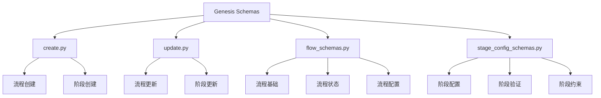
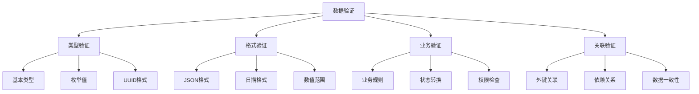

# Genesis Schema Module

## 概述

Genesis Schema 模块定义了创作流程相关的数据结构和验证规则，为 API 接口和数据持久化提供统一的模式定义。

## 核心功能

### 主要组件

- **流程模式**：定义 Genesis 流程的数据结构
- **阶段模式**：定义创作阶段的数据结构
- **配置模式**：定义流程和阶段的配置信息
- **验证规则**：提供数据验证和约束检查

### 模式关系



## 文件说明

### `create.py`

**创建模式定义**，包含：

- **流程创建模式**：`FlowCreate` - 创建新流程的请求数据结构
- **阶段创建模式**：`StageCreate` - 创建新阶段的请求数据结构
- **会话创建模式**：`SessionCreate` - 创建会话的请求数据结构

#### 核心类

```python
class FlowCreate(BaseModel):
    """创建 Genesis 流程的请求模式"""
    novel_id: UUID
    config: dict[str, Any] = {}
    metadata: dict[str, Any] = {}

class StageCreate(BaseModel):
    """创建创作阶段的请求模式"""
    flow_id: UUID
    stage_type: GenesisStage
    config: dict[str, Any] = {}
    dependencies: list[UUID] = []
```

### `update.py`

**更新模式定义**，包含：

- **流程更新模式**：`FlowUpdate` - 更新流程的请求数据结构
- **阶段更新模式**：`StageUpdate` - 更新阶段的请求数据结构
- **状态更新模式**：`StatusUpdate` - 更新状态的请求数据结构

#### 核心类

```python
class FlowUpdate(BaseModel):
    """更新 Genesis 流程的请求模式"""
    status: GenesisStatus | None = None
    config: dict[str, Any] | None = None
    metadata: dict[str, Any] | None = None

class StageUpdate(BaseModel):
    """更新创作阶段的请求模式"""
    status: StageStatus | None = None
    config: dict[str, Any] | None = None
    progress: float | None = None
```

### `flow_schemas.py`

**流程相关模式**，包含：

- **流程基础模式**：`FlowBase` - 流程的基础数据结构
- **流程响应模式**：`FlowResponse` - API 响应数据结构
- **流程列表模式**：`FlowListResponse` - 列表响应数据结构
- **流程状态模式**：`FlowStatusResponse` - 状态响应数据结构

#### 核心类

```python
class FlowBase(BaseModel):
    """Genesis 流程的基础模式"""
    id: UUID
    novel_id: UUID
    status: GenesisStatus
    config: dict[str, Any]
    metadata: dict[str, Any]
    created_at: datetime
    updated_at: datetime

class FlowResponse(FlowBase):
    """流程响应模式"""
    stages: list[StageSummary]
    current_stage: StageSummary | None
    progress: float
```

### `stage_config_schemas.py`

**阶段配置模式**，包含：

- **阶段配置基础**：`StageConfigBase` - 阶段配置的基础结构
- **配置验证**：`ConfigValidator` - 配置验证逻辑
- **完整性检查**：`ConfigCompletenessChecker` - 配置完整性检查

#### 核心类

```python
class StageConfigBase(BaseModel):
    """阶段配置的基础模式"""
    stage_type: GenesisStage
    config: dict[str, Any]
    constraints: dict[str, Any] = {}
    dependencies: list[str] = []

def check_stage_config_completeness(
    config: dict[str, Any], 
    stage_type: GenesisStage
) -> bool:
    """检查阶段配置的完整性"""
    pass
```

## 数据验证

### 验证规则



### 自定义验证器

```python
@validator('progress')
def validate_progress(cls, v):
    """验证进度值在 0-1 之间"""
    if v is not None and (v < 0 or v > 1):
        raise ValueError('Progress must be between 0 and 1')
    return v

@validator('config')
def validate_config(cls, v, values):
    """验证配置格式和内容"""
    stage_type = values.get('stage_type')
    if stage_type and v:
        validate_stage_config(stage_type, v)
    return v
```

## 配置模式

### 阶段配置结构

```python
# 世界观构建阶段配置示例
WORLD_BUILDING_CONFIG = {
    "elements": ["setting", "culture", "history", "magic_system"],
    "requirements": {
        "min_elements": 2,
        "required_elements": ["setting"]
    },
    "validation": {
        "consistency_check": True,
        "conflict_resolution": "manual"
    }
}

# 角色设计阶段配置示例
CHARACTER_DESIGN_CONFIG = {
    "aspects": ["personality", "background", "motivation", "relationships"],
    "limits": {
        "max_characters": 10,
        "min_main_characters": 1
    },
    "templates": ["protagonist", "antagonist", "supporting"]
}
```

## 使用示例

### 创建流程

```python
# 创建流程
flow_create = FlowCreate(
    novel_id=novel_id,
    config={
        "auto_advance": True,
        "validation_level": "strict"
    }
)

# 验证数据
try:
    flow_create.validate()
except ValidationError as e:
    print(f"验证失败: {e}")
```

### 更新阶段

```python
# 更新阶段
stage_update = StageUpdate(
    status=StageStatus.COMPLETED,
    progress=1.0,
    config={
        "completion_notes": "所有角色设计完成",
        "quality_score": 0.95
    }
)
```

## 最佳实践

### 模式设计

- **明确字段含义**：使用清晰的字段名和描述
- **合理使用默认值**：为可选字段提供合适的默认值
- **类型安全**：使用严格的类型定义
- **验证完整**：提供全面的验证规则

### 性能优化

- **惰性验证**：只在需要时进行验证
- **批量验证**：支持批量数据验证
- **缓存验证结果**：缓存验证逻辑的结果
- **异步验证**：对于复杂的验证逻辑使用异步

### 错误处理

- **清晰的错误信息**：提供明确的错误描述
- **错误代码标准化**：使用统一的错误代码
- **错误恢复**：提供错误恢复建议
- **日志记录**：记录验证错误和调试信息

## 扩展指南

### 添加新的模式

1. 在对应文件中定义新的模式类
2. 添加必要的验证器
3. 更新导入和导出
4. 编写测试用例
5. 更新文档

### 扩展现有模式

1. 分析现有模式结构
2. 添加新字段或方法
3. 更新验证逻辑
4. 保持向后兼容性
5. 测试兼容性

### 自定义验证器

1. 实现验证器函数
2. 注册到对应的字段
3. 处理验证异常
4. 提供错误信息
5. 测试验证逻辑

---

*该模块为整个 Genesis 系统提供统一的数据结构定义，确保数据的一致性和完整性，是系统稳定运行的基础。*