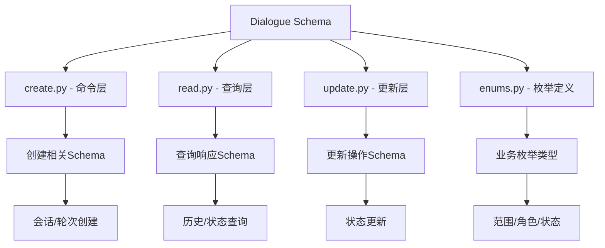
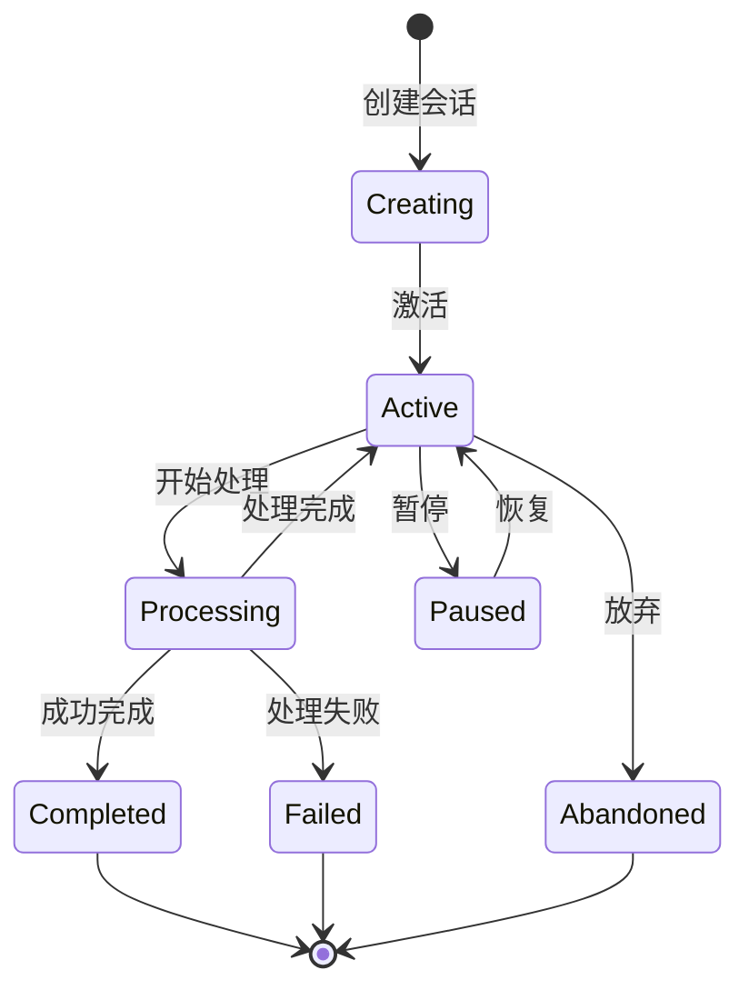
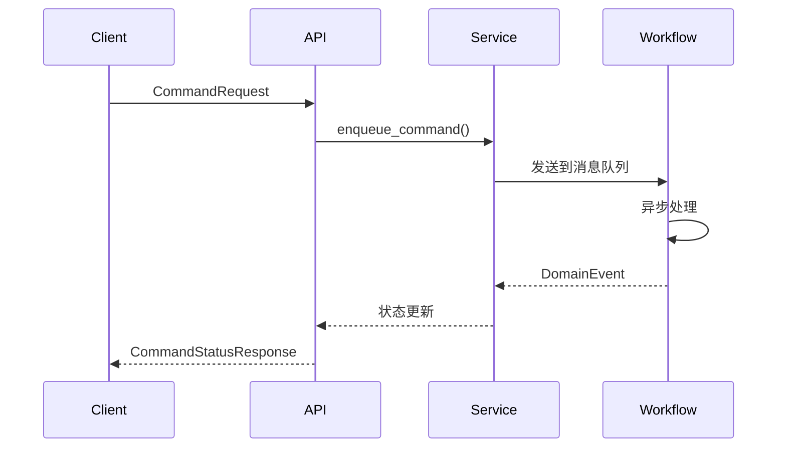

# Novel Dialogue Schema

## 概述

Novel Dialogue Schema 模块定义了小说对话系统的数据模型，采用 CQRS（命令查询职责分离）架构模式。该模块为 InfiniteScribe 的对话系统提供完整的类型安全数据结构。

## 架构设计

### CQRS 分层架构



## 核心概念

### 对话会话 (Conversation Session)

对话会话是对话系统的基础聚合根，包含：

- **scope_type**: 对话范围类型
- **scope_id**: 业务实体标识
- **status**: 会话生命周期状态
- **stage**: 当前处理阶段
- **state**: 会话聚合状态
- **version**: 乐观并发控制版本

### 对话轮次 (Conversation Round)

分层对话轮次结构：

- **round_path**: 分层路径标识（如 "1", "2.1", "2.1.1"）
- **role**: 参与者角色
- **input/output**: 输入输出数据
- **model**: 使用的 LLM 模型
- **tokens**: Token 计数和成本
- **correlation_id**: 请求关联标识

### 命令系统 (Command System)

异步命令执行框架：

- **CommandRequest**: 命令请求模型
- **CommandStatusResponse**: 命令状态响应
- **PendingCommandResponse**: 待处理命令响应
- **CommandEventItem**: 命令事件时间线

## 枚举类型

### ScopeType - 对话范围

```python
class ScopeType(str, Enum):
    GENESIS = "GENESIS"        # 小说创作阶段
    CHAPTER = "CHAPTER"        # 章节写作阶段
    REVIEW = "REVIEW"          # 审查和修订阶段
    PLANNING = "PLANNING"      # 规划和大纲阶段
    WORLDBUILDING = "WORLDBUILDING"  # 世界构建阶段
```

### SessionStatus - 会话状态

```python
class SessionStatus(str, Enum):
    ACTIVE = "ACTIVE"          # 会话当前活跃
    PROCESSING = "PROCESSING"  # 会话正在处理中
    COMPLETED = "COMPLETED"    # 会话成功完成
    FAILED = "FAILED"          # 会话处理失败
    ABANDONED = "ABANDONED"    # 会话被放弃
    PAUSED = "PAUSED"          # 会话已暂停
```

### DialogueRole - 对话角色

```python
class DialogueRole(str, Enum):
    USER = "user"             # 用户
    ASSISTANT = "assistant"   # AI助手
    SYSTEM = "system"         # 系统
    TOOL = "tool"             # 工具
```

## Schema 详细说明

### 创建 Schema (create.py)

#### ConversationSessionCreate
```python
class ConversationSessionCreate(BaseSchema):
    scope_type: ScopeType                  # 对话范围类型
    scope_id: str                         # 业务实体ID
    stage: str | None                     # 可选阶段
    initial_state: dict[str, Any]         # 初始状态
```

#### ConversationRoundCreate
```python
class ConversationRoundCreate(BaseSchema):
    session_id: UUID                      # 父会话ID
    round_path: str                       # 分层轮次路径
    role: DialogueRole                    # 参与者角色
    input: dict[str, Any]                 # 轮次输入
    model: str                            # 使用的LLM模型
    correlation_id: str | None            # 关联ID
```

### 查询 Schema (read.py)

#### ConversationSessionResponse
```python
class ConversationSessionResponse(BaseSchema):
    id: UUID                              # 会话ID
    scope_type: ScopeType                 # 范围类型
    scope_id: str                         # 业务实体ID
    status: SessionStatus                 # 会话状态
    stage: str | None                     # 当前阶段
    state: dict[str, Any]                # 会话状态
    version: int                          # 版本号
    created_at: datetime                  # 创建时间
    updated_at: datetime                  # 更新时间
```

#### ConversationRoundResponse
```python
class ConversationRoundResponse(BaseSchema):
    session_id: UUID                      # 父会话ID
    round_path: str                       # 分层轮次路径
    role: DialogueRole                    # 参与者角色
    input: dict[str, Any]                 # 轮次输入
    output: dict[str, Any] | None         # 轮次输出
    tool_calls: list[dict[str, Any]] | None  # 工具调用
    model: str                            # 使用的LLM模型
    tokens_in: int | None                 # 输入token数量
    tokens_out: int | None                # 输出token数量
    latency_ms: int | None                # 响应延迟
    cost: Decimal | None                  # 轮次成本
    correlation_id: str | None            # 关联ID
    created_at: datetime                  # 创建时间
```

### 更新 Schema (update.py)

#### ConversationSessionUpdate
```python
class ConversationSessionUpdate(BaseSchema):
    status: SessionStatus | None          # 会话状态
    stage: str | None                     # 当前阶段
    state: dict[str, Any] | None         # 会话状态
```

#### ConversationRoundUpdate
```python
class ConversationRoundUpdate(BaseSchema):
    output: dict[str, Any]                # 轮次输出
    tool_calls: list[dict[str, Any]] | None  # 工具调用
    tokens_in: int                        # 输入token数量
    tokens_out: int                       # 输出token数量
    latency_ms: int                       # 响应延迟
    cost: Decimal | None                  # 轮次成本
```

## 数据流转

### 对话生命周期



### 命令执行流程



## 验证和约束

### 路径格式验证

```python
@field_validator("round_path")
@classmethod
def validate_round_path(cls, v: str) -> str:
    """验证分层轮次路径格式"""
    if not re.match(r"^(\d+)(\.(\d+))*$", v):
        raise ValueError(f"无效的轮次路径格式: {v}")
    return v
```

### 状态验证

```python
@model_validator(mode="after")
def at_least_one_field(self):
    """确保至少提供一个字段进行更新"""
    if all(value is None for value in self.model_dump().values()):
        raise ValueError("更新时至少必须提供一个字段")
    return self
```

### 数值约束

```python
tokens_in: int = Field(..., ge=0, description="输入token数量")
tokens_out: int = Field(..., ge=0, description="输出token数量")
latency_ms: int = Field(..., ge=0, description="响应延迟")
cost: Decimal | None = Field(None, ge=0, decimal_places=4, description="轮次成本")
```

## 使用示例

### 创建对话会话

```python
from src.schemas.novel.dialogue.create import CreateSessionRequest
from src.schemas.novel.dialogue.enums import ScopeType

request = CreateSessionRequest(
    scope_type=ScopeType.GENESIS,
    scope_id="novel-123"
)
```

### 创建对话轮次

```python
from src.schemas.novel.dialogue.create import ConversationRoundCreate
from src.schemas.novel.dialogue.enums import DialogueRole
from uuid import uuid4

round_create = ConversationRoundCreate(
    session_id=uuid4(),
    round_path="1",
    role=DialogueRole.USER,
    input={"message": "开始新的故事"},
    model="gpt-4",
    correlation_id="req-456"
)
```

### 查询对话历史

```python
from src.schemas.novel.dialogue.read import DialogueHistory

# 服务层返回的对话历史
history = DialogueHistory(
    session=session_response,
    rounds=round_responses,
    total_tokens_in=1500,
    total_tokens_out=2000,
    total_cost=Decimal("0.025")
)
```

### 更新会话状态

```python
from src.schemas.novel.dialogue.update import ConversationSessionUpdate
from src.schemas.novel.dialogue.enums import SessionStatus

update = ConversationSessionUpdate(
    status=SessionStatus.PROCESSING,
    stage="chapter_planning"
)
```

## 类型安全特性

### Pydantic 集成

- **自动类型转换**: 类型安全的自动转换
- **数据验证**: 运行时数据验证
- **序列化支持**: JSON 序列化/反序列化
- **文档生成**: 自动生成 API 文档

### 字段描述

```python
scope_type: ScopeType = Field(
    ..., 
    description="对话范围类型",
    examples=["GENESIS"]
)
correlation_id: str | None = Field(
    None, 
    description="请求相关ID，用于幂等性"
)
```

## 性能优化

### 数据结构优化

- **分层路径**: 使用字符串路径表示层级关系
- **状态字典**: 灵活的状态存储结构
- **成本计算**: Decimal 类型确保精度
- **版本控制**: 乐观并发控制

### 缓存支持

```python
class DialogueCache(BaseSchema):
    session_id: UUID
    scope_type: ScopeType
    scope_id: str
    status: SessionStatus
    state: dict[str, Any]
    last_round_path: str | None
    ttl_seconds: int = 2592000  # 30天
    
    @property
    def cache_key(self) -> str:
        return f"dialogue:session:{self.session_id}"
```

## 扩展性设计

### 模块化结构

```
dialogue/
├── create.py      # 创建操作
├── read.py        # 查询操作
├── update.py      # 更新操作
└── enums.py       # 枚举定义
```

### 向后兼容

- **API 兼容 Schema**: 保持 API 兼容性
- **版本管理**: 支持数据模型版本演进
- **字段别名**: 支持字段重命名

## 最佳实践

### Schema 设计原则

1. **单一职责**: 每个 Schema 有明确的用途
2. **类型安全**: 充分利用 Python 类型系统
3. **验证完整**: 覆盖所有业务规则
4. **文档友好**: 提供清晰的字段描述

### 使用建议

1. **创建操作**: 使用 create.py 中的 Schema
2. **查询操作**: 使用 read.py 中的 Schema
3. **更新操作**: 使用 update.py 中的 Schema
4. **枚举常量**: 使用 enums.py 中的类型

### 错误处理

```python
try:
    # Schema 验证
    session = ConversationSessionCreate(**data)
except ValidationError as e:
    # 处理验证错误
    print(f"验证失败: {e}")
```

## 监控和调试

### 数据验证

- **类型检查**: 运行时类型验证
- **约束检查**: 业务规则验证
- **格式验证**: 数据格式检查

### 调试支持

```python
# 模型序列化
session_dict = session.model_dump()

# 模型验证
try:
    validated = ConversationSessionCreate(**data)
except ValidationError as e:
    print(f"验证错误: {e.errors()}")
```