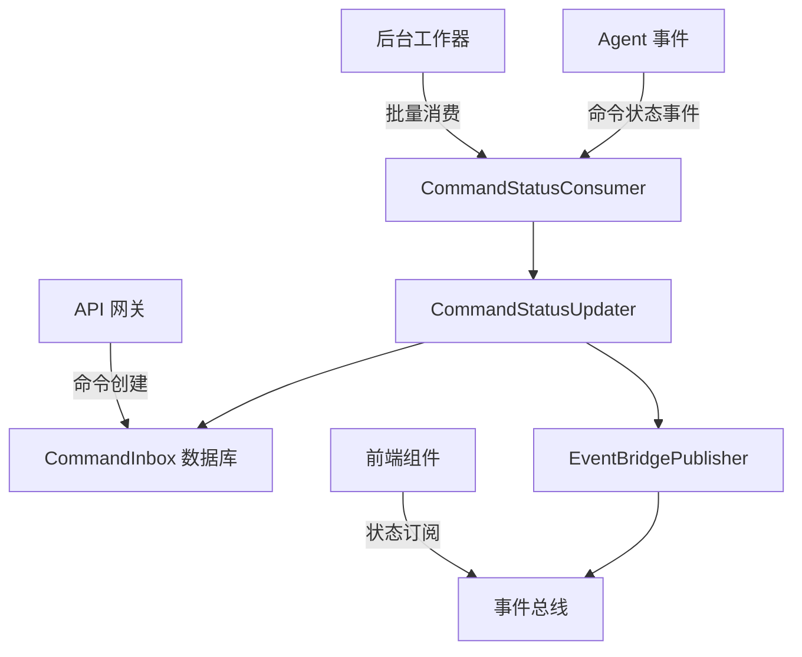
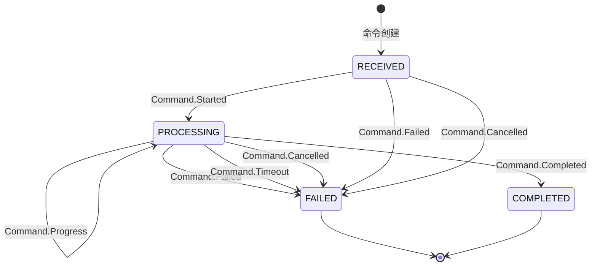
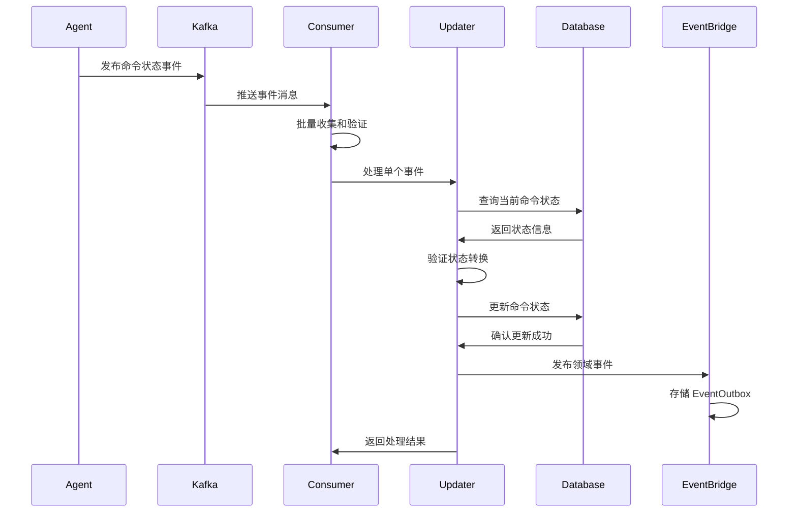
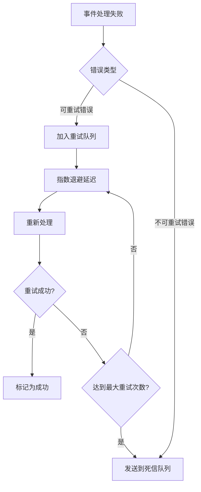

# Command Services

命令服务模块负责处理系统中的命令状态管理和事件驱动架构，实现了完整的命令生命周期管理。

## 🏗️ 架构概述

### 核心职责
- 命令状态的统一管理和更新
- 事件驱动的状态同步机制
- 可靠的事件发布和订阅
- 错误恢复和重试机制

### 技术架构


## 📁 目录结构

```
command/
├── command_status_consumer.py    # 命令状态消费者
├── command_status_updater.py     # 命令状态更新器
└── event_publisher.py            # 事件发布器
```

## 🔧 核心组件

### CommandStatusConsumer

负责消费和处理命令状态事件的 Kafka 消费者实现。

#### 主要功能
- 批量消费命令事件消息
- 实现重试和死信队列机制
- 提供详细的处理统计和监控
- 支持多种事件格式和验证

#### 关键特性
- **批量处理**: 高效的批量事件消费
- **错误恢复**: 指数退避重试策略
- **死信队列**: 处理永久失败的事件
- **健康检查**: 完整的系统健康状态监控

#### 配置参数
```python
max_retries: int = 3                    # 最大重试次数
retry_delay_seconds: int = 1           # 重试基础延迟
batch_size: int = 100                   # 批处理大小
enable_dlq: bool = True                 # 启用死信队列
```

#### 处理统计
```python
processed_count: int      # 总处理事件数
success_count: int         # 成功事件数
error_count: int           # 错误事件数
dlq_count: int             # 死信队列事件数
success_rate: float        # 成功率
error_rate: float          # 错误率
```

### CommandStatusUpdater

实现核心状态更新逻辑的单一写入者模式组件。

#### 主要功能
- 管理命令状态的合法转换
- 实现幂等性状态更新
- 处理超时命令的看门狗机制
- 发布领域事件到 EventBridge

#### 状态转换规则


#### 支持的事件类型
```python
CommandEventType:
    STARTED = "Command.Started"      # Agent 开始处理
    PROGRESS = "Command.Progress"    # 处理进度更新
    COMPLETED = "Command.Completed"  # 处理成功
    FAILED = "Command.Failed"        # 处理失败
    TIMEOUT = "Command.Timeout"      # 处理超时
    CANCELLED = "Command.Cancelled"  # 处理取消
```

### EventBridgePublisher

负责将领域事件发布到 EventBridge 的事件发布器。

#### 主要功能
- 可靠的事件发布机制
- 事件格式验证和标准化
- 支持 Outbox 模式确保发布可靠性
- 提供多种发布策略

#### 发布策略
- **Outbox 模式**: 通过 EventOutbox 表实现可靠发布
- **直接发布**: 开发环境下的直接发布
- **NoOp 发布**: 测试环境的无操作发布

#### 事件格式
```json
{
  "event_type": "Genesis.Session.Command.Completed",
  "aggregate_type": "Session",
  "aggregate_id": "session_uuid",
  "payload": {
    "command_id": "command_uuid",
    "session_id": "session_uuid",
    "user_id": 123,
    "old_status": "PROCESSING",
    "new_status": "COMPLETED"
  },
  "metadata": {
    "source": "command-status-updater",
    "correlation_id": "command_uuid",
    "published_at": "2024-01-01T00:00:00Z"
  }
}
```

## 🔄 处理流程

### 命令状态更新流程


### 错误处理和重试机制


## 📊 监控和统计

### 处理指标
- **批处理统计**: 批次大小、处理时间、成功率
- **重试统计**: 重试次数、成功率、失败原因分布
- **死信队列**: DLQ 事件数量、错误类型分析
- **性能指标**: 处理延迟、吞吐量、资源使用

### 健康检查
```python
# 系统健康状态
{
  "status": "healthy",
  "component": "CommandStatusConsumer",
  "stats": {
    "processed_count": 1000,
    "success_count": 950,
    "error_count": 50,
    "success_rate": 0.95
  },
  "configuration": {
    "max_retries": 3,
    "batch_size": 100,
    "enable_dlq": true
  }
}
```

## 🚀 使用指南

### 初始化消费者
```python
consumer = CommandStatusConsumer(
    session_factory=session_factory,
    event_publisher=event_publisher,
    max_retries=3,
    batch_size=100,
    enable_dlq=True
)
```

### 处理事件批次
```python
result = await consumer.consume_command_events(
    events=event_list,
    context={"source": "api-gateway"}
)
```

### 状态更新器使用
```python
updater = CommandStatusUpdater(event_publisher)
result = await updater.handle_command_event(db, event)
```

### 事件发布
```python
publisher = EventBridgePublisher()
success = await publisher.publish_event(domain_event)
```

## 🔧 开发指南

### 添加新的命令事件类型
1. 在 `CommandEventType` 枚举中添加新类型
2. 更新 `VALID_TRANSITIONS` 状态转换规则
3. 在 `CommandStatusUpdater` 中实现处理逻辑
4. 添加对应的测试用例

### 扩展事件发布器
1. 实现 `DomainEventPublisher` 接口
2. 添加新的事件格式支持
3. 集成外部事件总线系统
4. 实现发布重试和监控机制

### 性能优化
- 调整批处理大小和轮询超时
- 优化数据库查询和连接池
- 实现并行处理和异步IO
- 监控内存使用和GC性能

## 📝 最佳实践

### 错误处理
- 实现完善的错误分类和处理策略
- 使用结构化日志记录错误上下文
- 提供清晰的错误恢复机制
- 实现死信队列避免消息丢失

### 幂等性设计
- 使用数据库条件更新确保幂等性
- 实现事件去重和重复检测
- 设计可重试的操作和事务
- 维护状态转换的合法性检查

### 监控和告警
- 监控关键性能指标和业务指标
- 设置合理的告警阈值和通知机制
- 实现详细的处理统计和分析
- 提供可视化的监控界面

## 🔗 相关组件

- **CommandInbox**: 命令数据模型
- **EventOutbox**: 事件输出箱模型
- **KafkaClientManager**: Kafka 客户端管理
- **CommandStatusWorker**: 后台工作器集成