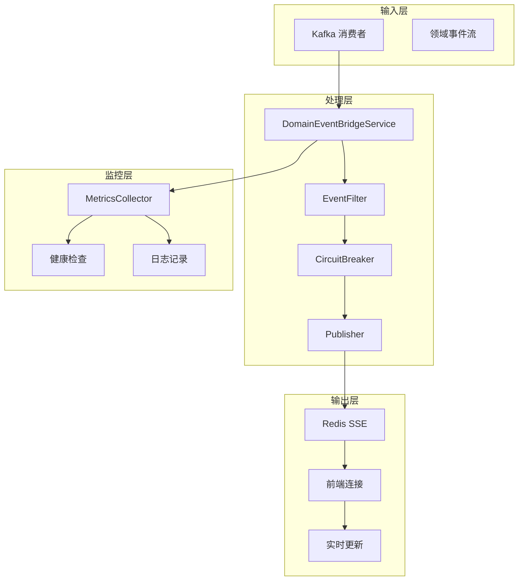
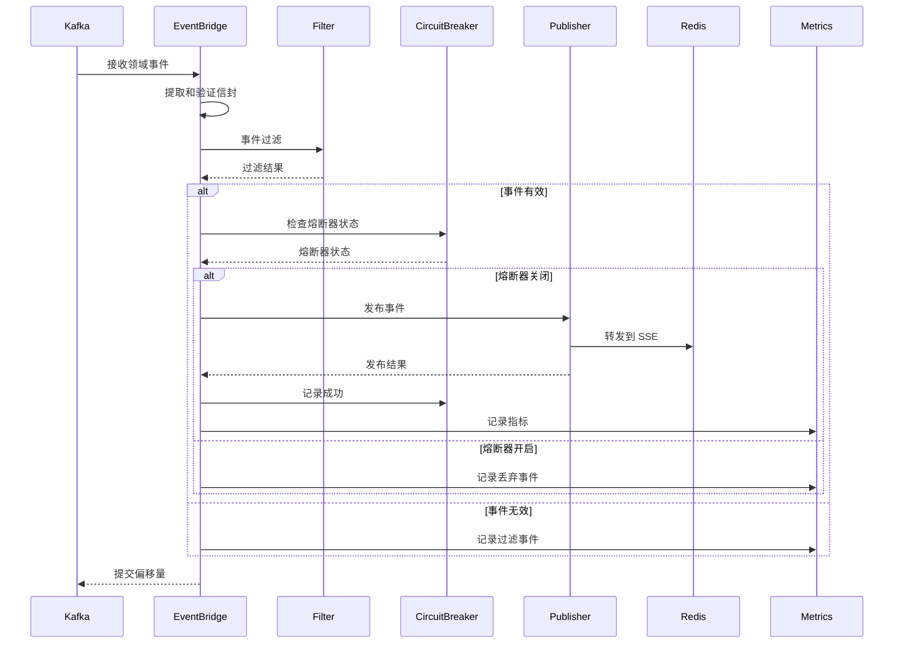
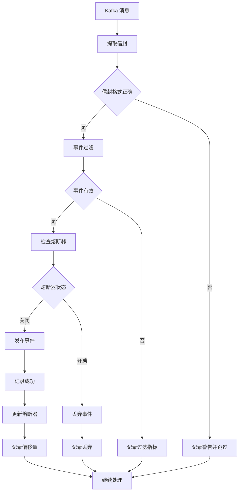
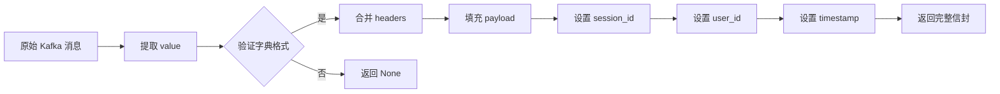
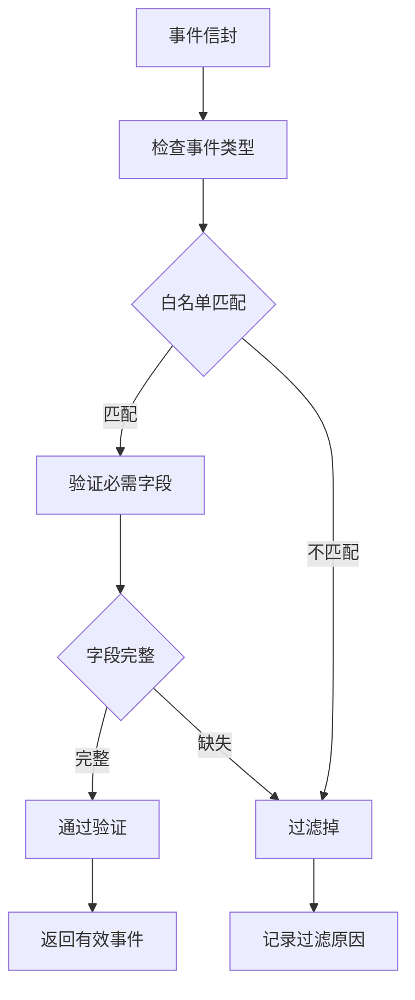
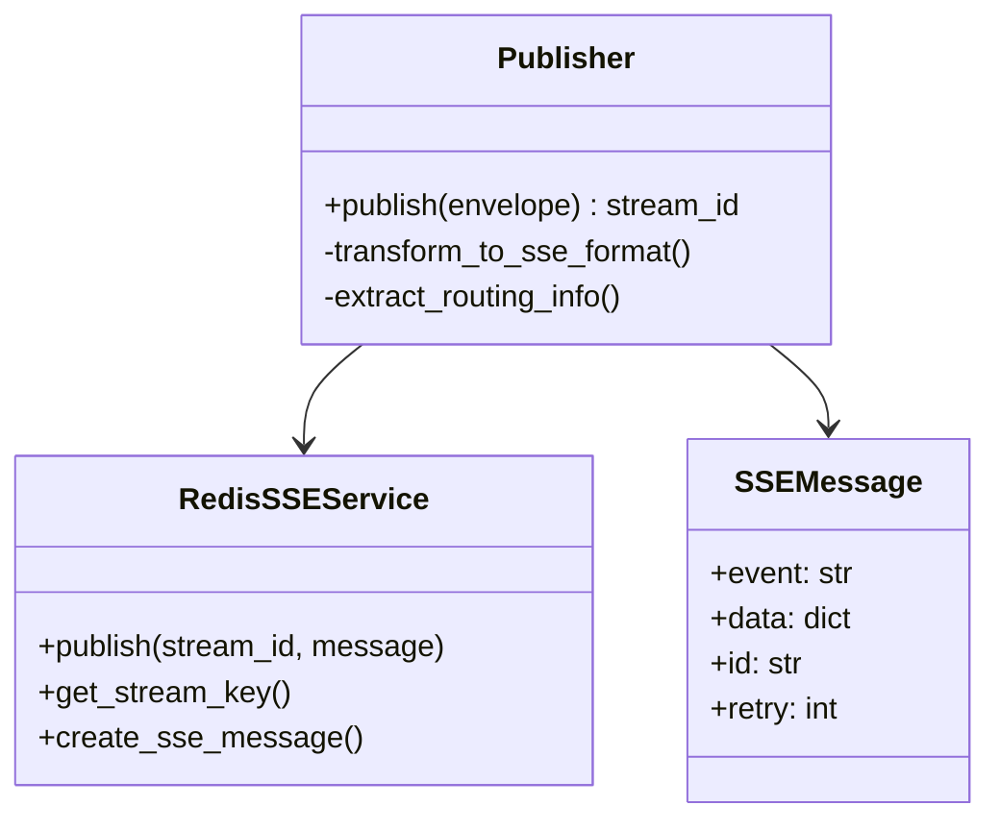
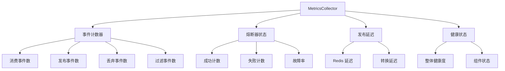
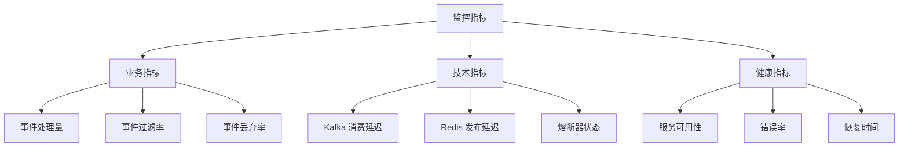
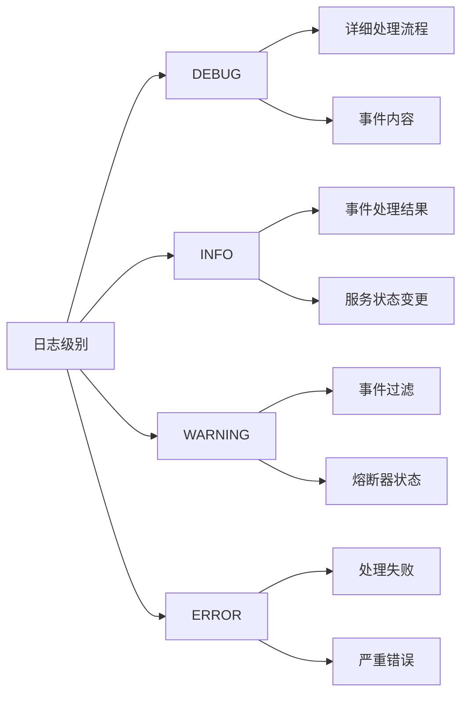
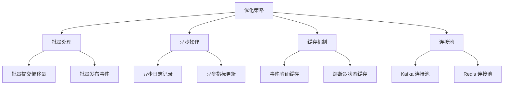

# 事件桥接服务 (EventBridge Service)

实现 Kafka 领域事件到 SSE 通道的桥接服务，采用熔断器模式和优雅降级策略，确保高可用性和容错性。

## 🏗️ 架构概览

### 核心职责

- **事件消费**：从 Kafka 主题消费领域事件
- **事件过滤**：根据业务规则验证和过滤事件
- **熔断保护**：优雅处理 Redis 故障
- **事件发布**：转换并发布到 SSE 通道
- **健康监控**：全面的指标收集和健康状态管理

### 架构图



## 📁 目录结构

```
eventbridge/
├── __init__.py           # 服务导出和注册
├── bridge.py             # 主桥接服务（主要变更）
├── circuit_breaker.py    # 熔断器实现
├── constants.py          # 常量定义
├── factory.py            # 服务工厂
├── filter.py             # 事件过滤器
├── main.py               # 主程序入口
├── metrics.py            # 指标收集器
└── publisher.py          # 事件发布器
```

## 🎯 核心组件

### DomainEventBridgeService

主桥接服务类，协调所有组件实现完整的事件处理流水线：



### 事件处理流程



### CircuitBreaker 熔断器

实现熔断器模式，防止 Redis 故障导致的级联故障：

```mermaid
stateDiagram-v2
    [*] --> CLOSED: 初始状态
    CLOSED --> OPEN: 故障率超过阈值
    OPEN --> HALF_OPEN: 超时重试
    HALF_OPEN --> CLOSED: 重试成功
    HALF_OPEN --> OPEN: 重试失败
    
    CLOSED --> CLOSED: 成功请求
    CLOSED --> CLOSED: 失败但未达阈值
    
    note right of CLOSED
        正常处理请求
        统计故障率
    end
    
    note right of OPEN
        快速失败
        停止处理请求
    end
    
    note right of HALF_OPEN
        有限放行
        探测服务恢复
    end
```

## 🔧 核心功能

### 1. 事件信封处理



### 2. 事件过滤机制



### 3. 发布器实现



### 4. 指标收集器



## 🚀 使用示例

### 基础事件处理

```python
# 初始化服务
bridge_service = DomainEventBridgeService(
    kafka_client_manager=kafka_manager,
    offset_manager=offset_manager,
    redis_sse_service=redis_service,
    event_filter=event_filter,
    circuit_breaker=circuit_breaker,
    publisher=publisher,
    metrics_collector=metrics_collector
)

# 设置消费者引用
bridge_service.set_consumer(kafka_consumer)

# 处理事件
result = await bridge_service.process_event(kafka_message)
if result:
    print("事件处理成功")
```

### 自定义事件过滤器

```python
class CustomEventFilter(EventFilter):
    def validate(self, envelope):
        # 实现自定义过滤逻辑
        event_type = envelope.get("event_type", "")
        
        # 只处理特定事件类型
        if not event_type.startswith("Custom."):
            return False, "非自定义事件类型"
            
        # 验证必需字段
        required_fields = ["user_id", "session_id", "payload"]
        for field in required_fields:
            if field not in envelope.get("payload", {}):
                return False, f"缺少必需字段: {field}"
                
        return True, "验证通过"
```

### 健康状态检查

```python
# 获取服务健康状态
health_status = bridge_service.get_health_status()

# 检查服务是否健康
if health_status["healthy"]:
    print("EventBridge 服务运行正常")
    print(f"处理事件数: {health_status['metrics']['events_consumed']}")
    print(f"熔断器状态: {health_status['circuit_breaker']['state']}")
else:
    print("EventBridge 服务存在问题")
    print(f"错误率: {health_status['circuit_breaker']['failure_rate']}")
```

## 📊 监控和调试

### 关键指标



### 日志记录策略



### 性能优化



## 🔍 关键变更点

### 1. 桥接服务增强 (bridge.py)

- **事件信封增强**：支持用户 ID 和时间戳的自动填充
- **熔断器集成**：与 Kafka 分区分配的动态集成
- **错误处理优化**：更细粒度的错误分类和处理
- **日志结构化**：采用结构化日志格式便于分析

### 2. 熔断器分区管理

- **动态分区注册**：根据 Kafka 分配自动注册分区
- **分区状态跟踪**：独立跟踪每个分区的状态
- **重平衡处理**：优雅处理分区重平衡

## 📝 最佳实践

### 1. 容错设计

```python
# 实现重试机制
async def process_with_retry(service, message, max_retries=3):
    for attempt in range(max_retries):
        try:
            return await service.process_event(message)
        except Exception as e:
            if attempt == max_retries - 1:
                # 最后一次尝试失败，记录错误
                logger.error("处理失败", error=str(e))
                return False
            # 指数退避
            await asyncio.sleep(2 ** attempt)
```

### 2. 监控告警

```python
# 设置关键指标监控
def setup_monitoring(metrics_collector):
    # 熔断器状态告警
    if metrics_collector.circuit_breaker.failure_rate > 0.5:
        send_alert("熔断器故障率过高")
    
    # 事件丢弃率告警
    if metrics_collector.event_drop_rate > 0.1:
        send_alert("事件丢弃率过高")
    
    # 服务健康状态告警
    if not metrics_collector.is_healthy():
        send_alert("EventBridge 服务不健康")
```

### 3. 配置管理

```python
# 配置熔断器参数
circuit_breaker_config = {
    "failure_threshold": 5,        # 触发熔断的失败次数
    "recovery_timeout": 60,       # 熔断器重试间隔（秒）
    "half_open_max_attempts": 3, # 半开状态最大尝试次数
    "success_threshold": 2,      # 熔断器关闭的成功次数
}

# 配置事件过滤器
event_filter_config = {
    "allowed_event_types": [
        "Genesis.Session.*",
        "Character.Design.*",
        "Theme.Generated.*"
    ],
    "required_fields": ["session_id", "event_type"],
    "max_payload_size": 1024 * 1024  # 1MB
}
```

## 🔗 相关模块

- **Kafka 客户端**：`src.core.kafka.client` - Kafka 消费者管理
- **偏移量管理**：`src.agents.offset_manager` - 偏移量跟踪和提交
- **Redis SSE**：`src.services.sse.redis_client` - Redis SSE 服务
- **指标收集**：`src.services.eventbridge.metrics` - 指标收集和监控
- **日志记录**：`src.core.logging` - 结构化日志记录

## ⚠️ 注意事项

1. **优雅降级**：Redis 故障时继续处理 Kafka，但丢弃 SSE 事件
2. **幂等性**：确保事件处理的幂等性，避免重复处理
3. **资源管理**：合理管理 Kafka 和 Redis 连接资源
4. **监控告警**：设置关键指标监控和异常告警
5. **性能优化**：根据实际负载调整批量处理和并发参数

## 🔄 部署和运维

### 容器化部署

```yaml
# docker-compose.yml
services:
  eventbridge:
    image: infinite-scribe/eventbridge
    environment:
      - KAFKA_BOOTSTRAP_SERVERS=kafka:9092
      - REDIS_URL=redis://redis:6379
      - CIRCUIT_BREAKER_FAILURE_THRESHOLD=5
    depends_on:
      - kafka
      - redis
    healthcheck:
      test: ["CMD", "python", "-c", "from src.services.eventbridge.bridge import DomainEventBridgeService; print('OK')"]
      interval: 30s
      timeout: 10s
      retries: 3
```

### 健康检查

```python
# 实现健康检查端点
@app.get("/health")
async def health_check():
    health_status = bridge_service.get_health_status()
    
    if health_status["healthy"]:
        return {"status": "healthy", **health_status}
    else:
        raise HTTPException(
            status_code=503,
            detail={"status": "unhealthy", **health_status}
        )
```