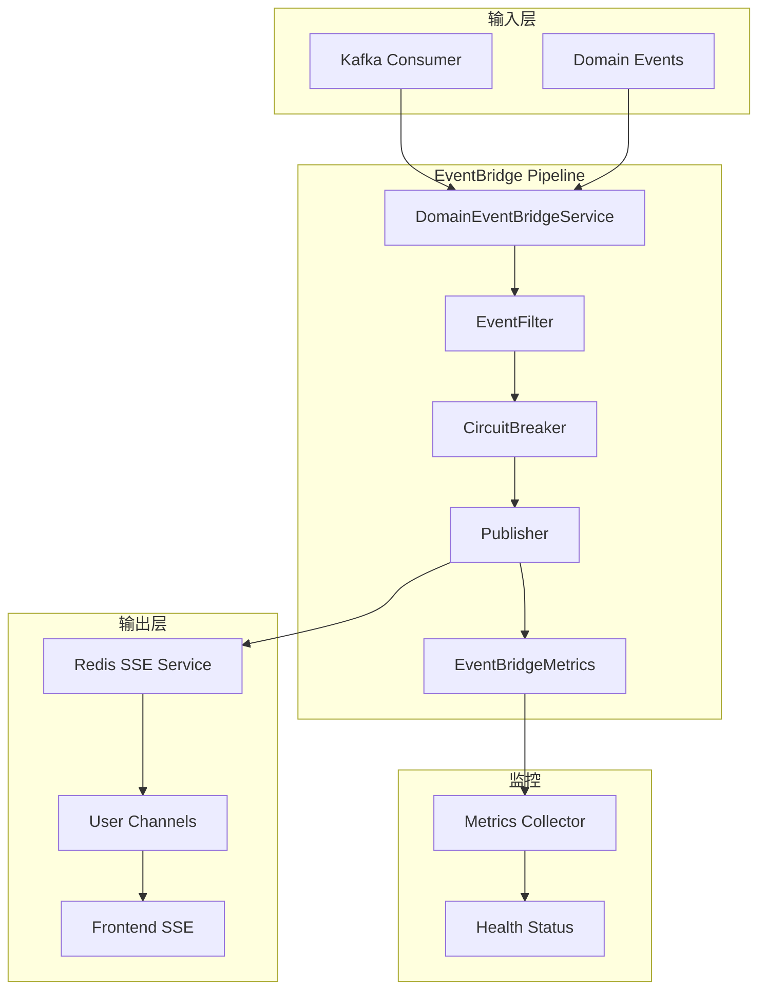
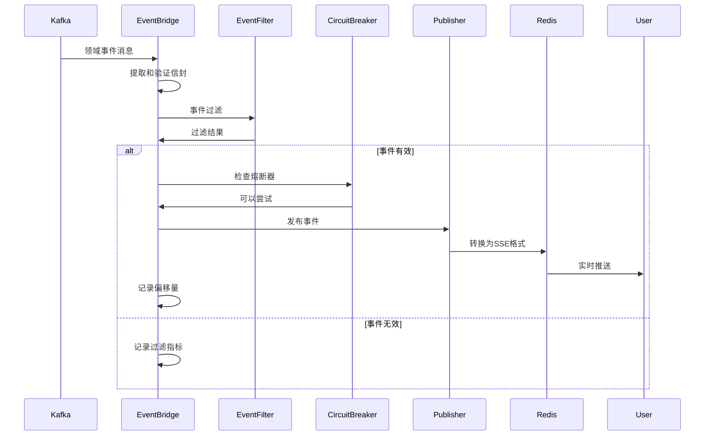
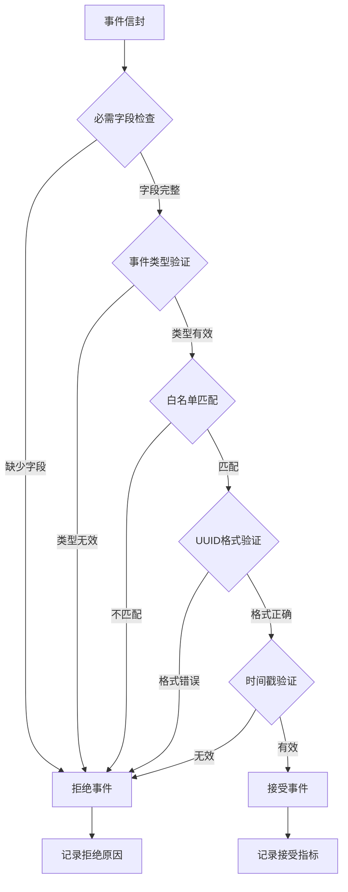
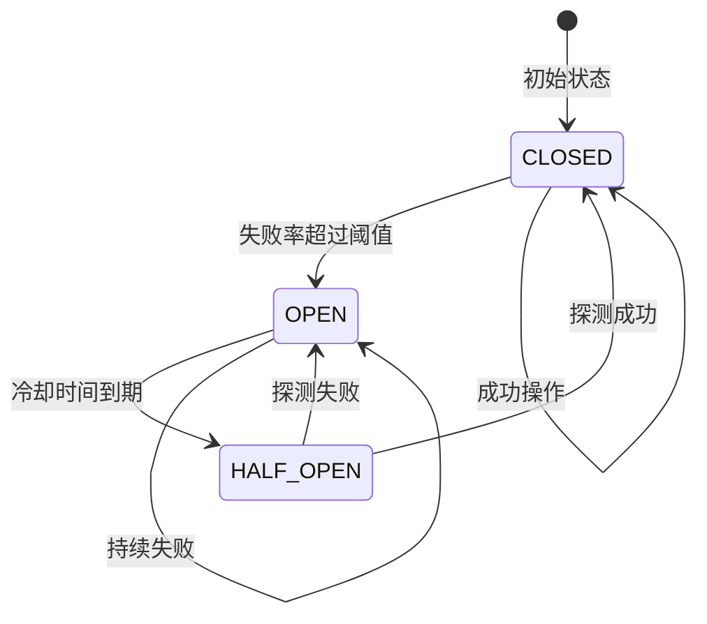
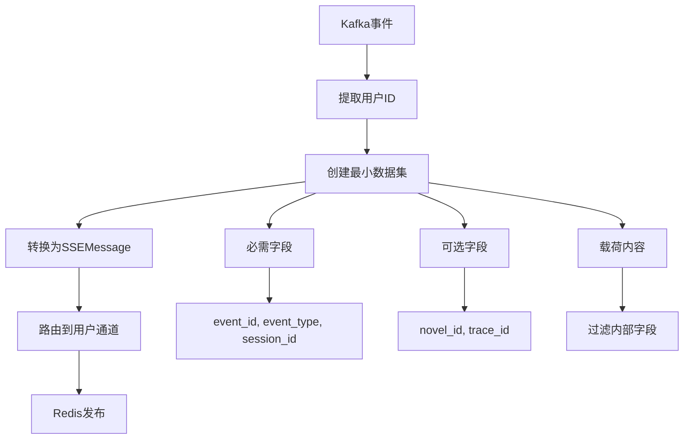

# 事件桥接服务 (EventBridge Service)

负责将 Kafka 中的领域事件通过 Redis 桥接到 SSE 通道，实现实时事件推送的核心服务。

## 🏗️ 架构概览

### 核心功能

EventBridge 服务采用流水线架构，实现了从 Kafka 到 SSE 的完整事件传递链路：

- **事件消费**：从 Kafka 主题接收领域事件
- **事件过滤**：根据业务规则验证和过滤事件
- **熔断保护**：优雅处理 Redis 故障，防止级联故障
- **事件转换**：将领域事件转换为 SSE 消息格式
- **实时推送**：通过 Redis SSE 服务路由到用户通道

### 架构图



## 📁 核心组件

### DomainEventBridgeService

主服务类，协调整个事件处理流程：

```python
class DomainEventBridgeService:
    async def process_event(self, message: Any) -> bool:
        """处理单个 Kafka 消息"""
        
    async def commit_processed_offsets(self) -> None:
        """批量提交已处理的偏移量"""
        
    async def shutdown(self) -> None:
        """优雅关闭服务"""
```

### 事件处理流程



## 🔧 关键特性

### 1. 事件过滤 (EventFilter)

实现严格的事件验证和过滤规则：

```python
class EventFilter:
    # 允许的事件类型白名单
    ALLOWED_EVENT_PATTERNS = [
        r"^Genesis\.Session\.Started$",
        r"^Genesis\.Session\.Command\.Received$",
        r"^Genesis\.Session\..*\.Requested$",
        r"^Genesis\.Session\..*\.Generated$",
        # ... 更多模式
    ]
    
    def validate(self, envelope: dict[str, Any]) -> tuple[bool, str | None]:
        """验证事件信封"""
```

**过滤流程**：


### 2. 熔断器 (CircuitBreaker)

实现智能的 Redis 故障保护机制：

```python
class CircuitBreaker:
    def can_attempt(self) -> bool:
        """检查是否可以尝试操作"""
        
    def record_success(self) -> None:
        """记录成功操作"""
        
    def record_failure(self) -> None:
        """记录失败操作"""
```

**熔断器状态**：


### 3. 事件发布器 (Publisher)

负责事件格式转换和路由：

```python
class Publisher:
    async def publish(self, envelope: dict[str, Any]) -> str:
        """发布事件到用户通道"""
```

**数据转换流程**：


### 4. 指标收集 (EventBridgeMetricsCollector)

全面的性能和健康指标监控：

```python
class EventBridgeMetricsCollector:
    def record_event_consumed(self) -> None:
        """记录事件消费"""
        
    def record_event_published(self) -> None:
        """记录事件发布"""
        
    def get_health_status(self) -> dict[str, Any]:
        """获取健康状态"""
```

## 🚀 配置和部署

### 环境配置

```yaml
# EventBridge 配置
eventbridge:
  kafka:
    topic: "genesis.domain.events"
    group_id: "eventbridge-consumer"
    auto_offset_reset: "earliest"
  
  circuit_breaker:
    failure_threshold: 5
    recovery_timeout: 60
    expected_exception: [RedisError, ConnectionError]
  
  metrics:
    collect_interval: 30
    prometheus_enabled: true
    
  redis:
    sse_prefix: "sse:user:"
    channel_ttl: 3600
```

### 依赖服务

- **Kafka**：领域事件源
- **Redis**：SSE 消息中转
- **PostgreSQL**：偏移量管理（可选）
- **Prometheus**：指标导出（可选）

## 📊 监控和调试

### 关键指标

**性能指标**：
- 事件处理吞吐量（events/sec）
- 端到端延迟（ms）
- Redis 发布延迟（ms）
- Kafka 消费延迟（ms）

**健康指标**：
- 熔断器状态和失败率
- Redis 连接状态
- Kafka 消费者滞后
- 错误率和异常统计

**业务指标**：
- 事件过滤率
- 用户推送成功率
- 事件类型分布
- 会话活跃度

### 日志结构

```json
{
  "service": "eventbridge",
  "event_type": "event_published",
  "event_id": "uuid-string",
  "user_id": "user-123",
  "session_id": "session-456",
  "topic": "genesis.domain.events",
  "stream_id": "redis-stream-id",
  "timestamp": "2024-01-01T00:00:00Z"
}
```

### 调试工具

```python
# 健康检查
health_status = eventbridge.get_health_status()

# 手动事件处理测试
test_event = {
    "event_id": str(uuid.uuid4()),
    "event_type": "Genesis.Session.Command.Received",
    "aggregate_id": str(uuid.uuid4()),
    "payload": {
        "user_id": str(uuid.uuid4()),
        "session_id": str(uuid.uuid4()),
        "timestamp": datetime.now().isoformat()
    }
}
success = await eventbridge.process_event(test_message)
```

## 🔍 扩展指南

### 添加新的事件类型

1. **更新过滤规则**：在 `EventFilter.ALLOWED_EVENT_PATTERNS` 中添加新模式
2. **验证逻辑**：根据需要调整字段验证规则
3. **测试覆盖**：添加相应的测试用例

### 自定义指标收集

```python
# 扩展指标收集器
class CustomMetricsCollector(EventBridgeMetricsCollector):
    def record_custom_metric(self, value: float) -> None:
        """记录自定义指标"""
        
    def get_custom_health_status(self) -> dict[str, Any]:
        """获取自定义健康状态"""
```

### 集成外部监控系统

```python
# Prometheus 集成
from prometheus_client import Counter, Histogram

EVENT_COUNTER = Counter('eventbridge_events_total', 'Total events processed', ['type', 'status'])
PROCESSING_TIME = Histogram('eventbridge_processing_seconds', 'Event processing time')
```

## 📝 最佳实践

1. **优雅降级**：Redis 故障时继续处理 Kafka，丢弃 SSE
2. **批量处理**：使用偏移量管理器批量提交
3. **资源管理**：合理设置连接池和超时时间
4. **监控覆盖**：确保关键路径都有指标和日志
5. **错误隔离**：避免单个事件失败影响整体处理
6. **性能优化**：异步处理和连接复用

## 🔗 相关模块

- **Kafka 客户端**：`src.core.kafka.client` - Kafka 消费者管理
- **Redis SSE**：`src.services.sse.redis_client` - Redis SSE 服务
- **偏移量管理**：`src.agents.offset_manager` - Kafka 偏移量管理
- **日志系统**：`src.core.logging` - 结构化日志记录