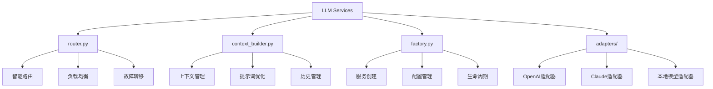
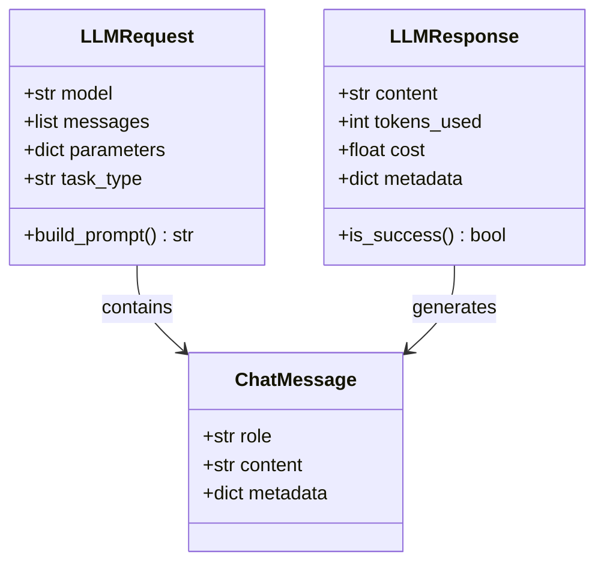
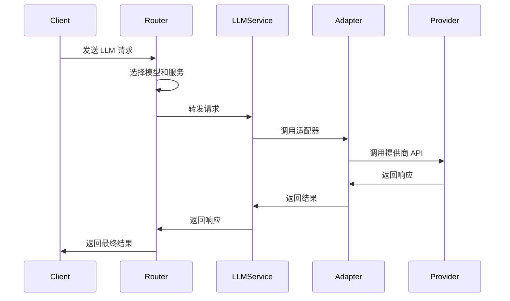
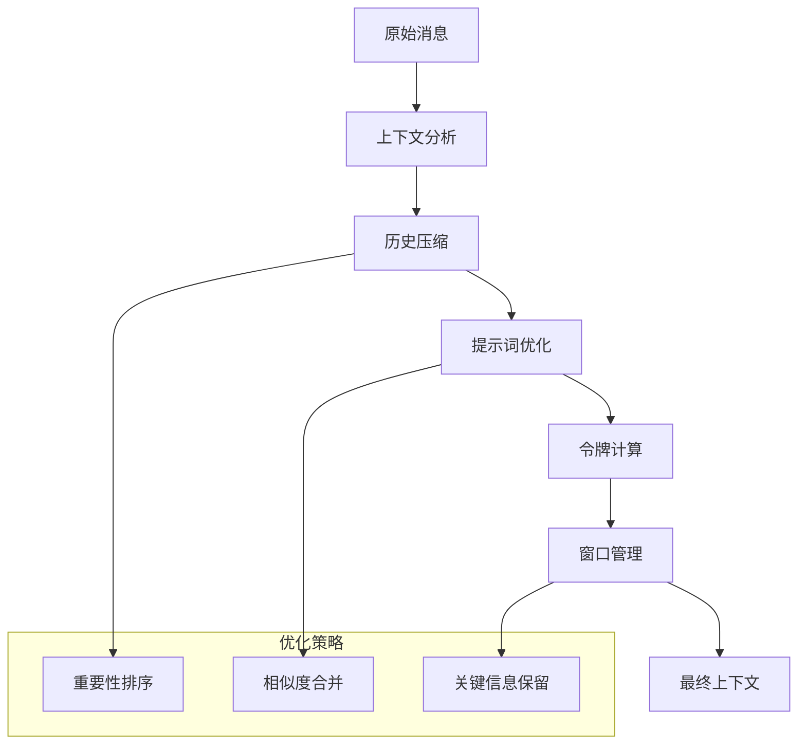

# LLM Services Module

## 概述

LLM Services 模块为 InfiniteScribe 提供统一的 LLM（大语言模型）服务接口，支持多种 LLM 提供商的统一接入和管理。

## 核心功能

### 主要组件

- **LLM 路由器**：智能选择和路由 LLM 请求
- **上下文构建器**：构建和优化 LLM 请求上下文
- **服务工厂**：创建和管理 LLM 服务实例
- **模型适配器**：适配不同 LLM 提供商的 API

### 架构设计



## 文件说明

### `router.py`

**LLM 路由器**，负责：

- **模型选择**：根据任务类型和配置选择合适的 LLM 模型
- **负载均衡**：在多个模型实例间分配请求
- **故障转移**：处理模型不可用的情况
- **性能监控**：跟踪模型的性能指标

#### 核心类

```python
class LLMRouter:
    """LLM 路由器，负责模型选择和请求分发"""
    
    def __init__(
        self,
        config: LLMRouterConfig,
        health_checker: HealthChecker,
        metrics_collector: MetricsCollector
    ):
        self.config = config
        self.health_checker = health_checker
        self.metrics_collector = metrics_collector
        self.model_pool = ModelPool()
    
    async def route_request(
        self, 
        request: LLMRequest
    ) -> LLMResponse:
        """路由 LLM 请求到合适的模型"""
        pass
    
    async def get_model_status(self) -> dict[str, ModelStatus]:
        """获取所有模型的状态"""
        pass
```

### `context_builder.py`

**上下文构建器**，提供：

- **上下文管理**：管理和优化对话上下文
- **提示词构建**：生成优化的提示词
- **历史压缩**：压缩和管理对话历史
- **上下文窗口**：智能管理上下文窗口

#### 核心类

```python
class ContextBuilder:
    """LLM 上下文构建器"""
    
    def __init__(
        self,
        config: ContextConfig,
        tokenizer: Tokenizer,
        cache: ContextCache
    ):
        self.config = config
        self.tokenizer = tokenizer
        self.cache = cache
    
    async def build_context(
        self,
        messages: list[ChatMessage],
        system_prompt: str | None = None,
        context_window: int = 4096
    ) -> list[ChatMessage]:
        """构建优化的上下文"""
        pass
    
    async def compress_history(
        self,
        messages: list[ChatMessage],
        target_length: int
    ) -> list[ChatMessage]:
        """压缩对话历史"""
        pass
```

### `factory.py`

**服务工厂**，负责：

- **服务创建**：创建 LLM 服务实例
- **配置管理**：管理服务配置
- **生命周期**：管理服务的生命周期

#### 核心类

```python
class LLMServiceFactory:
    """LLM 服务工厂"""
    
    def __init__(self, config: LLMConfig):
        self.config = config
        self.adapters: dict[str, LLMAdapter] = {}
        self.services: dict[str, LLMService] = {}
    
    def create_service(
        self, 
        provider: str | None = None,
        model: str | None = None
    ) -> LLMService:
        """创建 LLM 服务实例"""
        pass
    
    def register_adapter(
        self, 
        provider: str, 
        adapter: LLMAdapter
    ) -> None:
        """注册 LLM 适配器"""
        pass
```

## 数据模型

### 请求响应模型



### 配置模型

```python
class LLMRouterConfig(BaseModel):
    """路由器配置"""
    default_provider: str
    fallback_providers: list[str]
    load_balancing_strategy: str = "round_robin"
    health_check_interval: int = 30
    
class ContextConfig(BaseModel):
    """上下文配置"""
    max_tokens: int = 4096
    compression_threshold: float = 0.8
    system_prompt: str | None = None
    temperature: float = 0.7
```

## 业务流程

### 请求处理流程



### 上下文构建流程



## 配置说明

### 模型配置

```python
# 模型配置示例
LLM_MODELS = {
    "openai": {
        "gpt-4": {
            "max_tokens": 8192,
            "cost_per_1k_tokens": 0.03,
            "supports_streaming": True
        },
        "gpt-3.5-turbo": {
            "max_tokens": 4096,
            "cost_per_1k_tokens": 0.002,
            "supports_streaming": True
        }
    },
    "anthropic": {
        "claude-3": {
            "max_tokens": 100000,
            "cost_per_1k_tokens": 0.015,
            "supports_streaming": True
        }
    }
}
```

### 路由策略

```python
# 路由策略配置
ROUTING_STRATEGIES = {
    "cost_optimized": {
        "primary": "gpt-3.5-turbo",
        "fallback": ["claude-3"],
        "criteria": "lowest_cost"
    },
    "quality_optimized": {
        "primary": "gpt-4",
        "fallback": ["claude-3", "gpt-3.5-turbo"],
        "criteria": "highest_quality"
    },
    "balanced": {
        "primary": "claude-3",
        "fallback": ["gpt-4", "gpt-3.5-turbo"],
        "criteria": "balanced"
    }
}
```

## 错误处理

### 常见错误类型

- **模型不可用**：选择的模型暂时不可用
- **配额超限**：API 配额用完
- **上下文超限**：请求超过模型上下文窗口
- **网络错误**：网络连接问题

### 错误处理策略

```python
class LLMServiceError(Exception):
    """LLM 服务基础异常"""
    pass

class ModelUnavailableError(LLMServiceError):
    """模型不可用"""
    pass

class QuotaExceededError(LLMServiceError):
    """配额超限"""
    pass

async def handle_llm_error(error: Exception) -> LLMResponse:
    """处理 LLM 错误"""
    if isinstance(error, ModelUnavailableError):
        # 尝试备用模型
        return await fallback_request()
    elif isinstance(error, QuotaExceededError):
        # 等待配额重置
        return await retry_with_backoff()
    else:
        # 其他错误处理
        raise error
```

## 性能优化

### 缓存策略

- **响应缓存**：缓存相同请求的响应
- **上下文缓存**：缓存构建的上下文
- **模型状态缓存**：缓存模型状态信息

### 批量处理

- **批量请求**：支持批量处理多个请求
- **流水线处理**：使用异步流水线处理
- **并发控制**：控制并发请求数量

### 监控指标

- **响应时间**：请求处理时间
- **成功率**：请求成功率
- **成本监控**：API 调用成本
- **令牌使用**：令牌使用量统计

## 安全考虑

### API 安全

- **密钥管理**：安全的 API 密钥存储
- **访问控制**：API 访问权限控制
- **数据加密**：敏感数据加密传输

### 内容安全

- **输入验证**：验证和清理输入内容
- **输出过滤**：过滤不当内容
- **日志安全**：安全的日志记录

## 开发指南

### 添加新的 LLM 提供商

1. 创建对应的适配器类
2. 实现必要的接口方法
3. 注册到服务工厂
4. 添加配置选项
5. 编写测试用例

### 扩展上下文构建策略

1. 实现新的上下文构建算法
2. 添加压缩策略
3. 优化提示词生成
4. 测试各种场景
5. 性能基准测试

### 自定义路由策略

1. 实现路由策略接口
2. 添加决策逻辑
3. 考虑各种因素（成本、质量、延迟）
4. 添加监控和日志
5. A/B 测试不同策略

---

*该模块为 InfiniteScribe 提供强大的 LLM 服务支持，通过统一的接口和智能路由，确保系统在各种场景下的高性能和可靠性。*