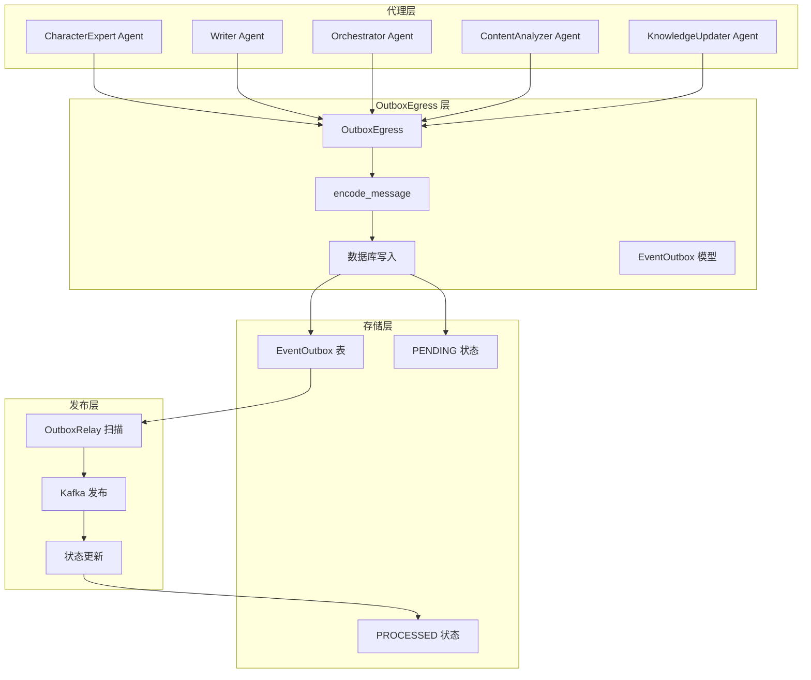
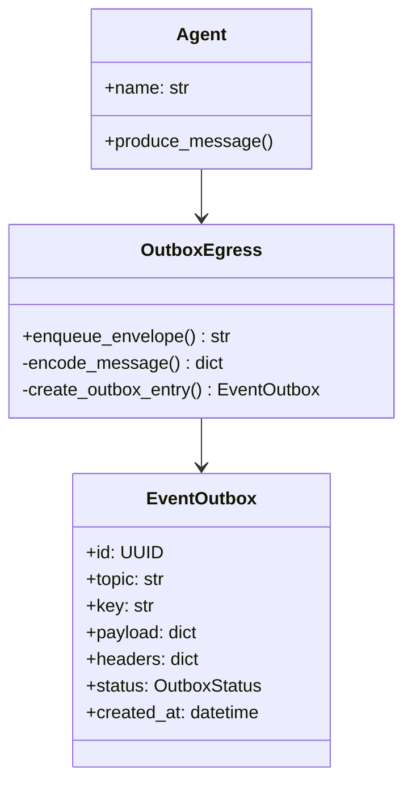
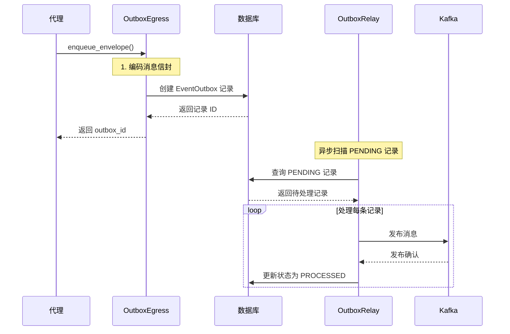
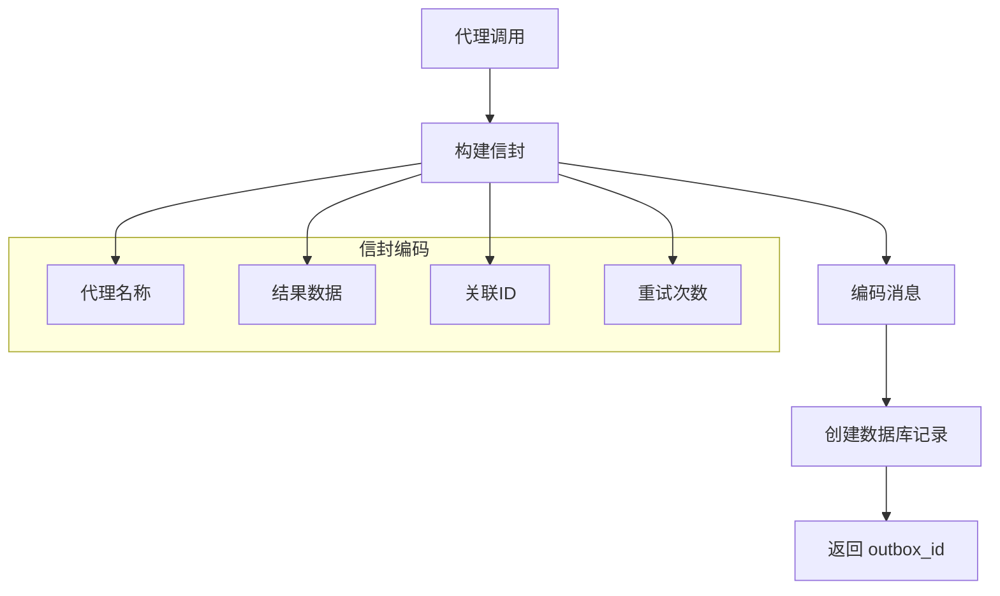
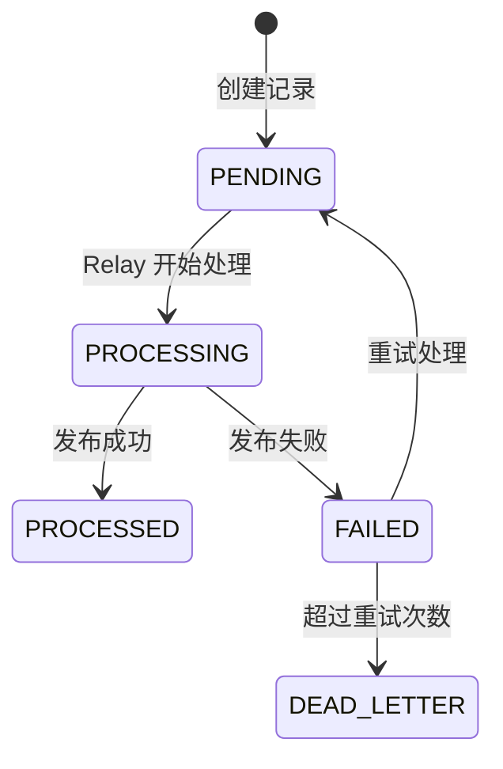
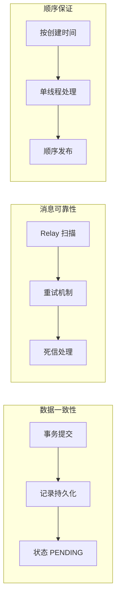
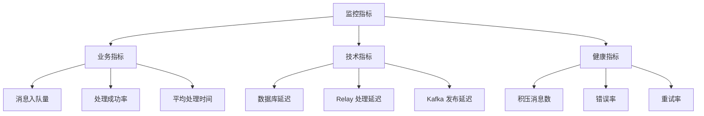
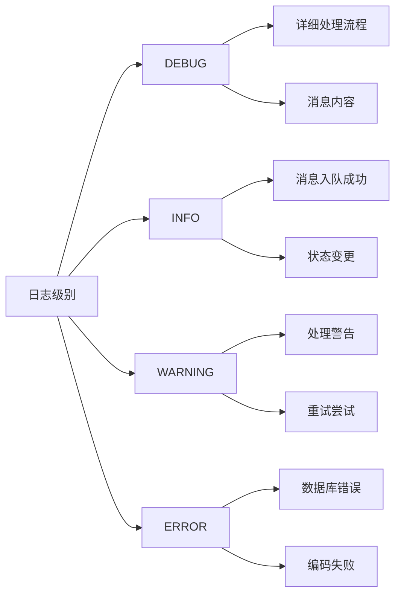
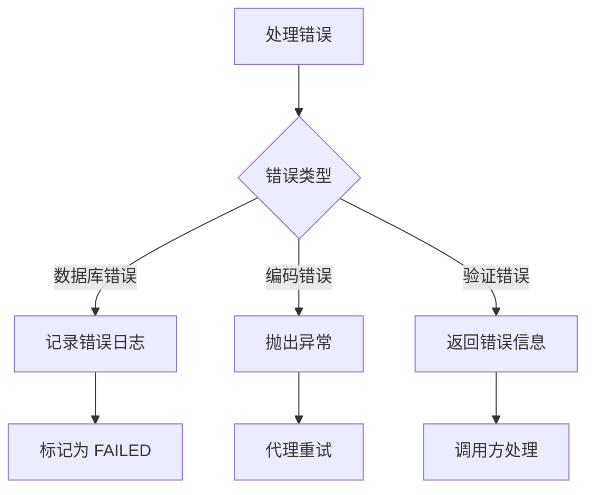

# Outbox 服务 (Outbox Service)

实现 Outbox 模式的统一出口服务，提供代理到 Kafka 的可靠消息投递机制，确保数据一致性和消息可靠性。

## 🏗️ 架构概览

### 核心职责

- **统一出口**：为所有代理提供标准化的消息出口接口
- **可靠投递**：通过数据库持久化确保消息不丢失
- **信封编码**：统一的消息编码和格式化
- **异步处理**：与 OutboxRelay 协作实现异步消息发布

### 架构图



## 📁 目录结构

```
outbox/
├── __init__.py           # 服务导出和注册
├── egress.py             # 主要出口服务（核心组件）
└── relay.py              # 中继服务（与 Kafka 交互）
```

## 🎯 核心组件

### OutboxEgress

统一的消息出口服务，为所有代理提供标准化的消息投递接口：



### 消息流转架构



## 🔧 核心功能

### 1. 消息编码与入队



### 2. 数据库操作模式



### 3. 可靠性保证



## 🚀 使用示例

### 基础消息发送

```python
# 创建 OutboxEgress 实例
egress = OutboxEgress()

# 发送角色生成结果
outbox_id = await egress.enqueue_envelope(
    agent="character_expert",
    topic="genesis.character.events",
    key="character-123",
    result={
        "type": "character_generated",
        "character_id": "char-123",
        "name": "Sir Arthur",
        "traits": ["勇敢", "智慧"]
    },
    correlation_id="cmd-abc-123"
)

print(f"消息已入队，outbox_id: {outbox_id}")
```

### 复杂消息发送

```python
# 发送带额外头的消息
outbox_id = await egress.enqueue_envelope(
    agent="writer",
    topic="genesis.writer.events",
    key="chapter-456",
    result={
        "type": "chapter_written",
        "chapter_id": 456,
        "content": "这是一个章节内容...",
        "word_count": 1500
    },
    correlation_id="cmd-def-456",
    retries=0,
    headers_extra={
        "content_type": "text/plain",
        "priority": "normal",
        "session_id": "session-789"
    }
)

print(f"复杂消息已入队: {outbox_id}")
```

### 批量消息发送

```python
# 批量发送多个相关消息
messages = [
    {
        "type": "scene_started",
        "scene_id": "scene-1",
        "location": "城堡大厅"
    },
    {
        "type": "dialogue_added",
        "scene_id": "scene-1",
        "character": "主角",
        "text": "你好，世界！"
    },
    {
        "type": "scene_completed",
        "scene_id": "scene-1",
        "duration": "5分钟"
    }
]

outbox_ids = []
for msg in messages:
    outbox_id = await egress.enqueue_envelope(
        agent="writer",
        topic="genesis.writer.events",
        key="scene-1",
        result=msg,
        correlation_id="batch-scene-1"
    )
    outbox_ids.append(outbox_id)

print(f"批量消息已入队: {outbox_ids}")
```

## 📊 监控和调试

### 关键指标



### 日志记录



### 状态查询

```python
# 查询 Outbox 状态（示例）
async def check_outbox_status(outbox_id: str):
    async with create_sql_session() as db:
        outbox = await db.get(EventOutbox, outbox_id)
        if outbox:
            return {
                "id": str(outbox.id),
                "topic": outbox.topic,
                "status": outbox.status.value,
                "created_at": outbox.created_at.isoformat(),
                "processed_at": outbox.processed_at.isoformat() if outbox.processed_at else None
            }
        return None
```

## 🔍 关键特性

### 1. 信封编码标准化

```python
# 统一的信封格式
envelope = {
    "id": "generated-uuid",
    "ts": "2025-09-20T14:03:00Z",
    "type": "Character.Generated",
    "version": "v1",
    "agent": "character_expert",
    "correlation_id": "cmd-123",
    "retries": 0,
    "status": "ok",
    "data": {
        "character_id": "char-123",
        "name": "Sir Arthur"
    }
}
```

### 2. 事务性保证

```python
# 与业务操作在同一事务中
async def create_character_with_outbox(db, character_data):
    # 1. 创建角色记录
    character = Character(**character_data)
    db.add(character)
    
    # 2. 发送事件到 Outbox
    outbox_id = await egress.enqueue_envelope(
        agent="character_expert",
        topic="genesis.character.events",
        key=str(character.id),
        result={"type": "character_created", "character_id": str(character.id)},
        correlation_id=str(character.id)
    )
    
    # 3. 事务提交，确保数据一致性
    await db.commit()
    return character, outbox_id
```

### 3. 错误处理机制



## 📝 最佳实践

### 1. 消息设计

- **强类型**：使用明确的类型标识符
- **幂等性**：设计可重试的消息处理逻辑
- **关联追踪**：使用 correlation_id 追踪请求链路
- **版本化**：支持消息格式的演进

### 2. 性能优化

```python
# 批量操作优化
async def batch_enqueue(messages: list[dict]) -> list[str]:
    """批量入队多个消息"""
    outbox_ids = []
    async with create_sql_session() as db:
        for msg in messages:
            outbox = EventOutbox(
                topic=msg["topic"],
                key=msg["key"],
                payload=msg["payload"],
                headers=msg["headers"],
                status=OutboxStatus.PENDING
            )
            db.add(outbox)
            outbox_ids.append(str(outbox.id))
        
        await db.commit()
    return outbox_ids
```

### 3. 监控告警

```python
# 设置监控指标
def setup_outbox_monitoring():
    # 监控积压情况
    if get_pending_count() > 1000:
        send_alert("Outbox 积压过高")
    
    # 监控错误率
    error_rate = get_error_rate()
    if error_rate > 0.05:  # 5%
        send_alert("Outbox 错误率过高")
    
    # 监控处理延迟
    avg_delay = get_average_processing_delay()
    if avg_delay > 300:  # 5分钟
        send_alert("Outbox 处理延迟过高")
```

## 🔗 相关模块

- **消息编码**：`src.agents.message` - 信封编码和解码
- **数据模型**：`src.models.workflow` - EventOutbox 模型定义
- **数据库会话**：`src.db.sql.session` - 数据库会话管理
- **中继服务**：`src.services.outbox.relay` - OutboxRelay 服务
- **枚举定义**：`src.schemas.enums` - OutboxStatus 等枚举

## ⚠️ 注意事项

1. **事务边界**：确保 Outbox 操作与业务操作在同一事务中
2. **错误处理**：实现适当的重试和错误恢复机制
3. **性能考虑**：避免大批量消息影响数据库性能
4. **监控告警**：设置关键指标监控和异常告警
5. **顺序保证**：如果需要顺序保证，使用相同的 key

## 🔄 部署和运维

### 配置参数

```yaml
# Outbox 配置
outbox:
  max_retries: 3              # 最大重试次数
  retry_interval: 60          # 重试间隔（秒）
  batch_size: 100             # 批量处理大小
  scan_interval: 30           # 扫描间隔（秒）
  
  # 监控配置
  monitoring:
    pending_threshold: 1000   # 积压阈值
    error_threshold: 0.05     # 错误率阈值
    delay_threshold: 300      # 延迟阈值（秒）
```

### 健康检查

```python
# Outbox 健康状态检查
async def check_outbox_health():
    async with create_sql_session() as db:
        # 检查积压情况
        pending_count = await db.scalar(
            select(func.count(EventOutbox.id))
            .where(EventOutbox.status == OutboxStatus.PENDING)
        )
        
        # 检查错误率
        error_count = await db.scalar(
            select(func.count(EventOutbox.id))
            .where(EventOutbox.status == OutboxStatus.FAILED)
        )
        total_count = await db.scalar(select(func.count(EventOutbox.id)))
        error_rate = error_count / total_count if total_count > 0 else 0
        
        # 返回健康状态
        return {
            "healthy": pending_count < 1000 and error_rate < 0.05,
            "pending_count": pending_count,
            "error_rate": error_rate,
            "total_processed": total_count
        }
```

---

*此文档描述了 InfiniteScribe Outbox 服务的核心架构和使用方法。该服务实现了标准的 Outbox 模式，为系统提供可靠的消息投递机制。*