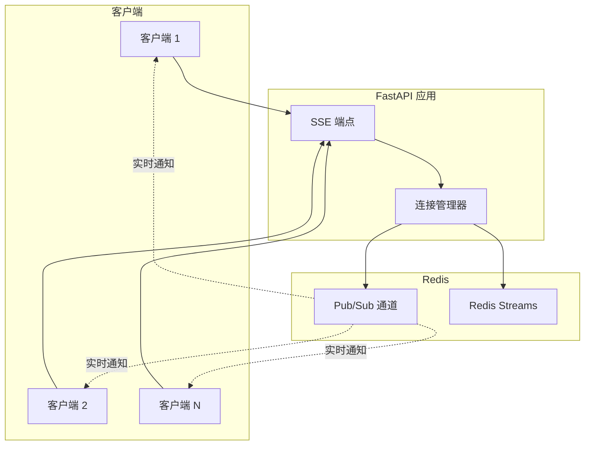
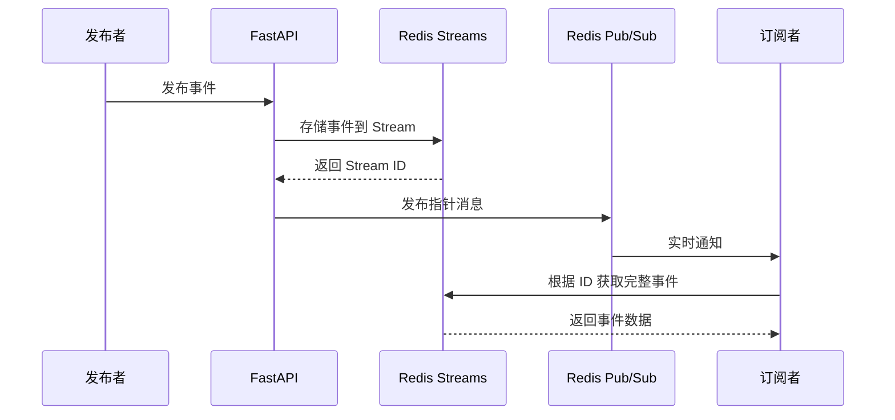
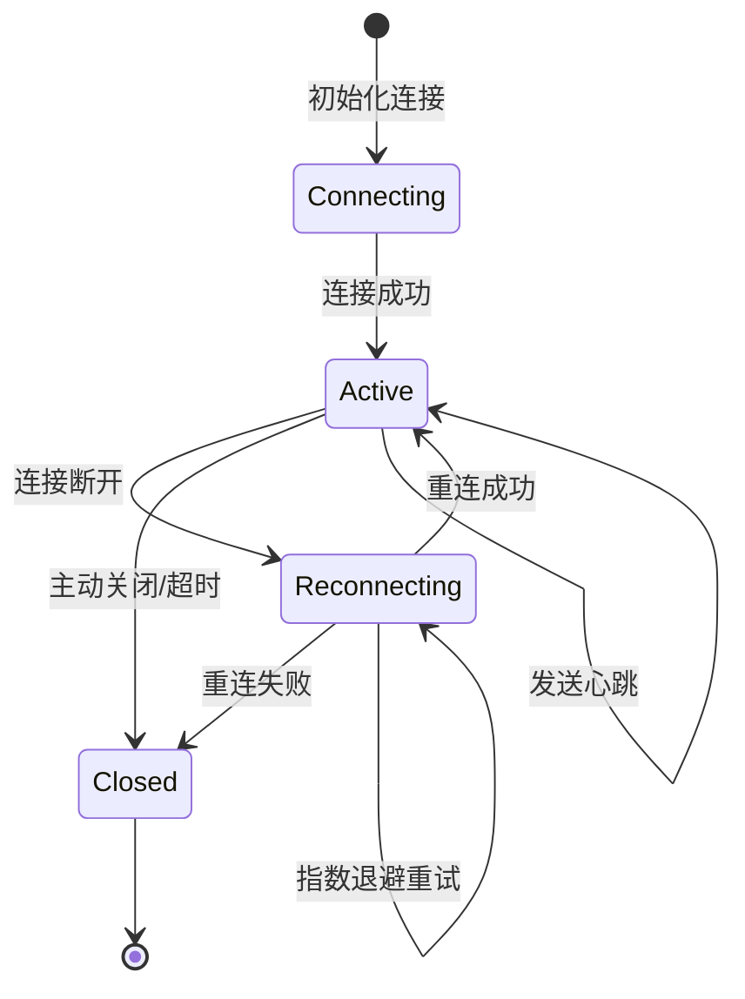
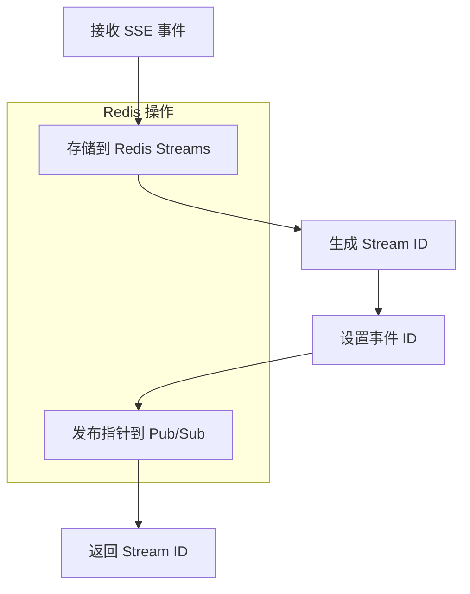
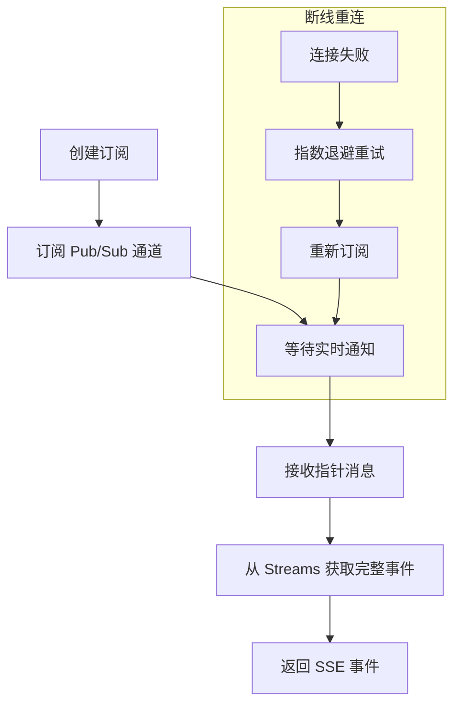
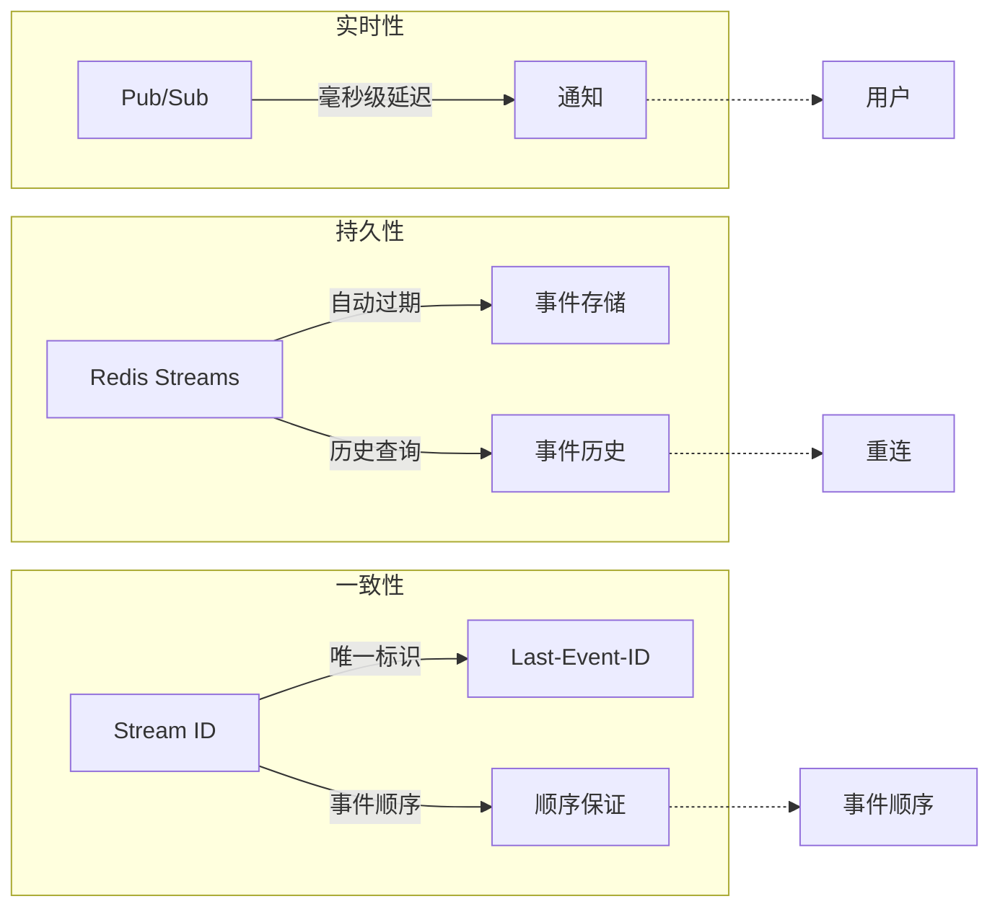

# SSE 服务模块

提供基于 Redis 的 Server-Sent Events (SSE) 服务，实现实时事件推送和连接管理。

## 🎯 核心功能

- **实时事件推送**: 基于 Redis Pub/Sub + Streams 的混合架构
- **连接管理**: 用户连接限制、状态跟踪和自动清理
- **事件持久化**: 通过 Redis Streams 提供事件历史记录
- **重连支持**: 基于 Last-Event-ID 的断线重连机制
- **性能优化**: 批量处理、缓存策略和资源管理

## 📁 目录结构

```
sse/
├── __init__.py                # 模块导出和公共接口
├── config.py                  # SSE 连接配置
├── connection_manager.py      # 连接管理器
├── connection_state.py        # 连接状态管理
├── event_streamer.py          # 事件流处理器
├── provider.py                # SSE 服务提供者
├── redis_client.py            # Redis SSE 服务实现
└── redis_counter.py           # Redis 计数器服务
```

## 🏗️ 架构设计

### 混合架构模式



### 数据流架构



### 连接管理状态



## 🔧 核心组件

### RedisSSEService

Redis SSE 服务的核心实现，采用 Pub/Sub + Streams 混合架构：

```python
class RedisSSEService:
    """基于 Redis 的 SSE 服务实现"""
    
    def __init__(self, redis_service: RedisService):
        self.redis_service = redis_service
        self._pubsub_client: Redis | None = None
```

#### 事件发布流程



#### 事件订阅流程



### SSEConnectionManager

连接管理器，负责处理用户连接的生命周期：

```python
class SSEConnectionManager:
    """SSE 连接管理器"""
    
    # 配置常量
    MAX_CONNECTIONS_PER_USER = 2
    CONNECTION_EXPIRY_SECONDS = 300
    PING_INTERVAL_SECONDS = 15
```

### SSEConfig

配置管理，定义 SSE 服务的各种参数：

```python
@dataclass
class SSEConfig:
    # 连接限制
    MAX_CONNECTIONS_PER_USER: int = 2
    CONNECTION_EXPIRY_SECONDS: int = 300
    RETRY_AFTER_SECONDS: int = 30
    
    # 事件流处理
    PING_INTERVAL_SECONDS: int = 15
    SEND_TIMEOUT_SECONDS: int = 30
    
    # 历史记录处理
    MAX_HISTORY_BATCH_SIZE: int = 100
    DEFAULT_HISTORY_LIMIT: int = 50
    
    # 清理配置
    STALE_CONNECTION_THRESHOLD_SECONDS: int = 300
    CLEANUP_INTERVAL_SECONDS: int = 60
    CLEANUP_BATCH_SIZE: int = 10
    ENABLE_PERIODIC_CLEANUP: bool = True
```

## 🔧 使用方式

### 基本使用

```python
from src.services.sse import RedisSSEService, sse_config
from src.db.redis import RedisService

# 初始化服务
redis_service = RedisService()
sse_service = RedisSSEService(redis_service)
await sse_service.init_pubsub_client()

# 发布事件
from src.schemas.sse import SSEMessage

event = SSEMessage(
    event="user_message",
    data={"message": "Hello World", "user_id": "123"},
    scope=EventScope.USER
)

stream_id = await sse_service.publish_event("user_123", event)

# 订阅事件
async for sse_event in sse_service.subscribe_user_events("user_123"):
    print(f"Received event: {sse_event.event}")
    print(f"Event data: {sse_event.data}")
```

### 带重连的订阅

```python
import asyncio

async def handle_user_events(user_id: str):
    stop_event = asyncio.Event()
    
    try:
        async for event in sse_service.subscribe_user_events(
            user_id, 
            stop_event=stop_event
        ):
            # 处理事件
            await process_event(event)
            
    except Exception as e:
        logger.error(f"Event subscription failed: {e}")
        
    # 优雅关闭
    stop_event.set()
```

### 获取历史事件

```python
# 获取最近的事件
recent_events = await sse_service.get_recent_events("user_123")

# 从特定事件 ID 后获取
events_since = await sse_service.get_recent_events(
    "user_123", 
    since_id="1672531200000-0"
)
```

## 📊 配置示例

### 环境变量配置

```bash
# Redis 连接配置
DATABASE_REDIS_HOST=localhost
DATABASE_REDIS_PORT=6379
DATABASE_REDIS_PASSWORD=
DATABASE_REDIS_DB=0

# SSE 流配置
DATABASE_REDIS_SSE_STREAM_MAXLEN=1000
```

### 自定义配置

```python
from src.services.sse import SSEConfig

# 创建自定义配置
custom_config = SSEConfig(
    MAX_CONNECTIONS_PER_USER=5,      # 增加连接限制
    CONNECTION_EXPIRY_SECONDS=600,    # 延长连接有效期
    PING_INTERVAL_SECONDS=30,        # 减少心跳频率
    DEFAULT_HISTORY_LIMIT=100,        # 增加历史记录数量
    CLEANUP_INTERVAL_SECONDS=120     # 减少清理频率
)
```

## 🔍 关键特性

### 1. 混合架构优势



### 2. 连接管理

```python
# 用户连接限制
MAX_CONNECTIONS_PER_USER = 2

# 连接状态跟踪
class SSEConnectionState:
    user_id: str
    connection_id: str
    created_at: datetime
    last_activity: datetime
    is_active: bool
    
# 自动清理机制
STALE_CONNECTION_THRESHOLD_SECONDS = 300
CLEANUP_INTERVAL_SECONDS = 60
CLEANUP_BATCH_SIZE = 10
```

### 3. 重连机制

```python
async def subscribe_user_events(
    self,
    user_id: str,
    last_event_id: str | None = None,
    stop_event: asyncio.Event | None = None,
) -> AsyncIterator[SSEMessage]:
    max_retries = 3
    retry_delay = 1  # 初始延迟
    
    while retry_count < max_retries:
        try:
            # 订阅逻辑
            retry_count = 0  # 成功后重置
            retry_delay = 1
            
        except RedisConnectionError:
            retry_count += 1
            retry_delay = min(retry_delay * 2, 30)  # 指数退避
            await asyncio.sleep(retry_delay)
```

### 4. 事件历史处理

```python
async def get_recent_events(self, user_id: str, since_id: str = "-") -> list[SSEMessage]:
    stream_key = f"events:user:{user_id}"
    
    if since_id in ("-", None):
        # 初始连接：获取最近的 N 个事件
        items = await redis_client.xrevrange(stream_key, "+", "-", count=DEFAULT_HISTORY_LIMIT)
        items = list(reversed(items))  # 恢复时间顺序
    else:
        # 重连：获取指定 ID 后的所有事件
        items = []
        current_id = since_id
        
        while True:
            batch = await redis_client.xread({stream_key: current_id}, count=BATCH_SIZE)
            if not batch:
                break
            # 处理批量数据
```

## 🚀 性能优化

### 1. 资源管理

```python
# 专用的 Pub/Sub 客户端
async def init_pubsub_client(self) -> None:
    if self._pubsub_client:
        try:
            await self._pubsub_client.close()
        except Exception as e:
            logger.warning("Error closing existing pubsub client", error=str(e))
    
    # 创建新客户端
    self._pubsub_client = redis.from_url(
        settings.database.redis_url,
        decode_responses=True,
        health_check_interval=30,
        socket_connect_timeout=10,
        socket_timeout=30,
        retry_on_timeout=True,
    )
```

### 2. 批量处理

```python
# 批量获取历史事件
BATCH_SIZE = 50

while True:
    batch_entries = await redis_client.xread({stream_key: current_id}, count=BATCH_SIZE)
    
    if not batch_entries:
        break
        
    items.extend(batch_entries)
    current_id = batch_items[-1][0]
    
    # 如果获取数量少于批量大小，说明已到达末尾
    if len(batch_items) < BATCH_SIZE:
        break
```

### 3. 内存优化

```python
# 流长度限制
maxlen=settings.database.redis_sse_stream_maxlen

# 添加事件时自动限制流长度
stream_id = await redis_client.xadd(
    stream_key,
    event_data,
    maxlen=maxlen,
    approximate=True,
)
```

## 📊 监控和调试

### 连接监控

```python
# 健康检查
async def check_health(self) -> bool:
    try:
        if not self._pubsub_client:
            return False
        await self._pubsub_client.ping()
        return True
    except Exception as e:
        logger.warning(f"Redis Pub/Sub health check failed: {e}")
        return False

# 连接统计
async def get_connection_stats(self) -> dict:
    return {
        "active_connections": len(self.active_connections),
        "total_connections": len(self.all_connections),
        "cleanup_last_run": self.last_cleanup_time,
        "pubsub_healthy": await self.check_health(),
    }
```

### 事件追踪

```python
# 发布事件日志
logger.info(
    "📤 Publishing SSE event",
    extra={
        "user_id": user_id,
        "event_type": event.event,
        "event_scope": event.scope.value,
        "event_id": event.id,
        "data_size": len(json.dumps(event.data, default=str)),
    },
)

# 订阅事件日志
logger.info(
    "📡 Starting subscription for user {user_id}",
    extra={
        "user_id": user_id,
        "last_event_id": last_event_id,
        "retry_count": retry_count,
    },
)
```

## 🧪 测试策略

### 单元测试

```python
import pytest
from unittest.mock import AsyncMock, MagicMock

@pytest.mark.asyncio
async def test_publish_event():
    """测试事件发布"""
    redis_service = AsyncMock()
    sse_service = RedisSSEService(redis_service)
    
    # 模拟 Redis 客户端
    sse_service._pubsub_client = AsyncMock()
    sse_service._pubsub_client.publish = AsyncMock()
    
    event = SSEMessage(event="test", data={"message": "hello"})
    stream_id = await sse_service.publish_event("user_123", event)
    
    assert stream_id is not None
    assert sse_service._pubsub_client.publish.called

@pytest.mark.asyncio
async def test_subscribe_events():
    """测试事件订阅"""
    redis_service = AsyncMock()
    sse_service = RedisSSEService(redis_service)
    
    # 模拟 Pub/Sub 消息
    async def mock_subscribe():
        messages = [
            {"type": "message", "data": '{"stream_key": "test", "stream_id": "123"}'}
        ]
        for msg in messages:
            yield msg
    
    # 实现订阅测试逻辑
    pass
```

### 集成测试

```python
@pytest.mark.asyncio
async def test_integration_with_real_redis():
    """使用真实 Redis 的集成测试"""
    redis_service = RedisService()
    sse_service = RedisSSEService(redis_service)
    
    await sse_service.init_pubsub_client()
    
    # 发布事件
    event = SSEMessage(event="integration_test", data={"test": True})
    stream_id = await sse_service.publish_event("test_user", event)
    
    # 验证事件可以被获取
    events = await sse_service.get_recent_events("test_user")
    assert len(events) > 0
    assert events[0].event == "integration_test"
    
    await sse_service.close()
```

## 🔧 故障排除

### 常见问题

1. **连接丢失**
   - 检查 Redis 连接状态
   - 验证网络连通性
   - 查看重连日志

2. **事件丢失**
   - 检查 Stream 配置
   - 验证 maxlen 设置
   - 检查事件格式

3. **性能问题**
   - 监控连接数
   - 检查批量大小
   - 优化清理频率

### 调试命令

```python
# 检查 Redis 连接
await sse_service.check_health()

# 查看连接统计
stats = await sse_service.get_connection_stats()
print(f"Active connections: {stats['active_connections']}")

# 手动触发清理
await sse_service.cleanup_stale_connections()

# 检查 Pub/Sub 状态
if sse_service._pubsub_client:
    await sse_service._pubsub_client.ping()
```

## 📝 最佳实践

### 1. 连接管理
- 限制每个用户的连接数量
- 实现连接超时和清理
- 监控连接状态和性能

### 2. 事件处理
- 使用批量处理提高性能
- 设置合理的 Stream 长度限制
- 实现事件格式验证

### 3. 错误处理
- 实现优雅的重连机制
- 记录详细的错误日志
- 提供降级策略

### 4. 监控和运维
- 监控关键指标
- 设置告警阈值
- 定期检查资源使用情况

这个 SSE 服务模块为 InfiniteScribe 平台提供了高效、可靠的实时事件推送能力，支持大规模用户连接和复杂的事件处理场景。