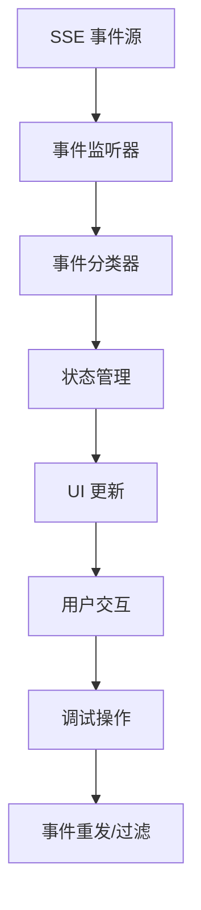
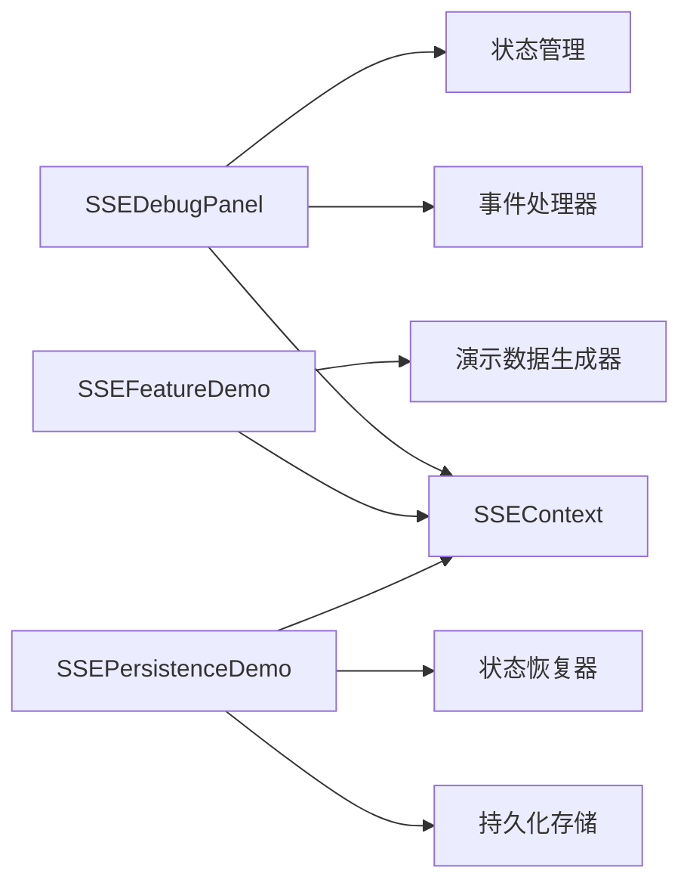

# Debug Components

调试组件库，用于开发和调试过程中的功能验证和问题排查。

## 组件列表

### SSEDebugPanel

Server-Sent Events (SSE) 调试面板，用于实时监控和调试 SSE 连接状态。

**功能特性：**
- 实时显示 SSE 连接状态
- 展示接收到的 SSE 事件
- 事件分类和过滤
- 连接错误诊断
- 事件历史记录

**主要功能：**
- 连接状态监控（连接中、已连接、断开、错误）
- 事件类型过滤（Genesis、系统、错误等）
- 事件详情展示（时间戳、会话ID、事件内容）
- 手动重连功能
- 事件统计信息

### SSEFeatureDemo

SSE 功能演示组件，用于展示 SSE 的各种使用场景。

**功能特性：**
- 多种 SSE 事件类型演示
- 实时数据流展示
- 交互式功能演示
- 性能监控
- 错误处理演示

### SSEPersistenceDemo

SSE 持久化演示组件，展示 SSE 连接的状态持久化能力。

**功能特性：**
- 连接状态持久化
- 页面刷新后状态恢复
- 离线状态处理
- 事件重放机制
- 数据一致性保证

## 使用场景

### 开发调试

```tsx
import { SSEDebugPanel } from '@/components/debug/SSEDebugPanel'

function DebugLayout() {
  return (
    <div className="debug-panel">
      <SSEDebugPanel />
    </div>
  )
}
```

### 功能验证

```tsx
import { SSEFeatureDemo } from '@/components/debug/SSEFeatureDemo'

function FeatureTesting() {
  return (
    <div className="feature-demo">
      <SSEFeatureDemo />
    </div>
  )
}
```

## 技术架构

### 事件处理流程



### 组件依赖关系



## 配置选项

### SSEDebugPanel Props

```typescript
interface SSEDebugPanelProps {
  sessionId?: string           // 会话ID
  autoScroll?: boolean         // 自动滚动
  maxEvents?: number          // 最大事件数量
  showTimestamp?: boolean     // 显示时间戳
  filterEventTypes?: string[] // 事件类型过滤器
}
```

### 事件类型

- `genesis_command` - 创世命令事件
- `system` - 系统事件
- `error` - 错误事件
- `connection` - 连接状态事件
- `custom` - 自定义事件

## 调试技巧

### 1. 连接问题排查

- 检查 SSE 连接状态
- 验证事件接收情况
- 查看错误日志
- 测试重连机制

### 2. 事件分析

- 使用事件过滤器
- 查看事件时间戳
- 分析事件内容
- 检查事件顺序

### 3. 性能优化

- 限制事件显示数量
- 使用虚拟滚动
- 优化渲染性能
- 内存使用监控

## 开发指南

### 添加新调试组件

1. 在 `components/debug/` 目录下创建新组件
2. 继承基础调试组件特性
3. 添加类型定义和接口
4. 实现调试功能
5. 编写测试用例

### 调试组件规范

- 提供清晰的调试信息
- 支持实时数据更新
- 包含错误处理机制
- 保持性能优化
- 提供用户友好的界面

## 测试

- 单元测试覆盖核心功能
- 集成测试验证事件流
- 性能测试确保效率
- 错误场景测试

## 注意事项

- 调试组件仅用于开发环境
- 生产环境应禁用调试功能
- 注意敏感信息保护
- 合理使用调试资源