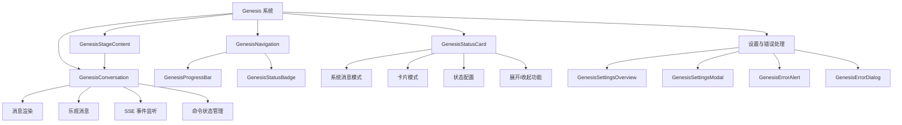
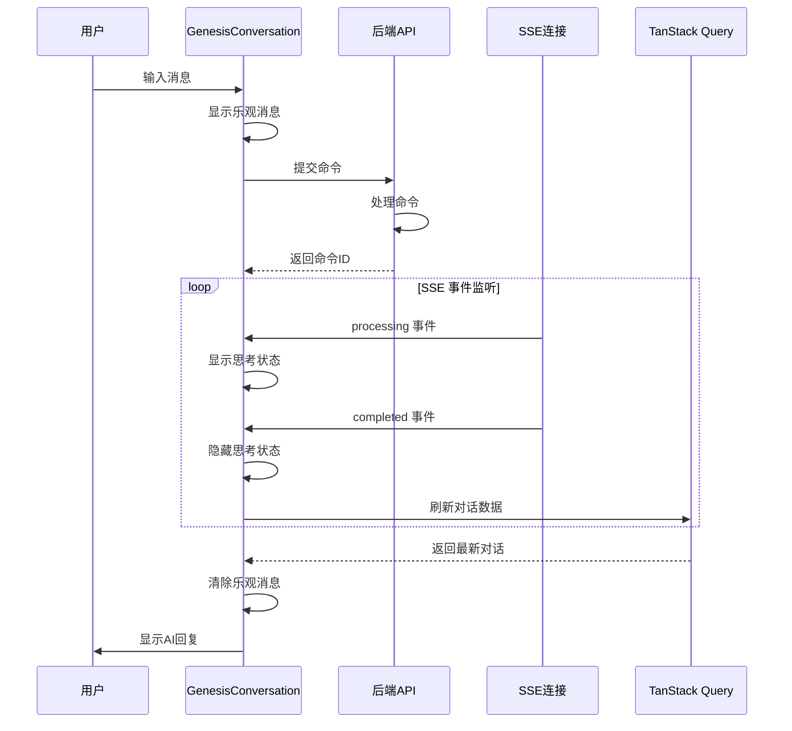
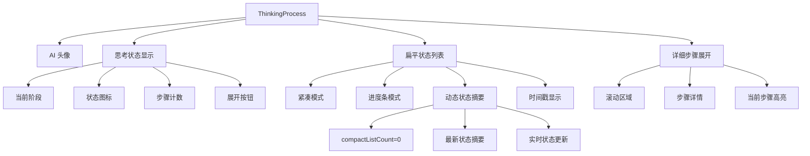
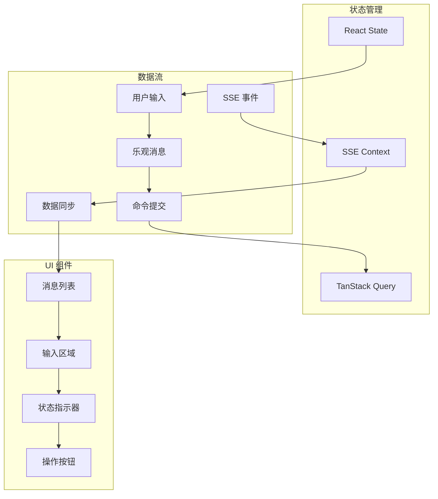
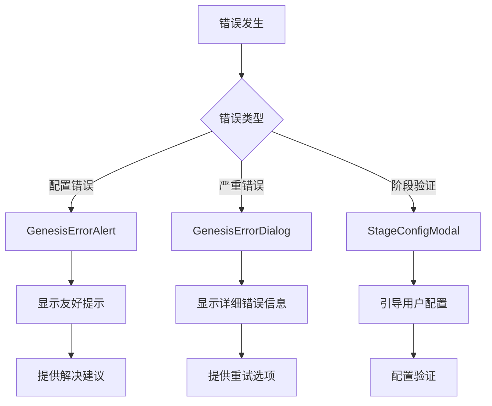
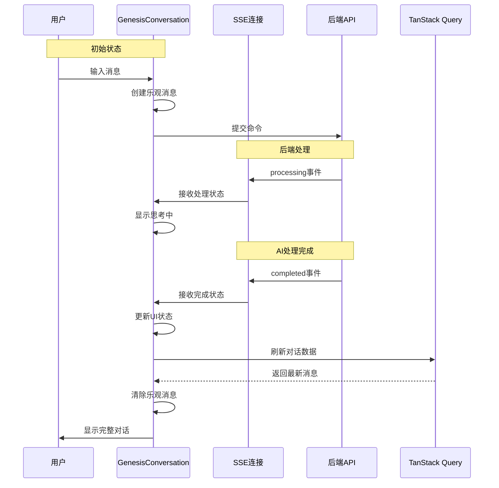
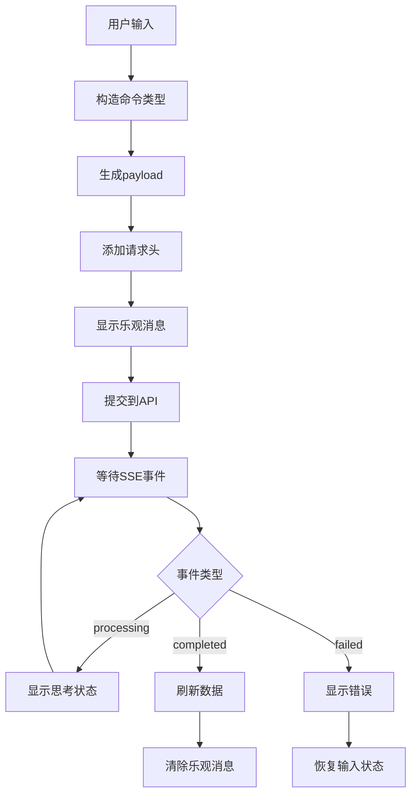
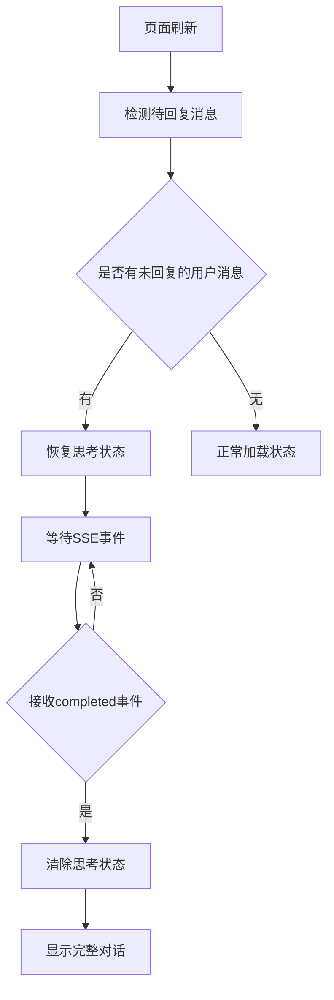
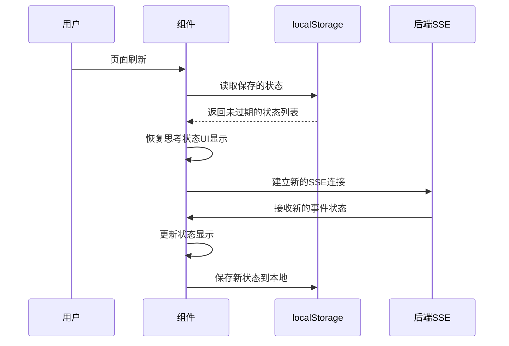

# Genesis 创世系统

Genesis 系统是 InfiniteScribe 平台的核心创作辅助功能，通过结构化的对话式交互帮助用户构建小说的基础设定。系统采用渐进式创世流程，引导用户从初始灵感到完整的世界观、角色和剧情设定。

## 🎯 核心功能

### 对话式创世体验
- **GenesisConversation**: 核心对话组件，提供类似 ChatGPT 的交互体验
- **实时反馈**: 支持乐观消息显示，提升用户体验
- **SSE 事件驱动**: 实时监听 AI 响应状态
- **兜底策略**: SSE 连接失败时自动切换到轮询模式
- **命令状态显示**: 在对话流中集成 Genesis 命令状态显示
- **状态恢复**: 支持页面刷新后自动恢复对话状态

### AI 思考过程显示
- **ThinkingProcess**: 新增的 AI 思考过程显示组件，参考 ChatGPT 的思考过程交互设计
- **紧凑状态条**: 优化后的系统事件显示，支持折叠功能
- **扁平化事件列表**: 将系统事件转移到思考中区域的扁平列表
- **状态持久化**: 页面刷新后仍能恢复最近的思考状态
- **智能时间格式**: 相对时间显示，提升用户体验

### Genesis 命令状态显示
- **GenesisStatusCard**: 命令状态显示组件，支持两种显示模式
- **系统消息模式**: 在聊天流中显示为系统通知
- **卡片模式**: 独立的状态卡片，支持展开查看详细信息
- **状态配置化**: 通过配置文件定义不同事件类型的显示样式和行为

### 阶段化流程管理
- **五个创世阶段**: 初始灵感 → 世界观设定 → 角色塑造 → 剧情大纲 → 创世完成
- **渐进式解锁**: 完成当前阶段后解锁下一阶段
- **灵活跳转**: 可随时返回已完成的阶段进行修改
- **进度可视化**: 清晰展示整体创世进度

## 📁 组件架构


```mermaid
graph TD
    A[Genesis 系统] --> B[GenesisNavigation]
    A --> C[GenesisStageContent]
    A --> D[GenesisConversation]
    A --> E[GenesisStatusCard]
    A --> F[设置与错误处理]
    
    B --> B1[GenesisProgressBar]
    B --> B2[GenesisStatusBadge]
    
    C --> D
    
    D --> D1[消息渲染]
    D --> D2[乐观消息]
    D --> D3[SSE 事件监听]
    D --> D4[命令状态管理]
    
    E --> E1[系统消息模式]
    E --> E2[卡片模式]
    E --> E3[状态配置]
    E --> E4[展开/收起功能]
    
    F --> F1[GenesisSettingsOverview]
    F --> F2[GenesisSettingsModal]
    F --> F3[GenesisErrorAlert]
    F --> F4[GenesisErrorDialog]
```

## 🔄 交互流程


```mermaid
sequenceDiagram
    participant U as 用户
    participant GC as GenesisConversation
    participant API as 后端API
    participant SSE as SSE连接
    participant Q as TanStack Query
    
    U->>GC: 输入消息
    GC->>GC: 显示乐观消息
    GC->>API: 提交命令
    API->>API: 处理命令
    API-->>GC: 返回命令ID
    
    loop SSE 事件监听
        SSE->>GC: processing 事件
        GC->>GC: 显示思考状态
        SSE->>GC: completed 事件
        GC->>GC: 隐藏思考状态
        GC->>Q: 刷新对话数据
    end
    
    Q-->>GC: 返回最新对话
    GC->>GC: 清除乐观消息
    GC->>U: 显示AI回复
```

## 🏗️ 组件详解

### GenesisConversation - 核心对话组件

**主要职责**:
- 管理对话状态和消息显示
- 处理用户输入和命令提交
- 集成 SSE 事件监听和兜底策略
- 提供流畅的用户交互体验
- **Genesis 命令状态集成**: 新增对 Genesis 命令状态的监听和显示

**关键特性**:
- **乐观消息**: 立即显示用户消息，无需等待 API 响应
- **SSE 集成**: 实时监听 AI 处理状态
- **兜底机制**: SSE 连接失败时自动切换到轮询
- **状态恢复**: 页面刷新后自动恢复对话状态
- **Genesis 事件处理**: 通过 `useGenesisEvents` 监听和处理 Genesis 相关事件
- **命令状态管理**: 支持在对话流中显示系统通知式的状态消息
- **增强的错误处理**: 更友好的错误提示和恢复机制

**最新更新 (feat/genesis-stage)**:
- **ThinkingProcess 组件**: 新增 AI 思考过程显示组件，提供友好的用户体验
- **优化状态显示**: 系统事件转移到思考中区域的扁平列表，支持折叠功能
- **状态持久化增强**: 使用 genesisThinkingStorage 实现思考状态的本地持久化
- **增强的 Genesis 事件监听**: 支持更多事件类型和状态
- **命令状态显示集成**: 在对话流中显示 Genesis 命令执行状态
- **优化的错误处理**: 更完善的错误分类和用户提示
- **性能优化**: 减少不必要的重渲染和 API 调用
- **命令 ID 推断逻辑**: 优化命令 ID 推断，支持从多个数据源获取命令 ID
- **useCommandEvents 集成**: 合并 API 和 SSE 事件，提供完整的时间线追踪
- **增强的状态恢复**: 改进页面刷新后的思考状态恢复机制，通过 rounds 数据推断命令 ID
- **动态状态摘要显示**: 支持紧凑模式下动态显示最近状态和进度信息

### ThinkingProcess - AI 思考过程显示组件

**主要职责**:
- 显示 AI 处理用户输入时的思考过程和状态
- 提供类似 ChatGPT 的思考过程交互体验
- 支持多种显示模式和状态持久化

**关键特性**:
- **双模式显示**: 
  - 紧凑模式：显示固定数量的最近状态项
  - 进度条模式：显示整体处理进度
- **可展开详情**: 支持展开查看完整的思考步骤列表
- **智能时间格式**: 使用相对时间显示（刚刚、几秒前、几分钟前）
- **阶段化显示**: 根据事件类型显示不同的思考阶段
- **状态持久化**: 集成 genesisThinkingStorage 实现状态恢复
- **响应式设计**: 适配不同屏幕尺寸，支持移动端
- **动态状态摘要**: 
  - 根据 `compactListCount` 参数动态调整显示模式
  - 当 `compactListCount = 0` 时，显示为最新的状态摘要
  - 支持实时状态更新和阶段切换显示

**思考阶段配置**:
```typescript
const THINKING_STAGES = {
  'genesis.session-started': { label: '开始创世', icon: Zap },
  'genesis.step-started': { label: '准备思考', icon: Brain },
  'genesis.step-processing': { label: '分析内容', icon: Loader2 },
  'genesis.step-completed': { label: '完成思考', icon: CheckCircle },
  'genesis.step-failed': { label: '遇到问题', icon: XCircle },
  default: { label: '处理中', icon: Loader2 },
}
```

**组件架构**:

```mermaid
graph TD
    A[ThinkingProcess] --> B[AI 头像]
    A --> C[思考状态显示]
    A --> D[扁平状态列表]
    A --> E[详细步骤展开]
    
    C --> C1[当前阶段]
    C --> C2[状态图标]
    C --> C3[步骤计数]
    C --> C4[展开按钮]
    
    D --> D1[紧凑模式]
    D --> D2[进度条模式]
    D --> D3[动态状态摘要]
    D --> D4[时间戳显示]
    
    E --> E1[滚动区域]
    E --> E2[步骤详情]
    E --> E3[当前步骤高亮]
    
    D3 --> D3a[compactListCount=0]
    D3 --> D3b[最新状态摘要]
    D3 --> D3c[实时状态更新]
```

### GenesisStatusCard - 命令状态显示组件

**主要职责**:
- 显示 Genesis 相关命令的执行状态和详细信息
- 支持两种显示模式：系统消息模式和卡片模式
- 提供展开/收起功能查看详细信息
- 通过配置文件定义不同事件类型的显示样式

**关键特性**:
- **双模式显示**: 
  - 系统消息模式：在聊天流中显示为系统通知
  - 卡片模式：独立的状态卡片，支持展开查看详细信息
- **配置驱动**: 通过 `getGenesisStatusConfig` 获取不同事件类型的配置
- **时间戳处理**: 格式化显示事件时间戳
- **ID 缩短显示**: 对长 ID 进行截断显示，提升用户体验
- **展开/收起**: 支持查看完整的命令状态信息

**状态配置**:
```typescript
interface GenesisStatusConfig {
  label: string           // 显示标签
  description: string     // 详细描述
  icon: React.ComponentType // 图标组件
  badgeVariant: string   // 徽章样式
  cardClass: string       // 卡片样式类
  messageClass: string    // 消息样式类
}
```

**核心架构**:

```mermaid
graph TD
    subgraph "状态管理"
        A[React State]
        B[TanStack Query]
        C[SSE Context]
    end
    
    subgraph "数据流"
        D[用户输入]
        E[乐观消息]
        F[命令提交]
        G[SSE 事件]
        H[数据同步]
    end
    
    subgraph "UI 组件"
        I[消息列表]
        J[输入区域]
        K[状态指示器]
        L[操作按钮]
    end
    
    A --> D
    D --> E
    E --> F
    F --> B
    G --> C
    C --> H
    H --> I
    I --> J
    J --> K
    K --> L
```

### GenesisNavigation - 阶段导航组件

**阶段配置**:
- **初始灵感**: 收集创作灵感和基本构思
- **世界观设定**: 构建世界背景和规则体系
- **角色塑造**: 创建主要角色和人物关系
- **剧情大纲**: 规划故事主线和章节结构
- **创世完成**: 所有设定完成，开始写作

**状态管理**:
- `pending`: 待解锁状态
- `active`: 当前激活状态
- `completed`: 已完成状态
- `locked`: 锁定状态

### 错误处理机制


```mermaid
graph TD
    A[错误发生] --> B{错误类型}
    B -->|配置错误| C[GenesisErrorAlert]
    B -->|严重错误| D[GenesisErrorDialog]
    B -->|阶段验证| E[StageConfigModal]
    
    C --> F[显示友好提示]
    D --> G[显示详细错误信息]
    E --> H[引导用户配置]
    
    F --> I[提供解决建议]
    G --> J[提供重试选项]
    H --> K[配置验证]
```

### SSE 事件驱动架构


```mermaid
sequenceDiagram
    participant U as 用户
    participant GC as GenesisConversation
    participant SSE as SSE连接
    participant API as 后端API
    participant Q as TanStack Query
    
    Note over U,GC: 初始状态
    U->>GC: 输入消息
    GC->>GC: 创建乐观消息
    GC->>API: 提交命令
    
    Note over API,SSE: 后端处理
    API->>SSE: processing事件
    SSE->>GC: 接收处理状态
    GC->>GC: 显示思考中
    
    Note over API,SSE: AI处理完成
    API->>SSE: completed事件
    SSE->>GC: 接收完成状态
    GC->>GC: 更新UI状态
    GC->>Q: 刷新对话数据
    Q-->>GC: 返回最新消息
    GC->>GC: 清除乐观消息
    GC->>U: 显示完整对话
```

## 🔧 技术实现

### 状态管理策略
- **对话状态**: 使用 TanStack Query 管理远程数据
- **本地状态**: React useState 管理组件状态
- **事件驱动**: SSE 事件监听实现实时更新
- **缓存优化**: 智能缓存策略提升性能

### 性能优化
- **乐观更新**: 提升响应速度
- **分页加载**: 支持大量历史消息
- **虚拟滚动**: 大量消息时的性能保障
- **自动滚动**: 保持对话可见性

### 错误处理
- **友好提示**: 用户友好的错误信息
- **自动恢复**: 网络问题自动重连
- **兜底策略**: 多重保障机制
- **日志记录**: 便于问题诊断

## 🎨 用户体验设计

### 交互设计原则
- **即时反馈**: 用户操作立即获得反馈
- **状态明确**: 清晰的加载和思考状态
- **引导清晰**: 阶段引导和操作提示
- **容错性强**: 支持撤销和重新操作

### 视觉设计
- **一致的视觉语言**: 统一的图标和颜色系统
- **动画效果**: 平滑的状态转换
- **响应式布局**: 适配不同屏幕尺寸
- **可访问性**: 支持键盘导航和屏幕阅读器

## 📊 API 集成

### Conversation API
```typescript
// 创建会话
POST /api/v1/conversations/sessions
{
  "scope_type": "GENESIS",
  "scope_id": "novel_id",
  "stage": "INITIAL_PROMPT"
}

// 发送消息
POST /api/v1/conversations/sessions/{session_id}/rounds
{
  "type": "user_message",
  "input": {
    "stage": "WORLDVIEW",
    "content": "世界观描述..."
  }
}

// 获取对话历史
GET /api/v1/conversations/sessions/{session_id}/rounds
```

### SSE 事件监听
```typescript
// 事件类型
- processing: AI 开始处理
- completed: AI 处理完成
- failed: AI 处理失败
- error: 系统错误
```

### 命令提交流程


```mermaid
graph TD
    A[用户输入] --> B[构造命令类型]
    B --> C[生成payload]
    C --> D[添加请求头]
    D --> E[显示乐观消息]
    E --> F[提交到API]
    F --> G[等待SSE事件]
    G --> H{事件类型}
    H -->|processing| I[显示思考状态]
    H -->|completed| J[刷新数据]
    H -->|failed| K[显示错误]
    J --> L[清除乐观消息]
    I --> G
    K --> M[恢复输入状态]
```

## 🚀 使用示例

### 基本使用
```tsx
import { GenesisConversation } from '@/components/genesis'

function GenesisPage() {
  return (
    <GenesisConversation
      stage={GenesisStage.INITIAL_PROMPT}
      sessionId="session_123"
      novelId="novel_456"
      onStageComplete={() => console.log('阶段完成')}
    />
  )
}
```

### 自定义配置
```tsx
// 自定义阶段提示
const customPrompts = {
  [GenesisStage.INITIAL_PROMPT]: '描述你的创作灵感...',
  [GenesisStage.WORLDVIEW]: '构建你的世界...'
}

// 动态状态摘要显示配置
function GenesisPage() {
  return (
    <div className="space-y-4">
      {/* 进度条模式显示最新状态 */}
      <ThinkingProcess
        isThinking={isThinking}
        statusList={statusList}
        compactListCount={0}  // 显示为最新状态摘要
        thinkingText="AI 正在处理你的请求..."
      />
      
      {/* 紧凑模式显示最近3条状态 */}
      <ThinkingProcess
        isThinking={isThinking}
        statusList={statusList}
        compactListCount={3}  // 显示最近3条状态
        thinkingText="AI 正在思考..."
      />
    </div>
  )
}
```

### 关键Hook使用

```typescript
// SSE 事件监听
const { isConnected, status: connectionState } = useSSEStatus()

// 命令状态管理
const { data: pendingCommand } = usePendingCommand(sessionId)

// 对话轮次数据
const { data: roundsData } = useRounds(sessionId, {
  order: 'asc'
})

// 命令提交
const submitCommand = useSubmitCommand(sessionId, {
  onSuccess: (data) => {
    console.log('命令提交成功:', data)
  },
  onError: (error) => {
    console.error('命令提交失败:', error)
  }
})
```

## 🛠️ 开发指南

### 组件开发规范
- 遵循 TypeScript 严格模式
- 使用 Shadcn UI 组件库
- 实现完整的错误处理
- 编写单元测试覆盖

### 性能考虑
- 避免不必要的重新渲染
- 使用 useMemo 和 useCallback 优化
- 实现虚拟滚动处理大量数据
- 合理使用 TanStack Query 缓存

### 调试工具
- 使用 React DevTools 分析性能
- 启用详细的控制台日志
- 测试 SSE 连接稳定性
- 验证错误处理逻辑

### 状态恢复机制


```mermaid
graph TD
    A[页面刷新] --> B[检测待回复消息]
    B --> C{是否有未回复的用户消息}
    C -->|有| D[恢复思考状态]
    C -->|无| E[正常加载状态]
    D --> F[等待SSE事件]
    F --> G{接收completed事件}
    G -->|是| H[清除思考状态]
    G -->|否| F
    H --> I[显示完整对话]
```

### 乐观消息管理

```typescript
// 乐观消息生命周期
interface OptimisticMessage {
  id: string // 唯一标识符
  content: string
  initialRoundsLength: number // 发送时的rounds数量
}

// 1. 创建乐观消息
setOptimisticMessage({
  id: `optimistic-${Date.now()}`,
  content: userInput,
  initialRoundsLength: rounds.length
})

// 2. 检测真实消息到达
if (rounds.length > optimisticMessage.initialRoundsLength) {
  const matchingRound = rounds.find(round => 
    round.role === 'user' && 
    round.input?.payload?.user_input === optimisticMessage.content
  )
  if (matchingRound) {
    setOptimisticMessage(null) // 清除乐观消息
  }
}
```

### 状态恢复机制

```typescript
// 页面刷新后的状态恢复逻辑
const hasPendingUserMessage = useMemo(() => {
  return (
    rounds.length > 0 &&
    rounds[rounds.length - 1]?.role === 'user' &&
    !rounds[rounds.length - 1]?.output
  )
}, [rounds])

// 命令ID推断逻辑
const inferredCommandId = useMemo(() => {
  if (currentCommandId) return currentCommandId
  
  if (hasPendingUserMessage && rounds.length > 0) {
    const lastUserRound = rounds[rounds.length - 1]
    if (lastUserRound?.role === 'user') {
      // 优先使用 round 级别的 correlation_id
      if (lastUserRound.correlation_id) {
        return lastUserRound.correlation_id
      }
      // 其次尝试从 input 中获取
      if (lastUserRound.input?.correlation_id) {
        return lastUserRound.input.correlation_id
      }
      // 最后尝试从 input.payload 中获取
      if (lastUserRound.input?.payload?.correlation_id) {
        return lastUserRound.input.payload.correlation_id
      }
    }
  }
  
  return null
}, [currentCommandId, hasPendingUserMessage, rounds])
```

## 🔮 未来规划

### 短期目标
- [ ] 支持更多创世模板
- [ ] 增强AI生成质量
- [ ] 优化移动端体验
- [ ] 添加协作功能

### 长期规划
- [ ] 智能内容推荐
- [ ] 风格一致性检查
- [ ] 多语言支持
- [ ] 导出和分享功能

## 💾 状态持久化机制

### Genesis 思考状态持久化

**实现目标**:
- 页面刷新后仍能恢复最近的思考状态列表
- 提供 `genesisThinkingStorage` 工具函数实现状态管理
- 支持 TTL 机制自动清理过期状态数据

**核心功能**:
```typescript
// 主要工具函数
- getThinkingStatuses(sessionId): 获取指定会话的状态列表
- appendThinkingStatus(sessionId, status): 添加新的状态
- setThinkingStatuses(sessionId, statuses): 批量设置状态
- clearThinkingStatuses(sessionId): 清理指定会话的状态
```

**存储配置**:
```typescript
const STORAGE_KEY = 'genesis_thinking_state_v1'
const MAX_PER_SESSION = 20      // 每个会话最多保存20条状态
const TTL_MS = 10 * 60 * 1000  // 10分钟有效期
```

**状态恢复流程**:

```mermaid
sequenceDiagram
    participant U as 用户
    participant C as 组件
    participant S as localStorage
    participant SSE as 后端SSE
    
    U->>C: 页面刷新
    C->>S: 读取保存的状态
    S-->>C: 返回未过期的状态列表
    C->>C: 恢复思考状态UI显示
    C->>SSE: 建立新的SSE连接
    SSE->>C: 接收新的事件状态
    C->>C: 更新状态显示
    C->>S: 保存新状态到本地
```

**状态恢复机制**:

```mermaid
graph TD
    A[页面刷新] --> B[检测待回复消息]
    B --> C{是否有未回复的用户消息}
    C -->|有| D[恢复思考状态]
    C -->|无| E[正常加载状态]
    D --> F[等待SSE事件]
    F --> G{接收completed事件}
    G -->|是| H[清除思考状态]
    G -->|否| F
    H --> I[显示完整对话]
```

**数据结构**:
```typescript
interface GenesisCommandStatus {
  event_id: string           // 事件唯一标识
  event_type: string         // 事件类型
  session_id: string         // 会话ID
  correlation_id: string     // 关联ID
  timestamp: string          // 时间戳
  status: string             // 状态信息
  _scope?: string           // 作用域
  _version?: string         // 版本信息
}

type StoredSessionState = {
  statuses: GenesisCommandStatus[]
  updatedAt: number         // 更新时间戳
}
```

**使用示例**:
```typescript
// 在 ThinkingProcess 组件中使用
useEffect(() => {
  // 初始恢复：从本地存储恢复最近的思考状态
  const restored = getThinkingStatuses(sessionId)
  if (restored.length > 0) {
    setGenesisCommandStatuses(restored)
  }
}, [sessionId])

// 监听新事件并保存
useGenesisEvents(sessionId, (eventType, eventData) => {
  if (isGenesisEvent(eventType)) {
    const commandStatus: GenesisCommandStatus = { /* ... */ }
    setGenesisCommandStatuses(prev => [...prev, commandStatus])
    
    // 持久化到本地存储
    appendThinkingStatus(sessionId, commandStatus)
  }
})
```