# Genesis 创世系统

Genesis 系统是 InfiniteScribe 平台的核心创作辅助功能，通过结构化的对话式交互帮助用户构建小说的基础设定。系统采用渐进式创世流程，引导用户从初始灵感到完整的世界观、角色和剧情设定。

## 🎯 核心功能

### 对话式创世体验
- **GenesisConversation**: 核心对话组件，提供类似 ChatGPT 的交互体验
- **实时反馈**: 支持乐观消息显示，提升用户体验
- **SSE 事件驱动**: 实时监听 AI 响应状态
- **兜底策略**: SSE 连接失败时自动切换到轮询模式

### 阶段化流程管理
- **五个创世阶段**: 初始灵感 → 世界观设定 → 角色塑造 → 剧情大纲 → 创世完成
- **渐进式解锁**: 完成当前阶段后解锁下一阶段
- **灵活跳转**: 可随时返回已完成的阶段进行修改
- **进度可视化**: 清晰展示整体创世进度

## 📁 组件架构

```mermaid
graph TD
    A[Genesis 系统] --> B[GenesisNavigation]
    A --> C[GenesisStageContent]
    A --> D[GenesisConversation]
    A --> E[设置与错误处理]
    
    B --> B1[GenesisProgressBar]
    B --> B2[GenesisStatusBadge]
    
    C --> D
    
    D --> D1[消息渲染]
    D --> D2[乐观消息]
    D --> D3[SSE 事件监听]
    D --> D4[命令状态管理]
    
    E --> E1[GenesisSettingsOverview]
    E --> E2[GenesisSettingsModal]
    E --> E3[GenesisErrorAlert]
    E --> E4[GenesisErrorDialog]
```



## 🔄 交互流程

```mermaid
sequenceDiagram
    participant U as 用户
    participant GC as GenesisConversation
    participant API as 后端API
    participant SSE as SSE连接
    participant Q as TanStack Query
    
    U->>GC: 输入消息
    GC->>GC: 显示乐观消息
    GC->>API: 提交命令
    API->>API: 处理命令
    API-->>GC: 返回命令ID
    
    loop SSE 事件监听
        SSE->>GC: processing 事件
        GC->>GC: 显示思考状态
        SSE->>GC: completed 事件
        GC->>GC: 隐藏思考状态
        GC->>Q: 刷新对话数据
    end
    
    Q-->>GC: 返回最新对话
    GC->>GC: 清除乐观消息
    GC->>U: 显示AI回复
```



## 🏗️ 组件详解

### GenesisConversation - 核心对话组件

**主要职责**:
- 管理对话状态和消息显示
- 处理用户输入和命令提交
- 集成 SSE 事件监听和兜底策略
- 提供流畅的用户交互体验

**关键特性**:
- **乐观消息**: 立即显示用户消息，无需等待 API 响应
- **SSE 集成**: 实时监听 AI 处理状态
- **兜底机制**: SSE 连接失败时自动切换到轮询
- **状态恢复**: 页面刷新后自动恢复对话状态

**核心架构**:

```mermaid
graph TD
    subgraph "状态管理"
        A[React State]
        B[TanStack Query]
        C[SSE Context]
    end
    
    subgraph "数据流"
        D[用户输入]
        E[乐观消息]
        F[命令提交]
        G[SSE 事件]
        H[数据同步]
    end
    
    subgraph "UI 组件"
        I[消息列表]
        J[输入区域]
        K[状态指示器]
        L[操作按钮]
    end
    
    A --> D
    D --> E
    E --> F
    F --> B
    G --> C
    C --> H
    H --> I
    I --> J
    J --> K
    K --> L
```


### GenesisNavigation - 阶段导航组件

**阶段配置**:
- **初始灵感**: 收集创作灵感和基本构思
- **世界观设定**: 构建世界背景和规则体系
- **角色塑造**: 创建主要角色和人物关系
- **剧情大纲**: 规划故事主线和章节结构
- **创世完成**: 所有设定完成，开始写作

**状态管理**:
- `pending`: 待解锁状态
- `active`: 当前激活状态
- `completed`: 已完成状态
- `locked`: 锁定状态

### 错误处理机制

```mermaid
graph TD
    A[错误发生] --> B{错误类型}
    B -->|配置错误| C[GenesisErrorAlert]
    B -->|严重错误| D[GenesisErrorDialog]
    B -->|阶段验证| E[StageConfigModal]
    
    C --> F[显示友好提示]
    D --> G[显示详细错误信息]
    E --> H[引导用户配置]
    
    F --> I[提供解决建议]
    G --> J[提供重试选项]
    H --> K[配置验证]
```



### SSE 事件驱动架构

```mermaid
sequenceDiagram
    participant U as 用户
    participant GC as GenesisConversation
    participant SSE as SSE连接
    participant API as 后端API
    participant Q as TanStack Query
    
    Note over U,GC: 初始状态
    U->>GC: 输入消息
    GC->>GC: 创建乐观消息
    GC->>API: 提交命令
    
    Note over API,SSE: 后端处理
    API->>SSE: processing事件
    SSE->>GC: 接收处理状态
    GC->>GC: 显示思考中
    
    Note over API,SSE: AI处理完成
    API->>SSE: completed事件
    SSE->>GC: 接收完成状态
    GC->>GC: 更新UI状态
    GC->>Q: 刷新对话数据
    Q-->>GC: 返回最新消息
    GC->>GC: 清除乐观消息
    GC->>U: 显示完整对话
```



## 🔧 技术实现

### 状态管理策略
- **对话状态**: 使用 TanStack Query 管理远程数据
- **本地状态**: React useState 管理组件状态
- **事件驱动**: SSE 事件监听实现实时更新
- **缓存优化**: 智能缓存策略提升性能

### 性能优化
- **乐观更新**: 提升响应速度
- **分页加载**: 支持大量历史消息
- **虚拟滚动**: 大量消息时的性能保障
- **自动滚动**: 保持对话可见性

### 错误处理
- **友好提示**: 用户友好的错误信息
- **自动恢复**: 网络问题自动重连
- **兜底策略**: 多重保障机制
- **日志记录**: 便于问题诊断

## 🎨 用户体验设计

### 交互设计原则
- **即时反馈**: 用户操作立即获得反馈
- **状态明确**: 清晰的加载和思考状态
- **引导清晰**: 阶段引导和操作提示
- **容错性强**: 支持撤销和重新操作

### 视觉设计
- **一致的视觉语言**: 统一的图标和颜色系统
- **动画效果**: 平滑的状态转换
- **响应式布局**: 适配不同屏幕尺寸
- **可访问性**: 支持键盘导航和屏幕阅读器

## 📊 API 集成

### Conversation API
```typescript
// 创建会话
POST /api/v1/conversations/sessions
{
  "scope_type": "GENESIS",
  "scope_id": "novel_id",
  "stage": "INITIAL_PROMPT"
}

// 发送消息
POST /api/v1/conversations/sessions/{session_id}/rounds
{
  "type": "user_message",
  "input": {
    "stage": "WORLDVIEW",
    "content": "世界观描述..."
  }
}

// 获取对话历史
GET /api/v1/conversations/sessions/{session_id}/rounds
```

### SSE 事件监听
```typescript
// 事件类型
- processing: AI 开始处理
- completed: AI 处理完成
- failed: AI 处理失败
- error: 系统错误
```

### 命令提交流程

```mermaid
graph TD
    A[用户输入] --> B[构造命令类型]
    B --> C[生成payload]
    C --> D[添加请求头]
    D --> E[显示乐观消息]
    E --> F[提交到API]
    F --> G[等待SSE事件]
    G --> H{事件类型}
    H -->|processing| I[显示思考状态]
    H -->|completed| J[刷新数据]
    H -->|failed| K[显示错误]
    J --> L[清除乐观消息]
    I --> G
    K --> M[恢复输入状态]
```



## 🚀 使用示例

### 基本使用
```tsx
import { GenesisConversation } from '@/components/genesis'

function GenesisPage() {
  return (
    <GenesisConversation
      stage={GenesisStage.INITIAL_PROMPT}
      sessionId="session_123"
      novelId="novel_456"
      onStageComplete={() => console.log('阶段完成')}
    />
  )
}
```

### 自定义配置
```tsx
// 自定义阶段提示
const customPrompts = {
  [GenesisStage.INITIAL_PROMPT]: '描述你的创作灵感...',
  [GenesisStage.WORLDVIEW]: '构建你的世界...'
}
```

### 关键Hook使用

```typescript
// SSE 事件监听
const { isConnected, status: connectionState } = useSSEStatus()

// 命令状态管理
const { data: pendingCommand } = usePendingCommand(sessionId)

// 对话轮次数据
const { data: roundsData } = useRounds(sessionId, {
  order: 'asc'
})

// 命令提交
const submitCommand = useSubmitCommand(sessionId, {
  onSuccess: (data) => {
    console.log('命令提交成功:', data)
  },
  onError: (error) => {
    console.error('命令提交失败:', error)
  }
})
```

## 🛠️ 开发指南

### 组件开发规范
- 遵循 TypeScript 严格模式
- 使用 Shadcn UI 组件库
- 实现完整的错误处理
- 编写单元测试覆盖

### 性能考虑
- 避免不必要的重新渲染
- 使用 useMemo 和 useCallback 优化
- 实现虚拟滚动处理大量数据
- 合理使用 TanStack Query 缓存

### 调试工具
- 使用 React DevTools 分析性能
- 启用详细的控制台日志
- 测试 SSE 连接稳定性
- 验证错误处理逻辑

### 状态恢复机制

```mermaid
graph TD
    A[页面刷新] --> B[检测待回复消息]
    B --> C{是否有未回复的用户消息}
    C -->|有| D[恢复思考状态]
    C -->|无| E[正常加载状态]
    D --> F[等待SSE事件]
    F --> G{接收completed事件}
    G -->|是| H[清除思考状态]
    G -->|否| F
    H --> I[显示完整对话]
```



### 乐观消息管理

```typescript
// 乐观消息生命周期
interface OptimisticMessage {
  id: string // 唯一标识符
  content: string
  initialRoundsLength: number // 发送时的rounds数量
}

// 1. 创建乐观消息
setOptimisticMessage({
  id: `optimistic-${Date.now()}`,
  content: userInput,
  initialRoundsLength: rounds.length
})

// 2. 检测真实消息到达
if (rounds.length > optimisticMessage.initialRoundsLength) {
  const matchingRound = rounds.find(round => 
    round.role === 'user' && 
    round.input?.payload?.user_input === optimisticMessage.content
  )
  if (matchingRound) {
    setOptimisticMessage(null) // 清除乐观消息
  }
}
```

## 🔮 未来规划

### 短期目标
- [ ] 支持更多创世模板
- [ ] 增强AI生成质量
- [ ] 优化移动端体验
- [ ] 添加协作功能

### 长期规划
- [ ] 智能内容推荐
- [ ] 风格一致性检查
- [ ] 多语言支持
- [ ] 导出和分享功能