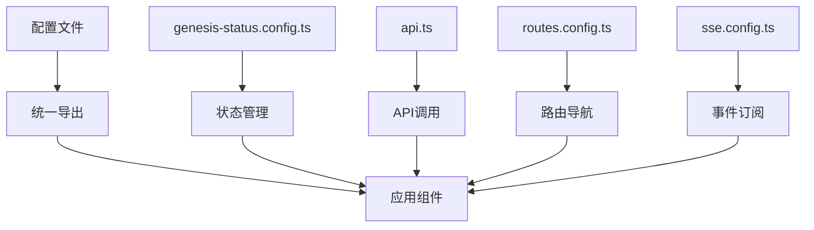

# 配置系统

本目录包含了前端应用的所有配置文件，采用配置驱动的设计模式，实现统一管理和动态扩展。

## 🏗️ 架构概述

### 设计理念
- **配置驱动**: 新增功能无需修改组件代码，只需配置即可
- **类型安全**: 完整的 TypeScript 类型支持
- **模块化**: 按功能划分配置模块，便于维护
- **动态扩展**: 支持运行时动态添加配置

### 配置架构图


## 📁 目录结构

```
config/
├── api.ts                    # API端点和配置
├── genesis-status.config.ts   # Genesis状态显示配置
├── routes.config.ts           # 路由和导航配置
├── sse.config.ts             # SSE服务配置
└── index.ts                  # 统一导出文件
```

## 🔧 核心配置模块

### API 配置 (`api.ts`)

集中管理所有 API 端点和相关配置。

#### 功能特性
- **环境变量支持**: 通过 `VITE_API_BASE_URL` 配置 API 基础地址
- **版本管理**: 统一的 API 版本控制
- **类型安全**: 完整的 TypeScript 类型定义
- **动态路径**: 支持参数化的 API 路径

#### 配置结构
```typescript
// API 基础配置
API_BASE_URL: string           // API 基础地址
API_VERSION: string           // API 版本号

// API 端点
API_ENDPOINTS: {
  health: string              // 健康检查
  sse: {                      // SSE 服务
    stream: string           // 事件流端点
    health: string           // SSE 健康检查
  }
  genesis: {                  // Genesis 相关
    start: string            // 启动 Genesis
    status: (sessionId: string) => string  // 获取状态
  }
  novels: {                   // 小说相关
    list: string             // 小说列表
    detail: (id: string) => string  // 小说详情
    chapters: (id: string) => string  // 章节列表
  }
}
```

#### 使用示例
```typescript
import { API_BASE_URL, API_ENDPOINTS } from '@/config'

// 使用 API 端点
const novelDetailUrl = API_ENDPOINTS.novels.detail(novelId)
const genesisStatusUrl = API_ENDPOINTS.genesis.status(sessionId)

// 发起 API 请求
const response = await fetch(`${API_BASE_URL}${novelDetailUrl}`)
```

### 路由配置 (`routes.config.ts`)

集中管理应用路由、导航和页面元信息。

#### 功能特性
- **路由定义**: 集中管理所有路由路径
- **导航配置**: 统一的导航菜单配置
- **权限控制**: 路由访问权限管理
- **元信息**: 页面标题和描述配置
- **工具函数**: 路由相关的辅助函数

#### 配置结构
```typescript
// 路由定义
ROUTES: {
  auth: { ... }              // 认证相关路由
  novels: {                  // 小说相关路由
    list: string
    detail: (id: string) => string
    genesis: (id: string) => string
    // ... 其他路由
  }
  // ... 其他路由组
}

// 导航配置
NAV_ITEMS: {
  novel: [                   // 小说相关导航
    { name: string, path: string, icon: string }
  ]
}

// 页面元信息
PAGE_META: {
  titles: { ... }           // 页面标题
  descriptions: { ... }     // 页面描述
}

// 权限配置
ROUTE_ACCESS: {
  public: string[]          // 公开路由
  protected: string[]       // 需要认证的路由
}
```

#### 使用示例
```typescript
import { ROUTES, NAV_ITEMS, isProtectedRoute } from '@/config'

// 使用路由
const novelGenesisUrl = ROUTES.novels.genesis(novelId)

// 检查路由权限
if (isProtectedRoute(currentPath)) {
  // 需要认证
}

// 获取导航配置
const novelNavItems = NAV_ITEMS.novel
```

### SSE 配置 (`sse.config.ts`)

Server-Sent Events 服务相关配置。

#### 功能特性
- **事件类型定义**: 预定义的通用事件类型
- **连接配置**: SSE 连接参数和选项
- **重试机制**: 连接失败的重试策略
- **事件过滤**: 事件类型过滤和分类

#### 配置结构
```typescript
// 通用事件类型
COMMON_EVENT_TYPES: string[]

// 连接配置
SSE_CONFIG: {
  retryInterval: number      // 重试间隔
  maxRetries: number         // 最大重试次数
  timeout: number           // 连接超时
}

// 事件分类
EVENT_CATEGORIES: {
  SYSTEM: string[]          // 系统事件
  BUSINESS: string[]        // 业务事件
}
```

### 统一导出 (`index.ts`)

提供所有配置的统一导出入口。

#### 功能特性
- **集中导出**: 所有配置的统一入口
- **类型安全**: 完整的类型导出
- **向后兼容**: 保持现有导入方式

#### 使用方式
```typescript
// 从统一入口导入
import { 
  API_ENDPOINTS, 
  ROUTES, 
  GENESIS_STATUS_CONFIGS,
  isGenesisEvent 
} from '@/config'
```

## Genesis状态配置

### 添加新的Genesis事件类型

当后端新增Genesis事件类型时，只需要在 `genesis-status.config.ts` 中添加配置：

```typescript
// 在 GENESIS_STATUS_CONFIGS 中添加新的事件配置
export const GENESIS_STATUS_CONFIGS: Record<string, GenesisStatusConfig> = {
  // 现有配置...

  'Genesis.New.Event.Type': {
    label: '新事件标题',
    description: '新事件描述',
    icon: YourIcon, // 从 lucide-react 导入的图标
    badgeVariant: 'default',
    cardClass: 'border-blue-200 bg-blue-50/50',
    messageClass: 'bg-blue-50 border-blue-200',
  },
}
```

### 配置字段说明

- `label`: 事件的显示标题
- `description`: 事件的详细描述
- `icon`: Lucide React图标组件
- `badgeVariant`: 徽章样式变体 (`default` | `secondary` | `destructive` |
  `outline`)
- `cardClass`: 卡片模式的CSS类名
- `messageClass`: 消息模式的CSS类名

### 使用配置

```typescript
import {
  getGenesisStatusConfig,
  isGenesisEvent,
} from '@/config/genesis-status.config'

// 获取事件配置
const config = getGenesisStatusConfig('Genesis.Session.Seed.Requested')

// 检查是否是Genesis事件
const isGenesis = isGenesisEvent('Genesis.Session.Command.Received')
```

## 动态事件注册机制

### 工作原理

系统采用**按需动态注册**的机制：

1. **SSEProvider**只预注册常见的基础事件（ping、heartbeat等）
2. **业务模块**通过`useSSEEvents`或`useGenesisEvents`订阅事件时，自动注册到EventSource
3. **配置文件**管理事件的显示和处理逻辑，与SSE基础设施解耦

### 事件注册流程

```typescript
// 1. 业务组件使用Genesis事件
useGenesisEvents(sessionId, handler)

// 2. useGenesisEvents调用useSSEEvents
useSSEEvents(['Genesis.Session.Command.Received', ...], handler)

// 3. useSSEEvents为每个事件类型调用subscribe
events.map(eventType => subscribe(eventType, handler))

// 4. subscribe检查事件是否已注册，如果没有则动态添加监听器
if (!commonEventTypes.includes(event)) {
  src.addEventListener(event, handleSSEEvent(event))
}
```

### 优势

- **解耦**: SSEProvider不需要知道业务事件类型
- **按需加载**: 只有使用的事件类型才会注册监听器
- **扩展性**: 新业务模块可以独立添加事件类型
- **配置管理**: 事件显示逻辑在业务配置中统一管理

## 优势

1. **配置驱动**: 新增事件类型无需修改组件代码
2. **统一管理**: 所有状态配置集中在一个文件中
3. **类型安全**: 完整的TypeScript支持
4. **易于扩展**: 提供了便利的函数来添加和管理配置
5. **自动发现**: SSE hooks自动发现所有配置的事件类型
6. **动态注册**: 事件类型按需注册到EventSource，解耦基础设施和业务逻辑
7. **按业务模块**: 只有使用的业务模块才会注册相关事件监听器

## 扩展示例

### 添加国际化支持

```typescript
// 可以扩展配置接口支持多语言
interface GenesisStatusConfig {
  label: string | Record<string, string>
  description: string | Record<string, string>
  // ...其他字段
}
```

### 添加事件分类

```typescript
// 使用现有的分类系统
import { getEventTypesByCategory } from '@/config/genesis-status.config'

const commandEvents = getEventTypesByCategory('COMMAND')
const taskEvents = getEventTypesByCategory('TASK_ASSIGNMENT')
const stepEvents = getEventTypesByCategory('STEP_EXECUTION')
```

### 动态添加事件配置

```typescript
// 运行时动态添加新的事件配置
import { addGenesisStatusConfig } from '@/config/genesis-status.config'

addGenesisStatusConfig('Genesis.Custom.Event', {
  label: '自定义事件',
  description: '这是一个动态添加的事件配置',
  icon: Activity,
  badgeVariant: 'outline',
  cardClass: 'border-purple-200 bg-purple-50/50',
  messageClass: 'bg-purple-50 border-purple-200',
})
```

### 获取支持的事件类型

```typescript
// 获取所有支持的Genesis事件类型
import { getSupportedGenesisEventTypes } from '@/config/genesis-status.config'

const allEventTypes = getSupportedGenesisEventTypes()
console.log(allEventTypes)
// ['Genesis.Session.Command.Received', 'Genesis.Session.Seed.Requested', ...]
```
