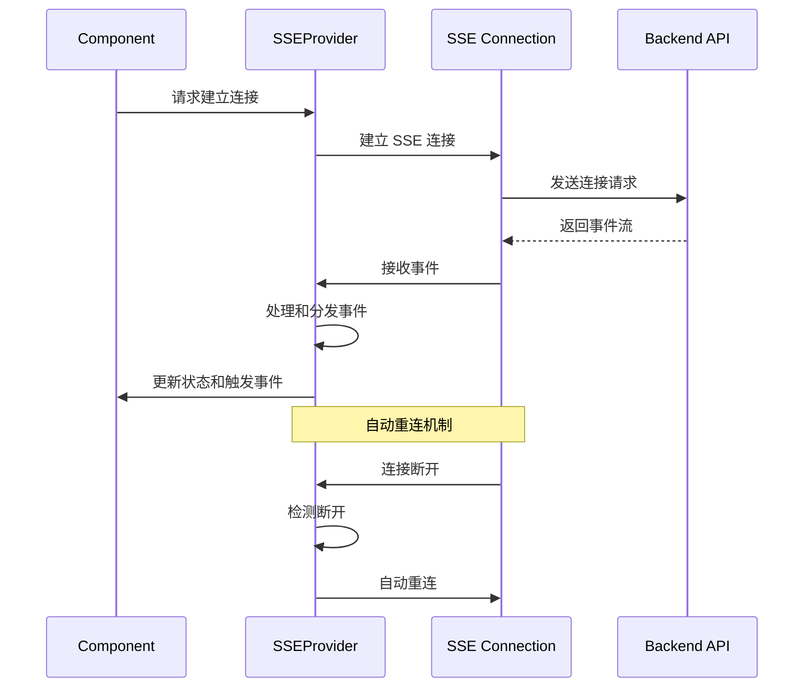
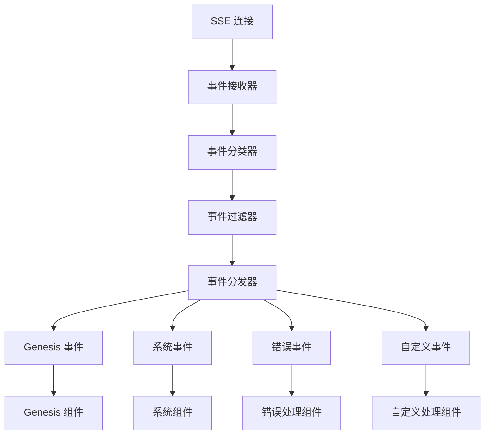

# React Contexts

React Context 目录，用于管理全局状态和共享数据。

## 目录结构

```
src/contexts/
├── index.ts              # 导出所有 Context
└── sse/                  # SSE 相关 Context
    └── SSEProvider.tsx   # SSE 连接和事件管理
```

## Contexts 概述

### SSEProvider

Server-Sent Events (SSE) 提供者，管理 SSE 连接的生命周期和事件分发。

**主要职责：**
- 建立和管理 SSE 连接
- 处理连接状态变化
- 分发 SSE 事件到订阅者
- 提供连接状态查询
- 实现自动重连机制

**关键特性：**
- **连接管理**: 自动建立、维护和恢复 SSE 连接
- **事件分发**: 将接收到的 SSE 事件分发给相关组件
- **状态管理**: 提供连接状态、错误状态等实时信息
- **错误处理**: 完善的错误处理和恢复机制
- **性能优化**: 事件去重、批量处理等优化

**最新更新 (feat/genesis-stage)：**
- **Genesis 事件支持**: 增强对 Genesis 相关事件的处理
- **状态持久化**: 支持连接状态的持久化存储
- **事件过滤**: 支持事件类型过滤和自定义处理
- **调试支持**: 增加调试日志和连接诊断功能

## 使用示例

### 基本使用

```tsx
import { SSEProvider, useSSEContext } from '@/contexts/sse'

function App() {
  return (
    <SSEProvider>
      <MyComponent />
    </SSEProvider>
  )
}

function MyComponent() {
  const { isConnected, status, events } = useSSEContext()
  
  return (
    <div>
      <p>SSE 连接状态: {isConnected ? '已连接' : '未连接'}</p>
      <p>详细状态: {status}</p>
    </div>
  )
}
```

### Genesis 事件监听

```tsx
import { useSSEContext } from '@/contexts/sse'

function GenesisComponent() {
  const { subscribe, unsubscribe } = useSSEContext()
  
  useEffect(() => {
    // 订阅 Genesis 事件
    const handleGenesisEvent = (event: SSEEvent) => {
      console.log('Genesis 事件:', event)
    }
    
    subscribe('genesis_command', handleGenesisEvent)
    
    return () => {
      unsubscribe('genesis_command', handleGenesisEvent)
    }
  }, [subscribe, unsubscribe])
}
```

## 技术架构

### SSE 连接管理流程



### 事件分发架构



## API 接口

### SSEProvider Props

```typescript
interface SSEProviderProps {
  children: React.ReactNode
  baseUrl?: string        // SSE 服务器地址
  reconnectInterval?: number // 重连间隔时间
  maxReconnectAttempts?: number // 最大重连次数
  debug?: boolean        // 调试模式
}
```

### SSEContext

```typescript
interface SSEContext {
  // 连接状态
  isConnected: boolean
  status: SSEConnectionStatus
  error: Error | null
  
  // 事件管理
  events: SSEEvent[]
  subscribe: (eventType: string, handler: EventHandler) => void
  unsubscribe: (eventType: string, handler: EventHandler) => void
  
  // 连接控制
  connect: () => void
  disconnect: () => void
  reconnect: () => void
}
```

### 事件类型

```typescript
type SSEEventType = 
  | 'genesis_command'      // Genesis 命令事件
  | 'system'               // 系统事件
  | 'connection'           // 连接状态事件
  | 'error'                // 错误事件
  | 'custom'               // 自定义事件
```

## 配置选项

### 连接配置

```typescript
const sseConfig = {
  baseUrl: '/api/v1/sse',           // SSE 端点
  reconnectInterval: 3000,          // 重连间隔 3 秒
  maxReconnectAttempts: 5,         // 最大重连次数
  heartbeatInterval: 30000,         // 心跳间隔 30 秒
  timeout: 10000,                   // 连接超时 10 秒
}
```

### 事件处理配置

```typescript
const eventConfig = {
  maxEvents: 1000,                  // 最大事件缓存数量
  enableFiltering: true,            // 启用事件过滤
  enableDeduplication: true,        // 启用事件去重
  enablePersistence: false,         // 启用事件持久化
}
```

## 开发指南

### 添加新 Context

1. 在 `contexts/` 目录下创建新的 Context 目录
2. 实现 Provider 组件和 Hook
3. 在 `contexts/index.ts` 中导出
4. 添加类型定义和接口
5. 编写测试用例

### Context 开发规范

- **单一职责**: 每个 Context 负责一个特定的状态域
- **性能优化**: 使用 useMemo 和 useCallback 避免不必要的重渲染
- **类型安全**: 提供 TypeScript 类型定义
- **错误处理**: 实现完善的错误处理机制
- **测试覆盖**: 编写单元测试和集成测试

### 性能优化

- **事件去重**: 避免重复事件处理
- **批量更新**: 批量处理多个事件更新
- **内存管理**: 及时清理过期事件和监听器
- **懒加载**: 按需加载 Context 功能

## 测试

### 单元测试

```typescript
// 测试 SSE 连接
describe('SSEProvider', () => {
  it('should establish connection', () => {
    // 测试连接建立逻辑
  })
  
  it('should handle reconnection', () => {
    // 测试重连机制
  })
})
```

### 集成测试

```typescript
// 测试事件分发
describe('Event Distribution', () => {
  it('should distribute events to subscribers', () => {
    // 测试事件分发逻辑
  })
})
```

## 调试和监控

### 开发调试

```typescript
// 启用调试模式
<SSEProvider debug={true}>
  <App />
</SSEProvider>
```

### 监控指标

- **连接状态**: 实时监控连接状态
- **事件处理速度**: 监控事件处理延迟
- **内存使用**: 监控事件缓存内存占用
- **错误率**: 监控连接和事件处理错误率

## 注意事项

- **安全性**: 确保 SSE 端点的安全性
- **性能**: 合理设置事件缓存和清理策略
- **兼容性**: 考虑不同浏览器的 SSE 兼容性
- **错误恢复**: 实现完善的错误恢复机制
- **资源管理**: 及时清理不再需要的连接和监听器