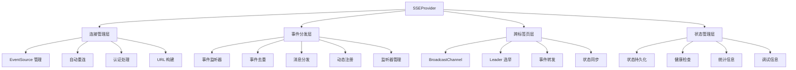
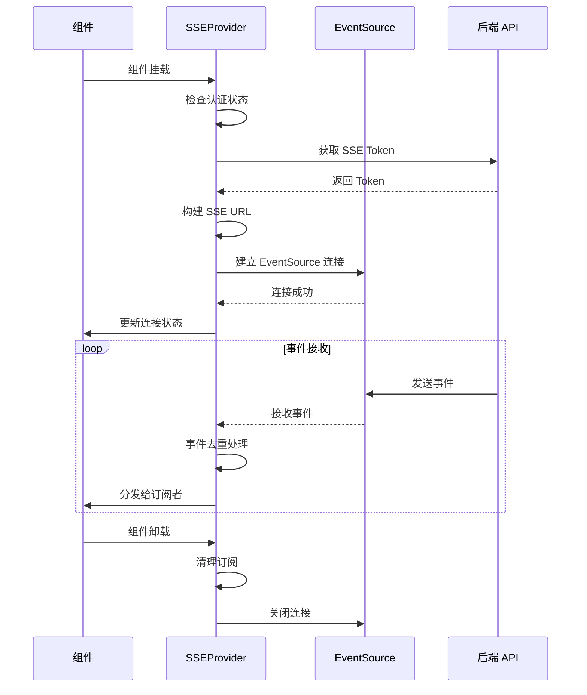
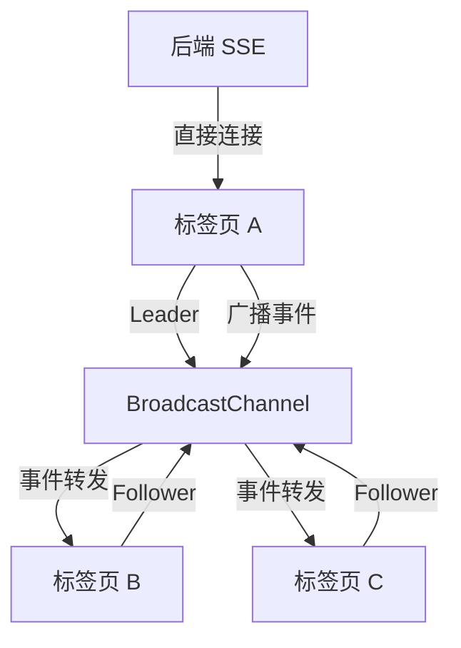
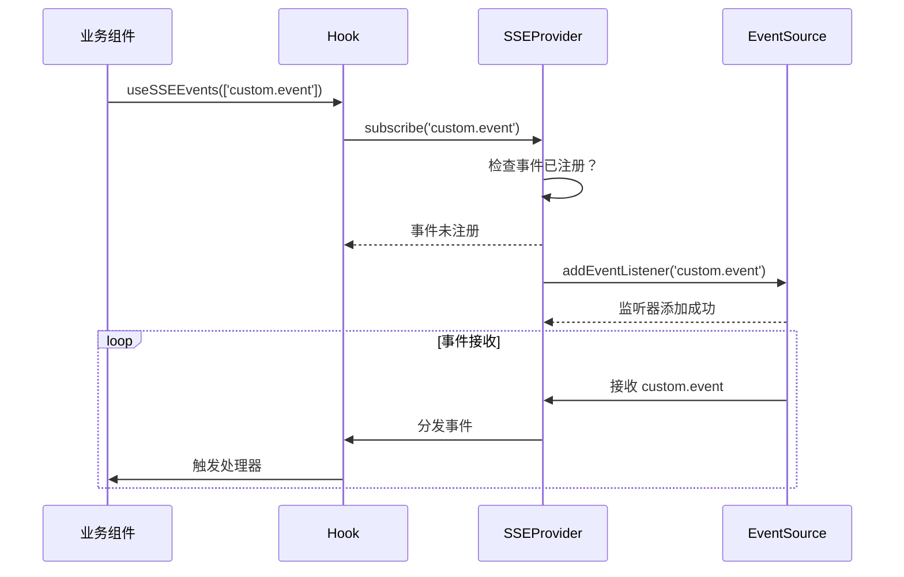

# SSE Context 系统

SSE Context 系统为 InfiniteScribe 前端应用提供了完整的 Server-Sent Events 连接管理和事件分发解决方案。该系统基于 React Context 封装，实现了单连接多路复用、自动重连、跨标签页共享等核心功能。

## 🎯 核心特性

### 连接管理
- **单连接多路复用**: 整个应用维护一个 SSE 连接，支持多个事件订阅者
- **自动重连机制**: 指数退避算法，智能处理网络异常
- **跨标签页共享**: 使用 BroadcastChannel 实现多标签页连接共享
- **认证集成**: 自动处理 SSE Token 获取和刷新

### 事件分发
- **动态事件注册**: 按需注册事件类型到 EventSource，优化监听器管理
- **事件去重**: 基于 event ID 防止重复处理同一事件，包含跨标签页事件去重
- **多级监听**: 支持特定事件监听和全局消息监听
- **类型安全**: 完整的 TypeScript 类型支持
- **智能监听器管理**: 自动添加和移除 EventSource 监听器，避免内存泄漏

### 状态管理
- **连接状态监控**: 实时跟踪连接状态和健康度
- **持久化支持**: localStorage 存储关键状态信息
- **内存优化**: 智能缓存管理，避免内存泄漏
- **调试支持**: 开发环境的完整调试工具

## 📁 架构设计



## 🔧 核心组件

### SSEProvider
React Context Provider，提供 SSE 连接的核心功能。

```typescript
<SSEProvider
  buildUrl={customBuildUrl}           // 自定义URL构建函数
  withCredentials={true}              // 是否携带Cookie
  minRetry={1000}                     // 最小重连间隔
  maxRetry={30000}                    // 最大重连间隔
  crossTabKey="infinitescribe_sse"    // 跨标签页通信Key
  endpoint="/api/v1/events"           // SSE端点路径
>
  {children}
</SSEProvider>
```

### useSSE Hook
获取 SSE 上下文的主要 Hook。

```typescript
const {
  // 连接状态
  status,                           // 当前连接状态
  isConnected,                      // 是否已连接
  isConnecting,                     // 是否正在连接
  isReconnecting,                   // 是否正在重连
  error,                            // 错误信息
  
  // 连接信息
  connectionId,                     // 连接唯一标识
  connectedAt,                      // 连接建立时间
  reconnectAttempts,                // 重连尝试次数
  
  // 事件统计
  totalEventsReceived,             // 接收事件总数
  lastEventTime,                    // 最后事件时间
  averageLatency,                   // 平均延迟
  isHealthy,                        // 连接健康状态
  
  // 核心方法
  subscribe,                        // 订阅事件
  addMessageListener,               // 添加消息监听器
  removeMessageListener,            // 移除消息监听器
  connect,                          // 建立连接
  disconnect,                       // 断开连接
  reconnect,                        // 重新连接
  pause,                            // 暂停连接
  resume,                           // 恢复连接
  getConnectionInfo,                // 获取连接信息
} = useSSE()
```

### useSSEEvent Hook
订阅特定类型事件的 Hook。

```typescript
useSSEEvent<T>(
  event: string,                    // 事件类型
  handler: (data: T) => void        // 事件处理器
)
```

## 🔄 工作原理

### 连接生命周期



### 跨标签页通信



### 动态事件注册



## 🚀 使用示例

### 基础使用

```typescript
// 在应用根组件中配置
function App() {
  return (
    <SSEProvider>
      <Router>
        <Routes>
          <Route path="/" element={<Home />} />
          <Route path="/genesis" element={<GenesisPage />} />
        </Routes>
      </Router>
    </SSEProvider>
  )
}
```

### 事件订阅

```typescript
// 订阅特定事件
function NotificationComponent() {
  const { addMessageListener, removeMessageListener } = useSSE()
  
  useEffect(() => {
    const handleNotification = (message: SSEMessage) => {
      if (message.event === 'system.notification-sent') {
        toast(message.data.message)
      }
    }
    
    addMessageListener(handleNotification)
    return () => removeMessageListener(handleNotification)
  }, [addMessageListener, removeMessageListener])
  
  return <div>通知组件</div>
}
```

### 连接状态监控

```typescript
function ConnectionStatus() {
  const { 
    isConnected, 
    isConnecting, 
    isReconnecting, 
    error, 
    reconnect 
  } = useSSE()
  
  return (
    <div className="flex items-center gap-2">
      <div className={`w-2 h-2 rounded-full ${
        isConnected ? 'bg-green-500' : 
        isConnecting ? 'bg-yellow-500' : 
        'bg-red-500'
      }`} />
      <span>
        {isConnected ? '已连接' : 
         isConnecting ? '连接中...' : 
         isReconnecting ? '重连中...' : '未连接'}
      </span>
      {error && (
        <button 
          onClick={reconnect}
          className="text-blue-500 hover:text-blue-700"
        >
          重新连接
        </button>
      )}
    </div>
  )
}
```

## 🛠️ 开发调试

### 调试模式

在开发环境中，SSE 连接会暴露到 window 对象：

```typescript
// 开发环境中访问 SSE 连接
if (import.meta.env.DEV) {
  const eventSource = (window as any).infinitescribe_sse
  console.log('SSE 连接:', eventSource)
}
```

### 日志输出

系统提供详细的日志输出：

```
[SSE] 建立连接...
[SSE] 连接已建立
[SSE] 收到事件: genesis.step-completed, ID: 12345
[SSE] 跨标签页广播事件: genesis.step-completed
[SSE] 连接断开，准备重连...
```

### 性能监控

```typescript
// 获取连接统计信息
const { 
  totalEventsReceived, 
  averageLatency, 
  getConnectionInfo 
} = useSSE()

const info = getConnectionInfo()
console.log('连接持续时间:', info.connectionDuration)
console.log('重连次数:', info.reconnectAttempts)
console.log('平均延迟:', averageLatency)
```

## 🎨 设计特点

### 类型安全
- 完整的 TypeScript 类型定义
- 泛型支持自定义数据类型
- 编译时类型检查

### 性能优化
- 单连接模式减少服务器压力
- 事件去重避免重复处理
- 智能缓存管理防止内存泄漏
- 跨标签页共享减少资源消耗
- 动态监听器管理优化内存使用
- 智能事件分发机制减少不必要的处理

### 可扩展性
- 支持自定义 URL 构建逻辑
- 可配置的重连策略
- 插件式的事件处理器
- 模块化的架构设计

### 错误处理
- 智能重连机制
- 错误状态管理
- 用户友好的错误提示
- 详细的错误日志

## 🔗 相关模块

- **SSE Hooks**: `@/hooks/sse` - 高级事件订阅 Hooks
- **配置系统**: `@/config/sse.config` - SSE 相关配置
- **Token 服务**: `@/services/sseTokenService` - SSE Token 管理
- **存储工具**: `@/utils/sseStorage` - 状态持久化工具
- **类型定义**: `@/types/events` - 事件类型定义

## 📝 最佳实践

### 连接管理
1. 在应用根组件中配置 SSEProvider
2. 避免频繁的连接/断开操作
3. 合理使用暂停/恢复功能
4. 监控连接状态提供用户反馈

### 事件订阅
1. 使用特定的 Hook 订阅领域事件
2. 及时清理不再需要的订阅
3. 使用条件过滤减少不必要的事件处理
4. 保持事件处理器的简洁性
5. 利用系统的动态监听器管理功能，避免手动管理 EventSource 监听器

### 性能优化
1. 避免在事件处理器中执行耗时操作
2. 使用状态管理来响应事件变化
3. 合理设置依赖项数组优化 Hook 性能
4. 监控内存使用情况

## ⚠️ 注意事项

1. **浏览器兼容性**: 需要 EventSource 和 BroadcastChannel 支持
2. **网络环境**: 在不稳定的网络环境中表现更好
3. **服务器负载**: 单连接模式减少服务器压力
4. **内存管理**: 系统自动管理内存，但仍需注意事件处理器的性能