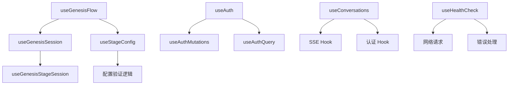
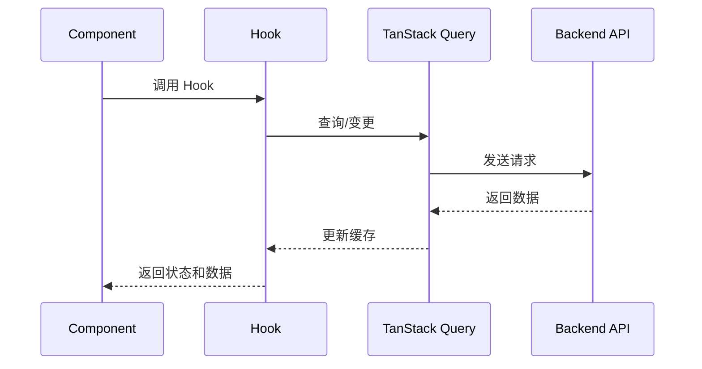

# React Hooks

React Hooks 目录，包含各种自定义 Hook 用于状态管理、API 调用和业务逻辑处理。

## 目录结构

```
src/hooks/
├── index.ts                    # 导出所有 Hook
├── sse/                        # SSE 相关 Hook
│   ├── index.ts               # SSE Hook 导出
│   └── README.md              # SSE Hook 文档
├── useAuth.ts                 # 认证相关 Hook
├── useAuthMutations.ts        # 认证操作 Hook
├── useAuthQuery.ts           # 认证查询 Hook
├── useConversations.ts       # 对话相关 Hook
├── useGenesisFlow.ts         # Genesis 流程管理 Hook
├── useGenesisSession.ts      # Genesis 会话管理 Hook
├── useGenesisStageSession.ts  # Genesis 阶段会话 Hook
├── useHealthCheck.ts         # 健康检查 Hook
├── useNovels.ts             # 小说管理 Hook
└── useStageConfig.ts        # 阶段配置 Hook
```

## Hooks 概览

### Genesis 相关 Hook

#### useGenesisFlow

Genesis 流程管理 Hook，用于管理创世流程的整个生命周期。

**主要功能：**
- 创建和获取 Genesis 流程
- 阶段切换和流程完成
- 流程状态查询和管理
- 错误处理和回调机制

**使用示例：**
```typescript
const {
  flow,                    // 当前流程数据
  isLoading,              // 加载状态
  currentStage,           // 当前阶段
  flowStatus,             // 流程状态
  switchStage,            // 切换阶段
  completeFlow,           // 完成流程
  hasStageConfigError,    // 阶段配置错误检查
  hasValidationError,      // 验证错误检查
} = useGenesisFlow(novelId, {
  onFlowReady: (flow) => console.log('流程准备就绪:', flow),
  onStageChanged: (flow) => console.log('阶段已切换:', flow),
  onError: (error) => console.error('流程错误:', error),
})
```

**最新更新 (feat/genesis-stage)：**
- **增强的错误处理**: 支持特定错误类型的回调
- **状态管理优化**: 更精确的状态控制和更新
- **配置验证**: 集成阶段配置验证功能
- **性能优化**: 减少不必要的 API 调用

#### useGenesisSession

Genesis 会话管理 Hook，用于管理会话相关的状态和操作。

**主要功能：**
- 会话创建和管理
- 会话状态查询
- 会话数据持久化
- 会话生命周期管理

#### useGenesisStageSession

Genesis 阶段会话 Hook，用于管理特定阶段的会话信息。

**主要功能：**
- 阶段会话创建和获取
- 阶段会话状态管理
- 会话配置处理
- 阶段切换协调

#### useStageConfig

阶段配置管理 Hook，用于管理各阶段的配置信息。

**主要功能：**
- 配置获取和更新
- 配置验证
- 配置模板处理
- 配置持久化

### 认证相关 Hook

#### useAuth

认证状态管理 Hook，提供用户认证状态和基本操作。

**主要功能：**
- 用户登录状态管理
- 用户信息获取
- 权限检查
- 登录/登出操作

#### useAuthMutations

认证操作 Hook，处理用户认证相关的变更操作。

**主要功能：**
- 用户登录
- 用户注册
- 密码重置
- 邮箱验证

#### useAuthQuery

认证查询 Hook，处理认证相关的数据查询。

**主要功能：**
- 用户信息查询
- 权限查询
- 会话状态查询
- 认证历史查询

### 业务相关 Hook

#### useConversations

对话管理 Hook，处理用户对话相关的状态和操作。

**主要功能：**
- 对话列表管理
- 对话详情查询
- 对话创建和删除
- 对话状态更新

#### useHealthCheck

健康检查 Hook，监控系统和服务状态。

**主要功能：**
- 服务健康状态检查
- 连接状态监控
- 错误状态检测
- 自动重连机制

#### useNovels

小说管理 Hook，处理小说相关的状态和操作。

**主要功能：**
- 小说列表管理
- 小说详情查询
- 小说创建和编辑
- 小说状态管理

### SSE 相关 Hook

#### useSSEStatus

SSE 连接状态 Hook，提供 SSE 连接的实时状态信息。

**主要功能：**
- 连接状态查询
- 错误状态监控
- 连接质量检测
- 重连状态跟踪

#### useGenesisEvents

Genesis 事件监听 Hook，专门用于监听 Genesis 相关事件。

**主要功能：**
- Genesis 事件订阅
- 事件过滤和处理
- 事件状态管理
- 回调函数管理

## 技术架构

### Hook 依赖关系



### 数据流架构



## 使用模式

### 基本 Hook 使用

```typescript
// 1. 导入 Hook
import { useGenesisFlow } from '@/hooks'

// 2. 在组件中使用
function GenesisComponent({ novelId }: { novelId: string }) {
  const { flow, switchStage, isLoading } = useGenesisFlow(novelId)
  
  if (isLoading) {
    return <div>加载中...</div>
  }
  
  return (
    <div>
      <h2>当前阶段: {flow?.current_stage}</h2>
      <button onClick={() => switchStage('WORLDVIEW')}>
        切换到世界观阶段
      </button>
    </div>
  )
}
```

### 组合 Hook 使用

```typescript
// 组合多个 Hook
function AdvancedGenesisComponent({ novelId }: { novelId: string }) {
  const { flow, switchStage } = useGenesisFlow(novelId)
  const { session } = useGenesisSession(novelId)
  const { config } = useStageConfig(flow?.current_stage)
  
  return (
    <div>
      <GenesisFlow flow={flow} onSwitchStage={switchStage} />
      <GenesisSession session={session} />
      <StageConfig config={config} />
    </div>
  )
}
```

### 自定义 Hook 创建

```typescript
// 创建自定义 Hook
function useCustomLogic(params: CustomParams) {
  const { data } = useQuery({
    queryKey: ['custom', params.id],
    queryFn: () => fetchCustomData(params.id),
  })
  
  const mutation = useMutation({
    mutationFn: updateCustomData,
    onSuccess: () => {
      // 处理成功逻辑
    },
  })
  
  return {
    data,
    updateData: mutation.mutate,
    isLoading: mutation.isPending,
  }
}
```

## 配置选项

### Hook 配置

```typescript
// Genesis Hook 配置
const genesisConfig = {
  retryAttempts: 3,           // 重试次数
  retryDelay: 1000,           // 重试延迟
  staleTime: 30000,           // 数据过期时间
  cacheTime: 300000,          // 缓存时间
  refetchOnWindowFocus: true, // 窗口聚焦时刷新
}
```

### 查询配置

```typescript
// 查询配置
const queryConfig = {
  enabled: true,              // 是否启用查询
  refetchOnMount: true,       // 组件挂载时刷新
  refetchOnReconnect: true,   // 重连时刷新
  keepPreviousData: true,     // 保留之前的数据
}
```

## 开发指南

### Hook 开发规范

1. **命名规范**: 使用 `use` 前缀，驼峰命名
2. **参数设计**: 提供清晰的参数接口
3. **返回值设计**: 返回状态、数据和操作函数
4. **错误处理**: 实现完善的错误处理机制
5. **性能优化**: 使用 useMemo 和 useCallback 优化

### 最佳实践

```typescript
// ✅ 好的实践
function useGoodHook(id: string) {
  const { data } = useQuery({
    queryKey: ['hook', id],
    queryFn: () => fetchData(id),
  })
  
  const mutation = useMutation({
    mutationFn: updateData,
  })
  
  return {
    data,
    update: mutation.mutate,
    isLoading: mutation.isPending,
  }
}

// ❌ 不好的实践
function useBadHook(id: string) {
  const [data, setData] = useState(null)
  const [isLoading, setIsLoading] = useState(false)
  
  // 没有使用 TanStack Query，缺乏缓存和错误处理
  useEffect(() => {
    setIsLoading(true)
    fetchData(id).then(setData).finally(() => setIsLoading(false))
  }, [id])
  
  return { data, isLoading }
}
```

### 测试

```typescript
// Hook 测试
describe('useGenesisFlow', () => {
  it('should handle flow creation', async () => {
    const { result } = renderHook(() => useGenesisFlow('test-novel'))
    
    await act(async () => {
      result.current.createOrGetFlow()
    })
    
    expect(result.current.flow).toBeDefined()
  })
})
```

## 性能优化

### 缓存策略

- **查询缓存**: 使用 TanStack Query 的缓存机制
- **数据去重**: 避免重复请求相同数据
- **过期策略**: 合理设置数据过期时间
- **内存管理**: 及时清理不需要的缓存

### 渲染优化

- **状态选择**: 只返回需要的状态
- **依赖优化**: 正确设置 useEffect 依赖
- **记忆化**: 使用 useMemo 和 useCallback
- **条件渲染**: 根据状态条件渲染组件

## 错误处理

### 错误分类

- **网络错误**: 连接失败、超时等
- **业务错误**: 验证失败、权限不足等
- **数据错误**: 数据格式错误、缺失等
- **系统错误**: 服务器错误、未知错误等

### 错误处理策略

```typescript
// 错误处理示例
function useWithErrorHandling() {
  const query = useQuery({
    queryKey: ['data'],
    queryFn: fetchData,
    retry: (failureCount, error) => {
      // 网络错误重试，业务错误不重试
      if (error instanceof NetworkError) {
        return failureCount < 3
      }
      return false
    },
  })
  
  return {
    ...query,
    // 分类错误处理
    isNetworkError: query.error instanceof NetworkError,
    isBusinessError: query.error instanceof BusinessError,
  }
}
```

## 调试和监控

### 开发调试

```typescript
// 调试模式
const DEBUG = process.env.NODE_ENV === 'development'

function useDebugHook() {
  const { data, error } = useQuery(/* ... */)
  
  if (DEBUG) {
    console.log('[useDebugHook] data:', data)
    console.log('[useDebugHook] error:', error)
  }
  
  return { data, error }
}
```

### 监控指标

- **性能指标**: 加载时间、响应时间
- **错误指标**: 错误率、错误类型分布
- **使用指标**: Hook 调用频率、并发数
- **资源指标**: 内存使用、网络请求