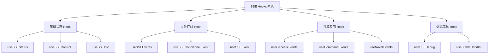
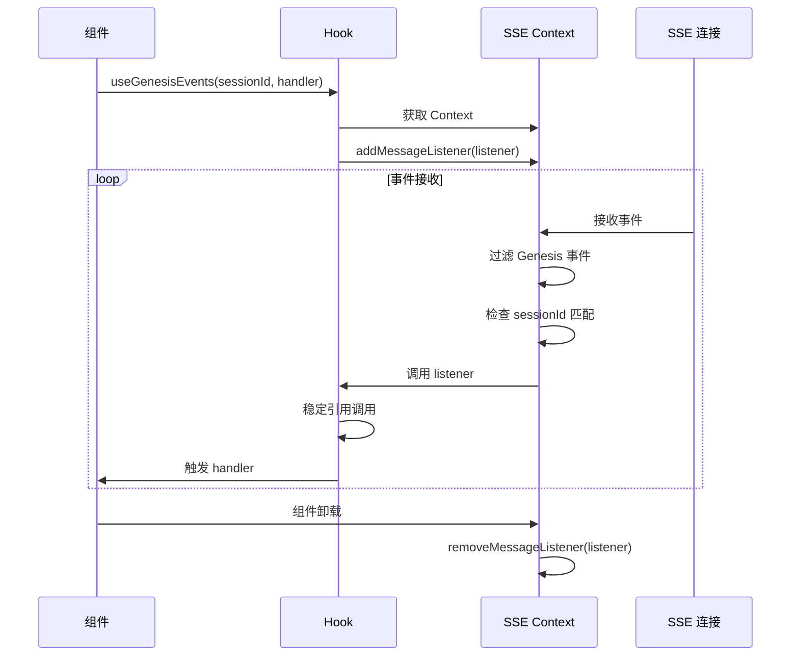
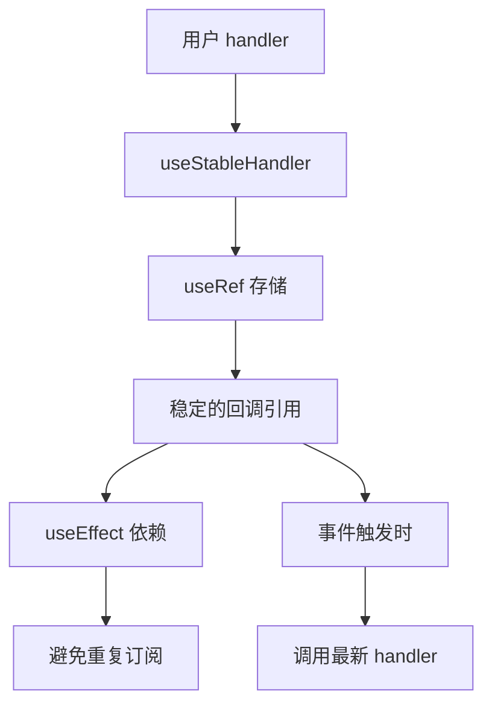

# SSE Hooks 系统

SSE (Server-Sent Events) Hooks 系统为前端应用提供了一套完整的实时事件订阅和管理解决方案。该系统基于 React Hooks 封装，提供了类型安全、高性能的事件监听功能。

## 🎯 核心功能

### 事件订阅机制
- **多事件订阅**: 支持同时订阅多个事件类型
- **条件订阅**: 支持基于数据条件的事件过滤
- **自动管理**: 自动处理订阅和取消订阅的生命周期
- **内存优化**: 使用稳定的引用避免不必要的重新渲染

### 领域专用 Hook
- **Genesis 事件**: 专门处理创世流程相关的事件
- **命令事件**: 监听命令执行状态和结果
- **小说事件**: 处理小说创作相关的事件
- **调试支持**: 提供开发环境的调试工具

### 连接状态管理
- **实时状态**: 获取 SSE 连接的当前状态
- **健康检查**: 监控连接的健康状况
- **控制接口**: 提供连接/断开/重连的控制方法

## 📁 Hook 架构



## 🔧 Hook 详解

### 基础状态 Hook

#### useSSEStatus - 连接状态监控

```typescript
const {
  status,           // 连接状态
  isConnected,      // 是否已连接
  isConnecting,     // 是否正在连接
  isRetrying,       // 是否正在重连
  isError,          // 是否有错误
  error,            // 错误信息
  isHealthy         // 连接是否健康
} = useSSEStatus()
```

**特性**:
- 实时反映 SSE 连接状态
- 提供布尔值简化条件判断
- 包含健康检查状态

#### useSSEControl - 连接控制

```typescript
const {
  connect,     // 建立连接
  disconnect,  // 断开连接
  reconnect,   // 重新连接
  pause,       // 暂停事件接收
  resume       // 恢复事件接收
} = useSSEControl()
```

**特性**:
- 提供完整的连接生命周期控制
- 支持暂停/恢复功能
- 支持手动重连操作

### 事件订阅 Hook

#### useSSEEvents - 多事件订阅

```typescript
useSSEEvents<T>(
  events: string[],                    // 事件类型数组
  handler: (event: string, data: T) => void,  // 事件处理器
  deps: React.DependencyList = []      // 依赖项数组
)
```

**特性**:
- 同时监听多个事件类型
- 自动管理订阅生命周期
- 类型安全的数据处理
- 支持依赖项优化

#### useSSEConditionalEvent - 条件订阅

```typescript
useSSEConditionalEvent<T>(
  event: string,                       // 事件类型
  handler: (data: T) => void,         // 事件处理器
  condition: (data: T) => boolean,     // 条件函数
  deps: React.DependencyList = []      // 依赖项数组
)
```

**特性**:
- 基于数据条件过滤事件
- 减少不必要的事件处理
- 支持复杂的过滤逻辑

### 领域专用 Hook

#### useGenesisEvents - Genesis 事件订阅

```typescript
useGenesisEvents(
  sessionId: string,
  handler: (event: string, data: any) => void
)
```

**特性**:
- 自动发现所有支持的 Genesis 事件类型
- 基于 sessionId 过滤事件
- 合并传统事件类型和新配置事件
- 集成 `isGenesisEvent` 检查

**事件类型支持**:
- 配置事件: 从 `genesis-status.config.ts` 自动获取
- 传统事件: `genesis.step-completed`, `genesis.step-failed` 等
- 命令事件: `Genesis.Session.Command.Received` 等

#### useCommandEvents - 命令事件订阅

```typescript
useCommandEvents(
  commandId: string | null,
  handler: (status: string, data: any) => void
)
```

**特性**:
- 基于 commandId 过滤命令事件
- 提供命令状态变更通知
- 支持命令执行结果监听

#### useNovelEvents - 小说事件订阅

```typescript
useNovelEvents(
  novelId: string,
  handler: (event: string, data: any) => void
)
```

**特性**:
- 监听小说创作相关事件
- 包含章节创建和状态变更
- 基于 novelId 过滤事件

## 🔄 工作原理

### 事件监听机制



### 稳定引用优化



## 🚀 使用示例

### 基本 SSE 事件订阅

```typescript
// 订阅多个事件类型
useSSEEvents(
  ['user.updated', 'user.created'],
  (event, data) => {
    console.log(`${event}:`, data)
  },
  [] // 空依赖项，只订阅一次
)
```

### 条件事件订阅

```typescript
// 只订阅特定用户的更新事件
useSSEConditionalEvent(
  'user.updated',
  (userData) => {
    console.log('用户数据更新:', userData)
  },
  (data) => data.user_id === currentUserId,
  [currentUserId]
)
```

### Genesis 事件集成

```typescript
// 在 GenesisConversation 组件中使用
useGenesisEvents(sessionId, (eventType, data) => {
  if (eventType === 'Genesis.Session.Command.Received') {
    console.log('命令已接收:', data)
  } else if (eventType === 'genesis.step-completed') {
    console.log('阶段已完成:', data)
  }
})
```

### 命令状态监控

```typescript
// 监控特定命令的执行状态
useCommandEvents(commandId, (status, data) => {
  switch (status) {
    case 'processing':
      setCommandStatus('处理中')
      break
    case 'completed':
      setCommandStatus('已完成')
      break
    case 'failed':
      setCommandStatus('失败')
      break
  }
})
```

### 连接状态管理

```typescript
function ConnectionStatus() {
  const { isConnected, isError, error } = useSSEStatus()
  const { reconnect } = useSSEControl()
  
  return (
    <div>
      <span>连接状态: {isConnected ? '已连接' : '未连接'}</span>
      {isError && (
        <div>
          <span>错误: {error?.message}</span>
          <button onClick={reconnect}>重新连接</button>
        </div>
      )}
    </div>
  )
}
```

## 🛠️ 开发调试

### 使用调试 Hook

```typescript
// 开发环境中的调试工具
const { events, eventCount } = useSSEDebug()

// 在开发工具中显示事件流
if (import.meta.env.DEV) {
  console.log('SSE 事件总数:', eventCount)
  console.log('最近的事件:', events.slice(-10))
}
```

### 性能优化

1. **依赖项优化**: 合理设置依赖项数组，避免不必要的重新订阅
2. **事件过滤**: 使用条件订阅减少不必要的事件处理
3. **内存管理**: 组件卸载时自动清理订阅

## 🎨 设计特点

### 类型安全
- 完整的 TypeScript 类型支持
- 泛型支持自定义数据类型
- 类型检查确保事件数据正确性

### 性能优化
- 使用 `useStableHandler` 避免重复订阅
- 基于 `useCallback` 和 `useMemo` 优化性能
- 自动内存管理防止内存泄漏

### 可扩展性
- 模块化设计，易于添加新的领域 Hook
- 配置驱动的事件类型管理
- 支持自定义事件处理器

### 开发体验
- 一致的 API 设计模式
- 完整的调试支持
- 清晰的错误处理机制

## 🔗 相关模块

- **SSE Context**: `@/contexts/sse/SSEProvider` - 底层 SSE 连接管理
- **事件配置**: `@/config/sse.config` - SSE 事件类型配置
- **Genesis 配置**: `@/config/genesis-status.config` - Genesis 事件状态配置
- **类型定义**: `@/types/events` - SSE 事件类型定义

## 📝 最佳实践

### 组件中使用
1. 在需要事件订阅的组件中直接使用对应的 Hook
2. 合理设置依赖项数组以优化性能
3. 在组件卸载时无需手动清理，Hook 自动处理

### 事件处理器
1. 保持事件处理器的简洁性
2. 避免在处理器中执行耗时操作
3. 使用状态管理来响应事件变化

### 错误处理
1. 监听 `useSSEStatus` 的错误状态
2. 提供重连机制的用户界面
3. 记录关键错误信息用于调试