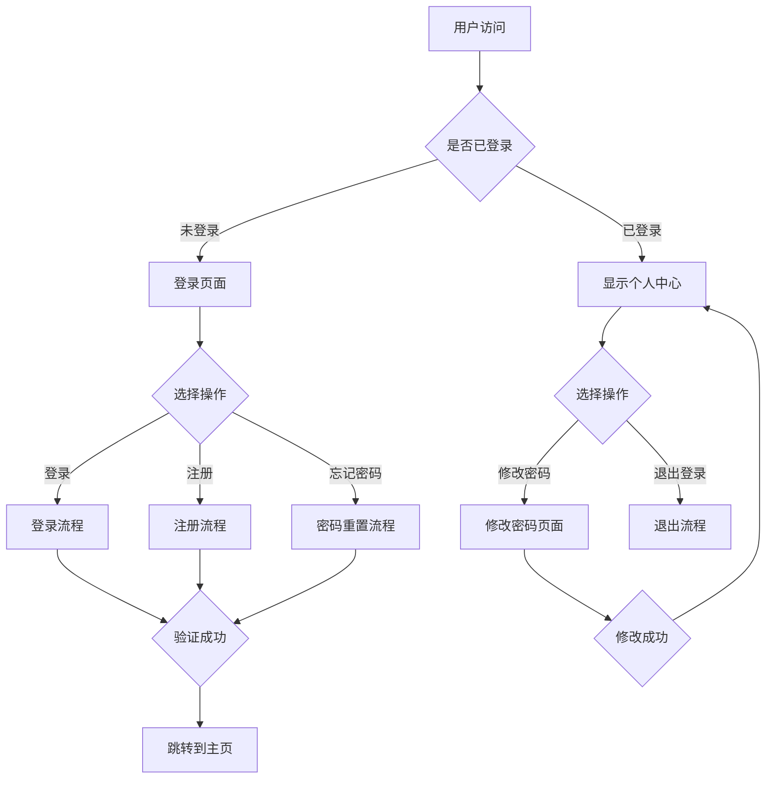
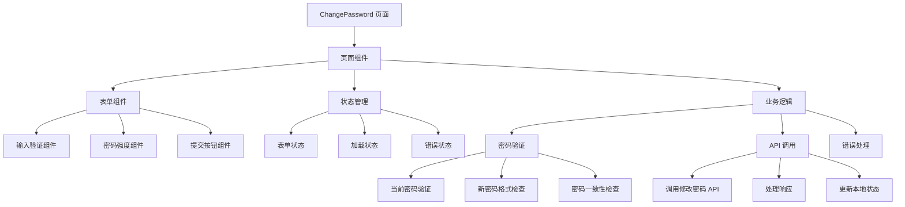

# 认证页面

认证相关页面组件，包含用户登录、注册、密码重置等功能的页面实现。

## 页面列表

### ChangePassword

密码修改页面，用于已登录用户修改登录密码。

**功能特性：**
- 当前密码验证
- 新密码强度检查
- 密码确认验证
- 实时输入验证
- 友好的错误提示
- 成功修改后的反馈

**主要组件：**
- 密码输入框（带可见性切换）
- 密码强度指示器
- 验证规则提示
- 提交按钮和加载状态
- 错误和成功消息提示

**使用示例：**
```tsx
import { ChangePassword } from '@/pages/auth/ChangePassword'

function ProfilePage() {
  return (
    <div className="profile-container">
      <ChangePassword />
    </div>
  )
}
```

## 页面架构

### 认证页面流程



### ChangePassword 页面架构



## 技术实现

### 表单验证

```typescript
// 密码验证规则
const passwordValidation = {
  minLength: 8,
  requireUppercase: true,
  requireLowercase: true,
  requireNumbers: true,
  requireSpecialChars: true,
}

// 实时验证
const validatePassword = (password: string) => {
  const errors = []
  
  if (password.length < passwordValidation.minLength) {
    errors.push('密码长度至少8位')
  }
  
  if (passwordValidation.requireUppercase && !/[A-Z]/.test(password)) {
    errors.push('密码必须包含大写字母')
  }
  
  // ... 更多验证规则
  
  return errors
}
```

### API 集成

```typescript
// 修改密码 API 调用
const changePassword = async (data: ChangePasswordData) => {
  const response = await authService.changePassword({
    currentPassword: data.currentPassword,
    newPassword: data.newPassword,
    confirmPassword: data.confirmPassword,
  })
  
  return response
}
```

### 状态管理

```typescript
// 页面状态
interface ChangePasswordState {
  formData: {
    currentPassword: string
    newPassword: string
    confirmPassword: string
  }
  validation: {
    currentPassword: { isValid: boolean; errors: string[] }
    newPassword: { isValid: boolean; errors: string[] }
    confirmPassword: { isValid: boolean; errors: string[] }
  }
  isLoading: boolean
  error: string | null
  success: boolean
}
```

## 用户体验设计

### 交互设计

- **即时反馈**: 输入时实时显示验证结果
- **视觉提示**: 密码强度用颜色和进度条表示
- **错误处理**: 友好的错误提示和解决建议
- **加载状态**: 提交时显示加载动画
- **成功反馈**: 修改成功后显示确认消息

### 视觉设计

- **一致的布局**: 遵循项目的设计系统
- **响应式设计**: 适配不同屏幕尺寸
- **可访问性**: 支持键盘导航和屏幕阅读器
- **动画效果**: 平滑的状态转换动画

## 安全考虑

### 密码安全

- **传输加密**: 使用 HTTPS 协议传输
- **输入验证**: 前端和后端双重验证
- **密码强度**: 强制要求复杂密码
- **防暴力破解**: 限制尝试次数和频率

### 数据保护

- **敏感信息**: 密码字段使用适当的输入类型
- **会话管理**: 修改密码后更新会话状态
- **日志记录**: 记录密码修改操作日志

## 配置选项

### 页面配置

```typescript
interface ChangePasswordConfig {
  minLength?: number              // 最小密码长度
  requireUppercase?: boolean       // 是否需要大写字母
  requireLowercase?: boolean       // 是否需要小写字母
  requireNumbers?: boolean         // 是否需要数字
  requireSpecialChars?: boolean    // 是否需要特殊字符
  maxAttempts?: number           // 最大尝试次数
  lockoutDuration?: number       // 锁定持续时间（分钟）
}
```

### 验证消息

```typescript
const validationMessages = {
  currentPasswordRequired: '请输入当前密码',
  newPasswordRequired: '请输入新密码',
  confirmPasswordRequired: '请确认新密码',
  passwordMismatch: '两次输入的密码不一致',
  passwordTooWeak: '密码强度不够',
  passwordChanged: '密码修改成功',
}
```

## 开发指南

### 添加新认证页面

1. 在 `pages/auth/` 目录下创建新页面组件
2. 实现页面布局和交互逻辑
3. 集成相关的 Hook 和 Service
4. 添加表单验证和错误处理
5. 编写测试用例

### 页面开发规范

- **组件化**: 将页面拆分为可复用的组件
- **类型安全**: 使用 TypeScript 类型定义
- **响应式设计**: 确保移动端适配
- **可访问性**: 支持键盘导航和屏幕阅读器
- **性能优化**: 使用 React.memo 和 useCallback 优化

### 测试

```typescript
// 单元测试
describe('ChangePassword', () => {
  it('should validate password strength', () => {
    // 测试密码强度验证
  })
  
  it('should handle API errors', () => {
    // 测试 API 错误处理
  })
})

// 集成测试
describe('ChangePassword Integration', () => {
  it('should successfully change password', async () => {
    // 测试完整的密码修改流程
  })
})
```

## 部署和配置

### 环境配置

```typescript
// 不同环境的配置
const envConfig = {
  development: {
    apiBaseUrl: 'http://localhost:3000',
    enableDebug: true,
  },
  production: {
    apiBaseUrl: 'https://api.infinite-scribe.com',
    enableDebug: false,
  },
}
```

### 路由配置

```typescript
// 路由配置
const authRoutes = [
  {
    path: '/auth/login',
    component: Login,
    meta: { requiresAuth: false },
  },
  {
    path: '/auth/change-password',
    component: ChangePassword,
    meta: { requiresAuth: true },
  },
]
```

## 监控和分析

### 用户行为分析

- **页面访问**: 记录页面访问次数和停留时间
- **表单提交**: 跟踪表单提交成功率和失败原因
- **错误分析**: 分析常见错误类型和用户行为

### 性能监控

- **加载时间**: 监控页面加载和渲染时间
- **API 性能**: 监控 API 调用的响应时间
- **用户体验**: 监控用户交互的响应速度

## 最佳实践

### 安全最佳实践

- 使用强密码策略
- 实施密码过期策略
- 记录安全相关事件
- 定期安全审计

### 用户体验最佳实践

- 提供清晰的错误提示
- 支持密码可见性切换
- 实现无障碍访问
- 提供多语言支持