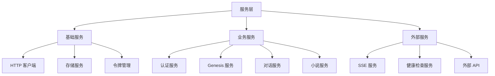
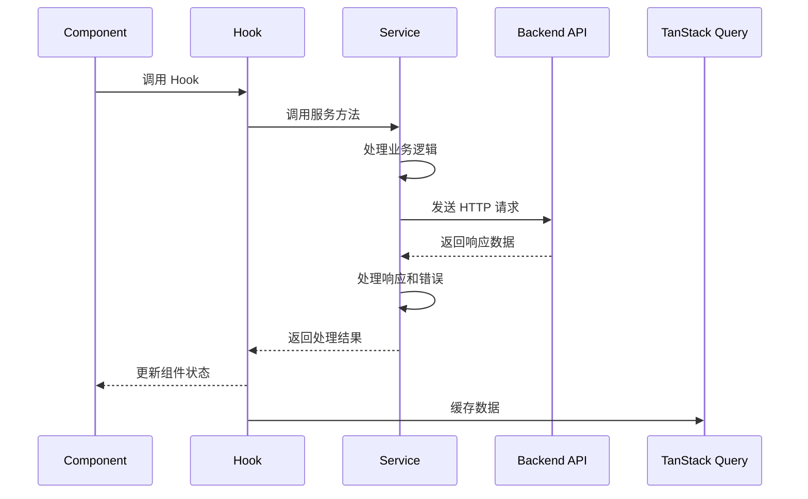
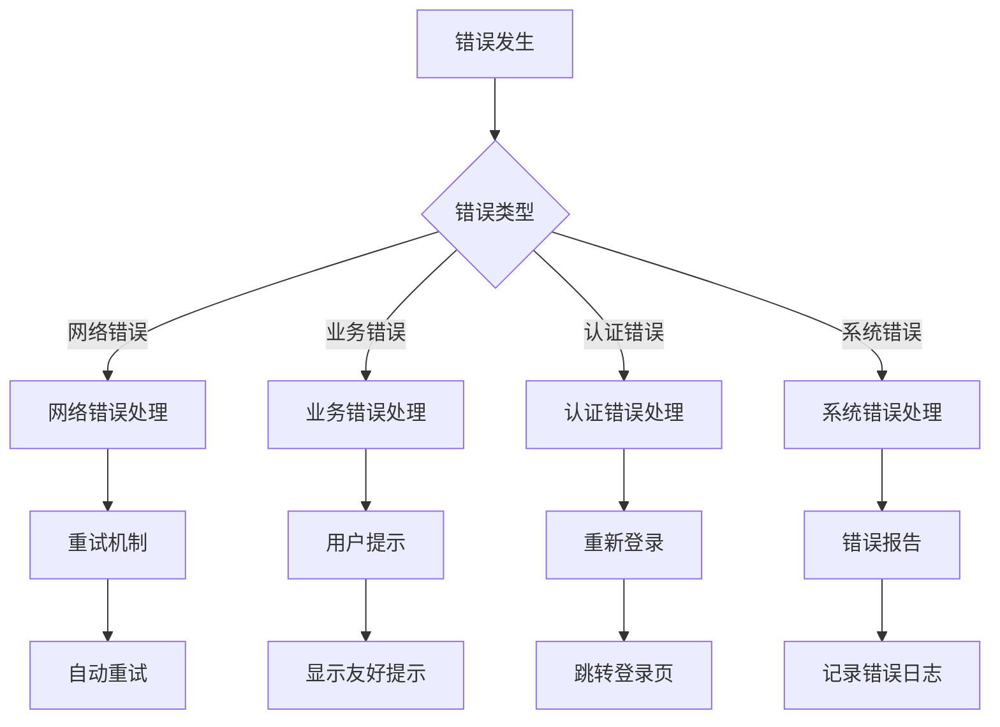

# 服务层 (Services)

服务层目录，包含应用的所有业务逻辑、API 调用和数据处理功能。

## 目录结构

```
src/services/
├── api.ts                     # 基础 API 配置
├── auth.ts                    # 认证服务入口
├── auth/                      # 认证相关服务
│   ├── __tests__/            # 认证服务测试
│   ├── auth-api-client.ts     # 认证 API 客户端
│   ├── auth-service.ts        # 认证业务服务
│   ├── factory.ts             # 认证服务工厂
│   ├── http-client.ts         # HTTP 客户端
│   ├── index.ts               # 认证服务导出
│   ├── navigation.ts          # 认证导航服务
│   ├── storage.ts             # 认证存储服务
│   ├── token-manager.ts        # 令牌管理服务
│   └── types.ts               # 认证类型定义
├── authExtensions.ts          # 认证扩展功能
├── authenticatedApiService.ts # 已认证 API 服务
├── conversations/             # 对话服务
│   └── README.md              # 对话服务文档
├── conversationsService.ts    # 对话服务
├── genesisService.ts          # Genesis 服务
├── healthService.ts           # 健康检查服务
├── novelsService.ts           # 小说服务
├── sse/                       # SSE 相关服务
│   ├── index.ts               # SSE 服务导出
│   └── types.ts               # SSE 类型定义
└── sseTokenService.ts         # SSE 令牌服务
```

## 服务概述

### GenesisService (创世服务)

Genesis API 客户端服务，实现创世阶段相关的 API 调用和业务逻辑。

**主要功能：**
- **流程管理**: 创建、获取、切换和完成 Genesis 流程
- **阶段会话管理**: 创建、查询和管理阶段会话
- **配置管理**: 获取和更新阶段配置
- **错误处理**: 统一的错误处理和恢复机制

**核心接口：**
```typescript
// Genesis 流程响应
export interface GenesisFlowResponse {
  id: string
  novel_id: string
  status: GenesisStatus
  current_stage: GenesisStage | null
  current_stage_id: string | null
  version: number
  state: Record<string, any> | null
  created_at: string
  updated_at: string
}

// 阶段切换请求
export interface SwitchStageRequest {
  target_stage: GenesisStage
}

// 阶段会话响应
export interface StageSessionResponse {
  id: string
  stage_id: string
  session_id: string
  status: StageSessionStatus
  is_primary: boolean
  session_kind: string | null
  created_at: string
  updated_at: string
}
```

**最新更新 (feat/genesis-stage)：**
- **增强的错误处理**: 支持结构化错误处理和类型分类
- **幂等性支持**: 添加幂等键和关联 ID 支持
- **配置验证**: 集成阶段配置验证功能
- **SSE 集成**: 支持命令状态和事件监听
- **性能优化**: 减少不必要的 API 调用和缓存优化

**API 端点：**
- `POST /api/v1/genesis/flows/{novel_id}` - 创建或获取流程
- `GET /api/v1/genesis/flows/{novel_id}` - 获取流程
- `POST /api/v1/genesis/flows/{novel_id}/switch-stage` - 切换阶段
- `POST /api/v1/genesis/flows/{novel_id}/complete` - 完成流程
- `POST /api/v1/genesis/stages/{stage_id}/sessions` - 创建阶段会话
- `GET /api/v1/genesis/stages/{stage_id}/sessions` - 列出阶段会话

### 认证服务 (Auth Services)

完整的用户认证体系，包含登录、注册、令牌管理等功能。

**主要组件：**
- **AuthService**: 认证业务逻辑服务
- **AuthApiClient**: 认证 API 客户端
- **TokenManager**: 令牌管理和刷新
- **AuthStorage**: 认证数据本地存储
- **AuthNavigation**: 认证状态导航管理

**核心功能：**
- 用户登录和注册
- 令牌获取和刷新
- 权限验证
- 会话管理
- 安全存储

### SSE 服务 (Server-Sent Events)

实时事件服务，用于处理服务器推送的实时事件。

**主要功能：**
- SSE 连接管理
- 事件订阅和处理
- 连接状态监控
- 自动重连机制

**最新更新：**
- **Genesis 事件支持**: 增强对 Genesis 相关事件的处理
- **连接优化**: 改进连接稳定性和性能
- **事件过滤**: 支持事件类型过滤和自定义处理

### 其他服务

- **ConversationsService**: 对话管理服务
- **NovelsService**: 小说管理服务
- **HealthService**: 系统健康检查服务
- **SSETokenService**: SSE 令牌管理服务

## 技术架构

### 服务层架构



### 数据流架构



### 错误处理架构



## 使用示例

### Genesis 服务使用

```typescript
import { genesisService } from '@/services/genesisService'

// 创建或获取流程
async function initializeGenesis(novelId: string) {
  try {
    const flow = await genesisService.createOrGetFlow(novelId, {
      'X-Correlation-Id': genesisService.generateCorrelationId(),
      'Idempotency-Key': genesisService.generateIdempotencyKey(),
    })
    
    console.log('Genesis 流程创建成功:', flow)
    return flow
  } catch (error) {
    console.error('创建 Genesis 流程失败:', error)
    throw error
  }
}

// 切换阶段
async function switchToStage(novelId: string, targetStage: GenesisStage) {
  try {
    const flow = await genesisService.switchStage(novelId, {
      target_stage: targetStage,
    })
    
    console.log('阶段切换成功:', flow)
    return flow
  } catch (error) {
    console.error('阶段切换失败:', error)
    throw error
  }
}
```

### 认证服务使用

```typescript
import { authService } from '@/services/auth'

// 用户登录
async function login(username: string, password: string) {
  try {
    const result = await authService.login({
      username,
      password,
    })
    
    // 存储认证信息
    await authStorage.setTokens(result.tokens)
    return result.user
  } catch (error) {
    console.error('登录失败:', error)
    throw error
  }
}
```

### SSE 服务使用

```typescript
import { sseService } from '@/services/sse'

// 订阅事件
function subscribeToEvents() {
  sseService.subscribe('genesis_command', (event) => {
    console.log('Genesis 命令事件:', event)
  })
  
  sseService.subscribe('system', (event) => {
    console.log('系统事件:', event)
  })
}
```

## 配置选项

### 服务配置

```typescript
// API 配置
const apiConfig = {
  baseUrl: '/api/v1',
  timeout: 10000,
  retryAttempts: 3,
  retryDelay: 1000,
}

// Genesis 服务配置
const genesisConfig = {
  flowEndpoint: '/genesis/flows',
  stageEndpoint: '/genesis/stages',
  enableIdempotency: true,
  enableCorrelation: true,
}

// 认证服务配置
const authConfig = {
  tokenRefreshThreshold: 300000, // 5分钟
  storagePrefix: 'auth_',
  enableAutoRefresh: true,
}
```

### 错误处理配置

```typescript
// 错误处理配置
const errorHandlingConfig = {
  networkErrorRetry: true,
  businessErrorNotify: true,
  authErrorRedirect: true,
  systemErrorReport: true,
}
```

## 开发指南

### 服务开发规范

1. **单一职责**: 每个服务负责特定的业务领域
2. **类型安全**: 使用 TypeScript 定义清晰的接口
3. **错误处理**: 实现统一的错误处理机制
4. **测试覆盖**: 编写单元测试和集成测试
5. **文档完善**: 提供详细的 API 文档和使用示例

### 添加新服务

1. 在 `services/` 目录下创建新服务文件
2. 定义服务接口和类型
3. 实现服务逻辑和错误处理
4. 集成到现有架构中
5. 编写测试用例

### 最佳实践

```typescript
// ✅ 好的服务实现
export class GoodService {
  private apiClient: ApiClient
  
  constructor(apiClient: ApiClient) {
    this.apiClient = apiClient
  }
  
  async getData(id: string): Promise<Data> {
    try {
      const response = await this.apiClient.get<Data>(`/data/${id}`)
      return this.transformResponse(response)
    } catch (error) {
      throw this.handleError(error)
    }
  }
  
  private transformResponse(response: ApiResponse<Data>): Data {
    // 数据转换逻辑
    return response.data
  }
  
  private handleError(error: unknown): never {
    // 错误处理逻辑
    throw new ServiceError('Failed to get data', error)
  }
}

// ❌ 不好的服务实现
export class BadService {
  async getData(id: string) {
    // 直接调用 fetch，缺乏错误处理和类型安全
    const response = await fetch(`/data/${id}`)
    const data = await response.json()
    return data
  }
}
```

## 测试

### 单元测试

```typescript
// 服务测试
describe('GenesisService', () => {
  let service: GenesisService
  let mockApiClient: jest.Mocked<ApiClient>
  
  beforeEach(() => {
    mockApiClient = createMockApiClient()
    service = new GenesisService(mockApiClient)
  })
  
  it('should create flow successfully', async () => {
    // 测试流程创建
  })
  
  it('should handle API errors', async () => {
    // 测试错误处理
  })
})
```

### 集成测试

```typescript
// 集成测试
describe('Service Integration', () => {
  it('should handle complete genesis flow', async () => {
    // 测试完整的 Genesis 流程
  })
})
```

## 性能优化

### 缓存策略

- **查询缓存**: 使用 TanStack Query 缓存查询结果
- **本地缓存**: 重要数据的本地存储
- **预加载**: 预加载可能需要的数据
- **缓存失效**: 合理设置缓存失效策略

### 请求优化

- **批量请求**: 合并多个请求
- **请求取消**: 取消不需要的请求
- **并发控制**: 控制并发请求数量
- **重试机制**: 智能重试失败请求

## 安全考虑

### 数据安全

- **传输加密**: 使用 HTTPS 协议
- **敏感信息**: 不在日志中记录敏感信息
- **输入验证**: 严格验证所有输入数据
- **输出编码**: 防止 XSS 攻击

### 认证安全

- **令牌管理**: 安全存储和管理访问令牌
- **权限验证**: 严格验证用户权限
- **会话管理**: 合理的会话超时设置
- **安全审计**: 记录安全相关操作

## 监控和分析

### 性能监控

- **响应时间**: 监控 API 响应时间
- **错误率**: 监控服务调用错误率
- **吞吐量**: 监控服务调用次数
- **资源使用**: 监控内存和 CPU 使用

### 业务监控

- **用户行为**: 监控用户操作模式
- **功能使用**: 监控功能使用频率
- **错误分析**: 分析错误类型和原因
- **性能指标**: 监控关键性能指标