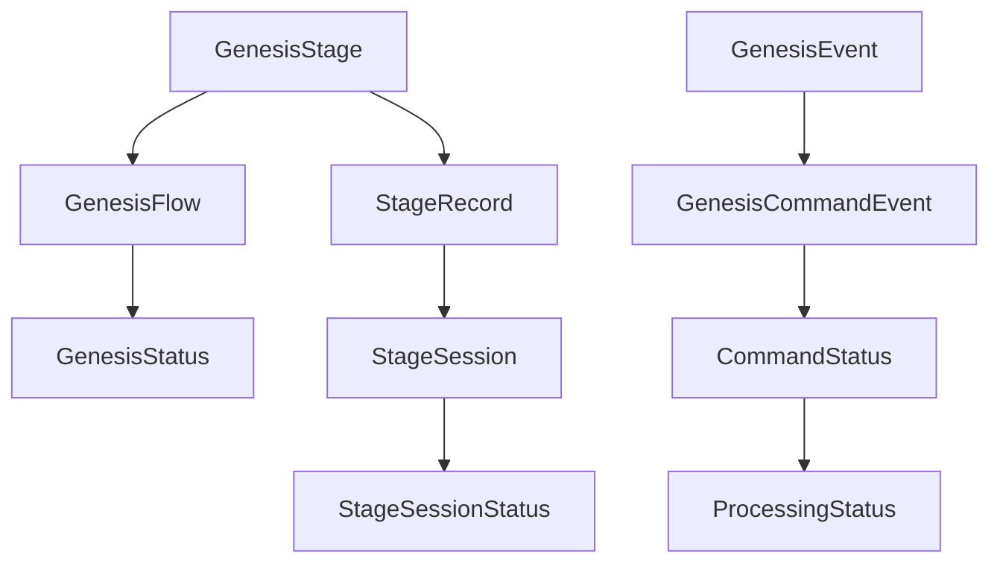
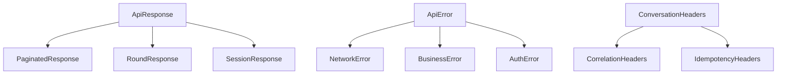

# 类型定义 (Types)

TypeScript 类型定义目录，包含应用中使用的所有类型、接口和枚举定义。

## 目录结构

```
src/types/
├── index.ts                    # 类型导出入口
├── api/                        # API 相关类型
│   ├── README.md              # API 类型文档
│   ├── conversations.ts       # 对话 API 类型
│   └── index.ts               # API 类型导出
├── auth.ts                    # 认证相关类型
├── enums/                     # 枚举定义
│   ├── README.md              # 枚举文档
│   └── index.ts               # 枚举导出
├── events/                    # 事件相关类型
│   └── index.ts               # 事件类型导出
├── models/                    # 数据模型类型
│   ├── base.ts                # 基础模型类型
│   └── entities.ts            # 实体模型类型
└── shared.ts                  # 共享类型定义
```

## 类型概述

### API 类型

API 相关的类型定义，包括请求参数、响应数据和错误处理类型。

**主要类型：**
- `ApiResponse<T>` - 通用 API 响应类型
- `ConversationHeaders` - 对话请求头类型
- `RoundResponse` - 对话轮次响应类型
- `SessionResponse` - 会话响应类型

**最新更新 (feat/genesis-stage)：**
- **Genesis 相关类型**: 新增 Genesis 流程和阶段相关类型
- **事件类型**: 增强的事件处理类型定义
- **错误类型**: 更完善的错误分类和处理类型

### 枚举类型

应用中使用的各种枚举定义，提供类型安全和代码可读性。

**主要枚举：**
- `GenesisStage` - 创世阶段枚举
- `GenesisStatus` - 创世状态枚举
- `StageSessionStatus` - 阶段会话状态枚举
- `CommandStatus` - 命令状态枚举

### 事件类型

SSE 和其他事件相关的类型定义。

**主要类型：**
- `SSEEvent` - SSE 事件基础类型
- `GenesisEvent` - Genesis 事件类型
- `SystemEvent` - 系统事件类型
- `EventHandler` - 事件处理器类型

### 模型类型

数据模型类型定义，描述应用中的各种数据结构。

**主要类型：**
- `User` - 用户模型
- `Novel` - 小说模型
- `Project` - 项目模型
- `Conversation` - 对话模型
- `Session` - 会话模型

## 详细类型定义

### Genesis 相关类型

```typescript
// 创世阶段枚举
export enum GenesisStage {
  INITIAL_PROMPT = 'INITIAL_PROMPT',    // 初始灵感
  WORLDVIEW = 'WORLDVIEW',              // 世界观设定
  CHARACTERS = 'CHARACTERS',            // 角色塑造
  PLOT_OUTLINE = 'PLOT_OUTLINE',        // 剧情大纲
  FINISHED = 'FINISHED',                // 创世完成
}

// 创世状态枚举
export enum GenesisStatus {
  NOT_STARTED = 'NOT_STARTED',          // 未开始
  IN_PROGRESS = 'IN_PROGRESS',          // 进行中
  COMPLETED = 'COMPLETED',              // 已完成
  FAILED = 'FAILED',                    // 失败
}

// 阶段会话状态枚举
export enum StageSessionStatus {
  ACTIVE = 'ACTIVE',                    // 活跃
  PAUSED = 'PAUSED',                    // 暂停
  COMPLETED = 'COMPLETED',              // 已完成
  FAILED = 'FAILED',                    // 失败
}

// Genesis 流程响应类型
export interface GenesisFlowResponse {
  id: string                            // 流程ID
  novel_id: string                      // 小说ID
  status: GenesisStatus                 // 流程状态
  current_stage: GenesisStage | null    // 当前阶段
  current_stage_id: string | null       // 当前阶段ID
  version: number                       // 版本号
  state: Record<string, any> | null     // 流程状态
  created_at: string                    // 创建时间
  updated_at: string                    // 更新时间
}

// 阶段记录响应类型
export interface StageRecordResponse {
  id: string                           // 记录ID
  flow_id: string                      // 流程ID
  stage: GenesisStage                  // 阶段
  config: Record<string, any> | null   // 阶段配置
  iteration_count: number              // 迭代次数
  created_at: string                   // 创建时间
  updated_at: string                   // 更新时间
}
```

### API 响应类型

```typescript
// 通用 API 响应类型
export interface ApiResponse<T = any> {
  code: number                         // 响应码
  msg: string                          // 响应消息
  data: T                              // 响应数据
  timestamp?: string                   // 时间戳
}

// 分页响应类型
export interface PaginatedResponse<T> {
  items: T[]                           // 数据项列表
  pagination: {
    page: number                       // 当前页码
    pageSize: number                   // 每页大小
    total: number                      // 总记录数
    totalPages: number                 // 总页数
  }
}

// 对话轮次响应类型
export interface RoundResponse {
  round_path: string                   // 轮次路径
  session_id: string                   // 会话ID
  role: 'user' | 'assistant'           // 角色类型
  input?: {
    type: string                       // 输入类型
    payload: Record<string, any>        // 输入负载
  }
  output?: {
    content: string                    // 输出内容
    metadata?: Record<string, any>     // 输出元数据
  }
  created_at: string                   // 创建时间
  updated_at: string                   // 更新时间
}
```

### 事件类型

```typescript
// SSE 事件基础类型
export interface SSEEvent {
  id: string                          // 事件ID
  type: string                        // 事件类型
  data: any                           // 事件数据
  timestamp: string                   // 时间戳
  session_id?: string                 // 会话ID
  correlation_id?: string              // 关联ID
}

// Genesis 命令事件类型
export interface GenesisCommandEvent extends SSEEvent {
  type: 'genesis_command'             // 事件类型
  data: {
    command_id: string                // 命令ID
    status: 'pending' | 'processing' | 'completed' | 'failed' // 命令状态
    stage: GenesisStage               // 关联阶段
    progress?: number                  // 进度百分比
    error?: string                    // 错误信息
  }
}

// 系统事件类型
export interface SystemEvent extends SSEEvent {
  type: 'system'                      // 事件类型
  data: {
    level: 'info' | 'warning' | 'error' // 事件级别
    message: string                   // 事件消息
    details?: Record<string, any>     // 详细信息
  }
}
```

### 错误类型

```typescript
// 应用错误类型
export interface AppError {
  code: string                        // 错误代码
  message: string                     // 错误消息
  details?: Record<string, any>        // 错误详情
  stack?: string                      // 错误堆栈
  timestamp: string                   // 错误时间
}

// 网络错误类型
export interface NetworkError extends AppError {
  code: 'NETWORK_ERROR'               // 错误代码
  status?: number                     // HTTP 状态码
  url?: string                        // 请求URL
}

// 业务错误类型
export interface BusinessError extends AppError {
  code: 'BUSINESS_ERROR'               // 错误代码
  field?: string                      // 错误字段
  value?: any                         // 错误值
}

// 认证错误类型
export interface AuthError extends AppError {
  code: 'AUTH_ERROR'                  // 错误代码
  type: 'UNAUTHORIZED' | 'FORBIDDEN' | 'TOKEN_EXPIRED' // 认证错误类型
}
```

## 类型关系图

### Genesis 类型关系



### API 类型关系



## 使用示例

### 基本类型使用

```typescript
import { GenesisStage, GenesisStatus, type GenesisFlowResponse } from '@/types'

// 使用枚举
const currentStage: GenesisStage = GenesisStage.WORLDVIEW
const flowStatus: GenesisStatus = GenesisStatus.IN_PROGRESS

// 使用接口类型
function handleGenesisFlow(flow: GenesisFlowResponse) {
  console.log(`流程状态: ${flow.status}`)
  console.log(`当前阶段: ${flow.current_stage}`)
  
  if (flow.status === GenesisStatus.COMPLETED) {
    console.log('创世流程已完成!')
  }
}
```

### 事件类型使用

```typescript
import { type GenesisCommandEvent, type EventHandler } from '@/types'

const handleGenesisCommand: EventHandler = (event) => {
  if (event.type === 'genesis_command') {
    const commandEvent = event as GenesisCommandEvent
    
    console.log(`命令状态: ${commandEvent.data.status}`)
    console.log(`关联阶段: ${commandEvent.data.stage}`)
    
    if (commandEvent.data.status === 'completed') {
      console.log('命令执行完成!')
    }
  }
}
```

### 错误类型使用

```typescript
import { type AppError, isNetworkError, isAuthError } from '@/types'

function handleError(error: AppError) {
  console.error(`错误代码: ${error.code}`)
  console.error(`错误消息: ${error.message}`)
  
  if (isNetworkError(error)) {
    console.log('网络错误，请检查连接')
  } else if (isAuthError(error)) {
    console.log('认证错误，请重新登录')
  }
}
```

## 类型工具

### 类型守卫

```typescript
// 类型守卫函数
export function isAppError(error: any): error is AppError {
  return error && typeof error.code === 'string' && typeof error.message === 'string'
}

export function isGenesisEvent(event: any): event is GenesisEvent {
  return event && typeof event.type === 'string' && event.type.startsWith('genesis_')
}

export function isNetworkError(error: AppError): error is NetworkError {
  return error.code === 'NETWORK_ERROR'
}
```

### 类型工具函数

```typescript
// 类型工具函数
export type DeepPartial<T> = {
  [P in keyof T]?: T[P] extends object ? DeepPartial<T[P]> : T[P]
}

export type Optional<T, K extends keyof T> = Omit<T, K> & Partial<Pick<T, K>>

export type RequiredFields<T, K extends keyof T> = T & Required<Pick<T, K>>
```

## 开发指南

### 类型定义规范

1. **命名规范**: 使用 PascalCase 命名接口和类型
2. **枚举命名**: 使用 UPPER_SNAKE_CASE 命名枚举值
3. **类型注释**: 为复杂类型添加注释说明
4. **类型约束**: 使用泛型约束提供类型安全
5. **向后兼容**: 考虑向后兼容性，避免破坏性更改

### 添加新类型

1. 在相应的类型文件中定义新类型
2. 更新导出文件（index.ts）
3. 添加类型测试
4. 更新相关文档
5. 通知相关组件更新

### 最佳实践

```typescript
// ✅ 好的类型定义
/**
 * 用户会话信息
 * 包含用户基本信息和会话状态
 */
export interface UserSession {
  /** 用户唯一标识符 */
  id: string
  /** 用户显示名称 */
  displayName: string
  /** 会话创建时间 */
  createdAt: Date
  /** 会话过期时间 */
  expiresAt: Date
  /** 会话状态 */
  status: SessionStatus
}

// ❌ 不好的类型定义
interface user {
  id: string
  name: string
  // 缺少注释和类型约束
}
```

## 测试

### 类型测试

```typescript
// 类型兼容性测试
describe('Type Compatibility', () => {
  it('should handle GenesisFlowResponse correctly', () => {
    const flow: GenesisFlowResponse = {
      id: 'test-flow-id',
      novel_id: 'test-novel-id',
      status: GenesisStatus.IN_PROGRESS,
      current_stage: GenesisStage.WORLDVIEW,
      current_stage_id: 'test-stage-id',
      version: 1,
      state: {},
      created_at: '2023-01-01T00:00:00Z',
      updated_at: '2023-01-01T00:00:00Z',
    }
    
    expect(flow.status).toBe(GenesisStatus.IN_PROGRESS)
  })
})
```

### 类型守卫测试

```typescript
// 类型守卫测试
describe('Type Guards', () => {
  it('should correctly identify AppError', () => {
    const error = { code: 'TEST_ERROR', message: 'Test error' }
    expect(isAppError(error)).toBe(true)
  })
})
```

## 类型安全检查

### TypeScript 配置

```json
{
  "compilerOptions": {
    "strict": true,
    "noImplicitAny": true,
    "strictNullChecks": true,
    "strictFunctionTypes": true,
    "strictBindCallApply": true,
    "strictPropertyInitialization": true,
    "noImplicitThis": true,
    "useUnknownInCatchVariables": true
  }
}
```

### ESLint 类型规则

```javascript
// .eslintrc.js
module.exports = {
  rules: {
    '@typescript-eslint/no-explicit-any': 'error',
    '@typescript-eslint/no-unused-vars': 'error',
    '@typescript-eslint/explicit-function-return-type': 'warn',
    '@typescript-eslint/no-explicit-any': 'error',
  }
}
```

## 性能考虑

### 类型编译性能

- **避免过度复杂**: 避免过于复杂的类型定义
- **合理使用泛型**: 避免不必要的泛型嵌套
- **类型复用**: 复用现有类型而非重复定义
- **模块化组织**: 合理组织类型模块，避免循环依赖

### 运行时性能

- **类型擦除**: TypeScript 类型在运行时会被擦除
- **类型守卫**: 合理使用类型守卫避免运行时检查
- **类型推断**: 利用 TypeScript 的类型推断减少显式类型标注

## 未来规划

### 类型系统改进

- [ ] 添加更多类型守卫函数
- [ ] 实现 JSON Schema 生成
- [ ] 添加 API 类型自动生成
- [ ] 改进错误类型系统
- [ ] 添加类型文档生成工具