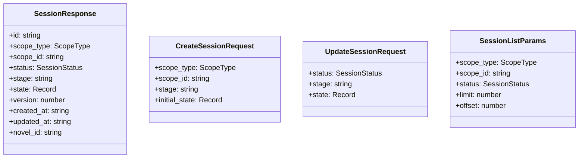
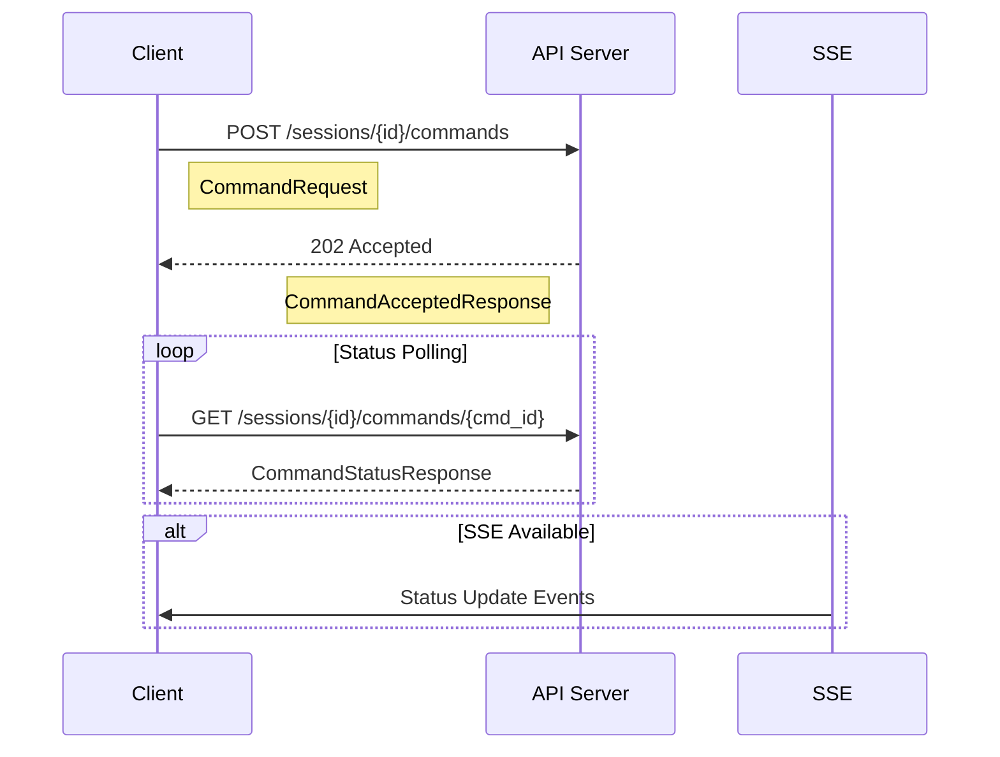
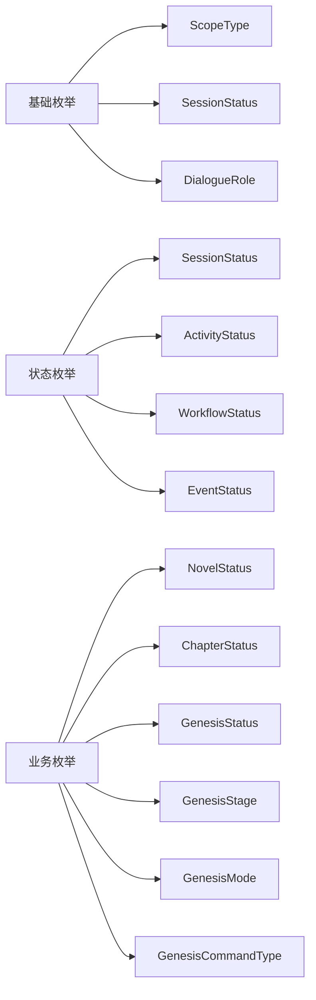

# API 类型定义 (Type Definitions)

提供与后端 API 严格对应的 TypeScript 类型定义，确保前后端类型安全，提升开发体验。

## 🎯 核心功能

### 对话 API 类型系统
- **会话管理**: 完整的会话生命周期类型定义
- **消息轮次**: 支持树状结构的对话轮次
- **命令系统**: 强类型的命令提交和状态跟踪
- **阶段管理**: 创世阶段的状态转换类型

### 类型安全保证
- **API 兼容**: 与后端 API 规范完全对应
- **运行时验证**: 结合 Zod 实现运行时类型检查
- **IDE 支持**: 完整的智能提示和类型推导
- **文档生成**: 自动生成 API 文档

## 📊 主要类型定义

### 会话管理类型



### 对话轮次类型

```mermaid
graph TD
    A[RoundResponse] --> A1[session_id: string]
    A --> A2[round_path: string]
    A --> A3[role: DialogueRole]
    A --> A4[input: Record<string, any>]
    A --> A5[output: Record<string, any>]
    A --> A6[model: string]
    A --> A7[correlation_id: string]
    A --> A8[created_at: string]
    
    B[RoundCreateRequest] --> B1[role: DialogueRole]
    B --> B2[input: Record<string, any>]
    B --> B3[model: string]
    B --> B4[correlation_id: string]
    
    C[RoundQueryParams] --> C1[after: string]
    C --> C2[limit: number]
    C --> C3[order: 'asc' | 'desc']
    C --> C4[role: DialogueRole]
```

### 命令系统类型



### 枚举类型定义



## 📁 目录结构

```
api/
├── conversations.ts    # 对话 API 类型定义
└── index.ts           # 统一导出
```

## 🔧 核心类型详解

### 对话范围类型 (ScopeType)

```typescript
export type ScopeType = 
  | 'GENESIS'        // 创世阶段
  | 'CHAPTER'        // 章节写作
  | 'REVIEW'         // 内容审查
  | 'PLANNING'       // 创作规划
  | 'WORLDBUILDING'  // 世界构建
```

### 会话状态枚举 (SessionStatus)

```typescript
export type SessionStatus =
  | 'ACTIVE'     // 活跃状态
  | 'PROCESSING' // 处理中
  | 'COMPLETED'  // 已完成
  | 'FAILED'     // 失败
  | 'ABANDONED'  // 已放弃
  | 'PAUSED'     // 已暂停
```

### 创世命令类型 (GenesisCommandType)

采用点式命名约定，确保命令类型的语义清晰：

```typescript
export enum GenesisCommandType {
  // 基础命令
  SESSION_START = 'Command.Genesis.Session.Start',
  SESSION_FINISH = 'Command.Genesis.Session.Finish',
  SESSION_FAIL = 'Command.Genesis.Session.Fail',
  
  // 阶段命令
  SEED_REQUEST = 'Command.Genesis.Session.Seed.Request',
  THEME_REQUEST = 'Command.Genesis.Session.Theme.Request',
  WORLD_REQUEST = 'Command.Genesis.Session.World.Request',
  CHARACTER_REQUEST = 'Command.Genesis.Session.Character.Request',
  PLOT_REQUEST = 'Command.Genesis.Session.Plot.Request',
  DETAILS_REQUEST = 'Command.Genesis.Session.Details.Request',
  
  // 确认命令
  CONCEPT_CONFIRM = 'Command.Genesis.Session.Concept.Confirm',
  THEME_CONFIRM = 'Command.Genesis.Session.Theme.Confirm',
  WORLD_CONFIRM = 'Command.Genesis.Session.World.Confirm',
  CHARACTER_CONFIRM = 'Command.Genesis.Session.Character.Confirm',
  PLOT_CONFIRM = 'Command.Genesis.Session.Plot.Confirm',
  DETAILS_CONFIRM = 'Command.Genesis.Session.Details.Confirm',
  
  // 更新命令
  THEME_REVISE = 'Command.Genesis.Session.Theme.Revise',
  WORLD_UPDATE = 'Command.Genesis.Session.World.Update',
  CHARACTER_UPDATE = 'Command.Genesis.Session.Character.Update',
  PLOT_UPDATE = 'Command.Genesis.Session.Plot.Update',
  
  // 阶段管理
  STAGE_COMPLETE = 'Command.Genesis.Session.Stage.Complete',
  
  // 高级功能
  BRANCH_CREATE = 'Command.Genesis.Session.Branch.Create',
  CHARACTER_NETWORK_CREATE = 'Command.Genesis.Session.CharacterNetwork.Create',
}
```

## 🛠️ 使用示例

### 基本类型使用

```typescript
import { 
  SessionResponse, 
  CreateSessionRequest,
  ScopeType,
  GenesisCommandType 
} from '@/types/api'

// 创建会话请求
const createRequest: CreateSessionRequest = {
  scope_type: ScopeType.GENESIS,
  scope_id: 'novel_123',
  stage: 'INITIAL_PROMPT',
  initial_state: {
    user_preferences: {
      genre: 'fantasy',
      length: 'medium'
    }
  }
}

// 处理会话响应
function handleSession(session: SessionResponse) {
  console.log(`会话 ${session.id} 状态: ${session.status}`)
  console.log(`当前阶段: ${session.stage}`)
  console.log(`版本号: ${session.version}`)
}
```

### 命令提交示例

```typescript
import { CommandRequest, CommandAcceptedResponse } from '@/types/api'

// 提交角色生成命令
const commandRequest: CommandRequest = {
  type: GenesisCommandType.CHARACTER_REQUEST,
  payload: {
    session_id: 'session_456',
    user_input: '创建一个勇敢的骑士角色',
    stage: 'CHARACTERS',
    requirements: {
      role: 'protagonist',
      traits: ['brave', 'noble']
    }
  }
}

// 处理命令接受响应
function handleCommandAccepted(response: CommandAcceptedResponse) {
  if (response.accepted) {
    console.log(`命令已接受，ID: ${response.command_id}`)
    // 开始监听命令状态
  }
}
```

### 轮次查询示例

```typescript
import { RoundQueryParams, RoundResponse } from '@/types/api'

// 查询对话历史
const queryParams: RoundQueryParams = {
  after: '1',      // 从第1轮之后开始
  limit: 50,       // 限制50条
  order: 'asc',    // 按时间正序
  role: 'user'     // 只看用户消息
}

// 处理轮次数据
function processRounds(rounds: RoundResponse[]) {
  rounds.forEach(round => {
    console.log(`${round.round_path}: ${round.role}`)
    console.log('输入:', round.input)
    if (round.output) {
      console.log('输出:', round.output)
    }
  })
}
```

## 🔗 与其他模块的集成

### 与前端组件集成

```typescript
// 在 React 组件中使用
import { useSession, useRounds } from '@/hooks/useConversations'
import { SessionResponse, RoundResponse } from '@/types/api'

function ConversationComponent({ sessionId }: { sessionId: string }) {
  const { data: session } = useSession(sessionId)
  const { data: rounds } = useRounds(sessionId)
  
  return (
    <div>
      <h2>会话状态: {session?.status}</h2>
      <div>
        {rounds?.map(round => (
          <Message key={round.round_path} round={round} />
        ))}
      </div>
    </div>
  )
}
```

### 与命令工具集成

```typescript
// 结合 genesisCommands 工具
import { getCommandTypeByStage } from '@/utils/genesisCommands'
import { GenesisCommandType, GenesisStage } from '@/types/enums'

function getCommandForStage(stage: GenesisStage): GenesisCommandType {
  return getCommandTypeByStage(stage)
}

const commandType = getCommandForStage(GenesisStage.CHARACTERS)
// 返回: GenesisCommandType.CHARACTER_REQUEST
```

## 📊 版本兼容性

### 向后兼容
- 保持现有类型签名不变
- 新增字段使用可选属性
- 废弃字段标记为 @deprecated

### 类型演化
- 使用类型守卫处理版本差异
- 提供迁移工具和文档
- 严格语义化版本控制

## 🧪 测试策略

### 类型测试
- 编译时类型检查
- 运行时类型验证
- 边界条件测试

### 集成测试
- 与实际 API 的兼容性测试
- 错误场景的类型安全验证
- 性能影响评估

## 🔮 未来规划

### 短期目标
- [ ] 添加更多 API 端点的类型定义
- [ ] 实现运行时类型验证
- [ ] 生成 OpenAPI 规范文档
- [ ] 添加类型守卫工具函数

### 长期规划
- [ ] 支持 API 版本管理
- [ ] 实现类型自动生成
- [ ] 添加 GraphQL 类型支持
- [ ] 增强开发者工具集成

## 📝 最佳实践

1. **类型安全**: 始终使用定义的类型，避免 any 类型
2. **版本控制**: 严格遵循语义化版本控制
3. **文档同步**: 类型变更时同步更新文档
4. **测试覆盖**: 确保所有类型都有对应的测试
5. **性能考虑**: 避免过度复杂的类型定义影响编译性能