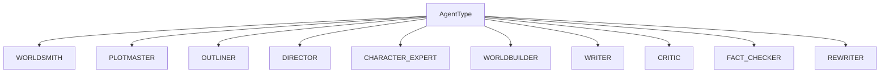
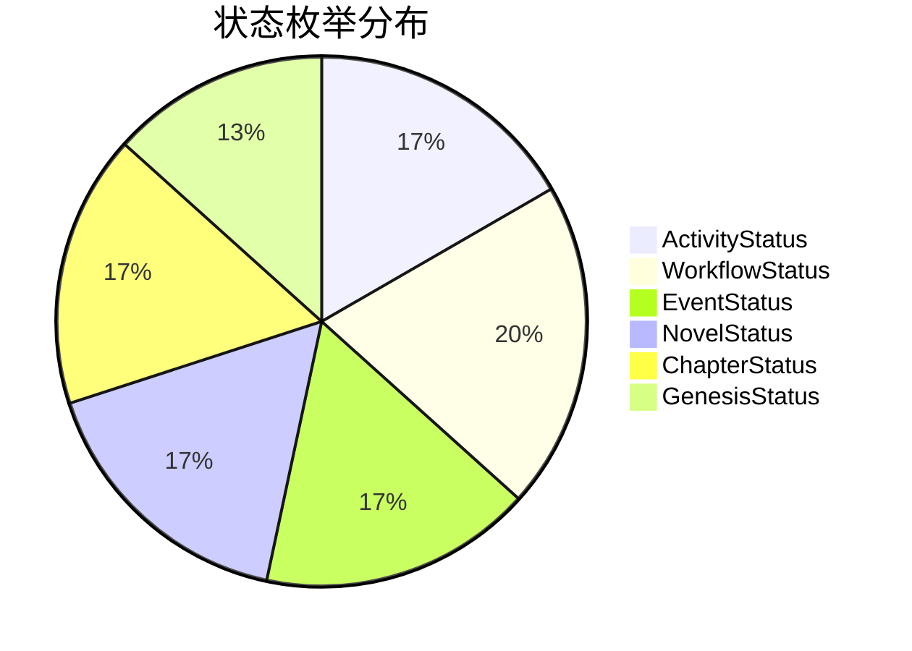
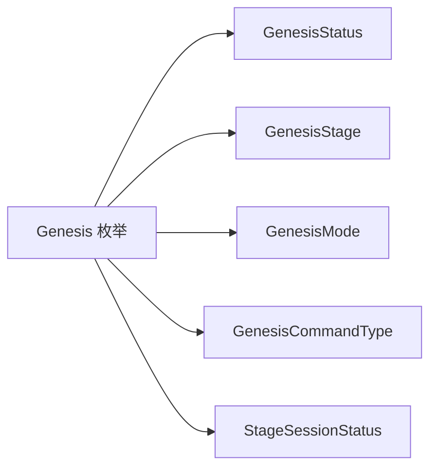
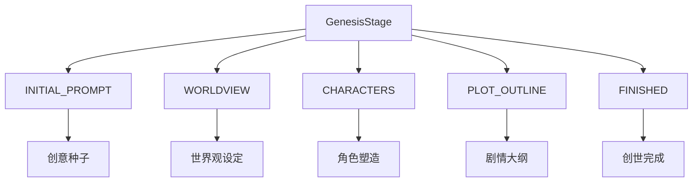
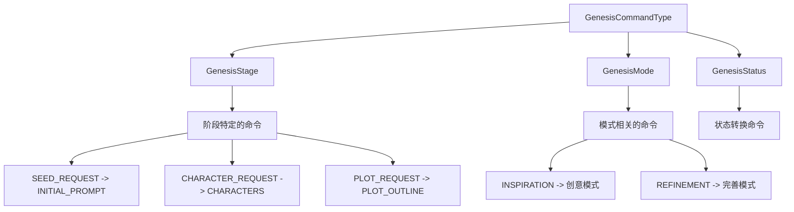
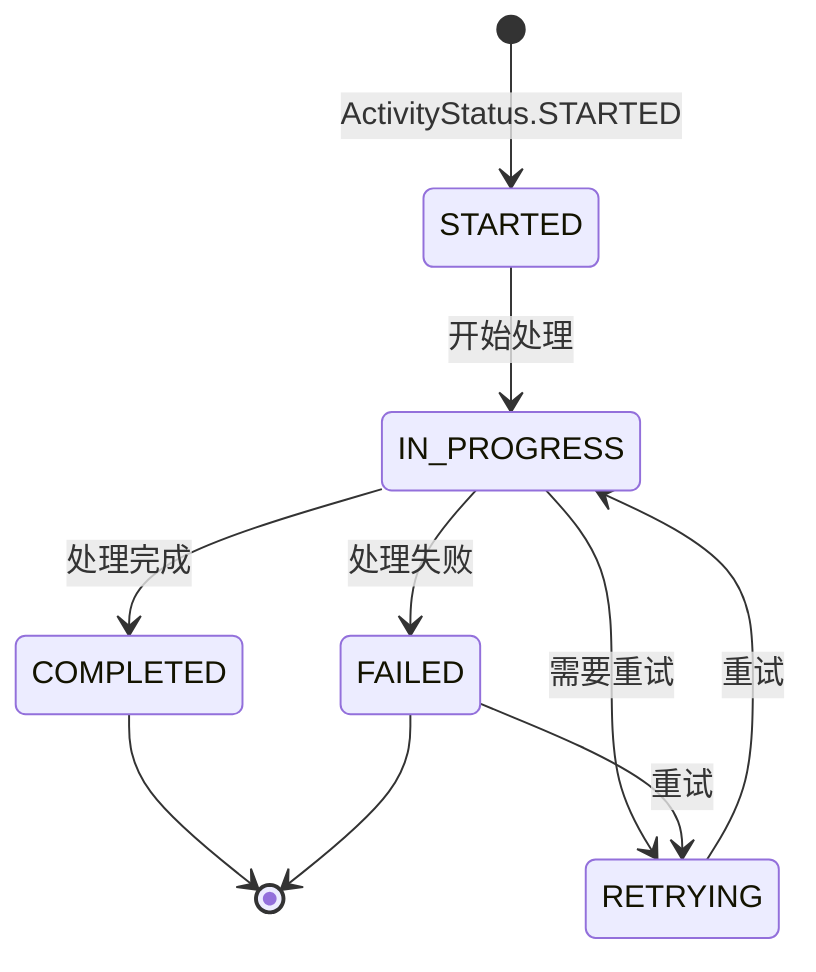

# 枚举类型定义 (Enum Definitions)

提供 InfiniteScribe 项目中所有枚举类型的统一管理，确保类型安全和代码一致性。

## 🎯 核心功能

### 统一枚举管理
- **集中化定义**: 所有枚举类型统一管理
- **类型安全**: TypeScript 编译时类型检查
- **语义化命名**: 清晰、自解释的枚举值
- **文档完整**: 每个枚举都有详细说明

### 枚举分类体系

#### 1. Agent 枚举
定义系统中各种 AI Agent 的类型：



#### 2. 状态枚举
覆盖系统各个层面的状态管理：



#### 3. Genesis 系统
完整的创世流程枚举体系：



## 📊 详细枚举说明

### AgentType - AI 智能体类型

```typescript
export enum AgentType {
  WORLDSMITH = 'worldsmith',        // 世界构建专家
  PLOTMASTER = 'plotmaster',        // 情节大师
  OUTLINER = 'outliner',            // 大纲生成器
  DIRECTOR = 'director',            // 创作指导
  CHARACTER_EXPERT = 'character_expert',  // 角色专家
  WORLDBUILDER = 'worldbuilder',    // 世界建造者
  WRITER = 'writer',                // 写作助手
  CRITIC = 'critic',                // 评论家
  FACT_CHECKER = 'fact_checker',    // 事实核查员
  REWRITER = 'rewriter',            // 改写专家
}
```

### ActivityStatus - 活动状态

```typescript
export enum ActivityStatus {
  STARTED = 'STARTED',        // 已开始
  IN_PROGRESS = 'IN_PROGRESS', // 进行中
  COMPLETED = 'COMPLETED',    // 已完成
  FAILED = 'FAILED',         // 失败
  RETRYING = 'RETRYING',      // 重试中
}
```

### WorkflowStatus - 工作流状态

```typescript
export enum WorkflowStatus {
  PENDING = 'PENDING',     // 待处理
  RUNNING = 'RUNNING',     // 运行中
  COMPLETED = 'COMPLETED', // 已完成
  FAILED = 'FAILED',      // 失败
  CANCELLED = 'CANCELLED', // 已取消
  PAUSED = 'PAUSED',      // 已暂停
}
```

### EventStatus - 事件状态

```typescript
export enum EventStatus {
  PENDING = 'PENDING',      // 待处理
  PROCESSING = 'PROCESSING', // 处理中
  PROCESSED = 'PROCESSED',   // 已处理
  FAILED = 'FAILED',        // 失败
  DEAD_LETTER = 'DEAD_LETTER', // 死信队列
}
```

### NovelStatus - 小说状态

```typescript
export enum NovelStatus {
  GENESIS = 'GENESIS',      // 创世阶段
  GENERATING = 'GENERATING', // 生成中
  PAUSED = 'PAUSED',         // 已暂停
  COMPLETED = 'COMPLETED',   // 已完成
  FAILED = 'FAILED',        // 失败
}
```

### ChapterStatus - 章节状态

```typescript
export enum ChapterStatus {
  DRAFT = 'DRAFT',           // 草稿
  REVIEWING = 'REVIEWING',   // 审查中
  REVISING = 'REVISING',     // 修订中
  PUBLISHED = 'PUBLISHED',   // 已发布
  FAILED = 'FAILED',         // 失败
}
```

### GenesisStatus - 创世状态

```typescript
export enum GenesisStatus {
  IN_PROGRESS = 'IN_PROGRESS', // 进行中
  COMPLETED = 'COMPLETED',     // 已完成
  ABANDONED = 'ABANDONED',     // 已放弃
  PAUSED = 'PAUSED',           // 已暂停
}
```

### GenesisStage - 创世阶段



```typescript
export enum GenesisStage {
  INITIAL_PROMPT = 'INITIAL_PROMPT',  // 初始提示
  WORLDVIEW = 'WORLDVIEW',           // 世界观
  CHARACTERS = 'CHARACTERS',         // 角色
  PLOT_OUTLINE = 'PLOT_OUTLINE',     // 情节大纲
  FINISHED = 'FINISHED',             // 完成
}
```

### GenesisMode - 创世模式

```typescript
export enum GenesisMode {
  /** 给我灵感模式（零输入） */
  INSPIRATION = 'inspiration',
  /** 基于想法完善模式（有输入） */
  REFINEMENT = 'refinement',
}
```

### GenesisCommandType - 创世命令类型

采用点式命名约定，确保命令类型的语义清晰：

```mermaid
graph TD
    A[GenesisCommandType] --> A1[会话命令]
    A --> A2[阶段命令]
    A --> A3[内容命令]
    A --> A4[管理命令]
    
    A1 --> A1_1[SESSION_START]
    A1 --> A1_2[SESSION_FINISH]
    A1 --> A1_3[SESSION_FAIL]
    
    A2 --> A2_1[SEED_REQUEST]
    A2 --> A2_2[THEME_REQUEST]
    A2 --> A2_3[WORLD_REQUEST]
    A2 --> A2_4[CHARACTER_REQUEST]
    A2 --> A2_5[PLOT_REQUEST]
    A2 --> A2_6[DETAILS_REQUEST]
    
    A3 --> A3_1[CONCEPT_CONFIRM]
    A3 --> A3_2[THEME_CONFIRM]
    A3 --> A3_3[WORLD_CONFIRM]
    A3 --> A3_4[CHARACTER_CONFIRM]
    A3 --> A3_5[PLOT_CONFIRM]
    A3 --> A3_6[DETAILS_CONFIRM]
    
    A4 --> A4_1[STAGE_COMPLETE]
    A4 --> A4_2[BRANCH_CREATE]
    A4 --> A4_3[CHARACTER_NETWORK_CREATE]
```



### StageSessionStatus - 阶段会话状态

```typescript
export enum StageSessionStatus {
  ACTIVE = 'ACTIVE',     // 激活
  ARCHIVED = 'ARCHIVED', // 已归档
  CLOSED = 'CLOSED',     // 已关闭
}
```

### OperationType - 操作类型

```typescript
export enum OperationType {
  INSERT = 'INSERT', // 插入
  UPDATE = 'UPDATE', // 更新
  DELETE = 'DELETE', // 删除
}
```

## 📁 目录结构

```
enums/
└── index.ts    # 所有枚举类型定义
```

## 🛠️ 使用示例

### 基本枚举使用

```typescript
import { 
  GenesisStage, 
  GenesisCommandType, 
  AgentType,
  ActivityStatus 
} from '@/types/enums'

// 使用创世阶段
const currentStage = GenesisStage.CHARACTERS
console.log(`当前阶段: ${currentStage}`)

// 获取对应的命令类型
function getCommandForStage(stage: GenesisStage): GenesisCommandType {
  switch (stage) {
    case GenesisStage.INITIAL_PROMPT:
      return GenesisCommandType.SEED_REQUEST
    case GenesisStage.CHARACTERS:
      return GenesisCommandType.CHARACTER_REQUEST
    // ... 其他阶段
    default:
      return GenesisCommandType.SEED_REQUEST
  }
}
```

### 枚举值映射

```typescript
// 枚举到显示名称的映射
const stageDisplayNames: Record<GenesisStage, string> = {
  [GenesisStage.INITIAL_PROMPT]: '初始灵感',
  [GenesisStage.WORLDVIEW]: '世界观设定',
  [GenesisStage.CHARACTERS]: '角色塑造',
  [GenesisStage.PLOT_OUTLINE]: '情节大纲',
  [GenesisStage.FINISHED]: '创世完成',
}

// 枚举到颜色的映射
const statusColors: Record<ActivityStatus, string> = {
  [ActivityStatus.STARTED]: 'blue',
  [ActivityStatus.IN_PROGRESS]: 'yellow',
  [ActivityStatus.COMPLETED]: 'green',
  [ActivityStatus.FAILED]: 'red',
  [ActivityStatus.RETRYING]: 'orange',
}
```

### 类型守卫和工具函数

```typescript
// 检查是否为 Genesis 枚举
function isGenesisEnum(value: any): boolean {
  return Object.values(GenesisStage).includes(value) ||
         Object.values(GenesisStatus).includes(value) ||
         Object.values(GenesisMode).includes(value)
}

// 获取所有 Agent 类型
function getAllAgentTypes(): AgentType[] {
  return Object.values(AgentType)
}

// 检查状态转换是否有效
function isValidStatusTransition(
  from: ActivityStatus, 
  to: ActivityStatus
): boolean {
  const validTransitions: Record<ActivityStatus, ActivityStatus[]> = {
    [ActivityStatus.STARTED]: [ActivityStatus.IN_PROGRESS, ActivityStatus.FAILED],
    [ActivityStatus.IN_PROGRESS]: [ActivityStatus.COMPLETED, ActivityStatus.FAILED, ActivityStatus.RETRYING],
    [ActivityStatus.RETRYING]: [ActivityStatus.IN_PROGRESS, ActivityStatus.FAILED],
    [ActivityStatus.COMPLETED]: [],
    [ActivityStatus.FAILED]: [ActivityStatus.RETRYING],
  }
  
  return validTransitions[from]?.includes(to) || false
}
```

### 与后端 API 的集成

```typescript
// 发送命令到后端
async function sendCommand(
  sessionId: string, 
  commandType: GenesisCommandType,
  payload: any
) {
  const response = await fetch(`/api/sessions/${sessionId}/commands`, {
    method: 'POST',
    headers: {
      'Content-Type': 'application/json',
    },
    body: JSON.stringify({
      type: commandType,
      payload,
    }),
  })
  
  return response.json()
}

// 使用示例
await sendCommand(
  'session_123', 
  GenesisCommandType.CHARACTER_REQUEST,
  {
    session_id: 'session_123',
    user_input: '创建一个勇敢的骑士',
    stage: GenesisStage.CHARACTERS
  }
)
```

## 🔗 枚举间的关系

### Genesis 系统的关联性



### 状态流转关系



## 🧪 测试策略

### 枚举值测试

```typescript
import { GenesisStage, GenesisCommandType } from '@/types/enums'

describe('Genesis 枚举测试', () => {
  test('GenesisStage 应该包含所有必需的阶段', () => {
    expect(Object.values(GenesisStage)).toContain('INITIAL_PROMPT')
    expect(Object.values(GenesisStage)).toContain('CHARACTERS')
    expect(Object.values(GenesisStage)).toContain('FINISHED')
  })
  
  test('GenesisCommandType 应该遵循命名约定', () => {
    Object.values(GenesisCommandType).forEach(commandType => {
      expect(commandType).toMatch(/^Command\./)
    })
  })
})
```

### 状态转换测试

```typescript
describe('状态转换测试', () => {
  test('应该只允许有效的状态转换', () => {
    expect(isValidStatusTransition(
      ActivityStatus.STARTED, 
      ActivityStatus.IN_PROGRESS
    )).toBe(true)
    
    expect(isValidStatusTransition(
      ActivityStatus.COMPLETED, 
      ActivityStatus.STARTED
    )).toBe(false)
  })
})
```

## 📊 性能考虑

### 枚举大小
- 当前枚举定义占用内存小
- 编译时优化，不影响运行时性能
- 类型检查在编译阶段完成

### 访问性能
- 对象属性访问是 O(1) 时间复杂度
- Object.values() 调用缓存优化
- 避免频繁的枚举值查找

## 🔮 未来规划

### 短期目标
- [ ] 添加更多业务枚举类型
- [ ] 实现枚举值验证工具
- [ ] 添加枚举变更日志
- [ ] 支持国际化显示名称

### 长期规划
- [ ] 实现动态枚举系统
- [ ] 添加枚举版本管理
- [ ] 支持枚举值的热更新
- [ ] 增强开发者工具集成

## 📝 最佳实践

1. **命名规范**: 使用大写字母和下划线，保持一致性
2. **语义化**: 枚举值应该自解释，不需要额外文档
3. **完整性**: 覆盖所有可能的业务场景
4. **稳定性**: 避免频繁变更枚举定义
5. **文档同步**: 枚举变更时及时更新相关文档

## 🔄 版本兼容性

### 向后兼容
- 不删除已存在的枚举值
- 新增枚举值不影响现有代码
- 废弃的枚举值标记为 @deprecated

### 迁移策略
- 提供迁移工具和指南
- 逐步淘汰废弃的枚举值
- 保持足够长的过渡期