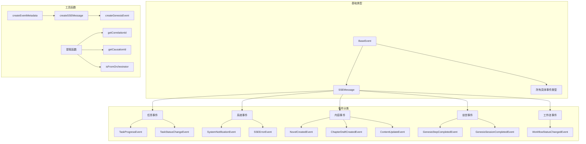
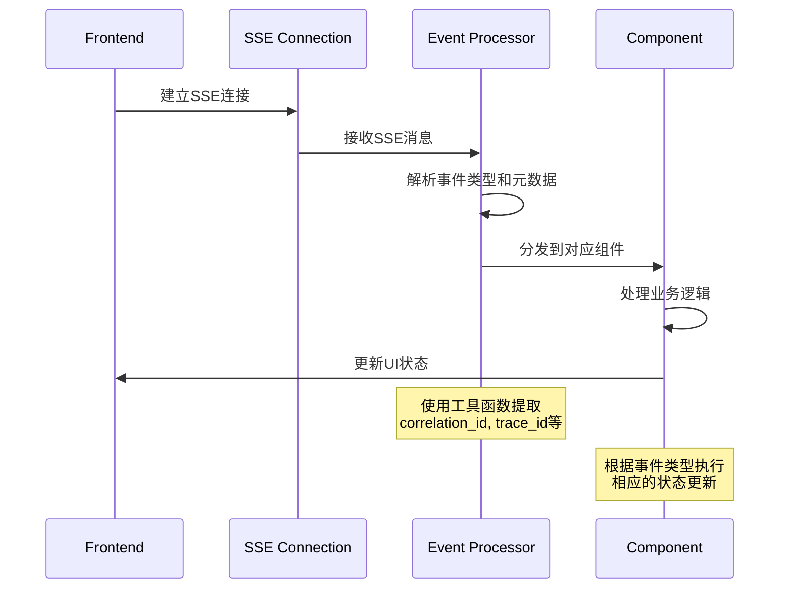
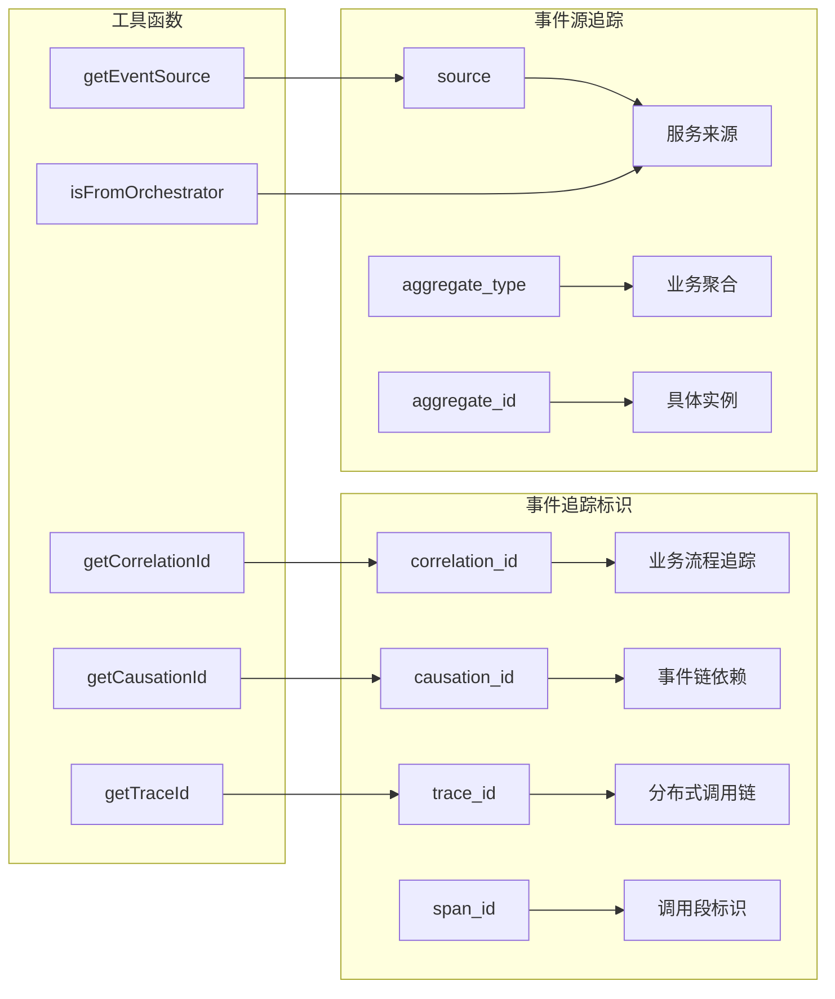

# 事件类型定义模块 (Events Types)

提供完整的事件类型定义和工具函数，对应后端的事件系统，实现前后端类型同步和事件处理的一致性。

## 🚀 核心功能

### 📋 统一事件类型系统

#### 字符串字面量类型
```typescript
// Orchestrator 消息类型（对应后端 MessageType）
export type MessageType =
  | 'Character.Design.Generated'
  | 'Character.Generated'
  | 'Outliner.Theme.Generated'
  | 'Theme.Generated'
  | 'Review.Quality.Evaluated'
  | 'Review.Quality.Result'
  | 'Review.Consistency.Checked'
  | 'Consistency.Checked'
  | 'Character.Design.GenerationRequested'
  | 'Outliner.Theme.GenerationRequested'
  | 'Review.Quality.EvaluationRequested'

// 事件动作类型（对应后端 EventActionType）
export type EventActionType =
  | 'Character.Proposed'
  | 'Theme.Proposed'
  | 'Character.Confirmed'
  | 'Theme.Confirmed'
  | 'Character.Failed'
  | 'Theme.Failed'
  | 'Character.RegenerationRequested'
  | 'Theme.RegenerationRequested'
  | 'Stage.Confirmed'
  | 'Stage.Failed'

// 目标类型和作用域类型
export type TargetType = 'character' | 'theme' | 'content'
export type OrchestratorScopeType = 'GENESIS'
```

#### 事件作用域枚举
```typescript
export enum EventScope {
  USER = 'user',
  SESSION = 'session',
  NOVEL = 'novel',
  GLOBAL = 'global',
}
```

### 🏗️ 统一事件元数据模型

对应后端 `EventMetadata`，提供完整的事件追踪和调试能力：

```typescript
export interface EventMetadata {
  // === 核心标识字段 ===
  event_id?: string | null           // 事件唯一标识符
  event_type?: string | null         // 事件类型标识
  aggregate_type?: string | null     // 聚合根类型
  aggregate_id?: string | null       // 聚合根实例ID
  
  // === 业务关联字段 ===
  correlation_id?: string | null    // 业务流程关联ID
  causation_id?: string | null       // 因果关系ID
  
  // === 时间字段 ===
  created_at?: string | null         // 事件创建时间戳
  
  // === 版本字段 ===
  event_version?: number | null     // 事件schema版本号
  version?: string | null           // 字符串版本标识
  
  // === 分布式追踪字段 ===
  trace_id?: string | null           // 分布式追踪ID
  span_id?: string | null            // 调用链段标识
  source?: string | null             // 事件来源标识
  
  // === 扩展元数据 ===
  metadata?: Record<string, any>      // 通用元数据字典
}
```

### 📡 SSE 消息格式

#### 增强 SSE 消息接口
```typescript
export interface SSEMessage {
  event: string                    // 事件类型，使用 domain.action-past 格式
  data: Record<string, any>         // 事件数据
  id?: string                       // 事件 ID，格式：{source}:{partition}:{offset}
  retry?: number                    // 重连延迟（毫秒）
  scope: EventScope                 // 事件作用域
  version: string                   // 事件版本，用于兼容性
  metadata?: EventMetadata          // 完整的事件元数据（新增）
}
```

#### SSE 连接配置
```typescript
export interface SSEConnectionConfig {
  reconnectInterval?: number       // 重连间隔（毫秒）
  maxReconnectAttempts?: number    // 最大重连次数
  connectionTimeout?: number       // 连接超时（毫秒）
  enableReconnect?: boolean         // 是否启用自动重连
}

export interface SSEListenerConfig {
  once?: boolean                    // 是否只监听一次
  filter?: (event: SSEEvent) => boolean  // 事件过滤器
  onError?: (error: Error) => void  // 错误处理器
}
```

### 🎯 具体事件类型定义

#### 任务相关事件
```typescript
export interface TaskProgressEvent {
  event: 'task.progress-updated'
  data: {
    task_id: string
    progress: number
    message?: string
    estimated_remaining?: number
  }
}

export interface TaskStatusChangeEvent {
  event: 'task.status-changed'
  data: {
    task_id: string
    old_status: string
    new_status: string
    timestamp: string
    reason?: string
  }
}
```

#### 系统通知事件
```typescript
export interface SystemNotificationEvent {
  event: 'system.notification-sent'
  data: {
    level: 'info' | 'warning' | 'error'
    title: string
    message: string
    action_required: boolean
    action_url?: string
  }
}

export interface SSEErrorEvent {
  event: 'sse.error-occurred'
  data: {
    level: ErrorLevel
    code: string
    message: string
    correlation_id?: string
    retry_after?: number
  }
}
```

#### 创世流程事件
```typescript
export interface GenesisStepCompletedEvent {
  event: 'genesis.step-completed'
  data: {
    session_id: string
    stage: string
    iteration: number
    is_confirmed: boolean
    summary?: string
  }
}

export interface GenesisSessionCompletedEvent {
  event: 'genesis.session-completed'
  data: {
    session_id: string
    novel_id: string
    status: string
    completion_time: string
  }
}
```

#### 内容相关事件
```typescript
export interface NovelCreatedEvent {
  event: 'novel.created'
  data: {
    id: string
    title: string
    theme?: string
    status: string
    created_at: string
  }
}

export interface ChapterDraftCreatedEvent {
  event: 'chapter.draft-created'
  data: {
    chapter_id: string
    chapter_number: number
    title?: string
    novel_id: string
  }
}
```

### 🛠️ 工具函数

#### 事件元数据创建
```typescript
export function createEventMetadata({
  event_id,
  event_type,
  aggregate_type,
  aggregate_id,
  correlation_id,
  causation_id,
  created_at,
  event_version,
  version,
  trace_id,
  span_id,
  source,
  metadata = {},
}: Partial<EventMetadata> = {}): EventMetadata {
  return {
    event_id,
    event_type,
    aggregate_type,
    aggregate_id,
    correlation_id,
    causation_id,
    created_at,
    event_version,
    version,
    trace_id,
    span_id,
    source,
    metadata,
  }
}
```

#### SSE 消息创建
```typescript
export function createSSEMessage({
  event,
  data,
  id,
  retry,
  scope = EventScope.USER,
  version = '1.0',
  metadata,
}: {
  event: string
  data: Record<string, any>
  id?: string
  retry?: number
  scope?: EventScope
  version?: string
  metadata?: EventMetadata
}): SSEMessage {
  return {
    event,
    data,
    id,
    retry,
    scope,
    version,
    metadata,
  }
}
```

#### Genesis 事件创建
```typescript
export function createGenesisEvent({
  event,
  data,
  session_id,
  correlation_id,
  causation_id,
  source = 'orchestrator',
}: {
  event: string
  data: Record<string, any>
  session_id: string
  correlation_id?: string
  causation_id?: string
  source?: string
}): SSEMessage {
  const metadata = createEventMetadata({
    event_id: `genesis-${Date.now()}-${Math.random().toString(36).slice(2)}`,
    event_type: event,
    aggregate_type: 'Genesis',
    aggregate_id: session_id,
    correlation_id,
    causation_id,
    created_at: new Date().toISOString(),
    event_version: 1,
    version: '1.0',
    source,
    metadata: {
      session_id,
      scope_type: 'GENESIS' as OrchestratorScopeType,
    },
  })

  return createSSEMessage({
    event,
    data,
    scope: EventScope.SESSION,
    version: '1.0',
    metadata,
  })
}
```

#### 事件元数据提取函数
```typescript
export function extractEventMetadata(message: SSEMessage): EventMetadata | null {
  return message.metadata || null
}

export function hasEventMetadata(message: SSEMessage): boolean {
  return !!message.metadata && Object.keys(message.metadata).length > 0
}

export function getCorrelationId(message: SSEMessage): string | null {
  return message.metadata?.correlation_id || null
}

export function getCausationId(message: SSEMessage): string | null {
  return message.metadata?.causation_id || null
}

export function getTraceId(message: SSEMessage): string | null {
  return message.metadata?.trace_id || null
}

export function getEventSource(message: SSEMessage): string | null {
  return message.metadata?.source || null
}
```

#### 事件源检查函数
```typescript
export function isFromSource(message: SSEMessage, source: string): boolean {
  return getEventSource(message) === source
}

export function isFromOrchestrator(message: SSEMessage): boolean {
  return isFromSource(message, 'orchestrator')
}

export function isFromAggregateType(message: SSEMessage, aggregateType: string): boolean {
  return message.metadata?.aggregate_type === aggregateType
}

export function isGenesisEvent(message: SSEMessage): boolean {
  return isFromAggregateType(message, 'Genesis')
}
```

### 📊 事件类型枚举

#### 后端事件类型枚举
```typescript
export enum BackendEventType {
  // 任务相关事件
  TASK_PROGRESS_UPDATED = 'task.progress-updated',
  TASK_STATUS_CHANGED = 'task.status-changed',
  
  // 系统相关事件
  SYSTEM_NOTIFICATION_SENT = 'system.notification-sent',
  SSE_ERROR_OCCURRED = 'sse.error-occurred',
  
  // 内容相关事件
  CONTENT_UPDATED = 'content.updated',
  
  // 小说相关事件
  NOVEL_CREATED = 'novel.created',
  NOVEL_STATUS_CHANGED = 'novel.status-changed',
  
  // 章节相关事件
  CHAPTER_DRAFT_CREATED = 'chapter.draft-created',
  CHAPTER_STATUS_CHANGED = 'chapter.status-changed',
  
  // 创世相关事件
  GENESIS_STEP_COMPLETED = 'genesis.step-completed',
  GENESIS_STEP_FAILED = 'genesis.step-failed',
  GENESIS_SESSION_COMPLETED = 'genesis.session-completed',
  GENESIS_SESSION_FAILED = 'genesis.session-failed',
  
  // 工作流相关事件
  WORKFLOW_STATUS_CHANGED = 'workflow.status-changed',
}
```

#### 错误级别枚举
```typescript
export enum ErrorLevel {
  WARNING = 'warning',
  ERROR = 'error',
  CRITICAL = 'critical',
}
```

### 🔄 类型联合

#### 所有后端事件类型的联合类型
```typescript
export type BackendSSEEvent =
  | TaskProgressEvent
  | TaskStatusChangeEvent
  | SystemNotificationEvent
  | ContentUpdateEvent
  | SSEErrorEvent
  | NovelCreatedEvent
  | NovelStatusChangedEvent
  | ChapterDraftCreatedEvent
  | ChapterStatusChangedEvent
  | GenesisStepCompletedEvent
  | GenesisStepFailedEvent
  | GenesisSessionCompletedEvent
  | GenesisSessionFailedEvent
  | WorkflowStatusChangedEvent

// 兼容性事件类型联合（保持向后兼容）
export type DomainEvent =
  | NovelCreatedEvent
  | LegacyChapterUpdatedEvent
  | LegacyWorkflowStartedEvent
  | LegacyWorkflowCompletedEvent
  | LegacyAgentActivityEvent
  | LegacyGenesisProgressEvent
```

## 🏗️ 架构设计

### 事件类型层次结构


### 事件处理流程


### 事件追踪机制


## 🚀 使用示例

### 基础事件创建
```typescript
// 创建基础 SSE 消息
const message = createSSEMessage({
  event: 'user.updated',
  data: {
    user_id: '123',
    changes: ['name', 'email']
  },
  scope: EventScope.USER,
  version: '1.0'
})

// 创建带完整元数据的事件
const metadata = createEventMetadata({
  event_id: 'evt-123',
  event_type: 'user.updated',
  correlation_id: 'corr-456',
  trace_id: 'trace-789',
  source: 'user-service'
})

const enhancedMessage = createSSEMessage({
  event: 'user.updated',
  data: { user_id: '123' },
  metadata
})
```

### Genesis 事件处理
```typescript
// 创建 Genesis 相关事件
const genesisEvent = createGenesisEvent({
  event: 'genesis.step-completed',
  data: {
    session_id: 'session-123',
    stage: 'character_generation',
    iteration: 1,
    is_confirmed: true
  },
  session_id: 'session-123',
  correlation_id: 'corr-456'
})

// 检查事件来源
if (isGenesisEvent(genesisEvent)) {
  console.log('这是 Genesis 相关事件')
}

if (isFromOrchestrator(genesisEvent)) {
  console.log('事件来自 Orchestrator')
}
```

### 事件监听和处理
```typescript
// 设置 SSE 连接配置
const sseConfig: SSEConnectionConfig = {
  reconnectInterval: 3000,
  maxReconnectAttempts: 5,
  connectionTimeout: 10000,
  enableReconnect: true
}

// 事件监听器配置
const listenerConfig: SSEListenerConfig = {
  once: false,
  filter: (event) => {
    return event.event === 'genesis.step-completed'
  },
  onError: (error) => {
    console.error('SSE 错误:', error)
  }
}

// 事件处理函数
function handleGenesisEvent(event: GenesisStepCompletedEvent) {
  const correlationId = getCorrelationId(event as SSEMessage)
  const traceId = getTraceId(event as SSEMessage)
  
  console.log(`处理 Genesis 事件: ${event.data.stage}`)
  console.log(`关联ID: ${correlationId}`)
  console.log(`追踪ID: ${traceId}`)
  
  // 更新 UI 状态
  updateGenesisProgress(event.data)
}
```

### 类型安全的处理
```typescript
// 类型守卫函数
function isTaskProgressEvent(event: any): event is TaskProgressEvent {
  return event?.event === 'task.progress-updated'
}

function isNovelCreatedEvent(event: any): event is NovelCreatedEvent {
  return event?.event === 'novel.created'
}

// 事件处理器
function handleBackendEvent(event: BackendSSEEvent) {
  if (isTaskProgressEvent(event)) {
    // 处理任务进度更新
    updateTaskProgress(event.data)
  } else if (isNovelCreatedEvent(event)) {
    // 处理小说创建
    addNovelToList(event.data)
  }
  // ... 其他事件类型处理
}
```

## 🎯 核心优势

### 🔄 类型安全
- **编译时检查**: 字符串字面量类型确保事件类型的准确性
- **类型推断**: 智能类型推断和守卫函数
- **IDE 支持**: 完整的类型提示和自动补全
- **向后兼容**: 保持与现有代码的兼容性

### 📊 完整的事件追踪
- **端到端追踪**: 通过 correlation_id 追踪完整业务流程
- **因果关系**: 通过 causation_id 建立事件依赖关系
- **分布式追踪**: 通过 trace_id 和 span_id 追踪跨服务调用
- **源标识**: 通过 source 和 aggregate_type 标识事件来源

### 🛠️ 丰富的工具函数
- **创建函数**: 类型安全的事件创建函数
- **提取函数**: 便捷的元数据提取函数
- **检查函数**: 事件来源和类型检查函数
- **工厂函数**: 针对特定场景的工厂函数

### 🎨 优秀的开发体验
- **文档完善**: 详细的类型定义和注释
- **示例丰富**: 提供完整的使用示例
- **架构清晰**: 分层设计和模块化组织
- **扩展性强**: 易于添加新的事件类型和功能

## 🔗 相关模块

- **后端对应**: `apps/backend/src/agents/orchestrator/types.py` - 对应的后端类型定义
- **事件映射**: `src/common/events.mapping` - 统一事件映射配置
- **SSE 连接**: `src/utils/sse-connection` - SSE 连接管理
- **状态管理**: `src/stores/events` - 事件状态管理

## 📝 注意事项

1. **类型同步**: 前后端事件类型需要保持同步
2. **版本兼容**: 新增事件类型时需要考虑向后兼容
3. **性能考虑**: 避免在事件处理中执行耗时操作
4. **错误处理**: 妥善处理 SSE 连接错误和重连逻辑
5. **内存管理**: 注意事件监听器的清理和资源释放

## 🔄 版本历史

### v1.0.0 (2024.09.26)
- ✨ 实现完整的事件类型系统
- ✨ 添加统一事件元数据模型
- ✨ 支持分布式追踪和因果关系
- ✨ 提供丰富的工具函数
- ✨ 实现 Genesis 事件专用创建函数
- ✨ 添加完整的类型守卫和检查函数