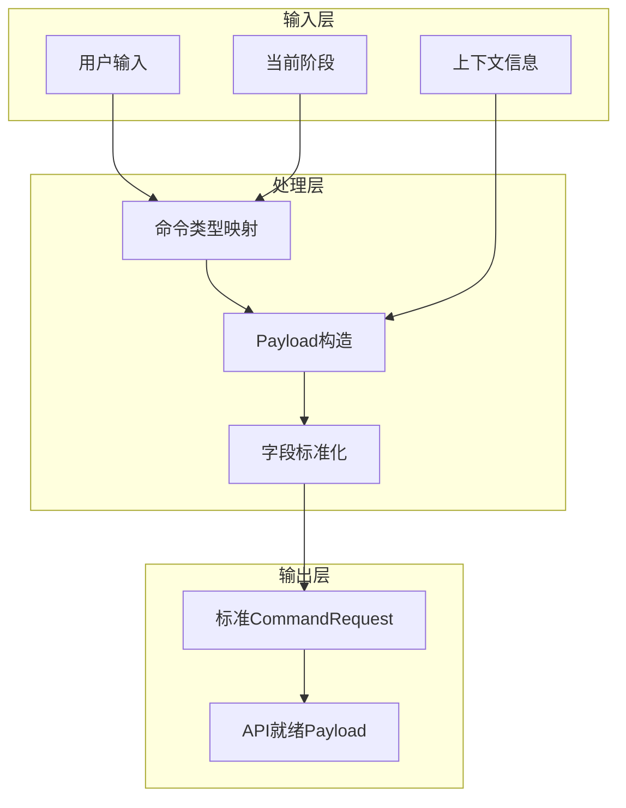
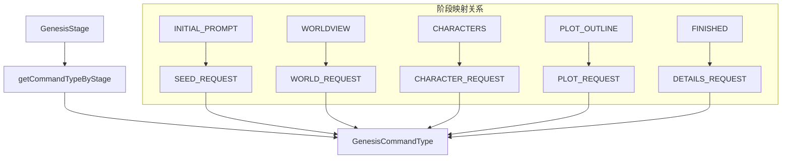
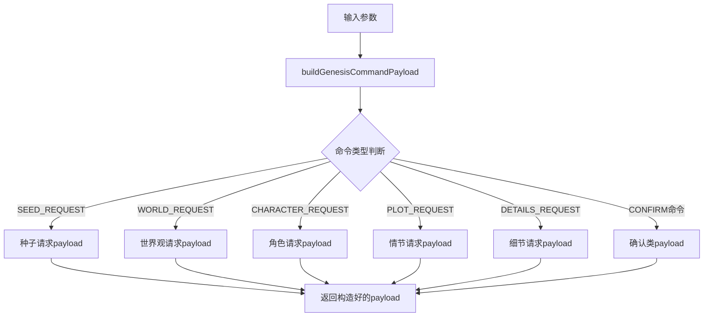
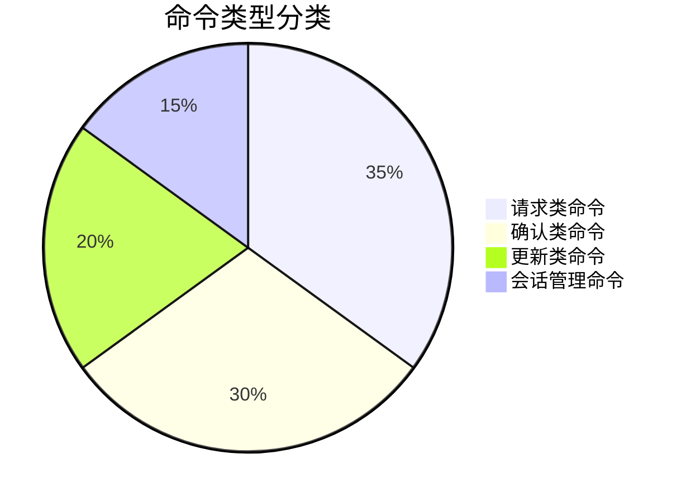

# 前端工具函数库 (Frontend Utils)

提供 InfiniteScribe 前端应用的核心工具函数，包括创世命令处理、状态管理、错误处理等通用功能。

## 📁 目录结构

```
utils/
├── genesisCommands.ts    # 创世命令工具函数
├── errorHandler.ts       # 错误处理工具
├── errorHandler.test.ts   # 错误处理测试
├── sseStorage.ts         # SSE 存储工具
├── api-response.ts       # API 响应处理工具
├── passwordValidator.ts  # 密码验证工具
└── README.md            # 工具函数文档
```

## 🎯 核心模块

### 1. 创世命令工具 (genesisCommands.ts)

提供 Genesis 创世系统的命令类型映射和 payload 构造功能，确保前端与后端 API 的无缝集成。

#### 核心功能

**命令类型映射**:
- **阶段自适应**: 根据当前创世阶段自动选择合适的命令类型
- **类型安全**: TypeScript 编译时类型检查
- **语义化**: 清晰的命令类型命名和分类

**Payload 构造**:
- **标准化**: 构造符合后端 API 规范的 payload
- **灵活性**: 支持各种上下文信息的传入
- **兼容性**: 保持与现有系统的向后兼容

#### 标准化字段说明

模块实现了完全标准化的 payload 字段，符合 LLD 文档要求：

```typescript
// 标准化字段结构
interface StandardPayload {
  user_input: string      // 用户输入内容，统一标准字段名
  session_id: string      // 会话ID
  stage: GenesisStage     // 当前创世阶段
  user_id?: string        // 用户ID，通常由后端推导
  context: Record<string, any>  // 上下文信息
  preferences?: Record<string, any>  // 用户偏好设置
}
```

#### 命令处理架构



## 📊 核心函数

#### 阶段命令映射



#### Payload 构造流程



#### 命令分类工具



#### 详细功能说明

**getCommandTypeByStage** - 根据创世阶段获取对应的用户消息命令类型

**buildGenesisCommandPayload** - 构造符合后端 API 要求的 payload 结构

**支持的命令类型**:
- **种子请求** (`SEED_REQUEST`): 创意种子生成
- **主题请求** (`THEME_REQUEST`): 主题生成
- **世界观请求** (`WORLD_REQUEST`): 世界观构建
- **角色请求** (`CHARACTER_REQUEST`): 角色创建
- **情节请求** (`PLOT_REQUEST`): 情节大纲
- **细节请求** (`DETAILS_REQUEST`): 细节完善
- **确认命令**: 各种内容的用户确认
- **会话管理**: 会话开始、完成等

**命令分类工具**:
- `isConfirmCommand()` - 检测确认类命令
- `isRequestCommand()` - 检测请求类命令
- `getConfirmCommandTypeByStage()` - 获取阶段确认命令
- `getUpdateCommandTypeByStage()` - 获取阶段更新命令
- `getCommandTypeDisplayName()` - 获取命令显示名称

### 2. 其他工具模块

#### 错误处理工具 (errorHandler.ts)
- 统一错误处理格式
- 用户友好的错误消息
- 错误日志记录和分析

#### SSE 存储工具 (sseStorage.ts)
- SSE 连接状态管理
- 事件数据缓存
- 连接恢复机制

## 🚀 使用示例

### 创世命令工具使用

```typescript
import { 
  getCommandTypeByStage, 
  buildGenesisCommandPayload,
  isConfirmCommand 
} from '@/utils/genesisCommands'
import { GenesisStage, GenesisCommandType } from '@/types/enums'

// 获取当前阶段的命令类型
const stage = GenesisStage.CHARACTERS
const commandType = getCommandTypeByStage(stage)
// 返回: GenesisCommandType.CHARACTER_REQUEST

// 构造标准化 payload
const payload = buildGenesisCommandPayload(
  commandType,
  '创建一个勇敢的骑士角色',
  'session_123',
  stage,
  {
    iteration_number: 2,
    requirements: {
      role: 'protagonist',
      traits: ['brave', 'noble']
    }
  }
)

// payload 结果符合 LLD 标准格式:
{
  session_id: 'session_123',
  user_input: '创建一个勇敢的骑士角色',  // 标准字段
  stage: 'CHARACTERS',
  context: {
    iteration_number: 2,
    requirements: {
      role: 'protagonist',
      traits: ['brave', 'noble']
    }
  }
}
```

### 在 React 组件中集成

```typescript
import { useState } from 'react'
import { 
  getCommandTypeByStage, 
  buildGenesisCommandPayload,
  isConfirmCommand 
} from '@/utils/genesisCommands'

function GenesisConversation({ stage, sessionId }: { 
  stage: GenesisStage, 
  sessionId: string 
}) {
  const [input, setInput] = useState('')
  
  const handleSendMessage = () => {
    const commandType = getCommandTypeByStage(stage)
    const payload = buildGenesisCommandPayload(
      commandType,
      input,  // 使用标准 user_input 字段
      sessionId,
      stage,
      {
        iteration_number: 3,
        user_preferences: {}
      }
    )
    
    // 发送到后端
    sendMessageToBackend({
      type: commandType,
      payload
    })
    
    setInput('')
  }
  
  return (
    <div>
      <textarea 
        value={input}
        onChange={(e) => setInput(e.target.value)}
        placeholder={isConfirmCommand(getCommandTypeByStage(stage)) 
          ? '输入确认意见...' 
          : '输入你的想法...'}
      />
      <button onClick={handleSendMessage}>
        发送
      </button>
    </div>
  )
}
```

### 与状态管理集成

```typescript
import { useMutation } from '@tanstack/react-query'
import { buildGenesisCommandPayload } from '@/utils/genesisCommands'

// 在 TanStack Query 中使用
const useSubmitCommand = () => {
  return useMutation({
    mutationFn: async ({ 
      commandType, 
      userInput, 
      sessionId, 
      stage 
    }) => {
      const payload = buildGenesisCommandPayload(
        commandType,
        userInput,
        sessionId,
        stage
      )
      
      const response = await fetch('/api/commands', {
        method: 'POST',
        headers: { 'Content-Type': 'application/json' },
        body: JSON.stringify({ type: commandType, payload })
      })
      
      return response.json()
    }
  })
}
```

## 🚀 使用示例

### 基本使用

```typescript
import { 
  getCommandTypeByStage, 
  buildGenesisCommandPayload 
} from '@/utils/genesisCommands'
import { GenesisStage, GenesisCommandType } from '@/types/enums'

// 获取当前阶段的命令类型
const stage = GenesisStage.CHARACTERS
const commandType = getCommandTypeByStage(stage)
// 返回: GenesisCommandType.CHARACTER_REQUEST

// 构造 payload
const payload = buildGenesisCommandPayload(
  commandType,
  '创建一个勇敢的骑士角色',
  'session_123',
  stage,
  {
    iteration_number: 2,
    requirements: {
      role: 'protagonist',
      traits: ['brave', 'noble']
    }
  }
)

// payload 结果:
{
  session_id: 'session_123',
  user_input: '创建一个勇敢的骑士角色',
  stage: 'CHARACTERS',
  context: {
    iteration_number: 2,
    requirements: {
      role: 'protagonist',
      traits: ['brave', 'noble']
    }
  }
}
```

### 在 React 组件中使用

```typescript
import { useState } from 'react'
import { 
  getCommandTypeByStage, 
  buildGenesisCommandPayload,
  isConfirmCommand 
} from '@/utils/genesisCommands'
import { GenesisStage } from '@/types/enums'

function GenesisConversation({ stage, sessionId }: { 
  stage: GenesisStage, 
  sessionId: string 
}) {
  const [input, setInput] = useState('')
  
  const handleSendMessage = () => {
    const commandType = getCommandTypeByStage(stage)
    const payload = buildGenesisCommandPayload(
      commandType,
      input,
      sessionId,
      stage,
      {
        iteration_number: 3,
        user_preferences: {}
      }
    )
    
    // 发送到后端
    sendMessageToBackend({
      type: commandType,
      payload
    })
    
    setInput('')
  }
  
  return (
    <div>
      <textarea 
        value={input}
        onChange={(e) => setInput(e.target.value)}
        placeholder={isConfirmCommand(getCommandTypeByStage(stage)) 
          ? '输入确认意见...' 
          : '输入你的想法...'}
      />
      <button onClick={handleSendMessage}>
        发送
      </button>
    </div>
  )
}
```

### 命令分类使用

```typescript
import { 
  isRequestCommand, 
  isConfirmCommand,
  getUpdateCommandTypeByStage 
} from '@/utils/genesisCommands'

// 判断命令类型
const commandType = GenesisCommandType.CHARACTER_REQUEST
console.log('是否为请求命令:', isRequestCommand(commandType)) // true
console.log('是否为确认命令:', isConfirmCommand(commandType)) // false

// 获取更新命令
const updateCommand = getUpdateCommandTypeByStage(GenesisStage.CHARACTERS)
console.log('更新命令类型:', updateCommand) // GenesisCommandType.CHARACTER_UPDATE
```

### 与表单集成

```typescript
import { 
  getCommandTypeByStage, 
  buildGenesisCommandPayload,
  getConfirmCommandTypeByStage 
} from '@/utils/genesisCommands'

function GenesisForm({ stage, sessionId }: { 
  stage: GenesisStage, 
  sessionId: string 
}) {
  const [formData, setFormData] = useState({
    content: '',
    preferences: {},
    requirements: {}
  })
  
  const handleSubmit = (isConfirm: boolean = false) => {
    const commandType = isConfirm 
      ? getConfirmCommandTypeByStage(stage)
      : getCommandTypeByStage(stage)
    
    const payload = buildGenesisCommandPayload(
      commandType,
      formData.content,
      sessionId,
      stage,
      {
        preferences: formData.preferences,
        requirements: formData.requirements,
        iteration_number: 1
      }
    )
    
    // 提交表单
    submitForm(payload)
  }
  
  return (
    <form>
      <textarea
        value={formData.content}
        onChange={(e) => setFormData({...formData, content: e.target.value})}
      />
      <button type="button" onClick={() => handleSubmit(false)}>
        提交请求
      </button>
      <button type="button" onClick={() => handleSubmit(true)}>
        确认内容
      </button>
    </form>
  )
}
```

## 🔗 与其他模块的集成

### 与 API 类型集成

```typescript
import { CommandRequest } from '@/types/api'
import { buildGenesisCommandPayload } from '@/utils/genesisCommands'

// 创建符合 API 要求的请求
function createCommandRequest(
  commandType: GenesisCommandType,
  userInput: string,
  sessionId: string,
  stage: GenesisStage
): CommandRequest {
  const payload = buildGenesisCommandPayload(
    commandType,
    userInput,
    sessionId,
    stage
  )
  
  return {
    type: commandType,
    payload
  }
}
```

### 与状态管理集成

```typescript
import { useMutation } from '@tanstack/react-query'
import { buildGenesisCommandPayload } from '@/utils/genesisCommands'

// 在状态管理中使用
const useSubmitCommand = () => {
  return useMutation({
    mutationFn: async ({ 
      commandType, 
      userInput, 
      sessionId, 
      stage 
    }) => {
      const payload = buildGenesisCommandPayload(
        commandType,
        userInput,
        sessionId,
        stage
      )
      
      const response = await fetch('/api/commands', {
        method: 'POST',
        headers: { 'Content-Type': 'application/json' },
        body: JSON.stringify({ type: commandType, payload })
      })
      
      return response.json()
    }
  })
}
```

## 🧪 测试策略

### 单元测试

```typescript
import { 
  getCommandTypeByStage, 
  buildGenesisCommandPayload,
  isConfirmCommand 
} from '@/utils/genesisCommands'
import { GenesisStage, GenesisCommandType } from '@/types/enums'

describe('GenesisCommands 工具测试', () => {
  test('应该返回正确的命令类型', () => {
    expect(getCommandTypeByStage(GenesisStage.CHARACTERS))
      .toBe(GenesisCommandType.CHARACTER_REQUEST)
  })
  
  test('应该正确识别确认命令', () => {
    expect(isConfirmCommand(GenesisCommandType.CHARACTER_CONFIRM))
      .toBe(true)
    expect(isConfirmCommand(GenesisCommandType.CHARACTER_REQUEST))
      .toBe(false)
  })
  
  test('应该构造正确的 payload', () => {
    const payload = buildGenesisCommandPayload(
      GenesisCommandType.CHARACTER_REQUEST,
      '测试输入',
      'session_123',
      GenesisStage.CHARACTERS
    )
    
    expect(payload).toEqual({
      session_id: 'session_123',
      user_input: '测试输入',
      stage: 'CHARACTERS',
      context: {
        iteration_number: 1
      },
      requirements: {}
    })
  })
})
```

### 集成测试

```typescript
describe('与后端 API 集成测试', () => {
  test('发送的 payload 应该被后端正确接收', async () => {
    const payload = buildGenesisCommandPayload(
      GenesisCommandType.CHARACTER_REQUEST,
      '创建角色',
      'session_123',
      GenesisStage.CHARACTERS
    )
    
    const response = await fetch('/api/test-endpoint', {
      method: 'POST',
      headers: { 'Content-Type': 'application/json' },
      body: JSON.stringify({ 
        type: GenesisCommandType.CHARACTER_REQUEST,
        payload 
      })
    })
    
    expect(response.ok).toBe(true)
  })
})
```

## 📊 性能优化

### 缓存策略
- 函数调用轻量级，无需特殊缓存
- 避免在渲染循环中重复计算
- 使用 useMemo 优化复杂计算

### 内存使用
- 纯函数设计，无状态管理
- 避免创建不必要的对象
- 及时清理临时变量

## 🔮 未来规划

### 短期目标
- [ ] 添加更多命令类型的支持
- [ ] 实现 payload 验证工具
- [ ] 添加命令历史记录
- [ ] 支持批量命令提交

### 长期规划
- [ ] 实现智能命令推荐
- [ ] 添加命令模板系统
- [ ] 支持命令链和批处理
- [ ] 增强错误处理和恢复机制

## 📝 最佳实践

1. **类型安全**: 始终使用定义的枚举类型
2. **参数验证**: 对输入参数进行基本验证
3. **错误处理**: 提供清晰的错误信息
4. **文档同步**: 工具函数变更时更新文档
5. **测试覆盖**: 确保所有工具函数都有测试

## 🔄 版本兼容性

### 向后兼容
- 保持函数签名不变
- 新增参数使用可选属性
- 废弃功能标记为 @deprecated

### 迁移策略
- 提供迁移工具和指南
- 逐步淘汰废弃的功能
- 保持足够长的过渡期