```mermaid
graph TD
    A[GenesisStage] --> B[getCommandTypeByStage]
    B --> C[GenesisCommandType]
    
    subgraph "阶段映射关系"
        D[INITIAL_PROMPT] --> E[SEED_REQUEST]
        F[WORLDVIEW] --> G[WORLD_REQUEST]
        H[CHARACTERS] --> I[CHARACTER_REQUEST]
        J[PLOT_OUTLINE] --> K[PLOT_REQUEST]
        L[FINISHED] --> M[DETAILS_REQUEST]
    end
    
    E --> C
    G --> C
    I --> C
    K --> C
    M --> C
```

```mermaid
flowchart TD
    A[输入参数] --> B[buildGenesisCommandPayload]
    B --> C{命令类型判断}
    
    C -->|SEED_REQUEST| D[种子请求payload]
    C -->|WORLD_REQUEST| E[世界观请求payload]
    C -->|CHARACTER_REQUEST| F[角色请求payload]
    C -->|PLOT_REQUEST| G[情节请求payload]
    C -->|DETAILS_REQUEST| H[细节请求payload]
    C -->|CONFIRM命令| I[确认类payload]
    
    D --> J[返回构造好的payload]
    E --> J
    F --> J
    G --> J
    H --> J
    I --> J
```

```mermaid
pie
    title 命令类型分类
    "请求类命令" : 35
    "确认类命令" : 30
    "更新类命令" : 20
    "会话管理命令" : 15
```

# 前端工具函数库 (Frontend Utils)

提供 InfiniteScribe 前端应用的核心工具函数，包括创世命令处理、状态管理、错误处理等通用功能。

## 📁 目录结构

```
utils/
├── genesisCommands.ts        # 创世命令工具函数
├── genesisThinkingStorage.ts # Genesis 思考状态持久化工具
├── errorHandler.ts           # 错误处理工具
├── errorHandler.test.ts      # 错误处理测试
├── sseStorage.ts             # SSE 存储工具
├── api-response.ts           # API 响应处理工具
├── passwordValidator.ts      # 密码验证工具
└── README.md                 # 工具函数文档
```

## 🎯 核心模块

### 1. 创世命令工具 (genesisCommands.ts)

提供 Genesis 创世系统的命令类型映射和 payload 构造功能，确保前端与后端 API 的无缝集成。

#### 核心功能

**命令类型映射**:
- **阶段自适应**: 根据当前创世阶段自动选择合适的命令类型
- **类型安全**: TypeScript 编译时类型检查
- **语义化**: 清晰的命令类型命名和分类

**Payload 构造**:
- **标准化**: 构造符合后端 API 规范的 payload
- **灵活性**: 支持各种上下文信息的传入
- **兼容性**: 保持与现有系统的向后兼容

#### 标准化字段说明

模块实现了完全标准化的 payload 字段，符合 LLD 文档要求：

```typescript
// 标准化字段结构
interface StandardPayload {
  user_input: string      // 用户输入内容，统一标准字段名
  session_id: string      // 会话ID
  stage: GenesisStage     // 当前创世阶段
  user_id?: string        // 用户ID，通常由后端推导
  context: Record<string, any>  // 上下文信息
  preferences?: Record<string, any>  // 用户偏好设置
}
```

#### 命令处理架构

```mermaid
graph TD
    subgraph "输入层"
        A[用户输入]
        B[当前阶段]
        C[上下文信息]
    end
    
    subgraph "处理层"
        D[命令类型映射]
        E[Payload构造]
        F[字段标准化]
    end
    
    subgraph "输出层"
        G[标准CommandRequest]
        H[API就绪Payload]
    end
    
    A --> D
    B --> D
    D --> E
    C --> E
    E --> F
    F --> G
    G --> H
```



## 📊 核心函数

#### 阶段命令映射



#### Payload 构造流程



#### 命令分类工具



#### 详细功能说明

**getCommandTypeByStage** - 根据创世阶段获取对应的用户消息命令类型

**buildGenesisCommandPayload** - 构造符合后端 API 要求的 payload 结构

**支持的命令类型**:
- **种子请求** (`SEED_REQUEST`): 创意种子生成
- **主题请求** (`THEME_REQUEST`): 主题生成
- **世界观请求** (`WORLD_REQUEST`): 世界观构建
- **角色请求** (`CHARACTER_REQUEST`): 角色创建
- **情节请求** (`PLOT_REQUEST`): 情节大纲
- **细节请求** (`DETAILS_REQUEST`): 细节完善
- **确认命令**: 各种内容的用户确认
- **会话管理**: 会话开始、完成等

**命令分类工具**:
- `isConfirmCommand()` - 检测确认类命令
- `isRequestCommand()` - 检测请求类命令
- `getConfirmCommandTypeByStage()` - 获取阶段确认命令
- `getUpdateCommandTypeByStage()` - 获取阶段更新命令
- `getCommandTypeDisplayName()` - 获取命令显示名称

### 2. Genesis 思考状态持久化工具 (genesisThinkingStorage.ts)

提供 Genesis 思考过程状态的本地持久化功能，确保页面刷新后能够恢复最近的思考状态。

#### 核心功能

**状态管理**:
- **会话隔离**: 每个会话的状态独立存储，避免数据污染
- **TTL 机制**: 自动清理过期状态数据（10分钟有效期）
- **容量限制**: 每个会话最多保存 20 条状态记录
- **错误容错**: 优雅处理 localStorage 读写异常

**存储策略**:
- **增量保存**: 新状态追加到现有状态列表
- **截断管理**: 自动截断超长状态列表
- **时间戳**: 记录状态更新时间，支持过期清理
- **序列化安全**: 使用 JSON 安全序列化/反序列化

#### 工具函数

```typescript
// 获取指定会话的状态列表
getThinkingStatuses(sessionId: string): GenesisCommandStatus[]

// 添加新的状态到会话
appendThinkingStatus(sessionId: string, status: GenesisCommandStatus): void

// 批量设置会话状态
setThinkingStatuses(sessionId: string, statuses: GenesisCommandStatus[]): void

// 清理指定会话的状态
clearThinkingStatuses(sessionId: string): void
```

#### 存储结构

```typescript
interface GenesisCommandStatus {
  event_id: string           // 事件唯一标识
  event_type: string         // 事件类型
  session_id: string         // 会话ID
  correlation_id: string     // 关联ID
  timestamp: string          // 时间戳
  status: string             // 状态信息
  _scope?: string           // 作用域
  _version?: string         // 版本信息
}

type StoredSessionState = {
  statuses: GenesisCommandStatus[]
  updatedAt: number         // 更新时间戳
}

type StoredState = Record<string, StoredSessionState>
```

#### 配置参数

```typescript
const STORAGE_KEY = 'genesis_thinking_state_v1'  // 本地存储键名
const MAX_PER_SESSION = 20                       // 每会话最大状态数
const TTL_MS = 10 * 60 * 1000                   // 10分钟有效期
```

#### 使用示例

```typescript
import { 
  getThinkingStatuses, 
  appendThinkingStatus,
  clearThinkingStatuses 
} from '@/utils/genesisThinkingStorage'
import type { GenesisCommandStatus } from '@/components/genesis/GenesisStatusCard'

// 在组件中恢复状态
function ThinkingComponent({ sessionId }: { sessionId: string }) {
  const [statuses, setStatuses] = useState<GenesisCommandStatus[]>([])
  
  useEffect(() => {
    // 初始恢复：从本地存储获取保存的状态
    const savedStatuses = getThinkingStatuses(sessionId)
    if (savedStatuses.length > 0) {
      setStatuses(savedStatuses)
    }
  }, [sessionId])
  
  // 监听新事件并保存
  const handleNewStatus = (newStatus: GenesisCommandStatus) => {
    setStatuses(prev => [...prev, newStatus])
    appendThinkingStatus(sessionId, newStatus)  // 持久化到本地
  }
  
  return (
    <div>
      {/* 渲染思考状态 */}
    </div>
  )
}
```

#### 状态恢复流程

```mermaid
graph TD
    A[组件加载] --> B[读取本地存储]
    B --> C{检查会话状态}
    C -->|存在且未过期| D[恢复状态到UI]
    C -->|不存在或已过期| E[显示初始状态]
    D --> F[等待新SSE事件]
    E --> F
    F --> G[接收到新事件]
    G --> H[更新UI状态]
    H --> I[保存到本地存储]
```



#### 性能优化

- **按需读取**: 仅在组件初始化时读取一次本地存储
- **增量保存**: 新状态追加而非重写整个状态列表
- **自动清理**: TTL 机制自动清理过期数据
- **容量控制**: 防止单个会话状态无限增长

### 3. 其他工具模块

#### 错误处理工具 (errorHandler.ts)
- 统一错误处理格式
- 用户友好的错误消息
- 错误日志记录和分析

#### SSE 存储工具 (sseStorage.ts)
- SSE 连接状态管理
- 事件数据缓存
- 连接恢复机制

## 🚀 使用示例

### 创世命令工具使用

```typescript
import { 
  getCommandTypeByStage, 
  buildGenesisCommandPayload,
  isConfirmCommand 
} from '@/utils/genesisCommands'
import { GenesisStage, GenesisCommandType } from '@/types/enums'

// 获取当前阶段的命令类型
const stage = GenesisStage.CHARACTERS
const commandType = getCommandTypeByStage(stage)
// 返回: GenesisCommandType.CHARACTER_REQUEST

// 构造标准化 payload
const payload = buildGenesisCommandPayload(
  commandType,
  '创建一个勇敢的骑士角色',
  'session_123',
  stage,
  {
    iteration_number: 2,
    requirements: {
      role: 'protagonist',
      traits: ['brave', 'noble']
    }
  }
)

// payload 结果符合 LLD 标准格式:
{
  session_id: 'session_123',
  user_input: '创建一个勇敢的骑士角色',  // 标准字段
  stage: 'CHARACTERS',
  context: {
    iteration_number: 2,
    requirements: {
      role: 'protagonist',
      traits: ['brave', 'noble']
    }
  }
}
```

### 在 React 组件中集成

```typescript
import { useState } from 'react'
import { 
  getCommandTypeByStage, 
  buildGenesisCommandPayload,
  isConfirmCommand 
} from '@/utils/genesisCommands'

function GenesisConversation({ stage, sessionId }: { 
  stage: GenesisStage, 
  sessionId: string 
}) {
  const [input, setInput] = useState('')
  
  const handleSendMessage = () => {
    const commandType = getCommandTypeByStage(stage)
    const payload = buildGenesisCommandPayload(
      commandType,
      input,  // 使用标准 user_input 字段
      sessionId,
      stage,
      {
        iteration_number: 3,
        user_preferences: {}
      }
    )
    
    // 发送到后端
    sendMessageToBackend({
      type: commandType,
      payload
    })
    
    setInput('')
  }
  
  return (
    <div>
      <textarea 
        value={input}
        onChange={(e) => setInput(e.target.value)}
        placeholder={isConfirmCommand(getCommandTypeByStage(stage)) 
          ? '输入确认意见...' 
          : '输入你的想法...'}
      />
      <button onClick={handleSendMessage}>
        发送
      </button>
    </div>
  )
}
```

### 与状态管理集成

```typescript
import { useMutation } from '@tanstack/react-query'
import { buildGenesisCommandPayload } from '@/utils/genesisCommands'

// 在 TanStack Query 中使用
const useSubmitCommand = () => {
  return useMutation({
    mutationFn: async ({ 
      commandType, 
      userInput, 
      sessionId, 
      stage 
    }) => {
      const payload = buildGenesisCommandPayload(
        commandType,
        userInput,
        sessionId,
        stage
      )
      
      const response = await fetch('/api/commands', {
        method: 'POST',
        headers: { 'Content-Type': 'application/json' },
        body: JSON.stringify({ type: commandType, payload })
      })
      
      return response.json()
    }
  })
}
```

## 🚀 使用示例

### 基本使用

```typescript
import { 
  getCommandTypeByStage, 
  buildGenesisCommandPayload 
} from '@/utils/genesisCommands'
import { GenesisStage, GenesisCommandType } from '@/types/enums'

// 获取当前阶段的命令类型
const stage = GenesisStage.CHARACTERS
const commandType = getCommandTypeByStage(stage)
// 返回: GenesisCommandType.CHARACTER_REQUEST

// 构造 payload
const payload = buildGenesisCommandPayload(
  commandType,
  '创建一个勇敢的骑士角色',
  'session_123',
  stage,
  {
    iteration_number: 2,
    requirements: {
      role: 'protagonist',
      traits: ['brave', 'noble']
    }
  }
)

// payload 结果:
{
  session_id: 'session_123',
  user_input: '创建一个勇敢的骑士角色',
  stage: 'CHARACTERS',
  context: {
    iteration_number: 2,
    requirements: {
      role: 'protagonist',
      traits: ['brave', 'noble']
    }
  }
}
```

### 在 React 组件中使用

```typescript
import { useState } from 'react'
import { 
  getCommandTypeByStage, 
  buildGenesisCommandPayload,
  isConfirmCommand 
} from '@/utils/genesisCommands'
import { GenesisStage } from '@/types/enums'

function GenesisConversation({ stage, sessionId }: { 
  stage: GenesisStage, 
  sessionId: string 
}) {
  const [input, setInput] = useState('')
  
  const handleSendMessage = () => {
    const commandType = getCommandTypeByStage(stage)
    const payload = buildGenesisCommandPayload(
      commandType,
      input,
      sessionId,
      stage,
      {
        iteration_number: 3,
        user_preferences: {}
      }
    )
    
    // 发送到后端
    sendMessageToBackend({
      type: commandType,
      payload
    })
    
    setInput('')
  }
  
  return (
    <div>
      <textarea 
        value={input}
        onChange={(e) => setInput(e.target.value)}
        placeholder={isConfirmCommand(getCommandTypeByStage(stage)) 
          ? '输入确认意见...' 
          : '输入你的想法...'}
      />
      <button onClick={handleSendMessage}>
        发送
      </button>
    </div>
  )
}
```

### 命令分类使用

```typescript
import { 
  isRequestCommand, 
  isConfirmCommand,
  getUpdateCommandTypeByStage 
} from '@/utils/genesisCommands'

// 判断命令类型
const commandType = GenesisCommandType.CHARACTER_REQUEST
console.log('是否为请求命令:', isRequestCommand(commandType)) // true
console.log('是否为确认命令:', isConfirmCommand(commandType)) // false

// 获取更新命令
const updateCommand = getUpdateCommandTypeByStage(GenesisStage.CHARACTERS)
console.log('更新命令类型:', updateCommand) // GenesisCommandType.CHARACTER_UPDATE
```

### 与表单集成

```typescript
import { 
  getCommandTypeByStage, 
  buildGenesisCommandPayload,
  getConfirmCommandTypeByStage 
} from '@/utils/genesisCommands'

function GenesisForm({ stage, sessionId }: { 
  stage: GenesisStage, 
  sessionId: string 
}) {
  const [formData, setFormData] = useState({
    content: '',
    preferences: {},
    requirements: {}
  })
  
  const handleSubmit = (isConfirm: boolean = false) => {
    const commandType = isConfirm 
      ? getConfirmCommandTypeByStage(stage)
      : getCommandTypeByStage(stage)
    
    const payload = buildGenesisCommandPayload(
      commandType,
      formData.content,
      sessionId,
      stage,
      {
        preferences: formData.preferences,
        requirements: formData.requirements,
        iteration_number: 1
      }
    )
    
    // 提交表单
    submitForm(payload)
  }
  
  return (
    <form>
      <textarea
        value={formData.content}
        onChange={(e) => setFormData({...formData, content: e.target.value})}
      />
      <button type="button" onClick={() => handleSubmit(false)}>
        提交请求
      </button>
      <button type="button" onClick={() => handleSubmit(true)}>
        确认内容
      </button>
    </form>
  )
}
```

## 🔗 与其他模块的集成

### 与 API 类型集成

```typescript
import { CommandRequest } from '@/types/api'
import { buildGenesisCommandPayload } from '@/utils/genesisCommands'

// 创建符合 API 要求的请求
function createCommandRequest(
  commandType: GenesisCommandType,
  userInput: string,
  sessionId: string,
  stage: GenesisStage
): CommandRequest {
  const payload = buildGenesisCommandPayload(
    commandType,
    userInput,
    sessionId,
    stage
  )
  
  return {
    type: commandType,
    payload
  }
}
```

### 与状态管理集成

```typescript
import { useMutation } from '@tanstack/react-query'
import { buildGenesisCommandPayload } from '@/utils/genesisCommands'

// 在状态管理中使用
const useSubmitCommand = () => {
  return useMutation({
    mutationFn: async ({ 
      commandType, 
      userInput, 
      sessionId, 
      stage 
    }) => {
      const payload = buildGenesisCommandPayload(
        commandType,
        userInput,
        sessionId,
        stage
      )
      
      const response = await fetch('/api/commands', {
        method: 'POST',
        headers: { 'Content-Type': 'application/json' },
        body: JSON.stringify({ type: commandType, payload })
      })
      
      return response.json()
    }
  })
}
```

## 🧪 测试策略

### 单元测试

```typescript
import { 
  getCommandTypeByStage, 
  buildGenesisCommandPayload,
  isConfirmCommand 
} from '@/utils/genesisCommands'
import { GenesisStage, GenesisCommandType } from '@/types/enums'

describe('GenesisCommands 工具测试', () => {
  test('应该返回正确的命令类型', () => {
    expect(getCommandTypeByStage(GenesisStage.CHARACTERS))
      .toBe(GenesisCommandType.CHARACTER_REQUEST)
  })
  
  test('应该正确识别确认命令', () => {
    expect(isConfirmCommand(GenesisCommandType.CHARACTER_CONFIRM))
      .toBe(true)
    expect(isConfirmCommand(GenesisCommandType.CHARACTER_REQUEST))
      .toBe(false)
  })
  
  test('应该构造正确的 payload', () => {
    const payload = buildGenesisCommandPayload(
      GenesisCommandType.CHARACTER_REQUEST,
      '测试输入',
      'session_123',
      GenesisStage.CHARACTERS
    )
    
    expect(payload).toEqual({
      session_id: 'session_123',
      user_input: '测试输入',
      stage: 'CHARACTERS',
      context: {
        iteration_number: 1
      },
      requirements: {}
    })
  })
})
```

### 集成测试

```typescript
describe('与后端 API 集成测试', () => {
  test('发送的 payload 应该被后端正确接收', async () => {
    const payload = buildGenesisCommandPayload(
      GenesisCommandType.CHARACTER_REQUEST,
      '创建角色',
      'session_123',
      GenesisStage.CHARACTERS
    )
    
    const response = await fetch('/api/test-endpoint', {
      method: 'POST',
      headers: { 'Content-Type': 'application/json' },
      body: JSON.stringify({ 
        type: GenesisCommandType.CHARACTER_REQUEST,
        payload 
      })
    })
    
    expect(response.ok).toBe(true)
  })
})
```

## 📊 性能优化

### 缓存策略
- 函数调用轻量级，无需特殊缓存
- 避免在渲染循环中重复计算
- 使用 useMemo 优化复杂计算

### 内存使用
- 纯函数设计，无状态管理
- 避免创建不必要的对象
- 及时清理临时变量

## 🔮 未来规划

### 短期目标
- [ ] 添加更多命令类型的支持
- [ ] 实现 payload 验证工具
- [ ] 添加命令历史记录
- [ ] 支持批量命令提交

### 长期规划
- [ ] 实现智能命令推荐
- [ ] 添加命令模板系统
- [ ] 支持命令链和批处理
- [ ] 增强错误处理和恢复机制

## 📝 最佳实践

1. **类型安全**: 始终使用定义的枚举类型
2. **参数验证**: 对输入参数进行基本验证
3. **错误处理**: 提供清晰的错误信息
4. **文档同步**: 工具函数变更时更新文档
5. **测试覆盖**: 确保所有工具函数都有测试

## 🔄 版本兼容性

### 向后兼容
- 保持函数签名不变
- 新增参数使用可选属性
- 废弃功能标记为 @deprecated

### 迁移策略
- 提供迁移工具和指南
- 逐步淘汰废弃的功能
- 保持足够长的过渡期

## 🔧 工具集成示例

### GenesisThinkingStorage 与创世命令集成

```typescript
import { 
  getCommandTypeByStage, 
  buildGenesisCommandPayload 
} from '@/utils/genesisCommands'
import { 
  getThinkingStatuses, 
  appendThinkingStatus 
} from '@/utils/genesisThinkingStorage'
import { useGenesisEvents } from '@/hooks/sse'

// 在对话组件中使用状态持久化
function GenesisConversationWithPersistence({ sessionId, stage }: {
  sessionId: string
  stage: GenesisStage
}) {
  const [statuses, setStatuses] = useState<GenesisCommandStatus[]>([])
  
  // 初始恢复状态
  useEffect(() => {
    const savedStatuses = getThinkingStatuses(sessionId)
    if (savedStatuses.length > 0) {
      setStatuses(savedStatuses)
    }
  }, [sessionId])
  
  // 监听 Genesis 事件
  useGenesisEvents(sessionId, (eventType, eventData) => {
    if (isGenesisEvent(eventType) && eventData.event_id) {
      const newStatus: GenesisCommandStatus = {
        event_id: eventData.event_id,
        event_type: eventData.event_type,
        session_id: sessionId,
        correlation_id: eventData.correlation_id || '',
        timestamp: eventData.timestamp || new Date().toISOString(),
        status: eventData.status,
        _scope: eventData._scope,
        _version: eventData._version,
      }
      
      // 更新UI状态
      setStatuses(prev => [...prev, newStatus])
      
      // 持久化到本地存储
      appendThinkingStatus(sessionId, newStatus)
    }
  })
  
  const handleSendMessage = (userInput: string) => {
    const commandType = getCommandTypeByStage(stage)
    const payload = buildGenesisCommandPayload(
      commandType,
      userInput,
      sessionId,
      stage
    )
    
    // 发送命令到后端
    // 后续的 SSE 事件会自动被上面的监听器捕获并保存
    sendCommand({ type: commandType, payload })
  }
  
  return (
    <div>
      {/* 渲染对话和思考状态 */}
    </div>
  )
}
```

### 完整的状态管理架构

```mermaid
graph TB
    subgraph "用户交互层"
        A[用户输入]
        B[AI响应显示]
    end
    
    subgraph "状态管理层"
        C[React State]
        D[localStorage持久化]
        E[SSE事件监听]
    end
    
    subgraph "工具函数层"
        F[genesisCommands]
        G[genesisThinkingStorage]
        H[errorHandler]
    end
    
    subgraph "后端集成层"
        I[API请求]
        J[SSE连接]
    end
    
    A --> F
    F --> I
    I --> J
    J --> E
    E --> G
    G --> D
    D --> C
    C --> B
    E --> C
    
    H -.-> I
    H -.-> J
```

