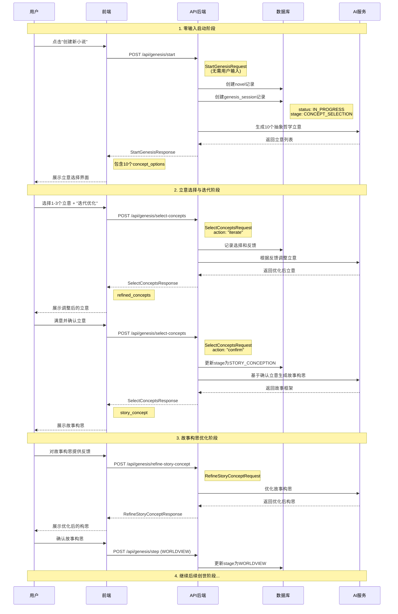
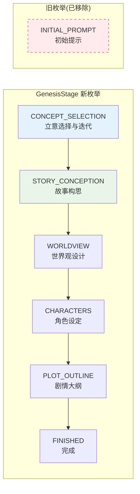
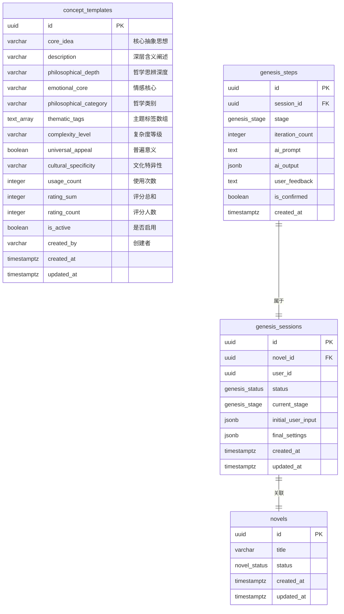
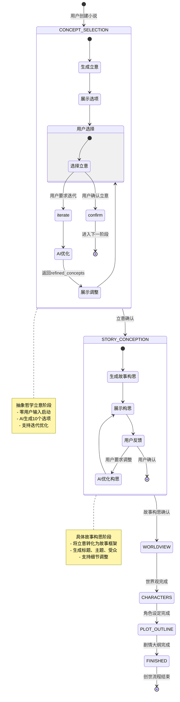

# 小说创世流程重新设计文档

## 概述

为了降低用户创作门槛，提升创作体验，我们重新设计了小说创世流程。新流程从要求用户提供初始想法改为由AI生成抽象哲学立意供用户选择，实现了"零输入"启动创作的目标。

## 设计原则

### 1. 零门槛启动
- 用户点击"创建新小说"无需任何输入
- AI主动提供创作方向，降低创作焦虑

### 2. 哲学立意驱动
- 立意层面保持抽象哲学思想
- 避免具体设定，保持创作空间的开放性
- 强调思想深度和情感内核

### 3. 迭代优化机制
- 支持用户对立意进行反馈和调整
- 渐进式细化，从抽象到具体
- 每个阶段都允许用户参与和修正

## 新旧流程对比

### 旧流程问题
```
用户输入初始想法 → 直接进入世界观设计
   ↓
❌ 创作门槛高，很多用户不知道如何开始
❌ 缺乏立意深度，容易导致平面化故事
❌ 没有迭代机制，用户难以表达真实需求
```

### 新流程优势
```
零输入启动 → 立意选择 → 故事构思 → 世界观设计
     ↓            ↓          ↓          ↓
✅ 降低门槛    ✅ 深度思考   ✅ 具体化   ✅ 细节完善
✅ AI引导     ✅ 用户选择   ✅ 迭代优化  ✅ 结构化设计
```

## 流程架构图

```mermaid
graph TB
    Start([用户点击"创建新小说"]) --> GenConcepts[AI生成10个抽象立意]
    GenConcepts --> ShowConcepts[展示立意选项]
    ShowConcepts --> UserSelect{用户选择1-3个立意}
    
    UserSelect --> CheckAction{用户操作}
    CheckAction -->|iterate| ProvideFeedback[用户提供反馈]
    CheckAction -->|confirm| MoveToConcept[进入故事构思阶段]
    
    ProvideFeedback --> RefineConcepts[AI根据反馈调整立意]
    RefineConcepts --> ShowRefined[展示调整后的立意]
    ShowRefined --> UserSelect
    
    MoveToConcept --> GenStoryConcept[AI生成具体故事构思]
    GenStoryConcept --> ShowStoryConcept[展示故事框架]
    ShowStoryConcept --> StoryAction{用户操作}
    
    StoryAction -->|refine| StoryFeedback[用户提供故事反馈]
    StoryAction -->|confirm| MoveToWorldview[进入世界观设计]
    
    StoryFeedback --> RefineStory[AI优化故事构思]
    RefineStory --> ShowStoryConcept
    
    MoveToWorldview --> WorldviewStage[世界观设计阶段]
    WorldviewStage --> CharacterStage[角色设定阶段]
    CharacterStage --> PlotStage[剧情大纲阶段]
    PlotStage --> Finished[创世完成]
    
    style Start fill:#e1f5fe
    style GenConcepts fill:#f3e5f5
    style MoveToConcept fill:#e8f5e8
    style MoveToWorldview fill:#fff3e0
    style Finished fill:#e0f2f1
```

## 详细时序图

### 完整用户交互流程



### 立意迭代优化流程

```mermaid
sequenceDiagram
    participant U as 用户
    participant AI as AI服务
    participant CT as 立意模板库

    Note over U,CT: 立意选择与优化循环
    
    loop 迭代优化过程
        U->>AI: 选择立意 + 提供反馈
        Note right of U: "希望更加强调孤独感"<br/>"想要加入友情元素"
        
        AI->>CT: 查询相关立意模板
        CT-->>AI: 返回匹配的哲学概念
        
        AI->>AI: 分析用户反馈
        Note right of AI: 解析用户意图<br/>调整立意表达
        
        AI-->>U: 返回调整后的立意
        Note left of AI: 保持抽象哲学层面<br/>体现用户偏好
        
        alt 用户满意
            U->>AI: 确认立意
            break 退出迭代循环
        else 需要继续调整
            U->>AI: 提供新的反馈
        end
    end
```

## 数据库架构设计

### 枚举类型更新



### 新增表结构



## API 接口设计

### 1. 开始创世流程

**请求**: `POST /api/genesis/start`

```json
{
  "user_id": "optional-uuid",
  "concept_preferences": {
    "philosophical_categories": ["存在主义", "人道主义"],
    "complexity_level": "medium",
    "thematic_focus": ["成长", "选择", "友情"],
    "cultural_context": "普世价值"
  },
  "concept_count": 10,
  "use_personalization": true
}
```

**响应**: `StartGenesisResponse`

```json
{
  "session_id": "uuid",
  "novel_id": "uuid", 
  "status": "IN_PROGRESS",
  "current_stage": "CONCEPT_SELECTION",
  "concept_options": [
    {
      "id": 1,
      "core_idea": "知识与无知的深刻对立",
      "description": "探讨知识如何改变一个人的命运，以及无知所带来的悲剧与痛苦",
      "philosophical_depth": "当个体获得超越同辈的知识时，他将面临孤独与责任的双重考验",
      "emotional_core": "理解与被理解之间的渴望与隔阂"
    }
  ],
  "selection_guidance": "请从以下10个立意中选择1-3个您感兴趣的方向...",
  "next_action": "选择喜欢的立意，可选择直接确认或提供反馈进行迭代优化"
}
```

### 2. 选择和优化立意

**请求**: `POST /api/genesis/select-concepts`

```json
{
  "session_id": "uuid",
  "selected_concept_ids": [1, 3],
  "user_feedback": "希望能够更突出主角的孤独感，并且加入一些关于友情的元素",
  "action": "iterate"  // 或 "confirm"
}
```

**响应** (迭代情况): `SelectConceptsResponse`

```json
{
  "session_id": "uuid",
  "current_stage": "CONCEPT_SELECTION",
  "refined_concepts": [
    {
      "id": 1,
      "core_idea": "知识与无知的深刻对立",
      "description": "探讨知识如何改变一个人的命运，以及无知所带来的悲剧与痛苦",
      "philosophical_depth": "当个体获得超越同辈的知识时，他将面临孤独与责任的双重考验。真正的成长往往来自于在孤独中找到理解自己的朋友。",
      "emotional_core": "理解与被理解之间的渴望与隔阂，以及在孤独中寻找真挚友情的珍贵",
      "adjustments_made": "根据您的反馈，强化了知识带来的孤独感，并融入了友情作为情感支撑的维度"
    }
  ],
  "is_confirmed": false,
  "next_action": "继续提供反馈优化立意"
}
```

**响应** (确认情况): `SelectConceptsResponse`

```json
{
  "session_id": "uuid", 
  "current_stage": "STORY_CONCEPTION",
  "story_concept": {
    "confirmed_concepts": [...],
    "title_suggestions": ["异世界的智者之路", "穿越时空的求知者"],
    "core_concept": "现代大学生穿越到异世界魔法学院，利用现代知识与魔法结合...",
    "main_themes": ["知识的力量", "友情与理解", "成长与自我发现"],
    "target_audience": "成年奇幻爱好者",
    "estimated_length": "长篇（50-80万字）",
    "genre_suggestions": ["奇幻", "穿越", "成长"],
    "emotional_journey": "从迷茫困顿到获得知识，再到在友情中找到归属感"
  },
  "is_confirmed": true,
  "next_stage": "STORY_CONCEPTION",
  "next_action": "立意已确认，开始故事构思设计"
}
```

### 3. 优化故事构思

**请求**: `POST /api/genesis/refine-story-concept`

```json
{
  "session_id": "uuid",
  "user_feedback": "希望标题更有诗意一些，目标读者群体更年轻化",
  "specific_adjustments": {
    "title_suggestions": "希望标题更有诗意一些",
    "target_audience": "希望面向更年轻的读者群体"
  }
}
```

**响应**: `RefineStoryConceptResponse`

```json
{
  "session_id": "uuid",
  "current_stage": "STORY_CONCEPTION", 
  "refined_story_concept": {
    "confirmed_concepts": [...],
    "title_suggestions": ["星河彼岸的求知者", "魔法学院的智慧之光"],
    "target_audience": "青少年及年轻奇幻爱好者",
    "adjustments_made": "根据您的反馈，调整了标题风格更具诗意，目标读者群体调整为更年轻的用户"
  },
  "needs_further_refinement": false,
  "next_action": "故事构思已优化完成，可以进入世界观设计阶段"
}
```

## 状态转换图



## 用户体验设计要点

### 1. 降低认知负荷
- **零输入启动**: 用户无需思考如何开始
- **选择而非创造**: 从AI提供的选项中选择，降低创作压力
- **渐进式细化**: 从抽象到具体，逐步深入

### 2. 保持创作自主性
- **多选项提供**: 10个不同方向的立意选择
- **迭代优化机制**: 用户可以通过反馈调整立意
- **个性化推荐**: 基于用户历史偏好和当前反馈

### 3. 专业指导
- **哲学深度**: 每个立意都包含深层哲学思考
- **情感内核**: 明确故事的情感驱动力
- **创作建议**: 提供下一步操作的明确指导

## 技术实现要点

### 1. AI 立意生成策略
- **模板库支持**: 从 `concept_templates` 表获取基础素材
- **个性化算法**: 基于用户历史偏好进行推荐
- **多样性保证**: 确保10个立意涵盖不同哲学维度

### 2. 迭代优化算法
- **意图理解**: 解析用户反馈中的关键需求
- **立意调整**: 在保持抽象性的同时响应用户偏好
- **一致性维护**: 确保调整后立意仍然具有哲学深度

### 3. 数据持久化
- **步骤记录**: 每次用户交互都记录到 `genesis_steps` 表
- **状态管理**: 通过 `current_stage` 字段追踪流程进度
- **回溯支持**: 保留完整的迭代历史便于回退

## 部署和迁移

### 数据库迁移步骤

1. **执行迁移脚本**
   ```bash
   psql -d infinite_scribe -f 09-migration-concept-templates.sql
   ```

2. **验证枚举更新**
   ```sql
   SELECT unnest(enum_range(NULL::genesis_stage));
   ```

3. **检查示例数据**
   ```sql
   SELECT core_idea, philosophical_category FROM concept_templates;
   ```

### API 部署检查清单

- [ ] 新的API端点已实现
- [ ] 请求/响应模型已更新
- [ ] AI服务集成已完成
- [ ] 错误处理已覆盖
- [ ] 单元测试已编写
- [ ] 集成测试已通过

### 前端更新要点

- [ ] 移除初始输入表单
- [ ] 实现立意选择界面
- [ ] 添加迭代反馈功能
- [ ] 更新状态管理逻辑
- [ ] 适配新的API接口

## 总结

新的创世流程通过以下关键改进，显著提升了用户体验：

1. **零门槛启动**: 从"用户想不出开头"到"AI提供丰富选择"
2. **哲学立意驱动**: 从"直接设定具体元素"到"深层思想引导创作"
3. **迭代优化机制**: 从"一次性输入"到"持续互动完善"
4. **渐进式细化**: 从"抽象哲学思考"到"具体故事框架"

这个设计不仅解决了创作门槛高的问题，还通过哲学立意的引入，有助于创作出更具深度和内涵的作品。